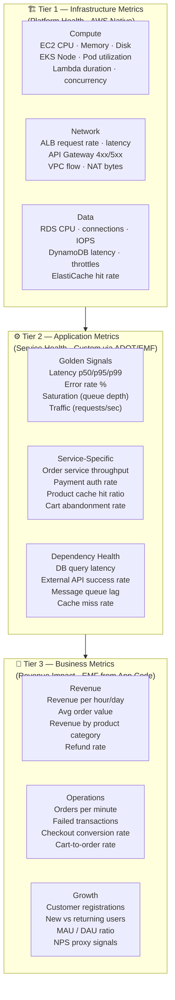
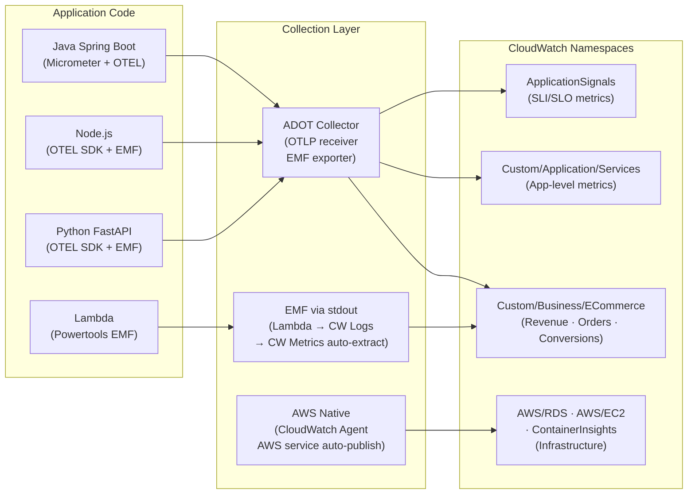
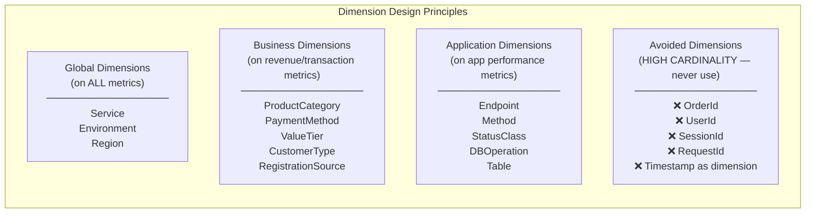
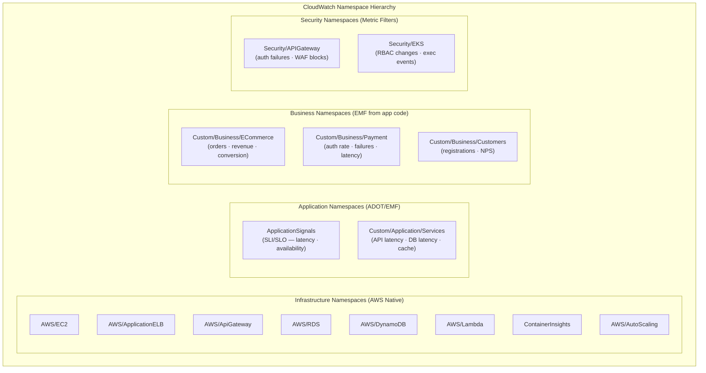
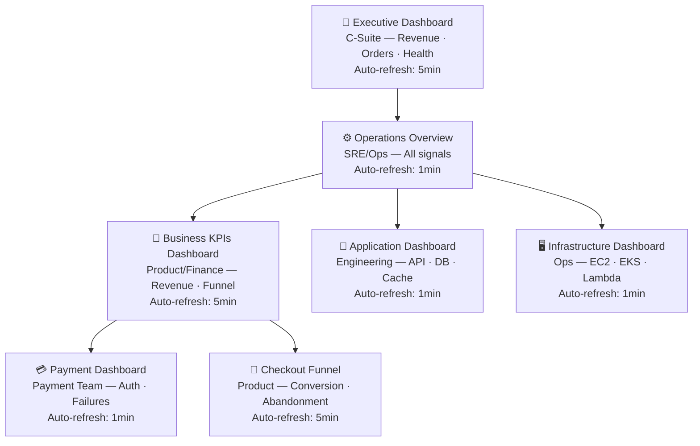
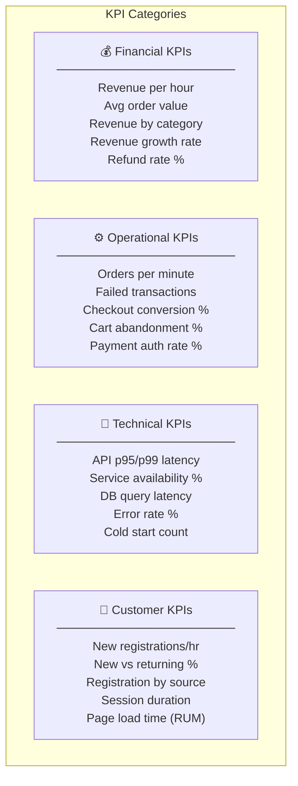
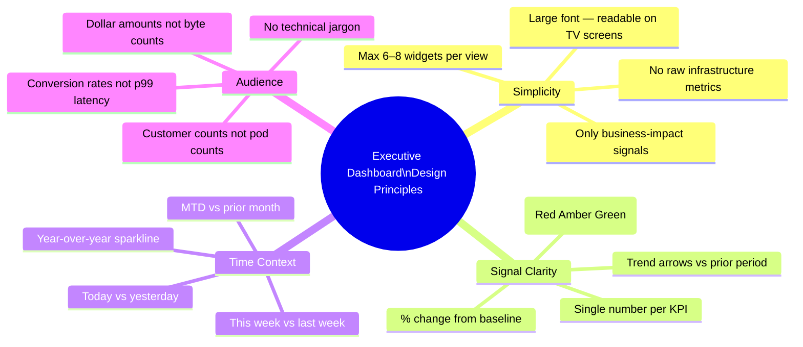
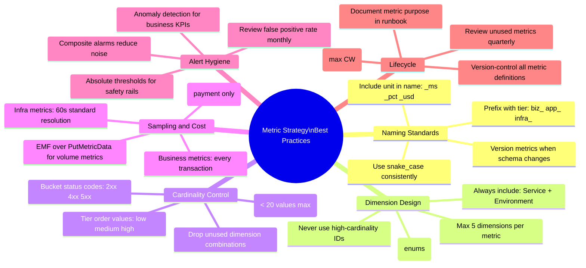

# Cloud Monitoring Strategy
## Infrastructure · Application · Business Metrics

> **Role**: Cloud Monitoring Architect
> **Date**: 2026-07-18
> **Platform**: E-Commerce Microservices — AWS Production
> **Scope**: Infrastructure KPIs · Application Signals · Business Intelligence · Executive Reporting

---

## Table of Contents

1. [Metric Taxonomy](#1-metric-taxonomy)
2. [Custom Metrics Design](#2-custom-metrics-design)
3. [CloudWatch Metrics Strategy](#3-cloudwatch-metrics-strategy)
4. [Dashboard Layouts](#4-dashboard-layouts)
5. [KPI Reporting](#5-kpi-reporting)
6. [Executive Dashboards](#6-executive-dashboards)
7. [Best Practices](#7-best-practices)

---

## 1. Metric Taxonomy

### 1.1 Three-Tier Metric Hierarchy



### 1.2 Complete Metric Catalog

| Metric Name | Tier | Source | Namespace | Unit | Alert Priority |
|---|---|---|---|---|---|
| `node_cpu_utilization` | Infrastructure | ContainerInsights | ContainerInsights | Percent | P2 |
| `node_memory_utilization` | Infrastructure | ContainerInsights | ContainerInsights | Percent | P2 |
| `rds_cpu_utilization` | Infrastructure | AWS Native | AWS/RDS | Percent | P1 |
| `rds_database_connections` | Infrastructure | AWS Native | AWS/RDS | Count | P2 |
| `alb_target_response_time` | Infrastructure | AWS Native | AWS/ApplicationELB | Seconds | P1 |
| `api_gateway_latency` | Infrastructure | AWS Native | AWS/ApiGateway | Milliseconds | P1 |
| `http_server_duration_p99` | Application | ADOT/EMF | ApplicationSignals | Milliseconds | P1 |
| `http_server_error_rate` | Application | ADOT/EMF | Custom/ECommerce | Percent | P1 |
| `order_service_availability` | Application | App Signals | ApplicationSignals | Percent | P1 |
| `payment_auth_success_rate` | Application | EMF | Custom/Payment | Percent | P1 |
| `db_query_latency_p99` | Application | ADOT/EMF | Custom/Database | Milliseconds | P1 |
| `cache_hit_ratio` | Application | EMF | Custom/Cache | Percent | P2 |
| `revenue_per_hour` | Business | EMF from app | Custom/Business | USD | P1 |
| `orders_per_minute` | Business | EMF from app | Custom/Business | Count/min | P1 |
| `failed_transactions_per_min` | Business | EMF from app | Custom/Business | Count/min | P1 |
| `checkout_conversion_rate` | Business | EMF from app | Custom/Business | Percent | P1 |
| `customer_registrations_per_hour` | Business | EMF from app | Custom/Business | Count/hour | P2 |
| `avg_order_value` | Business | EMF from app | Custom/Business | USD | P2 |
| `cart_abandonment_rate` | Business | EMF from app | Custom/Business | Percent | P2 |
| `refund_rate` | Business | EMF from app | Custom/Business | Percent | P2 |

### 1.3 Metric Signal Flow



---

## 2. Custom Metrics Design

### 2.1 Business Metric EMF Publisher

```python
# shared/metrics/business_metrics.py
# Used across all services to emit business metrics via EMF

import json
import time
import os
from typing import Optional
from dataclasses import dataclass, field
from enum import Enum
from decimal import Decimal


class MetricUnit(str, Enum):
    COUNT       = "Count"
    MILLISECONDS = "Milliseconds"
    SECONDS     = "Seconds"
    PERCENT     = "Percent"
    BYTES       = "Bytes"
    NONE        = "None"
    USD_CUSTOM  = "None"   # USD amounts stored as Count (CW has no currency unit)


@dataclass
class Dimension:
    name:  str
    value: str


class BusinessMetricsPublisher:
    """
    Emits business + application metrics via CloudWatch Embedded Metric Format.
    Works in Lambda (stdout), EKS (stdout → Fluent Bit → CW Logs), and EC2.

    Zero API call overhead — all metrics go through logs pipeline.
    Cost: ~$0.50/GB ingested (vs $0.30/metric/month for API-based PutMetricData).
    At typical scale: EMF is 10-100x cheaper than direct PutMetricData.
    """

    NAMESPACE_BUSINESS   = "Custom/Business/ECommerce"
    NAMESPACE_APPLICATION = "Custom/Application/Services"
    NAMESPACE_PAYMENT    = "Custom/Business/Payment"

    def __init__(
        self,
        service:     str,
        environment: str = None,
        region:      str = None
    ):
        self.service     = service
        self.environment = environment or os.getenv("DEPLOYMENT_ENVIRONMENT", "production")
        self.region      = region      or os.getenv("AWS_REGION", "us-east-1")
        self._buffer:    list = []

    # ── Revenue Metrics ─────────────────────────────────────────────────────

    def record_order_placed(
        self,
        order_value_cents: int,
        payment_method:    str,
        value_tier:        str,
        is_returning:      bool,
        item_count:        int
    ) -> None:
        """Record a placed order — core revenue metric."""
        order_value_usd = order_value_cents / 100

        self._emit(
            namespace=self.NAMESPACE_BUSINESS,
            metrics={
                "OrdersPlaced":     (1, MetricUnit.COUNT),
                "OrderValueUSD":    (order_value_usd, MetricUnit.USD_CUSTOM),
                "OrderItemCount":   (item_count, MetricUnit.COUNT),
            },
            dimensions={
                "Service":       self.service,
                "Environment":   self.environment,
                "PaymentMethod": payment_method,
                "ValueTier":     value_tier,
                "CustomerType":  "returning" if is_returning else "new"
            }
        )

    def record_order_failed(
        self,
        failure_reason: str,
        value_tier:     str,
        at_step:        str
    ) -> None:
        """Record a failed order attempt."""
        self._emit(
            namespace=self.NAMESPACE_BUSINESS,
            metrics={
                "OrdersFailed":  (1, MetricUnit.COUNT),
            },
            dimensions={
                "Service":       self.service,
                "Environment":   self.environment,
                "FailureReason": failure_reason,
                "ValueTier":     value_tier,
                "FailedAtStep":  at_step
            }
        )

    def record_revenue(
        self,
        amount_cents:     int,
        currency:         str,
        product_category: str
    ) -> None:
        """Emit revenue signal — aggregated by product category."""
        self._emit(
            namespace=self.NAMESPACE_BUSINESS,
            metrics={
                "RevenueUSD":        (amount_cents / 100, MetricUnit.USD_CUSTOM),
                "RevenueTransactions": (1, MetricUnit.COUNT),
            },
            dimensions={
                "Service":         self.service,
                "Environment":     self.environment,
                "Currency":        currency,
                "ProductCategory": product_category
            }
        )

    # ── Payment Metrics ──────────────────────────────────────────────────────

    def record_payment_attempt(
        self,
        success:         bool,
        payment_method:  str,
        failure_code:    Optional[str] = None,
        duration_ms:     Optional[float] = None
    ) -> None:
        """Record payment authorization attempt."""
        dims = {
            "Service":       self.service,
            "Environment":   self.environment,
            "PaymentMethod": payment_method,
            "Outcome":       "success" if success else "failure"
        }
        if failure_code:
            dims["FailureCode"] = failure_code

        metrics = {
            "PaymentAttempts":   (1, MetricUnit.COUNT),
            "PaymentSuccesses":  (1 if success else 0, MetricUnit.COUNT),
            "PaymentFailures":   (0 if success else 1, MetricUnit.COUNT),
        }
        if duration_ms is not None:
            metrics["PaymentDurationMs"] = (duration_ms, MetricUnit.MILLISECONDS)

        self._emit(namespace=self.NAMESPACE_PAYMENT, metrics=metrics, dimensions=dims)

    def record_transaction_failed(
        self,
        transaction_type: str,
        error_type:       str,
        value_tier:       str
    ) -> None:
        """Record a failed transaction — triggers business-level alert."""
        self._emit(
            namespace=self.NAMESPACE_BUSINESS,
            metrics={"FailedTransactions": (1, MetricUnit.COUNT)},
            dimensions={
                "Service":         self.service,
                "Environment":     self.environment,
                "TransactionType": transaction_type,
                "ErrorType":       error_type,
                "ValueTier":       value_tier
            }
        )

    # ── Customer Metrics ─────────────────────────────────────────────────────

    def record_customer_registration(
        self,
        registration_source: str,
        customer_tier:       str = "standard"
    ) -> None:
        """Record new customer registration."""
        self._emit(
            namespace=self.NAMESPACE_BUSINESS,
            metrics={"CustomerRegistrations": (1, MetricUnit.COUNT)},
            dimensions={
                "Service":             self.service,
                "Environment":         self.environment,
                "RegistrationSource":  registration_source,
                "CustomerTier":        customer_tier
            }
        )

    def record_checkout_step(
        self,
        step:               str,
        completed:          bool,
        time_in_step_sec:   Optional[float] = None
    ) -> None:
        """Record checkout funnel step — enables conversion analysis."""
        metrics = {
            "CheckoutStepReached":   (1, MetricUnit.COUNT),
            "CheckoutStepCompleted": (1 if completed else 0, MetricUnit.COUNT),
            "CheckoutStepAbandoned": (0 if completed else 1, MetricUnit.COUNT),
        }
        if time_in_step_sec is not None:
            metrics["CheckoutStepDurationSec"] = (time_in_step_sec, MetricUnit.SECONDS)

        self._emit(
            namespace=self.NAMESPACE_BUSINESS,
            metrics=metrics,
            dimensions={
                "Service":     self.service,
                "Environment": self.environment,
                "CheckoutStep": step
            }
        )

    # ── Application Performance Metrics ─────────────────────────────────────

    def record_api_latency(
        self,
        endpoint:        str,
        method:          str,
        duration_ms:     float,
        status_code:     int,
        downstream:      Optional[str] = None
    ) -> None:
        """Record API call latency — feeds p95/p99 dashboards."""
        dims = {
            "Service":     self.service,
            "Environment": self.environment,
            "Endpoint":    endpoint,
            "Method":      method,
            "StatusClass": f"{status_code // 100}xx"
        }
        if downstream:
            dims["Downstream"] = downstream

        self._emit(
            namespace=self.NAMESPACE_APPLICATION,
            metrics={
                "APILatencyMs":  (duration_ms, MetricUnit.MILLISECONDS),
                "APIRequests":   (1, MetricUnit.COUNT),
                "APIErrors":     (1 if status_code >= 500 else 0, MetricUnit.COUNT),
                "APIClientErrors": (1 if 400 <= status_code < 500 else 0, MetricUnit.COUNT),
            },
            dimensions=dims
        )

    def record_db_latency(
        self,
        operation:   str,
        table_name:  str,
        duration_ms: float,
        success:     bool
    ) -> None:
        """Record database operation latency."""
        self._emit(
            namespace=self.NAMESPACE_APPLICATION,
            metrics={
                "DBLatencyMs":  (duration_ms, MetricUnit.MILLISECONDS),
                "DBOperations": (1, MetricUnit.COUNT),
                "DBErrors":     (0 if success else 1, MetricUnit.COUNT),
            },
            dimensions={
                "Service":     self.service,
                "Environment": self.environment,
                "DBOperation": operation,
                "Table":       table_name
            }
        )

    # ── EMF Emission ─────────────────────────────────────────────────────────

    def _emit(
        self,
        namespace:  str,
        metrics:    dict,
        dimensions: dict
    ) -> None:
        """Write EMF JSON to stdout — captured by Lambda runtime or Fluent Bit."""
        doc = {
            "_aws": {
                "Timestamp": int(time.time() * 1000),
                "CloudWatchMetrics": [{
                    "Namespace":  namespace,
                    "Dimensions": [list(dimensions.keys())],
                    "Metrics": [
                        {"Name": name, "Unit": unit.value}
                        for name, (_, unit) in metrics.items()
                    ]
                }]
            },
            # Dimension values
            **dimensions,
            # Metric values
            **{name: value for name, (value, _) in metrics.items()}
        }
        print(json.dumps(doc), flush=True)


# ── Usage Example (Order Service) ───────────────────────────────────────────

# publisher = BusinessMetricsPublisher(service="order-service")
#
# # On successful order:
# publisher.record_order_placed(
#     order_value_cents=4999,
#     payment_method="card",
#     value_tier="medium",
#     is_returning=True,
#     item_count=3
# )
# publisher.record_revenue(4999, "USD", "electronics")
#
# # On payment attempt:
# publisher.record_payment_attempt(success=True, payment_method="card", duration_ms=145)
#
# # On checkout step:
# publisher.record_checkout_step("payment", completed=True, time_in_step_sec=12.4)
```

### 2.2 TypeScript Business Metrics (Node.js Services)

```typescript
// shared/metrics/BusinessMetricsPublisher.ts

interface MetricValue { value: number; unit: string; }

export class BusinessMetricsPublisher {
  private static readonly NS_BUSINESS    = "Custom/Business/ECommerce";
  private static readonly NS_APPLICATION = "Custom/Application/Services";
  private static readonly NS_PAYMENT     = "Custom/Business/Payment";

  constructor(
    private readonly service:     string,
    private readonly environment: string = process.env.DEPLOYMENT_ENVIRONMENT ?? "production"
  ) {}

  // ── Revenue ────────────────────────────────────────────────────────────

  recordOrderPlaced(params: {
    orderValueCents: number;
    paymentMethod:   string;
    valueTier:       "low" | "medium" | "high";
    isReturning:     boolean;
    itemCount:       number;
    category:        string;
  }): void {
    this.emit(BusinessMetricsPublisher.NS_BUSINESS, {
      OrdersPlaced:   { value: 1,                                unit: "Count" },
      OrderValueUSD:  { value: params.orderValueCents / 100,     unit: "None"  },
      OrderItemCount: { value: params.itemCount,                 unit: "Count" }
    }, {
      Service:       this.service,
      Environment:   this.environment,
      PaymentMethod: params.paymentMethod,
      ValueTier:     params.valueTier,
      CustomerType:  params.isReturning ? "returning" : "new",
      Category:      params.category
    });
  }

  recordRevenuePerHour(params: {
    amountCents:     number;
    productCategory: string;
  }): void {
    this.emit(BusinessMetricsPublisher.NS_BUSINESS, {
      RevenueUSD:          { value: params.amountCents / 100, unit: "None"  },
      RevenueTransactions: { value: 1,                        unit: "Count" }
    }, {
      Service:         this.service,
      Environment:     this.environment,
      ProductCategory: params.productCategory
    });
  }

  // ── Transactions ─────────────────────────────────────────────────────

  recordFailedTransaction(params: {
    transactionType: string;
    errorType:       string;
    valueTier:       string;
    amountCents:     number;
  }): void {
    this.emit(BusinessMetricsPublisher.NS_BUSINESS, {
      FailedTransactions:      { value: 1,                         unit: "Count" },
      FailedTransactionValue:  { value: params.amountCents / 100,  unit: "None"  }
    }, {
      Service:         this.service,
      Environment:     this.environment,
      TransactionType: params.transactionType,
      ErrorType:       params.errorType,
      ValueTier:       params.valueTier
    });
  }

  // ── Payment ───────────────────────────────────────────────────────────

  recordPaymentAttempt(params: {
    success:        boolean;
    paymentMethod:  string;
    durationMs:     number;
    failureCode?:   string;
  }): void {
    const dims: Record<string, string> = {
      Service:       this.service,
      Environment:   this.environment,
      PaymentMethod: params.paymentMethod,
      Outcome:       params.success ? "success" : "failure"
    };
    if (params.failureCode) dims["FailureCode"] = params.failureCode;

    this.emit(BusinessMetricsPublisher.NS_PAYMENT, {
      PaymentAttempts:     { value: 1,                           unit: "Count"        },
      PaymentSuccesses:    { value: params.success ? 1 : 0,     unit: "Count"        },
      PaymentFailures:     { value: params.success ? 0 : 1,     unit: "Count"        },
      PaymentDurationMs:   { value: params.durationMs,          unit: "Milliseconds" }
    }, dims);
  }

  // ── Customers ─────────────────────────────────────────────────────────

  recordCustomerRegistration(params: {
    source:        string;
    customerTier?: string;
  }): void {
    this.emit(BusinessMetricsPublisher.NS_BUSINESS, {
      CustomerRegistrations: { value: 1, unit: "Count" }
    }, {
      Service:            this.service,
      Environment:        this.environment,
      RegistrationSource: params.source,
      CustomerTier:       params.customerTier ?? "standard"
    });
  }

  // ── Application ───────────────────────────────────────────────────────

  recordAPILatency(params: {
    endpoint:    string;
    method:      string;
    durationMs:  number;
    statusCode:  number;
  }): void {
    this.emit(BusinessMetricsPublisher.NS_APPLICATION, {
      APILatencyMs:    { value: params.durationMs,                    unit: "Milliseconds" },
      APIRequests:     { value: 1,                                    unit: "Count"        },
      APIErrors:       { value: params.statusCode >= 500 ? 1 : 0,    unit: "Count"        },
      APIClientErrors: { value: (params.statusCode >= 400 && params.statusCode < 500) ? 1 : 0, unit: "Count" }
    }, {
      Service:     this.service,
      Environment: this.environment,
      Endpoint:    params.endpoint,
      Method:      params.method,
      StatusClass: `${Math.floor(params.statusCode / 100)}xx`
    });
  }

  recordDatabaseLatency(params: {
    operation:   string;
    tableName:   string;
    durationMs:  number;
    success:     boolean;
  }): void {
    this.emit(BusinessMetricsPublisher.NS_APPLICATION, {
      DBLatencyMs:  { value: params.durationMs,       unit: "Milliseconds" },
      DBOperations: { value: 1,                       unit: "Count"        },
      DBErrors:     { value: params.success ? 0 : 1,  unit: "Count"        }
    }, {
      Service:     this.service,
      Environment: this.environment,
      DBOperation: params.operation,
      Table:       params.tableName
    });
  }

  // ── EMF Emitter ───────────────────────────────────────────────────────

  private emit(
    namespace:  string,
    metrics:    Record<string, MetricValue>,
    dimensions: Record<string, string>
  ): void {
    const doc = {
      _aws: {
        Timestamp: Date.now(),
        CloudWatchMetrics: [{
          Namespace:  namespace,
          Dimensions: [Object.keys(dimensions)],
          Metrics:    Object.entries(metrics).map(([name, { unit }]) => ({ Name: name, Unit: unit }))
        }]
      },
      ...dimensions,
      ...Object.fromEntries(Object.entries(metrics).map(([name, { value }]) => [name, value]))
    };
    process.stdout.write(JSON.stringify(doc) + "\n");
  }
}
```

### 2.3 Metric Dimensions Design



---

## 3. CloudWatch Metrics Strategy

### 3.1 Namespace Architecture



### 3.2 Metric Math — Derived KPIs

```json
[
  {
    "id": "order_success_rate",
    "label": "Order Success Rate %",
    "expression": "(m_orders_placed / (m_orders_placed + m_orders_failed)) * 100",
    "comment": "Live order success rate — SLO target: > 99.5%"
  },
  {
    "id": "payment_conversion_rate",
    "label": "Payment Conversion Rate %",
    "expression": "(m_payment_success / m_payment_attempts) * 100",
    "comment": "Payment authorization rate — target: > 97%"
  },
  {
    "id": "revenue_per_minute",
    "label": "Revenue/min (USD)",
    "expression": "m_revenue_usd / PERIOD(m_revenue_usd) * 60",
    "comment": "Real-time revenue rate — normalize to per-minute"
  },
  {
    "id": "checkout_completion_rate",
    "label": "Checkout Completion %",
    "expression": "(m_checkout_completed / m_checkout_started) * 100",
    "comment": "Cart-to-order completion rate"
  },
  {
    "id": "error_rate_pct",
    "label": "API Error Rate %",
    "expression": "(m_api_errors / m_api_requests) * 100",
    "comment": "Service error rate — SLO target: < 1%"
  },
  {
    "id": "failed_transaction_rate",
    "label": "Failed Transaction Rate %",
    "expression": "(m_failed_txn / (m_orders_placed + m_failed_txn)) * 100",
    "comment": "Failed transaction rate — business alert: > 2%"
  }
]
```

### 3.3 Metric Alarms by Category

```hcl
# metric-alarms-complete.tf

# ════════════════════════════════════════════════════════
# BUSINESS METRIC ALARMS
# ════════════════════════════════════════════════════════

# ── Revenue Drop — anomaly detection ──────────────────────────────────────
resource "aws_cloudwatch_metric_alarm" "revenue_drop" {
  alarm_name          = "biz-revenue-per-hour-anomaly"
  alarm_description   = <<-EOT
    Revenue per hour is significantly below normal ML-detected band.
    Possible causes: payment outage, site error, marketing campaign ended.
    Dashboard: https://grafana.internal/d/business-kpis
    Runbook: https://wiki.internal/runbooks/revenue-drop
  EOT

  metrics = [
    {
      id = "revenue"
      metric_stat = {
        metric = {
          namespace   = "Custom/Business/ECommerce"
          metric_name = "RevenueUSD"
          dimensions  = [{ name = "Environment", value = "production" }]
        }
        period = 3600
        stat   = "Sum"
      }
      return_data = true
    },
    {
      id         = "revenue_band"
      expression = "ANOMALY_DETECTION_BAND(revenue, 2)"
      label      = "Expected revenue range"
      return_data = true
    }
  ]

  comparison_operator = "LessThanLowerThreshold"
  threshold_metric_id = "revenue_band"
  evaluation_periods  = 2
  datapoints_to_alarm = 2
  treat_missing_data  = "breaching"
  alarm_actions       = [var.sns_business_critical_arn]
  ok_actions          = [var.sns_business_critical_arn]
  tags                = { Tier = "business", Impact = "revenue" }
}

# ── Orders Per Minute — sudden drop ──────────────────────────────────────
resource "aws_cloudwatch_metric_alarm" "orders_per_minute_drop" {
  alarm_name          = "biz-orders-per-minute-anomaly"
  alarm_description   = "Order rate dropped below expected range. Possible checkout failure or site issue."
  metrics = [
    {
      id = "orders"
      metric_stat = {
        metric = {
          namespace   = "Custom/Business/ECommerce"
          metric_name = "OrdersPlaced"
          dimensions  = [{ name = "Environment", value = "production" }]
        }
        period = 300
        stat   = "Sum"
      }
      return_data = true
    },
    {
      id         = "orders_band"
      expression = "ANOMALY_DETECTION_BAND(orders, 3)"
      return_data = true
    }
  ]
  comparison_operator = "LessThanLowerThreshold"
  threshold_metric_id = "orders_band"
  evaluation_periods  = 3
  treat_missing_data  = "breaching"
  alarm_actions       = [var.sns_business_critical_arn]
}

# ── Failed Transactions — absolute threshold ──────────────────────────────
resource "aws_cloudwatch_metric_alarm" "failed_transactions" {
  alarm_name          = "biz-failed-transactions-critical"
  alarm_description   = "Failed transaction count > 50 in 5 minutes. Immediate investigation required."
  namespace           = "Custom/Business/ECommerce"
  metric_name         = "FailedTransactions"
  dimensions          = { Environment = "production" }
  statistic           = "Sum"
  period              = 300
  evaluation_periods  = 1
  threshold           = 50
  comparison_operator = "GreaterThanThreshold"
  treat_missing_data  = "notBreaching"
  alarm_actions       = [var.sns_business_critical_arn]
  ok_actions          = [var.sns_business_critical_arn]
}

# ── Payment Auth Rate — drop below threshold ──────────────────────────────
resource "aws_cloudwatch_metric_alarm" "payment_auth_rate_low" {
  alarm_name          = "biz-payment-auth-rate-low"
  alarm_description   = "Payment authorization rate < 95%. Investigate payment provider + card decline reasons."
  metrics = [
    {
      id         = "auth_rate"
      expression = "(successes / attempts) * 100"
      return_data = true
    },
    {
      id = "successes"
      metric_stat = {
        metric = {
          namespace   = "Custom/Business/Payment"
          metric_name = "PaymentSuccesses"
          dimensions  = [{ name = "Environment", value = "production" }]
        }
        period = 300
        stat   = "Sum"
      }
      return_data = false
    },
    {
      id = "attempts"
      metric_stat = {
        metric = {
          namespace   = "Custom/Business/Payment"
          metric_name = "PaymentAttempts"
          dimensions  = [{ name = "Environment", value = "production" }]
        }
        period = 300
        stat   = "Sum"
      }
      return_data = false
    }
  ]
  comparison_operator = "LessThanThreshold"
  threshold           = 95
  evaluation_periods  = 2
  datapoints_to_alarm = 2
  treat_missing_data  = "notBreaching"
  alarm_actions       = [var.sns_business_critical_arn]
}

# ── Customer Registration Drop ────────────────────────────────────────────
resource "aws_cloudwatch_metric_alarm" "registration_drop" {
  alarm_name          = "biz-customer-registrations-anomaly"
  alarm_description   = "Customer registration rate below expected. Marketing or UX issue possible."
  metrics = [
    {
      id = "registrations"
      metric_stat = {
        metric = {
          namespace   = "Custom/Business/ECommerce"
          metric_name = "CustomerRegistrations"
          dimensions  = [{ name = "Environment", value = "production" }]
        }
        period = 3600
        stat   = "Sum"
      }
      return_data = true
    },
    {
      id         = "reg_band"
      expression = "ANOMALY_DETECTION_BAND(registrations, 2)"
      return_data = true
    }
  ]
  comparison_operator = "LessThanLowerThreshold"
  threshold_metric_id = "reg_band"
  evaluation_periods  = 2
  treat_missing_data  = "notBreaching"
  alarm_actions       = [var.sns_business_warning_arn]
}
```

---

## 4. Dashboard Layouts

### 4.1 Dashboard Hierarchy



### 4.2 Business KPIs Dashboard JSON

```json
{
  "widgets": [
    {
      "type": "text",
      "properties": {
        "markdown": "# 💼 Business KPIs — Production\n**Environment**: Production | **Region**: us-east-1 | **Auto-refresh**: 5min\n\n| ✅ | All targets met | ⚠️ | Warning threshold | 🔴 | Target missed |"
      }
    },
    {
      "type": "metric",
      "properties": {
        "title": "💰 Revenue Per Hour (USD) — Rolling 24h",
        "view": "timeSeries",
        "stacked": false,
        "metrics": [
          ["Custom/Business/ECommerce", "RevenueUSD", "Environment", "production",
           {"stat": "Sum", "period": 3600, "label": "Revenue/hour", "color": "#2ca02c"}],
          [{"expression": "ANOMALY_DETECTION_BAND(m1, 2)", "label": "Expected range",
            "id": "band", "color": "#d4edda"}],
          ["Custom/Business/ECommerce", "RevenueUSD", "Environment", "production",
           {"stat": "Sum", "period": 3600, "id": "m1", "visible": false}]
        ],
        "yAxis": {"left": {"min": 0, "label": "USD"}},
        "period": 3600
      }
    },
    {
      "type": "metric",
      "properties": {
        "title": "📦 Orders Per Minute (5-min rolling avg)",
        "view": "timeSeries",
        "metrics": [
          [{"expression": "m1 / 5", "label": "Orders/min", "id": "opm", "color": "#1f77b4"}],
          ["Custom/Business/ECommerce", "OrdersPlaced", "Environment", "production",
           {"stat": "Sum", "period": 300, "id": "m1", "visible": false}],
          [{"expression": "ANOMALY_DETECTION_BAND(m1/5, 2)", "label": "Expected range",
            "color": "#cce5ff"}]
        ],
        "yAxis": {"left": {"min": 0, "label": "orders/min"}}
      }
    },
    {
      "type": "metric",
      "properties": {
        "title": "❌ Failed Transactions Per Minute",
        "view": "timeSeries",
        "metrics": [
          [{"expression": "m1 / 5", "label": "Failed Txn/min", "id": "ftpm", "color": "#d62728"}],
          ["Custom/Business/ECommerce", "FailedTransactions", "Environment", "production",
           {"stat": "Sum", "period": 300, "id": "m1", "visible": false}]
        ],
        "annotations": {
          "horizontal": [
            {"value": 2,  "color": "#ff9900", "label": "Warning (2/min)"},
            {"value": 10, "color": "#d62728", "label": "Critical (10/min)"}
          ]
        },
        "yAxis": {"left": {"min": 0, "label": "txn/min"}}
      }
    },
    {
      "type": "metric",
      "properties": {
        "title": "👤 Customer Registrations Per Hour",
        "view": "timeSeries",
        "metrics": [
          ["Custom/Business/ECommerce", "CustomerRegistrations", "Environment", "production",
           {"stat": "Sum", "period": 3600, "label": "New Registrations/hour", "color": "#9467bd"}],
          ["Custom/Business/ECommerce", "CustomerRegistrations",
           "Environment", "production", "RegistrationSource", "organic",
           {"stat": "Sum", "period": 3600, "label": "Organic"}],
          ["Custom/Business/ECommerce", "CustomerRegistrations",
           "Environment", "production", "RegistrationSource", "paid",
           {"stat": "Sum", "period": 3600, "label": "Paid"}],
          ["Custom/Business/ECommerce", "CustomerRegistrations",
           "Environment", "production", "RegistrationSource", "referral",
           {"stat": "Sum", "period": 3600, "label": "Referral"}]
        ]
      }
    },
    {
      "type": "metric",
      "properties": {
        "title": "💳 Payment Authorization Rate %",
        "view": "gauge",
        "metrics": [
          [{"expression": "(m1/m2)*100", "label": "Auth Rate %", "id": "auth_rate"}],
          ["Custom/Business/Payment", "PaymentSuccesses", "Environment", "production",
           {"stat": "Sum", "period": 3600, "id": "m1", "visible": false}],
          ["Custom/Business/Payment", "PaymentAttempts",  "Environment", "production",
           {"stat": "Sum", "period": 3600, "id": "m2", "visible": false}]
        ],
        "yAxis": {"left": {"min": 90, "max": 100}},
        "annotations": {
          "horizontal": [
            {"value": 95, "color": "#ff9900", "label": "Warning (95%)"},
            {"value": 97, "color": "#2ca02c", "label": "Target (97%)"}
          ]
        }
      }
    },
    {
      "type": "metric",
      "properties": {
        "title": "🛒 Checkout Conversion Rate % (started → completed)",
        "view": "timeSeries",
        "metrics": [
          [{"expression": "(m_comp / m_start) * 100", "label": "Conversion Rate %", "color": "#2ca02c"}],
          ["Custom/Business/ECommerce", "CheckoutStepCompleted",
           "Environment", "production", "CheckoutStep", "confirmation",
           {"stat": "Sum", "period": 3600, "id": "m_comp", "visible": false}],
          ["Custom/Business/ECommerce", "CheckoutStepReached",
           "Environment", "production", "CheckoutStep", "cart",
           {"stat": "Sum", "period": 3600, "id": "m_start", "visible": false}]
        ],
        "annotations": {
          "horizontal": [{"value": 65, "color": "#ff9900", "label": "Target: 65%+"}]
        },
        "yAxis": {"left": {"min": 0, "max": 100, "label": "%"}}
      }
    },
    {
      "type": "metric",
      "properties": {
        "title": "🏆 Revenue by Product Category (last 24h)",
        "view": "pie",
        "metrics": [
          ["Custom/Business/ECommerce", "RevenueUSD",
           "Environment", "production", "ProductCategory", "electronics",
           {"stat": "Sum", "period": 86400, "label": "Electronics"}],
          ["Custom/Business/ECommerce", "RevenueUSD",
           "Environment", "production", "ProductCategory", "clothing",
           {"stat": "Sum", "period": 86400, "label": "Clothing"}],
          ["Custom/Business/ECommerce", "RevenueUSD",
           "Environment", "production", "ProductCategory", "home",
           {"stat": "Sum", "period": 86400, "label": "Home & Garden"}],
          ["Custom/Business/ECommerce", "RevenueUSD",
           "Environment", "production", "ProductCategory", "sports",
           {"stat": "Sum", "period": 86400, "label": "Sports"}]
        ]
      }
    },
    {
      "type": "metric",
      "properties": {
        "title": "⚡ API Latency p50 / p95 / p99 (order-service)",
        "view": "timeSeries",
        "metrics": [
          ["Custom/Application/Services", "APILatencyMs",
           "Service", "order-service", "Environment", "production",
           {"stat": "p50", "period": 300, "label": "p50",  "color": "#2ca02c"}],
          ["Custom/Application/Services", "APILatencyMs",
           "Service", "order-service", "Environment", "production",
           {"stat": "p95", "period": 300, "label": "p95",  "color": "#ff9900"}],
          ["Custom/Application/Services", "APILatencyMs",
           "Service", "order-service", "Environment", "production",
           {"stat": "p99", "period": 300, "label": "p99",  "color": "#d62728"}]
        ],
        "annotations": {
          "horizontal": [
            {"value": 300, "color": "#ff9900", "label": "SLO threshold (300ms)"}
          ]
        },
        "yAxis": {"left": {"min": 0, "label": "ms"}}
      }
    },
    {
      "type": "metric",
      "properties": {
        "title": "🗄 Database Latency p99 — Order + Payment Services",
        "view": "timeSeries",
        "metrics": [
          ["Custom/Application/Services", "DBLatencyMs",
           "Service", "order-service",   "Environment", "production", "DBOperation", "SELECT",
           {"stat": "p99", "period": 300, "label": "Order DB READ p99"}],
          ["Custom/Application/Services", "DBLatencyMs",
           "Service", "order-service",   "Environment", "production", "DBOperation", "INSERT",
           {"stat": "p99", "period": 300, "label": "Order DB WRITE p99"}],
          ["Custom/Application/Services", "DBLatencyMs",
           "Service", "payment-service", "Environment", "production", "DBOperation", "SELECT",
           {"stat": "p99", "period": 300, "label": "Payment DB READ p99"}]
        ],
        "annotations": {
          "horizontal": [
            {"value": 50,  "color": "#ff9900", "label": "Warning (50ms)"},
            {"value": 100, "color": "#d62728", "label": "Critical (100ms)"}
          ]
        },
        "yAxis": {"left": {"min": 0, "label": "ms"}}
      }
    }
  ]
}
```

### 4.3 Application Performance Dashboard JSON

```json
{
  "widgets": [
    {
      "type": "metric",
      "properties": {
        "title": "Request Rate — All Services (RPS)",
        "view": "timeSeries",
        "metrics": [
          ["Custom/Application/Services", "APIRequests",
           "Service", "order-service",   "Environment", "production",
           {"stat": "SampleCount", "period": 60, "label": "order-service"}],
          ["Custom/Application/Services", "APIRequests",
           "Service", "payment-service", "Environment", "production",
           {"stat": "SampleCount", "period": 60, "label": "payment-service"}],
          ["Custom/Application/Services", "APIRequests",
           "Service", "product-service", "Environment", "production",
           {"stat": "SampleCount", "period": 60, "label": "product-service"}],
          ["Custom/Application/Services", "APIRequests",
           "Service", "cart-service",    "Environment", "production",
           {"stat": "SampleCount", "period": 60, "label": "cart-service"}]
        ]
      }
    },
    {
      "type": "metric",
      "properties": {
        "title": "API Error Rate % — All Services",
        "view": "timeSeries",
        "metrics": [
          [{"expression": "(m1/(m1+m2))*100", "label": "Order Error %", "id": "e1", "color": "#d62728"}],
          ["Custom/Application/Services", "APIErrors",   "Service", "order-service", "Environment", "production",
           {"stat": "Sum", "period": 60, "id": "m1", "visible": false}],
          ["Custom/Application/Services", "APIRequests", "Service", "order-service", "Environment", "production",
           {"stat": "Sum", "period": 60, "id": "m2", "visible": false}]
        ],
        "annotations": {
          "horizontal": [
            {"value": 0.1, "color": "#ff9900", "label": "Warning 0.1%"},
            {"value": 1.0, "color": "#d62728", "label": "SLO Threshold 1%"}
          ]
        },
        "yAxis": {"left": {"min": 0, "max": 5, "label": "%"}}
      }
    },
    {
      "type": "metric",
      "properties": {
        "title": "DB Query Latency — All Operations (p99)",
        "view": "timeSeries",
        "metrics": [
          ["Custom/Application/Services", "DBLatencyMs",
           "Service", "order-service",   "DBOperation", "SELECT", "Environment", "production",
           {"stat": "p99", "period": 300, "label": "Orders SELECT p99"}],
          ["Custom/Application/Services", "DBLatencyMs",
           "Service", "order-service",   "DBOperation", "INSERT", "Environment", "production",
           {"stat": "p99", "period": 300, "label": "Orders INSERT p99"}],
          ["AWS/RDS", "WriteLatency",   "DBClusterIdentifier", "ecommerce-aurora",
           {"stat": "p99", "period": 300, "label": "RDS Write Latency (native)"}],
          ["AWS/RDS", "ReadLatency",    "DBClusterIdentifier", "ecommerce-aurora",
           {"stat": "p99", "period": 300, "label": "RDS Read Latency (native)"}]
        ]
      }
    }
  ]
}
```

---

## 5. KPI Reporting

### 5.1 KPI Framework



### 5.2 KPI Targets and Thresholds

| KPI | Measurement | Target | Warning | Critical | Alert Channel |
|---|---|---|---|---|---|
| Revenue per Hour | Sum (hourly) | Baseline ± 20% | Below ML lower band | > 40% below baseline | PagerDuty + Slack |
| Orders per Minute | Sum/5min ÷ 5 | Baseline ± 25% | Below ML lower band | > 50% below baseline | PagerDuty + Slack |
| Failed Transactions/min | Sum/5min ÷ 5 | < 1/min | > 2/min | > 10/min | PagerDuty + Slack |
| Payment Auth Rate | Successes/Attempts | ≥ 97% | < 97% | < 95% | PagerDuty |
| Checkout Conversion | Completed/Started | ≥ 65% | < 65% | < 50% | Slack #product |
| Customer Registrations/hr | Sum (hourly) | Baseline ± 30% | Below ML lower band | > 60% below baseline | Slack #growth |
| API Latency p99 | p99 (5-min) | < 300ms | > 300ms | > 1,000ms | PagerDuty |
| DB Query Latency p99 | p99 (5-min) | < 50ms | > 50ms | > 100ms | PagerDuty |
| API Error Rate | Errors/Requests | < 1% | > 1% | > 5% | PagerDuty |
| Service Availability | App Signals | 99.95% | < 99.9% | < 99.5% | PagerDuty |

### 5.3 Automated KPI Report Lambda

```python
#!/usr/bin/env python3
# lambda/kpi_reporter/handler.py
# Runs hourly via EventBridge — publishes KPI summary to Slack + S3

import boto3
import json
import os
import urllib.request
from datetime import datetime, timezone, timedelta
from dataclasses import dataclass, asdict
from typing import Optional

cloudwatch = boto3.client("cloudwatch", region_name="us-east-1")

@dataclass
class HourlyKPISummary:
    timestamp:              str
    revenue_usd:            float
    revenue_vs_prior_week:  float    # % change
    orders_placed:          int
    orders_failed:          int
    order_success_rate_pct: float
    payment_auth_rate_pct:  float
    failed_transactions:    int
    customer_registrations: int
    checkout_conversion_pct: float
    api_p99_latency_ms:     float
    db_p99_latency_ms:      float
    api_error_rate_pct:     float
    health_status:          str      # "healthy" | "degraded" | "critical"


def get_metric_sum(namespace: str, metric_name: str, dimensions: dict,
                   start: datetime, end: datetime) -> float:
    response = cloudwatch.get_metric_statistics(
        Namespace=namespace,
        MetricName=metric_name,
        Dimensions=[{"Name": k, "Value": v} for k, v in dimensions.items()],
        StartTime=start,
        EndTime=end,
        Period=int((end - start).total_seconds()),
        Statistics=["Sum"]
    )
    return sum(dp["Sum"] for dp in response["Datapoints"])


def get_metric_percentile(namespace: str, metric_name: str, dimensions: dict,
                          percentile: str, start: datetime, end: datetime) -> float:
    response = cloudwatch.get_metric_statistics(
        Namespace=namespace,
        MetricName=metric_name,
        Dimensions=[{"Name": k, "Value": v} for k, v in dimensions.items()],
        StartTime=start,
        EndTime=end,
        Period=int((end - start).total_seconds()),
        ExtendedStatistics=[percentile]
    )
    if response["Datapoints"]:
        return response["Datapoints"][-1]["ExtendedStatistics"].get(percentile, 0)
    return 0.0


def generate_hourly_kpi(event, context):
    now   = datetime.now(timezone.utc)
    start = now - timedelta(hours=1)
    dims  = {"Environment": "production"}

    # ── Fetch all KPI metrics ────────────────────────────────────────────
    revenue       = get_metric_sum("Custom/Business/ECommerce", "RevenueUSD",          dims, start, now)
    orders        = get_metric_sum("Custom/Business/ECommerce", "OrdersPlaced",         dims, start, now)
    orders_failed = get_metric_sum("Custom/Business/ECommerce", "OrdersFailed",         dims, start, now)
    failed_txn    = get_metric_sum("Custom/Business/ECommerce", "FailedTransactions",   dims, start, now)
    registrations = get_metric_sum("Custom/Business/ECommerce", "CustomerRegistrations",dims, start, now)
    pay_attempts  = get_metric_sum("Custom/Business/Payment",   "PaymentAttempts",      dims, start, now)
    pay_success   = get_metric_sum("Custom/Business/Payment",   "PaymentSuccesses",     dims, start, now)
    ckout_start   = get_metric_sum("Custom/Business/ECommerce", "CheckoutStepReached",
                                   {**dims, "CheckoutStep": "cart"}, start, now)
    ckout_done    = get_metric_sum("Custom/Business/ECommerce", "CheckoutStepCompleted",
                                   {**dims, "CheckoutStep": "confirmation"}, start, now)

    api_latency   = get_metric_percentile(
        "Custom/Application/Services", "APILatencyMs",
        {"Service": "order-service", "Environment": "production"},
        "p99", start, now
    )
    db_latency    = get_metric_percentile(
        "Custom/Application/Services", "DBLatencyMs",
        {"Service": "order-service", "Environment": "production"},
        "p99", start, now
    )
    api_errors    = get_metric_sum("Custom/Application/Services", "APIErrors",
                                   {"Service": "order-service", "Environment": "production"}, start, now)
    api_requests  = get_metric_sum("Custom/Application/Services", "APIRequests",
                                   {"Service": "order-service", "Environment": "production"}, start, now)

    # ── Prior week same hour for trend ──────────────────────────────────
    pw_start      = start - timedelta(days=7)
    pw_end        = now   - timedelta(days=7)
    prior_revenue = get_metric_sum("Custom/Business/ECommerce", "RevenueUSD", dims, pw_start, pw_end)

    # ── Compute derived KPIs ─────────────────────────────────────────────
    order_success_rate = ((orders / (orders + orders_failed)) * 100) if (orders + orders_failed) > 0 else 100
    payment_auth_rate  = ((pay_success / pay_attempts) * 100) if pay_attempts > 0 else 0
    checkout_conv      = ((ckout_done / ckout_start) * 100) if ckout_start > 0 else 0
    api_error_rate     = ((api_errors / api_requests) * 100) if api_requests > 0 else 0
    revenue_change_pct = (((revenue - prior_revenue) / prior_revenue) * 100) if prior_revenue > 0 else 0

    # ── Health score ─────────────────────────────────────────────────────
    def health_status() -> str:
        if (payment_auth_rate < 95 or api_error_rate > 5 or
                failed_txn > 50 or api_latency > 1000):
            return "🔴 critical"
        if (payment_auth_rate < 97 or api_error_rate > 1 or
                failed_txn > 10 or api_latency > 300):
            return "🟡 degraded"
        return "🟢 healthy"

    summary = HourlyKPISummary(
        timestamp=now.strftime("%Y-%m-%dT%H:00:00Z"),
        revenue_usd=round(revenue, 2),
        revenue_vs_prior_week=round(revenue_change_pct, 1),
        orders_placed=int(orders),
        orders_failed=int(orders_failed),
        order_success_rate_pct=round(order_success_rate, 2),
        payment_auth_rate_pct=round(payment_auth_rate, 2),
        failed_transactions=int(failed_txn),
        customer_registrations=int(registrations),
        checkout_conversion_pct=round(checkout_conv, 1),
        api_p99_latency_ms=round(api_latency, 1),
        db_p99_latency_ms=round(db_latency, 1),
        api_error_rate_pct=round(api_error_rate, 3),
        health_status=health_status()
    )

    _post_to_slack(summary)
    _archive_to_s3(summary)

    return asdict(summary)


def _post_to_slack(s: HourlyKPISummary) -> None:
    trend = "📈" if s.revenue_vs_prior_week >= 0 else "📉"
    message = {
        "blocks": [
            {
                "type": "header",
                "text": {
                    "type": "plain_text",
                    "text": f"Hourly KPI Report — {s.timestamp[:13]}:00 UTC"
                }
            },
            {
                "type": "section",
                "fields": [
                    {"type": "mrkdwn", "text": f"*Status*\n{s.health_status}"},
                    {"type": "mrkdwn", "text": f"*Revenue*\n${s.revenue_usd:,.2f} {trend} {s.revenue_vs_prior_week:+.1f}% vs last week"},
                    {"type": "mrkdwn", "text": f"*Orders Placed*\n{s.orders_placed:,}"},
                    {"type": "mrkdwn", "text": f"*Failed Transactions*\n{s.failed_transactions}"},
                    {"type": "mrkdwn", "text": f"*Payment Auth Rate*\n{s.payment_auth_rate_pct:.1f}%"},
                    {"type": "mrkdwn", "text": f"*Checkout Conversion*\n{s.checkout_conversion_pct:.1f}%"},
                    {"type": "mrkdwn", "text": f"*Customer Registrations*\n{s.customer_registrations}"},
                    {"type": "mrkdwn", "text": f"*API p99 Latency*\n{s.api_p99_latency_ms:.0f}ms"},
                    {"type": "mrkdwn", "text": f"*DB p99 Latency*\n{s.db_p99_latency_ms:.0f}ms"},
                    {"type": "mrkdwn", "text": f"*API Error Rate*\n{s.api_error_rate_pct:.2f}%"}
                ]
            },
            {
                "type": "actions",
                "elements": [{
                    "type": "button",
                    "text": {"type": "plain_text", "text": "📊 View Dashboard"},
                    "url": "https://grafana.internal/d/business-kpis"
                }]
            }
        ]
    }
    webhook_url = os.environ.get("SLACK_KPI_WEBHOOK_URL", "")
    if webhook_url:
        req = urllib.request.Request(
            webhook_url,
            data=json.dumps(message).encode(),
            headers={"Content-Type": "application/json"},
            method="POST"
        )
        urllib.request.urlopen(req, timeout=10)


def _archive_to_s3(s: HourlyKPISummary) -> None:
    s3 = boto3.client("s3")
    dt = datetime.fromisoformat(s.timestamp.replace("Z", "+00:00"))
    key = f"kpi-reports/{dt.year}/{dt.month:02d}/{dt.day:02d}/{dt.hour:02d}/kpi-summary.json"
    s3.put_object(
        Bucket="ecommerce-kpi-reports",
        Key=key,
        Body=json.dumps(asdict(s), indent=2),
        ContentType="application/json"
    )
```

---

## 6. Executive Dashboards

### 6.1 Executive Dashboard Design Principles



### 6.2 Executive Dashboard JSON

```json
{
  "widgets": [
    {
      "type": "text",
      "properties": {
        "markdown": "# 🏢 E-Commerce Executive Dashboard\n**Live Production Metrics** | Auto-refresh: 5 minutes | [Detailed KPIs →](#)\n\n---"
      }
    },
    {
      "type": "metric",
      "properties": {
        "title": "💰 REVENUE TODAY (USD)",
        "view": "singleValue",
        "sparkline": true,
        "metrics": [
          ["Custom/Business/ECommerce", "RevenueUSD", "Environment", "production",
           {"stat": "Sum", "period": 86400, "label": "Revenue Today"}]
        ],
        "setPeriodToTimeRange": false
      }
    },
    {
      "type": "metric",
      "properties": {
        "title": "📦 ORDERS THIS HOUR",
        "view": "singleValue",
        "sparkline": true,
        "metrics": [
          ["Custom/Business/ECommerce", "OrdersPlaced", "Environment", "production",
           {"stat": "Sum", "period": 3600, "label": "Orders This Hour"}]
        ]
      }
    },
    {
      "type": "metric",
      "properties": {
        "title": "💳 PAYMENT SUCCESS RATE",
        "view": "gauge",
        "metrics": [
          [{"expression": "(m1/m2)*100", "label": "Payment Auth %", "id": "auth"}],
          ["Custom/Business/Payment", "PaymentSuccesses", "Environment", "production",
           {"stat": "Sum", "period": 3600, "id": "m1", "visible": false}],
          ["Custom/Business/Payment", "PaymentAttempts",  "Environment", "production",
           {"stat": "Sum", "period": 3600, "id": "m2", "visible": false}]
        ],
        "yAxis": {"left": {"min": 90, "max": 100}},
        "annotations": {
          "horizontal": [{"value": 97, "color": "#2ca02c", "label": "97% Target"}]
        }
      }
    },
    {
      "type": "metric",
      "properties": {
        "title": "❌ FAILED TRANSACTIONS (This Hour)",
        "view": "singleValue",
        "sparkline": true,
        "metrics": [
          ["Custom/Business/ECommerce", "FailedTransactions", "Environment", "production",
           {"stat": "Sum", "period": 3600, "label": "Failed Transactions"}]
        ]
      }
    },
    {
      "type": "metric",
      "properties": {
        "title": "👤 NEW CUSTOMERS TODAY",
        "view": "singleValue",
        "sparkline": true,
        "metrics": [
          ["Custom/Business/ECommerce", "CustomerRegistrations", "Environment", "production",
           {"stat": "Sum", "period": 86400, "label": "Registrations Today"}]
        ]
      }
    },
    {
      "type": "metric",
      "properties": {
        "title": "📈 Revenue Trend — Last 7 Days (Hourly)",
        "view": "timeSeries",
        "stacked": true,
        "metrics": [
          ["Custom/Business/ECommerce", "RevenueUSD",
           "Environment", "production", "ProductCategory", "electronics",
           {"stat": "Sum", "period": 3600, "label": "Electronics"}],
          ["Custom/Business/ECommerce", "RevenueUSD",
           "Environment", "production", "ProductCategory", "clothing",
           {"stat": "Sum", "period": 3600, "label": "Clothing"}],
          ["Custom/Business/ECommerce", "RevenueUSD",
           "Environment", "production", "ProductCategory", "home",
           {"stat": "Sum", "period": 3600, "label": "Home & Garden"}]
        ],
        "yAxis": {"left": {"min": 0, "label": "USD"}}
      }
    },
    {
      "type": "metric",
      "properties": {
        "title": "🛒 Checkout Funnel — Step Completion (Last 24h)",
        "view": "bar",
        "metrics": [
          ["Custom/Business/ECommerce", "CheckoutStepReached",
           "Environment", "production", "CheckoutStep", "cart",
           {"stat": "Sum", "period": 86400, "label": "Cart"}],
          ["Custom/Business/ECommerce", "CheckoutStepReached",
           "Environment", "production", "CheckoutStep", "shipping",
           {"stat": "Sum", "period": 86400, "label": "Shipping"}],
          ["Custom/Business/ECommerce", "CheckoutStepReached",
           "Environment", "production", "CheckoutStep", "payment",
           {"stat": "Sum", "period": 86400, "label": "Payment"}],
          ["Custom/Business/ECommerce", "CheckoutStepCompleted",
           "Environment", "production", "CheckoutStep", "confirmation",
           {"stat": "Sum", "period": 86400, "label": "Completed"}]
        ]
      }
    },
    {
      "type": "alarm",
      "properties": {
        "title": "🚨 Active Business Alerts",
        "alarms": [
          "arn:aws:cloudwatch:us-east-1:123456789012:alarm:biz-revenue-per-hour-anomaly",
          "arn:aws:cloudwatch:us-east-1:123456789012:alarm:biz-orders-per-minute-anomaly",
          "arn:aws:cloudwatch:us-east-1:123456789012:alarm:biz-failed-transactions-critical",
          "arn:aws:cloudwatch:us-east-1:123456789012:alarm:biz-payment-auth-rate-low"
        ]
      }
    }
  ]
}
```

---

## 7. Best Practices

### 7.1 Metric Design Principles



### 7.2 Metric Governance

```bash
#!/bin/bash
# metric-governance-check.sh — Run in CI/CD pipeline

echo "=== Metric Governance Check ==="

# 1. Verify all custom metric namespaces exist
echo "[1] Custom Namespaces"
EXPECTED_NAMESPACES=(
  "Custom/Business/ECommerce"
  "Custom/Business/Payment"
  "Custom/Application/Services"
  "Security/APIGateway"
)

for ns in "${EXPECTED_NAMESPACES[@]}"; do
  COUNT=$(aws cloudwatch list-metrics \
    --namespace "$ns" \
    --region us-east-1 \
    --query 'length(Metrics)' \
    --output text 2>/dev/null)
  [ "$COUNT" -gt 0 ] && echo "  ✅ $ns ($COUNT metrics)" || echo "  ❌ MISSING: $ns"
done

# 2. Check business critical alarms exist + have OKActions
echo "[2] Business Critical Alarms"
CRITICAL_ALARMS=(
  "biz-revenue-per-hour-anomaly"
  "biz-orders-per-minute-anomaly"
  "biz-failed-transactions-critical"
  "biz-payment-auth-rate-low"
)

for alarm in "${CRITICAL_ALARMS[@]}"; do
  STATE=$(aws cloudwatch describe-alarms \
    --alarm-names "$alarm" \
    --query "MetricAlarms[0].{State:StateValue,OKActions:length(OKActions)}" \
    --output json --region us-east-1 2>/dev/null)
  STATE_VAL=$(echo "$STATE" | python3 -c "import sys,json; d=json.load(sys.stdin); print(d.get('State','MISSING'))")
  OK_ACTIONS=$(echo "$STATE" | python3 -c "import sys,json; d=json.load(sys.stdin); print(d.get('OKActions',0))")

  if [ "$STATE_VAL" = "MISSING" ]; then
    echo "  ❌ ALARM NOT FOUND: $alarm"
  elif [ "$OK_ACTIONS" -eq 0 ]; then
    echo "  ⚠️  MISSING OKActions: $alarm (state: $STATE_VAL)"
  else
    echo "  ✅ $alarm (state: $STATE_VAL, OKActions: $OK_ACTIONS)"
  fi
done

# 3. Verify business metric data freshness (last 5 min)
echo "[3] Business Metric Freshness"
NOW=$(($(date +%s)))
FIVE_MIN_AGO=$((NOW - 300))

check_metric_fresh() {
  local ns=$1 metric=$2 dim_name=$3 dim_val=$4
  LAST=$(aws cloudwatch get-metric-statistics \
    --namespace "$ns" \
    --metric-name "$metric" \
    --dimensions "Name=$dim_name,Value=$dim_val" \
    --start-time "$(date -u -d '10 minutes ago' +%Y-%m-%dT%H:%M:%SZ)" \
    --end-time "$(date -u +%Y-%m-%dT%H:%M:%SZ)" \
    --period 300 --statistics Sum \
    --query 'length(Datapoints)' --output text --region us-east-1 2>/dev/null)
  [ "${LAST:-0}" -gt 0 ] && echo "  ✅ $metric in $ns" || echo "  ❌ STALE/MISSING: $metric in $ns"
}

check_metric_fresh "Custom/Business/ECommerce" "OrdersPlaced"      "Environment" "production"
check_metric_fresh "Custom/Business/Payment"   "PaymentAttempts"   "Environment" "production"
check_metric_fresh "Custom/Business/ECommerce" "RevenueUSD"        "Environment" "production"

echo ""
echo "=== Governance check complete ==="
```

### 7.3 Metric to Business Impact Map

| Metric | Business Impact | Alert Action | Owner |
|---|---|---|---|
| `RevenueUSD` drops | Direct revenue loss | Page on-call + VP Engineering | SRE |
| `FailedTransactions` > 50 | Customer frustration, cart abandonment | Page payment team | Payment Team |
| `PaymentSuccesses/Attempts` < 95% | Revenue conversion blocked | Page SRE + payment team | SRE + Payment |
| `CustomerRegistrations` drops | Growth signal degradation | Slack #growth-alerts | Product |
| `CheckoutStepCompleted` drops | Funnel breakage | Slack #product-alerts | Product |
| `OrdersPlaced` drops | Revenue + engagement signal | Page on-call | SRE |
| `APILatencyMs` p99 > 1s | User experience degradation | Page SRE | SRE |
| `DBLatencyMs` p99 > 100ms | Backend slowdown | Page SRE | SRE |

### 7.4 Metric Lifecycle Management

```bash
# Find unused custom metrics (no data in 30 days)
aws cloudwatch list-metrics \
  --namespace "Custom/Business/ECommerce" \
  --region us-east-1 \
  --query 'Metrics[*].MetricName' \
  --output text | tr '\t' '\n' | sort -u | while read metric; do

  DATAPOINTS=$(aws cloudwatch get-metric-statistics \
    --namespace "Custom/Business/ECommerce" \
    --metric-name "$metric" \
    --start-time "$(date -u -d '30 days ago' +%Y-%m-%dT%H:%M:%SZ)" \
    --end-time "$(date -u +%Y-%m-%dT%H:%M:%SZ)" \
    --period 2592000 --statistics Sum \
    --query 'length(Datapoints)' --output text 2>/dev/null)

  [ "${DATAPOINTS:-0}" -eq 0 ] && echo "UNUSED (30d): $metric"
done
```

---

*Monitoring strategy aligned with Google SRE Four Golden Signals, AWS Well-Architected Operational Excellence pillar, and DORA metrics for engineering effectiveness. EMF-based business metrics eliminate PutMetricData API call overhead — cost-effective at any volume.*
