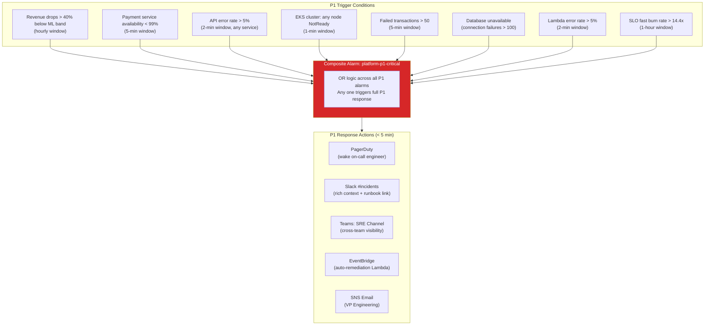
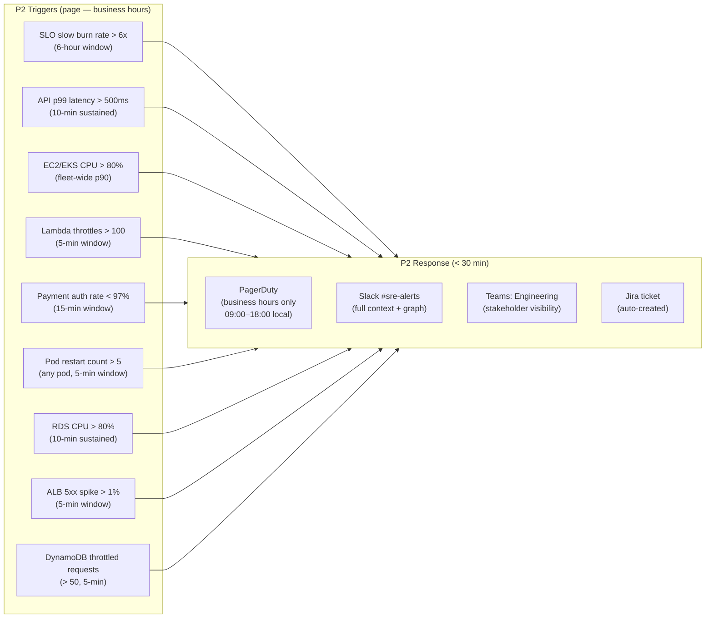
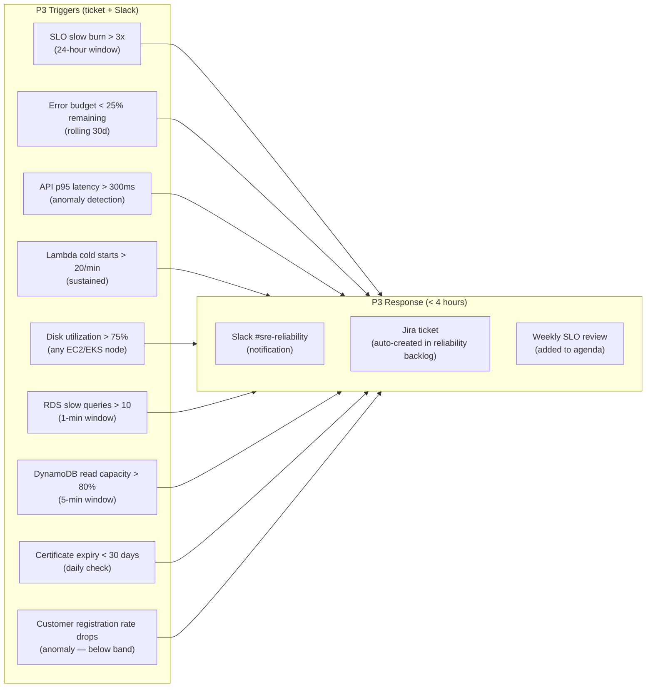
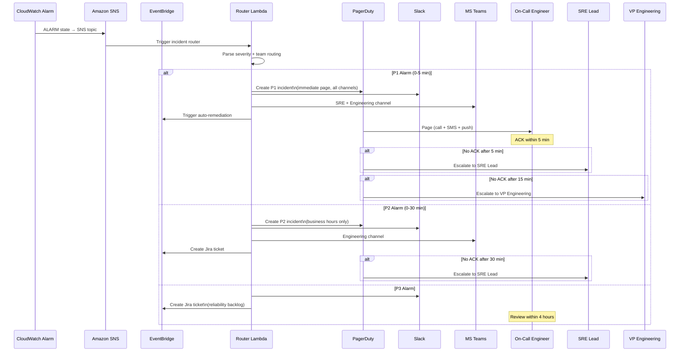
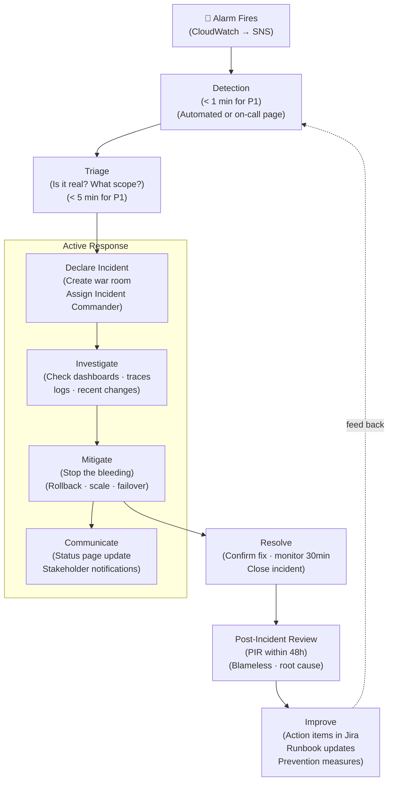
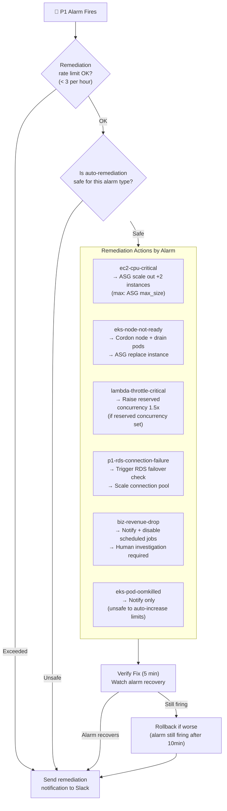
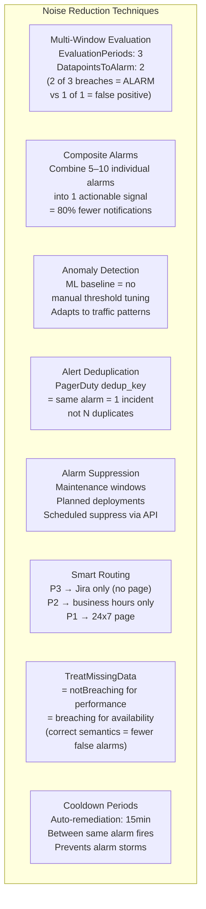

# Alerting & Incident Response Architecture
## CloudWatch · EventBridge · SNS · PagerDuty · Slack · Teams

> **Role**: SRE Lead
> **Date**: 2026-07-18
> **Platform**: E-Commerce Microservices — AWS Production
> **Scope**: P1–P3 Alerts · Escalation Matrix · Incident Workflow · Auto-Remediation · Runbooks

---

## Table of Contents

1. [P1 Alerts](#1-p1-alerts)
2. [P2 Alerts](#2-p2-alerts)
3. [P3 Alerts](#3-p3-alerts)
4. [Escalation Matrix](#4-escalation-matrix)
5. [Incident Workflow](#5-incident-workflow)
6. [Auto-Remediation Strategy](#6-auto-remediation-strategy)
7. [Runbooks](#7-runbooks)
8. [Alert Noise Reduction Techniques](#8-alert-noise-reduction-techniques)

---

## 1. P1 Alerts

### 1.1 P1 Alert Architecture



### 1.2 P1 Alarm CloudFormation

```yaml
# p1-alarms.yaml
AWSTemplateFormatVersion: "2010-09-09"
Description: P1 Critical Alarms — E-Commerce Production

Parameters:
  SNSCriticalArn:
    Type: String
  ClusterName:
    Type: String
    Default: ecommerce-prod

Resources:

  # ── Payment Service Availability < 99% ──────────────────────────────────
  PaymentAvailabilityP1:
    Type: AWS::CloudWatch::Alarm
    Properties:
      AlarmName: p1-payment-service-availability
      AlarmDescription: |
        SEVERITY: P1 | TEAM: Payment + SRE
        Payment service availability dropped below 99%.
        Direct revenue impact — every minute costs ~$X,XXX.
        Runbook: https://wiki.internal/runbooks/p1-payment-availability
        Dashboard: https://grafana.internal/d/payment-service
      Namespace: ApplicationSignals
      MetricName: Availability
      Dimensions:
        - Name: Service
          Value: payment-service
        - Name: Environment
          Value: production
      Statistic: Average
      Period: 60
      EvaluationPeriods: 3
      DatapointsToAlarm: 2
      Threshold: 0.99
      ComparisonOperator: LessThanThreshold
      TreatMissingData: breaching
      AlarmActions: [!Ref SNSCriticalArn]
      OKActions:    [!Ref SNSCriticalArn]

  # ── API Error Rate > 5% ────────────────────────────────────────────────
  APIErrorRateP1:
    Type: AWS::CloudWatch::Alarm
    Properties:
      AlarmName: p1-api-error-rate-critical
      AlarmDescription: |
        SEVERITY: P1 | TEAM: SRE
        API error rate exceeded 5% threshold.
        Possible causes: recent deployment, dependency failure, DB issue.
        Runbook: https://wiki.internal/runbooks/p1-api-error-rate
      Metrics:
        - Id: error_rate
          Expression: "(errors / requests) * 100"
          ReturnData: true
        - Id: errors
          MetricStat:
            Metric:
              Namespace: ApplicationSignals
              MetricName: FaultCount
              Dimensions:
                - Name: Service
                  Value: order-service
                - Name: Environment
                  Value: production
            Period: 120
            Stat: Sum
          ReturnData: false
        - Id: requests
          MetricStat:
            Metric:
              Namespace: ApplicationSignals
              MetricName: RequestCount
              Dimensions:
                - Name: Service
                  Value: order-service
                - Name: Environment
                  Value: production
            Period: 120
            Stat: Sum
          ReturnData: false
      ComparisonOperator: GreaterThanThreshold
      Threshold: 5
      EvaluationPeriods: 2
      DatapointsToAlarm: 2
      TreatMissingData: notBreaching
      AlarmActions: [!Ref SNSCriticalArn]
      OKActions:    [!Ref SNSCriticalArn]

  # ── EKS Node NotReady ───────────────────────────────────────────────────
  EKSNodeNotReadyP1:
    Type: AWS::CloudWatch::Alarm
    Properties:
      AlarmName: p1-eks-node-not-ready
      AlarmDescription: |
        SEVERITY: P1 | TEAM: Platform SRE
        EKS worker node entered NotReady state.
        Pod scheduling suspended — scaling headroom reduced.
        Runbook: https://wiki.internal/runbooks/p1-eks-node-failure
      Namespace: ContainerInsights
      MetricName: cluster_failed_node_count
      Dimensions:
        - Name: ClusterName
          Value: !Ref ClusterName
      Statistic: Maximum
      Period: 60
      EvaluationPeriods: 2
      DatapointsToAlarm: 1
      Threshold: 0
      ComparisonOperator: GreaterThanThreshold
      TreatMissingData: breaching
      AlarmActions: [!Ref SNSCriticalArn]
      OKActions:    [!Ref SNSCriticalArn]

  # ── Failed Transactions > 50 ───────────────────────────────────────────
  FailedTransactionsP1:
    Type: AWS::CloudWatch::Alarm
    Properties:
      AlarmName: p1-failed-transactions-critical
      AlarmDescription: |
        SEVERITY: P1 | TEAM: Payment + SRE
        > 50 failed transactions in 5 minutes.
        Customer orders are failing — revenue and trust at risk.
        Runbook: https://wiki.internal/runbooks/p1-failed-transactions
      Namespace: Custom/Business/ECommerce
      MetricName: FailedTransactions
      Dimensions:
        - Name: Environment
          Value: production
      Statistic: Sum
      Period: 300
      EvaluationPeriods: 1
      Threshold: 50
      ComparisonOperator: GreaterThanThreshold
      TreatMissingData: notBreaching
      AlarmActions: [!Ref SNSCriticalArn]
      OKActions:    [!Ref SNSCriticalArn]

  # ── RDS Connection Failure ─────────────────────────────────────────────
  RDSConnectionFailureP1:
    Type: AWS::CloudWatch::Alarm
    Properties:
      AlarmName: p1-rds-connection-failure
      AlarmDescription: |
        SEVERITY: P1 | TEAM: Platform SRE + DBA
        RDS database connection count dropped to critical low.
        Services may be unable to write orders/payments.
        Runbook: https://wiki.internal/runbooks/p1-rds-unavailable
      Namespace: AWS/RDS
      MetricName: DatabaseConnections
      Dimensions:
        - Name: DBClusterIdentifier
          Value: ecommerce-aurora
      Statistic: Minimum
      Period: 60
      EvaluationPeriods: 2
      DatapointsToAlarm: 2
      Threshold: 1
      ComparisonOperator: LessThanThreshold
      TreatMissingData: breaching
      AlarmActions: [!Ref SNSCriticalArn]
      OKActions:    [!Ref SNSCriticalArn]

  # ── SLO Fast Burn (Payment) ────────────────────────────────────────────
  PaymentSLOFastBurnP1:
    Type: AWS::CloudWatch::Alarm
    Properties:
      AlarmName: p1-payment-slo-fast-burn
      AlarmDescription: |
        SEVERITY: P1 | TEAM: SRE
        Payment service error budget burning at > 14.4x rate.
        30-day error budget will be exhausted in < 52 minutes.
        Runbook: https://wiki.internal/runbooks/p1-slo-fast-burn
      Metrics:
        - Id: burn_rate
          Expression: "(faults / requests) / 0.0005"
          ReturnData: true
        - Id: faults
          MetricStat:
            Metric:
              Namespace: ApplicationSignals
              MetricName: FaultCount
              Dimensions:
                - Name: Service
                  Value: payment-service
                - Name: Environment
                  Value: production
            Period: 3600
            Stat: Sum
          ReturnData: false
        - Id: requests
          MetricStat:
            Metric:
              Namespace: ApplicationSignals
              MetricName: RequestCount
              Dimensions:
                - Name: Service
                  Value: payment-service
                - Name: Environment
                  Value: production
            Period: 3600
            Stat: Sum
          ReturnData: false
      ComparisonOperator: GreaterThanThreshold
      Threshold: 14.4
      EvaluationPeriods: 1
      TreatMissingData: notBreaching
      AlarmActions: [!Ref SNSCriticalArn]
      OKActions:    [!Ref SNSCriticalArn]

  # ── Composite P1 Alarm ─────────────────────────────────────────────────
  PlatformP1Critical:
    Type: AWS::CloudWatch::CompositeAlarm
    DependsOn:
      - PaymentAvailabilityP1
      - APIErrorRateP1
      - EKSNodeNotReadyP1
      - FailedTransactionsP1
      - RDSConnectionFailureP1
      - PaymentSLOFastBurnP1
    Properties:
      AlarmName: p1-platform-critical
      AlarmDescription: |
        COMPOSITE P1: Platform experiencing critical incident.
        One or more P1 signals are in ALARM state.
        DECLARE INCIDENT IMMEDIATELY.
        War room: https://meet.internal/sre-war-room
        Incident tracker: https://incident.internal/create
      AlarmRule: >
        ALARM("p1-payment-service-availability") OR
        ALARM("p1-api-error-rate-critical") OR
        ALARM("p1-eks-node-not-ready") OR
        ALARM("p1-failed-transactions-critical") OR
        ALARM("p1-rds-connection-failure") OR
        ALARM("p1-payment-slo-fast-burn")
      AlarmActions: [!Ref SNSCriticalArn]
      OKActions:    [!Ref SNSCriticalArn]
```

---

## 2. P2 Alerts

### 2.1 P2 Alert Classification



### 2.2 P2 Alarm Terraform

```hcl
# p2-alarms.tf

locals {
  p2_description_prefix = "SEVERITY: P2 | Response: 30 min | Page (business hours)"
}

# ── API p99 Latency > 500ms ──────────────────────────────────────────────
resource "aws_cloudwatch_metric_alarm" "api_latency_p2" {
  for_each = toset(["order-service", "payment-service", "product-service"])

  alarm_name          = "p2-${each.key}-latency-p99-high"
  alarm_description   = <<-EOT
    ${local.p2_description_prefix}
    ${each.key} p99 latency > 500ms — user experience degrading.
    Runbook: https://wiki.internal/runbooks/p2-high-latency
  EOT
  namespace           = "ApplicationSignals"
  metric_name         = "Latency"
  dimensions          = { Service = each.key, Environment = "production" }
  extended_statistic  = "p99"
  period              = 300
  evaluation_periods  = 3
  datapoints_to_alarm = 2
  threshold           = 500
  comparison_operator = "GreaterThanThreshold"
  treat_missing_data  = "notBreaching"
  alarm_actions       = [var.sns_p2_arn]
  ok_actions          = [var.sns_p2_arn]
  tags                = { Severity = "P2", Service = each.key }
}

# ── SLO Slow Burn > 6x ───────────────────────────────────────────────────
resource "aws_cloudwatch_metric_alarm" "slo_slow_burn_p2" {
  alarm_name          = "p2-order-service-slo-slow-burn"
  alarm_description   = <<-EOT
    ${local.p2_description_prefix}
    Order service SLO burning at > 6x. Budget exhaustion in < 5 days.
    Runbook: https://wiki.internal/runbooks/p2-slo-slow-burn
  EOT
  metrics = [
    {
      id = "burn_rate"
      expression = "(faults / requests) / 0.0005"
      return_data = true
    },
    {
      id = "faults"
      metric_stat = {
        metric = {
          namespace   = "ApplicationSignals"
          metric_name = "FaultCount"
          dimensions  = [{ name = "Service", value = "order-service" }, { name = "Environment", value = "production" }]
        }
        period = 21600
        stat   = "Sum"
      }
      return_data = false
    },
    {
      id = "requests"
      metric_stat = {
        metric = {
          namespace   = "ApplicationSignals"
          metric_name = "RequestCount"
          dimensions  = [{ name = "Service", value = "order-service" }, { name = "Environment", value = "production" }]
        }
        period = 21600
        stat   = "Sum"
      }
      return_data = false
    }
  ]
  comparison_operator = "GreaterThanThreshold"
  threshold           = 6.0
  evaluation_periods  = 1
  treat_missing_data  = "notBreaching"
  alarm_actions       = [var.sns_p2_arn]
}

# ── Lambda Throttles ──────────────────────────────────────────────────────
resource "aws_cloudwatch_metric_alarm" "lambda_throttles_p2" {
  for_each = toset(["order-processor", "inventory-sync", "payment-validator"])

  alarm_name          = "p2-lambda-${each.key}-throttles"
  alarm_description   = <<-EOT
    ${local.p2_description_prefix}
    Lambda ${each.key} throttled > 100 times in 5 minutes.
    Concurrent execution limit reached. Requests being dropped.
  EOT
  namespace           = "AWS/Lambda"
  metric_name         = "Throttles"
  dimensions          = { FunctionName = each.key }
  statistic           = "Sum"
  period              = 300
  evaluation_periods  = 1
  threshold           = 100
  comparison_operator = "GreaterThanThreshold"
  treat_missing_data  = "notBreaching"
  alarm_actions       = [var.sns_p2_arn]
  ok_actions          = [var.sns_p2_arn]
  tags                = { Severity = "P2" }
}

# ── RDS CPU High ─────────────────────────────────────────────────────────
resource "aws_cloudwatch_metric_alarm" "rds_cpu_p2" {
  alarm_name          = "p2-rds-cpu-high"
  alarm_description   = <<-EOT
    ${local.p2_description_prefix}
    RDS Aurora CPU > 80% for 10+ minutes.
    Query performance may degrade. Consider read replica routing.
    Runbook: https://wiki.internal/runbooks/p2-rds-cpu
  EOT
  namespace           = "AWS/RDS"
  metric_name         = "CPUUtilization"
  dimensions          = { DBClusterIdentifier = "ecommerce-aurora" }
  statistic           = "Average"
  period              = 300
  evaluation_periods  = 3
  datapoints_to_alarm = 2
  threshold           = 80
  comparison_operator = "GreaterThanThreshold"
  treat_missing_data  = "notBreaching"
  alarm_actions       = [var.sns_p2_arn]
  ok_actions          = [var.sns_p2_arn]
}

# ── P2 Composite Alarm ────────────────────────────────────────────────────
resource "aws_cloudwatch_composite_alarm" "p2_platform_degraded" {
  alarm_name        = "p2-platform-degraded"
  alarm_description = "COMPOSITE P2: Platform performance degrading. Investigate before P1 escalation."
  alarm_rule = join(" OR ", [
    "ALARM(\"p2-order-service-latency-p99-high\")",
    "ALARM(\"p2-order-service-slo-slow-burn\")",
    "ALARM(\"p2-rds-cpu-high\")"
  ])
  alarm_actions = [var.sns_p2_arn]
  ok_actions    = [var.sns_p2_arn]
}
```

---

## 3. P3 Alerts

### 3.1 P3 Alert Classification



### 3.2 P3 Alarm + Certificate Expiry

```hcl
# p3-alarms.tf

# ── SLO Creeping Burn ─────────────────────────────────────────────────────
resource "aws_cloudwatch_metric_alarm" "slo_creeping_burn_p3" {
  alarm_name          = "p3-order-service-slo-creeping-burn"
  alarm_description   = "SEVERITY: P3 | Order SLO burning at > 3x. Budget exhausted in < 10 days if unresolved."
  metrics = [
    {
      id = "burn_rate_24h"
      expression = "(faults / requests) / 0.0005"
      return_data = true
    },
    {
      id = "faults"
      metric_stat = {
        metric = {
          namespace   = "ApplicationSignals"
          metric_name = "FaultCount"
          dimensions  = [{ name = "Service", value = "order-service" }, { name = "Environment", value = "production" }]
        }
        period = 86400
        stat   = "Sum"
      }
      return_data = false
    },
    {
      id = "requests"
      metric_stat = {
        metric = {
          namespace   = "ApplicationSignals"
          metric_name = "RequestCount"
          dimensions  = [{ name = "Service", value = "order-service" }, { name = "Environment", value = "production" }]
        }
        period = 86400
        stat   = "Sum"
      }
      return_data = false
    }
  ]
  comparison_operator = "GreaterThanThreshold"
  threshold           = 3.0
  evaluation_periods  = 1
  treat_missing_data  = "notBreaching"
  alarm_actions       = [var.sns_p3_arn]
}

# ── Lambda Cold Starts High ───────────────────────────────────────────────
resource "aws_cloudwatch_metric_alarm" "lambda_cold_starts_p3" {
  alarm_name          = "p3-lambda-cold-start-frequency-high"
  alarm_description   = "SEVERITY: P3 | Lambda cold start count > 20/min. Consider Provisioned Concurrency."
  namespace           = "AWS/Lambda"
  metric_name         = "InitDuration"
  dimensions          = { FunctionName = "order-processor" }
  statistic           = "SampleCount"
  period              = 300
  evaluation_periods  = 3
  datapoints_to_alarm = 2
  threshold           = 100    # > 100 cold starts per 5 minutes = > 20/min
  comparison_operator = "GreaterThanThreshold"
  treat_missing_data  = "notBreaching"
  alarm_actions       = [var.sns_p3_arn]
}

# ── TLS Certificate Expiry ────────────────────────────────────────────────
resource "aws_cloudwatch_metric_alarm" "cert_expiry_30d" {
  alarm_name          = "p3-tls-certificate-expiry-30d"
  alarm_description   = "SEVERITY: P3 | ACM certificate expiring in < 30 days. Renew before site becomes unreachable."
  namespace           = "AWS/CertificateManager"
  metric_name         = "DaysToExpiry"
  dimensions          = { CertificateArn = var.acm_certificate_arn }
  statistic           = "Minimum"
  period              = 86400   # Check daily
  evaluation_periods  = 1
  threshold           = 30
  comparison_operator = "LessThanThreshold"
  treat_missing_data  = "notBreaching"
  alarm_actions       = [var.sns_p3_arn]
}

# ── RDS Slow Queries ─────────────────────────────────────────────────────
resource "aws_cloudwatch_log_metric_filter" "rds_slow_queries" {
  name           = "rds-slow-query-count"
  log_group_name = "/aws/rds/cluster/ecommerce-aurora/slowquery"
  pattern        = ""   # Every slow query log entry counts

  metric_transformation {
    name          = "SlowQueryCount"
    namespace     = "Custom/RDS"
    value         = "1"
    default_value = "0"
    unit          = "Count"
  }
}

resource "aws_cloudwatch_metric_alarm" "rds_slow_queries_p3" {
  alarm_name          = "p3-rds-slow-query-count"
  alarm_description   = "SEVERITY: P3 | > 10 slow queries/min detected. Review query patterns and indexes."
  namespace           = "Custom/RDS"
  metric_name         = "SlowQueryCount"
  statistic           = "Sum"
  period              = 60
  evaluation_periods  = 3
  datapoints_to_alarm = 2
  threshold           = 10
  comparison_operator = "GreaterThanThreshold"
  treat_missing_data  = "notBreaching"
  alarm_actions       = [var.sns_p3_arn]
}
```

---

## 4. Escalation Matrix

### 4.1 Escalation Flow



### 4.2 Escalation Matrix Table

| Severity | Trigger | Response SLA | Primary On-Call | Escalation 1 (no ACK) | Escalation 2 | Channels |
|---|---|---|---|---|---|---|
| **P1** | Platform down / revenue impact | < 5 min ACK | On-call SRE | SRE Lead (5 min) | VP Engineering (15 min) | PagerDuty + Slack + Teams |
| **P1-S** | Security incident | < 5 min ACK | On-call SRE + SecOps | CISO (10 min) | CEO (30 min) | PagerDuty + Security channel |
| **P2** | Performance degraded | < 30 min ACK | On-call SRE (biz hours) | SRE Lead (30 min) | Engineering Manager (1h) | PagerDuty (biz hrs) + Slack |
| **P3** | Reliability debt | < 4 hour review | SRE team | SRE Lead (daily) | — | Slack + Jira |
| **P4** | Informational | Weekly review | SRE team | — | — | Slack digest |

### 4.3 On-Call Schedule (PagerDuty)

```yaml
# pagerduty-schedule.yaml (PagerDuty Terraform Provider)
# terraform resource: pagerduty_schedule

schedules:
  - name: "SRE Primary On-Call"
    description: "7x24 primary rotation — 1 week shifts"
    time_zone: "America/New_York"
    layers:
      - name: "Primary"
        rotation_type: weekly
        start: "2026-07-21T09:00:00"
        restrictions:
          - type: weekly_restriction
            start_day_of_week: 1   # Monday
            start_time_of_day: "09:00:00"
            duration_seconds: 604800  # 1 week
        users:
          - engineer_1
          - engineer_2
          - engineer_3
          - engineer_4

  - name: "SRE Secondary (Escalation)"
    description: "Secondary escalation — SRE Leads"
    layers:
      - name: "Secondary"
        rotation_type: weekly
        users:
          - sre_lead_1
          - sre_lead_2

escalation_policies:
  - name: "P1 Critical Escalation"
    escalation_rules:
      - escalation_delay_in_minutes: 5
        targets:
          - type: schedule
            id: sre_primary_schedule
      - escalation_delay_in_minutes: 10
        targets:
          - type: schedule
            id: sre_secondary_schedule
      - escalation_delay_in_minutes: 15
        targets:
          - type: user
            id: vp_engineering_user_id
    repeat_enabled: true
    num_loops: 2
```

---

## 5. Incident Workflow

### 5.1 Incident Lifecycle



### 5.2 Incident Commander Lambda (Auto-Dispatch)

```python
# lambda/incident_router/handler.py
# SNS → Lambda: routes alarms to correct channels + creates incidents

import boto3
import json
import os
import urllib.request
from datetime import datetime, timezone
from typing import Optional
from dataclasses import dataclass, field

secrets_client = boto3.client("secretsmanager", region_name="us-east-1")
ssm_client     = boto3.client("ssm",             region_name="us-east-1")


@dataclass
class AlarmContext:
    alarm_name:    str
    alarm_state:   str
    alarm_reason:  str
    timestamp:     str
    severity:      str
    team:          str
    runbook_url:   str
    dashboard_url: str
    is_recovery:   bool = False


# ── Alarm routing table ──────────────────────────────────────────────────────
ALARM_ROUTES = {
    "p1-": {
        "severity":      "P1",
        "pagerduty":     True,
        "pagerduty_urgency": "high",
        "slack_channel": "#incidents",
        "teams_channel": "SRE",
        "jira_priority": None,
        "auto_remediate": True
    },
    "p2-": {
        "severity":      "P2",
        "pagerduty":     True,
        "pagerduty_urgency": "low",
        "slack_channel": "#sre-alerts",
        "teams_channel": "Engineering",
        "jira_priority": "High",
        "auto_remediate": False
    },
    "p3-": {
        "severity":      "P3",
        "pagerduty":     False,
        "slack_channel": "#sre-reliability",
        "teams_channel": None,
        "jira_priority": "Medium",
        "auto_remediate": False
    },
    "biz-": {
        "severity":      "P1",
        "pagerduty":     True,
        "pagerduty_urgency": "high",
        "slack_channel": "#incidents",
        "teams_channel": "Engineering",
        "jira_priority": None,
        "auto_remediate": True
    },
    "sec-": {
        "severity":      "P1-S",
        "pagerduty":     True,
        "pagerduty_urgency": "high",
        "slack_channel": "#security-incidents",
        "teams_channel": "Security",
        "jira_priority": None,
        "auto_remediate": False
    }
}

RUNBOOK_MAP = {
    "p1-payment":       "https://wiki.internal/runbooks/p1-payment-service",
    "p1-api-error":     "https://wiki.internal/runbooks/p1-api-error-rate",
    "p1-eks":           "https://wiki.internal/runbooks/p1-eks-node-failure",
    "p1-rds":           "https://wiki.internal/runbooks/p1-rds-unavailable",
    "p1-failed-trans":  "https://wiki.internal/runbooks/p1-failed-transactions",
    "p2-latency":       "https://wiki.internal/runbooks/p2-high-latency",
    "p2-rds":           "https://wiki.internal/runbooks/p2-rds-cpu",
    "biz-revenue":      "https://wiki.internal/runbooks/p1-revenue-drop",
    "sec-":             "https://wiki.internal/runbooks/security-incident"
}

DASHBOARD_MAP = {
    "payment":    "https://grafana.internal/d/payment-service",
    "order":      "https://grafana.internal/d/order-service",
    "eks":        "https://grafana.internal/d/eks-cluster",
    "rds":        "https://grafana.internal/d/rds-aurora",
    "business":   "https://grafana.internal/d/business-kpis",
    "default":    "https://grafana.internal/d/overview"
}


def lambda_handler(event, context):
    for record in event.get("Records", []):
        message = json.loads(record["Sns"]["Message"])
        process_alarm(message)
    return {"statusCode": 200}


def process_alarm(message: dict):
    alarm_name  = message.get("AlarmName", "")
    alarm_state = message.get("NewStateValue", "")
    reason      = message.get("NewStateReason", "")
    timestamp   = message.get("StateChangeTime",
                              datetime.now(timezone.utc).isoformat())

    # Determine routing from alarm prefix
    route = next(
        (config for prefix, config in ALARM_ROUTES.items()
         if alarm_name.lower().startswith(prefix)),
        ALARM_ROUTES["p3-"]   # Default to P3
    )

    ctx = AlarmContext(
        alarm_name=alarm_name,
        alarm_state=alarm_state,
        alarm_reason=reason,
        timestamp=timestamp,
        severity=route["severity"],
        team=_get_team(alarm_name),
        runbook_url=_get_runbook(alarm_name),
        dashboard_url=_get_dashboard(alarm_name),
        is_recovery=(alarm_state == "OK")
    )

    if ctx.is_recovery:
        _handle_recovery(ctx, route)
        return

    # Route to channels
    _post_slack(ctx, route["slack_channel"])

    if route.get("teams_channel"):
        _post_teams(ctx, route["teams_channel"])

    if route.get("pagerduty"):
        _create_pagerduty_incident(ctx, route["pagerduty_urgency"])

    if route.get("jira_priority"):
        _create_jira_ticket(ctx, route["jira_priority"])

    if route.get("auto_remediate"):
        _trigger_auto_remediation(ctx)


def _post_slack(ctx: AlarmContext, channel: str):
    """Send rich Slack alert with context, runbook link, and action buttons."""

    severity_config = {
        "P1":   {"color": "#d62728", "emoji": "🚨", "urgency": "IMMEDIATE ACTION"},
        "P1-S": {"color": "#7f0000", "emoji": "🔐", "urgency": "SECURITY INCIDENT"},
        "P2":   {"color": "#ff9900", "emoji": "⚠️",  "urgency": "INVESTIGATE NOW"},
        "P3":   {"color": "#1f77b4", "emoji": "📋", "urgency": "SCHEDULED REVIEW"},
    }

    cfg      = severity_config.get(ctx.severity, severity_config["P3"])
    action   = "🟢 RESOLVED" if ctx.is_recovery else f"{cfg['emoji']} {cfg['urgency']}"
    color    = "#2ca02c" if ctx.is_recovery else cfg["color"]

    payload = {
        "channel": channel,
        "attachments": [{
            "color": color,
            "blocks": [
                {
                    "type": "header",
                    "text": {
                        "type": "plain_text",
                        "text": f"{action} — [{ctx.severity}] {ctx.alarm_name}"
                    }
                },
                {
                    "type": "section",
                    "fields": [
                        {"type": "mrkdwn", "text": f"*Severity*\n{ctx.severity}"},
                        {"type": "mrkdwn", "text": f"*State*\n{ctx.alarm_state}"},
                        {"type": "mrkdwn", "text": f"*Time*\n{ctx.timestamp[:19]}Z"},
                        {"type": "mrkdwn", "text": f"*Team*\n{ctx.team}"},
                        {"type": "mrkdwn", "text": f"*Reason*\n{ctx.alarm_reason[:200]}"}
                    ]
                },
                {
                    "type": "actions",
                    "elements": [
                        {
                            "type": "button",
                            "text": {"type": "plain_text", "text": "📊 Dashboard"},
                            "url": ctx.dashboard_url,
                            "style": "primary"
                        },
                        {
                            "type": "button",
                            "text": {"type": "plain_text", "text": "📖 Runbook"},
                            "url": ctx.runbook_url
                        },
                        {
                            "type": "button",
                            "text": {"type": "plain_text", "text": "🎯 Declare Incident"},
                            "url": "https://incident.internal/create"
                        }
                    ]
                }
            ]
        }]
    }

    webhook = _get_secret("slack/webhook-url")
    _http_post(webhook, payload)


def _post_teams(ctx: AlarmContext, channel_group: str):
    """Send Microsoft Teams Adaptive Card."""

    severity_colors = {"P1": "Attention", "P2": "Warning", "P3": "Good"}
    card_color      = severity_colors.get(ctx.severity, "Good")

    payload = {
        "type": "message",
        "attachments": [{
            "contentType": "application/vnd.microsoft.card.adaptive",
            "content": {
                "$schema": "http://adaptivecards.io/schemas/adaptive-card.json",
                "type": "AdaptiveCard",
                "version": "1.4",
                "body": [
                    {
                        "type": "Container",
                        "style": card_color,
                        "items": [
                            {
                                "type": "TextBlock",
                                "text": f"[{ctx.severity}] {ctx.alarm_name}",
                                "weight": "Bolder",
                                "size": "Large",
                                "wrap": True
                            },
                            {
                                "type": "FactSet",
                                "facts": [
                                    {"title": "Severity", "value": ctx.severity},
                                    {"title": "State",    "value": ctx.alarm_state},
                                    {"title": "Team",     "value": ctx.team},
                                    {"title": "Time",     "value": ctx.timestamp[:19] + "Z"},
                                    {"title": "Reason",   "value": ctx.alarm_reason[:300]}
                                ]
                            }
                        ]
                    }
                ],
                "actions": [
                    {
                        "type": "Action.OpenUrl",
                        "title": "📊 View Dashboard",
                        "url": ctx.dashboard_url
                    },
                    {
                        "type": "Action.OpenUrl",
                        "title": "📖 Runbook",
                        "url": ctx.runbook_url
                    }
                ]
            }
        }]
    }

    webhook = _get_secret(f"teams/webhook-{channel_group.lower()}")
    _http_post(webhook, payload)


def _create_pagerduty_incident(ctx: AlarmContext, urgency: str = "high"):
    """Create PagerDuty incident via Events API v2."""

    routing_key = _get_secret("pagerduty/routing-key")
    payload = {
        "routing_key":  routing_key,
        "event_action": "trigger",
        "dedup_key":    f"cw-alarm-{ctx.alarm_name}-{ctx.timestamp[:10]}",
        "payload": {
            "summary":   f"[{ctx.severity}] {ctx.alarm_name}",
            "severity":  "critical" if ctx.severity == "P1" else "warning",
            "source":    "CloudWatch",
            "timestamp": ctx.timestamp,
            "component": _get_team(ctx.alarm_name),
            "group":     ctx.severity.lower(),
            "class":     "alarm",
            "custom_details": {
                "alarm_reason":  ctx.alarm_reason[:500],
                "dashboard_url": ctx.dashboard_url,
                "runbook_url":   ctx.runbook_url
            }
        },
        "links": [
            {"href": ctx.dashboard_url, "text": "Dashboard"},
            {"href": ctx.runbook_url,   "text": "Runbook"}
        ]
    }

    req = urllib.request.Request(
        "https://events.pagerduty.com/v2/enqueue",
        data=json.dumps(payload).encode(),
        headers={"Content-Type": "application/json"},
        method="POST"
    )
    urllib.request.urlopen(req, timeout=10)


def _create_jira_ticket(ctx: AlarmContext, priority: str):
    """Create Jira ticket for P2/P3 reliability work."""
    print(f"Jira ticket: [{priority}] {ctx.alarm_name}")


def _trigger_auto_remediation(ctx: AlarmContext):
    """Publish to EventBridge for auto-remediation processing."""
    events = boto3.client("events", region_name="us-east-1")
    events.put_events(Entries=[{
        "Source":       "ecommerce.monitoring",
        "DetailType":   "AutoRemediationTrigger",
        "Detail":       json.dumps({"alarmName": ctx.alarm_name, "severity": ctx.severity}),
        "EventBusName": "ecommerce-events"
    }])


def _handle_recovery(ctx: AlarmContext, route: dict):
    """Notify all channels that the alarm has recovered."""
    _post_slack(ctx, route["slack_channel"])
    if route.get("teams_channel"):
        _post_teams(ctx, route["teams_channel"])


def _get_team(alarm_name: str) -> str:
    if "payment" in alarm_name: return "Payment Team + SRE"
    if "eks" in alarm_name:     return "Platform SRE"
    if "rds" in alarm_name:     return "Platform SRE + DBA"
    if "lambda" in alarm_name:  return "Backend Engineering"
    if "biz" in alarm_name:     return "SRE + Product"
    if "sec" in alarm_name:     return "SecOps + SRE"
    return "SRE"


def _get_runbook(alarm_name: str) -> str:
    for prefix, url in RUNBOOK_MAP.items():
        if alarm_name.lower().startswith(prefix):
            return url
    return "https://wiki.internal/runbooks/general-alert"


def _get_dashboard(alarm_name: str) -> str:
    for key, url in DASHBOARD_MAP.items():
        if key in alarm_name.lower():
            return url
    return DASHBOARD_MAP["default"]


def _get_secret(secret_name: str) -> str:
    response = secrets_client.get_secret_value(SecretId=f"ecommerce/production/{secret_name}")
    return response["SecretString"]


def _http_post(url: str, payload: dict):
    req = urllib.request.Request(
        url,
        data=json.dumps(payload).encode(),
        headers={"Content-Type": "application/json"},
        method="POST"
    )
    try:
        urllib.request.urlopen(req, timeout=10)
    except Exception as e:
        print(f"HTTP POST failed to {url}: {e}")
```

### 5.3 EventBridge Rules for Incident Routing

```hcl
# eventbridge-incidents.tf

resource "aws_cloudwatch_event_bus" "ecommerce" {
  name = "ecommerce-events"
  tags = { Project = "ecommerce", ManagedBy = "terraform" }
}

# ── P1 alarms → incident router ──────────────────────────────────────────
resource "aws_cloudwatch_event_rule" "p1_alarm_routing" {
  name           = "p1-alarm-routing"
  event_bus_name = "default"
  event_pattern = jsonencode({
    source      = ["aws.cloudwatch"]
    detail-type = ["CloudWatch Alarm State Change"]
    detail = {
      state = { value = ["ALARM", "OK"] }
      alarmName = [{ prefix = "p1-" }, { prefix = "biz-" }, { prefix = "sec-" }]
    }
  })
}

resource "aws_cloudwatch_event_target" "incident_router" {
  rule      = aws_cloudwatch_event_rule.p1_alarm_routing.name
  target_id = "IncidentRouter"
  arn       = aws_lambda_function.incident_router.arn
}

# ── P2 alarms → router ───────────────────────────────────────────────────
resource "aws_cloudwatch_event_rule" "p2_alarm_routing" {
  name           = "p2-alarm-routing"
  event_bus_name = "default"
  event_pattern = jsonencode({
    source      = ["aws.cloudwatch"]
    detail-type = ["CloudWatch Alarm State Change"]
    detail = {
      state     = { value = ["ALARM", "OK"] }
      alarmName = [{ prefix = "p2-" }]
    }
  })
}

resource "aws_cloudwatch_event_target" "incident_router_p2" {
  rule      = aws_cloudwatch_event_rule.p2_alarm_routing.name
  target_id = "IncidentRouterP2"
  arn       = aws_lambda_function.incident_router.arn
}

# ── SNS Topics ───────────────────────────────────────────────────────────
resource "aws_sns_topic" "p1_critical" {
  name              = "ecommerce-p1-critical"
  kms_master_key_id = "alias/aws/sns"
  tags              = { Severity = "P1" }
}

resource "aws_sns_topic" "p2_warning" {
  name = "ecommerce-p2-warning"
  tags = { Severity = "P2" }
}

resource "aws_sns_topic" "p3_advisory" {
  name = "ecommerce-p3-advisory"
  tags = { Severity = "P3" }
}

resource "aws_sns_topic_subscription" "p1_to_lambda" {
  topic_arn = aws_sns_topic.p1_critical.arn
  protocol  = "lambda"
  endpoint  = aws_lambda_function.incident_router.arn
}
```

---

## 6. Auto-Remediation Strategy

### 6.1 Auto-Remediation Decision Tree



### 6.2 Auto-Remediation Lambda

```python
# lambda/auto_remediation/handler.py
import boto3
import json
import os
import time
from datetime import datetime, timezone, timedelta
from typing import Optional

asg_client    = boto3.client("autoscaling", region_name="us-east-1")
lambda_client = boto3.client("lambda",      region_name="us-east-1")
ec2_client    = boto3.client("ec2",         region_name="us-east-1")
ssm_client    = boto3.client("ssm",         region_name="us-east-1")
dynamodb      = boto3.resource("dynamodb",  region_name="us-east-1")
cw_client     = boto3.client("cloudwatch",  region_name="us-east-1")

state_table = dynamodb.Table(os.environ["REMEDIATION_STATE_TABLE"])

MAX_REMEDIATIONS_PER_HOUR = 3
COOLDOWN_MINUTES = 15

# ── Alarm → Remediation Action Map ──────────────────────────────────────────
REMEDIATION_MAP = {
    "ec2-cpu-critical":         _remediate_ec2_scale_out,
    "p1-eks-node-not-ready":    _remediate_eks_node,
    "p2-lambda-order-processor-throttles": _remediate_lambda_concurrency,
    "p1-rds-connection-failure":  _remediate_rds_connections,
    "ec2-disk-critical":        _remediate_disk_cleanup
}


def lambda_handler(event, context):
    alarm_name = (
        event.get("detail", {}).get("alarmName") or
        event.get("alarmName") or
        event.get("Records", [{}])[0].get("Sns", {}).get("Subject", "")
    )

    if not alarm_name:
        return {"action": "skip", "reason": "No alarm name in event"}

    handler_fn = REMEDIATION_MAP.get(alarm_name)
    if not handler_fn:
        return {"action": "no_handler", "alarm": alarm_name}

    if not _check_rate_limit(alarm_name):
        _send_rate_limit_notification(alarm_name)
        return {"action": "rate_limited", "alarm": alarm_name}

    result = handler_fn(alarm_name)
    _record_remediation(alarm_name, result)
    _send_remediation_notification(alarm_name, result)
    return result


def _remediate_ec2_scale_out(alarm_name: str) -> dict:
    """Scale ASG out by 2 instances when CPU is critically high."""
    asg_name = os.environ.get("ASG_ORDER_SERVICE", "order-service-asg")
    try:
        asg      = asg_client.describe_auto_scaling_groups(AutoScalingGroupNames=[asg_name])
        group    = asg["AutoScalingGroups"][0]
        current  = group["DesiredCapacity"]
        max_cap  = group["MaxSize"]
        new_cap  = min(current + 2, max_cap)

        if new_cap == current:
            return {"action": "at_max_capacity", "asg": asg_name, "capacity": current}

        asg_client.set_desired_capacity(
            AutoScalingGroupName=asg_name,
            DesiredCapacity=new_cap,
            HonorCooldown=False
        )
        return {"action": "scale_out", "asg": asg_name, "from": current, "to": new_cap}
    except Exception as e:
        return {"action": "failed", "error": str(e)}


def _remediate_eks_node(alarm_name: str) -> dict:
    """Cordon failed EKS node and trigger replacement via ASG."""
    # Get failed nodes from EKS API via kubectl (SSM)
    ssm_response = ssm_client.send_command(
        Targets=[{"Key": "tag:Role", "Values": ["eks-bastion"]}],
        DocumentName="AWS-RunShellScript",
        Parameters={
            "commands": [
                "kubectl get nodes --field-selector=status.conditions[?(@.type=='Ready')].status!=True -o jsonpath='{.items[*].metadata.name}'",
                "for node in $(kubectl get nodes --field-selector=status.conditions[?(@.type=='Ready')].status!=True -o jsonpath='{.items[*].metadata.name}'); do kubectl cordon $node && kubectl drain $node --ignore-daemonsets --delete-emptydir-data --force --timeout=60s; done"
            ]
        },
        Comment=f"Auto-remediation: cordon/drain for alarm {alarm_name}"
    )
    return {"action": "cordon_drain_initiated", "commandId": ssm_response["Command"]["CommandId"]}


def _remediate_lambda_concurrency(alarm_name: str) -> dict:
    """Increase Lambda reserved concurrency when throttling occurs."""
    function_name = "order-processor"
    try:
        config      = lambda_client.get_function_concurrency(FunctionName=function_name)
        current     = config.get("ReservedConcurrentExecutions", 0)

        if current == 0:
            return {"action": "using_account_pool", "note": "Raise quota via Support"}

        new_limit = min(int(current * 1.5), 1000)
        lambda_client.put_function_concurrency(
            FunctionName=function_name,
            ReservedConcurrentExecutions=new_limit
        )
        return {"action": "concurrency_increased", "function": function_name, "from": current, "to": new_limit}
    except Exception as e:
        return {"action": "failed", "error": str(e)}


def _remediate_rds_connections(alarm_name: str) -> dict:
    """Check RDS cluster health + trigger failover if primary is unhealthy."""
    try:
        rds = boto3.client("rds", region_name="us-east-1")
        cluster = rds.describe_db_clusters(DBClusterIdentifier="ecommerce-aurora")
        members = cluster["DBClusters"][0]["DBClusterMembers"]

        primary_unhealthy = any(
            m["IsClusterWriter"] and not m.get("DBInstanceStatus") == "available"
            for m in members
        )

        if primary_unhealthy:
            rds.failover_db_cluster(DBClusterIdentifier="ecommerce-aurora")
            return {"action": "failover_initiated", "cluster": "ecommerce-aurora"}

        return {"action": "cluster_healthy", "note": "No failover needed — check application pool"}
    except Exception as e:
        return {"action": "failed", "error": str(e)}


def _remediate_disk_cleanup(alarm_name: str) -> dict:
    """Run disk cleanup on EC2 instances via SSM."""
    response = ssm_client.send_command(
        Targets=[{"Key": "tag:Application", "Values": ["ecommerce-api"]}],
        DocumentName="AWS-RunShellScript",
        Parameters={
            "commands": [
                "find /var/log -name '*.gz' -mtime +7 -delete 2>/dev/null || true",
                "find /tmp -type f -mtime +1 -delete 2>/dev/null || true",
                "docker image prune -f 2>/dev/null || true",
                "df -h / | tail -1"
            ]
        },
        Comment=f"Auto disk cleanup — {alarm_name}"
    )
    return {"action": "disk_cleanup", "commandId": response["Command"]["CommandId"]}


def _check_rate_limit(alarm_name: str) -> bool:
    now    = datetime.now(timezone.utc)
    window = (now - timedelta(hours=1)).isoformat()
    resp   = state_table.query(
        KeyConditionExpression="alarmName = :a AND #ts > :w",
        ExpressionAttributeNames={"#ts": "timestamp"},
        ExpressionAttributeValues={":a": alarm_name, ":w": window}
    )
    return len(resp.get("Items", [])) < MAX_REMEDIATIONS_PER_HOUR


def _record_remediation(alarm_name: str, result: dict):
    state_table.put_item(Item={
        "alarmName": alarm_name,
        "timestamp": datetime.now(timezone.utc).isoformat(),
        "result":    json.dumps(result),
        "ttl":       int(time.time()) + (7 * 24 * 3600)
    })


def _send_remediation_notification(alarm_name: str, result: dict):
    print(f"AUTO-REMEDIATION: {alarm_name} → {result.get('action', 'unknown')}")


def _send_rate_limit_notification(alarm_name: str):
    print(f"RATE LIMITED: {alarm_name} — too many remediations in 1 hour")
```

---

## 7. Runbooks

### 7.1 P1 Runbook — Payment Service Availability

```markdown
## Runbook: P1-001 — Payment Service Availability Drop
**Severity**: P1 | **Team**: Payment + SRE | **Owner**: Payment Team Lead
**Last Updated**: 2026-07-18 | **Test Date**: 2026-07-01

### Trigger Conditions
- `payment-service` availability < 99% for 3 consecutive 1-minute datapoints
- OR SLO fast burn rate > 14.4x on payment-service

### Immediate Actions (< 5 minutes)

**Step 1: Assess scope**
- Open X-Ray Service Map: https://grafana.internal/d/payment-service
- Check payment-service error rate (should be visible on dashboard)
- Note: is it ALL requests or specific payment methods?

**Step 2: Check recent changes**
- Check CloudWatch dashboard for deployment annotation (last 2 hours)
- `kubectl rollout history deployment/payment-service -n ecommerce`
- If recent deployment: `kubectl rollout undo deployment/payment-service -n ecommerce`

**Step 3: Check downstream dependencies**
- Stripe status: https://status.stripe.com
- RDS health: `aws rds describe-db-clusters --db-cluster-identifier ecommerce-aurora`
- DynamoDB: `aws dynamodb describe-table --table-name ecommerce-sessions`

### Recovery Actions

**If deployment rollback needed:**
```bash
kubectl rollout undo deployment/payment-service -n ecommerce
kubectl rollout status deployment/payment-service -n ecommerce
```

**If Stripe is down:**
- Enable payment degradation mode (feature flag: `payment_fallback_enabled=true`)
- Notify customers: post to #customer-success

**If RDS is unavailable:**
- Follow runbook: https://wiki.internal/runbooks/p1-rds-unavailable

### Resolution Criteria
- Alarm state returns to OK for 10+ minutes
- Payment auth rate > 97% for 5+ minutes
- No customer escalations in support queue

### Post-Incident
- Create PIR ticket within 48 hours
- Update this runbook if gaps found
```

### 7.2 Runbook Template Structure

```python
# scripts/create_runbook.py — Generate runbook from template

RUNBOOK_TEMPLATE = """
## Runbook: {id} — {title}
**Severity**: {severity} | **Team**: {team} | **Owner**: {owner}
**Alarm Name**: `{alarm_name}` | **Last Updated**: {date}

---

### Trigger Conditions
{trigger_conditions}

---

### Dashboard Links
- Main Dashboard: {dashboard_url}
- X-Ray Traces: https://console.aws.amazon.com/xray/home
- CloudWatch Alarms: https://console.aws.amazon.com/cloudwatch/home#alarmsV2

---

### Diagnostic Steps

#### Step 1: Verify the alert is real (not flapping)
```bash
# Check alarm history
aws cloudwatch describe-alarm-history \\
  --alarm-name "{alarm_name}" \\
  --start-date $(date -u -d '2 hours ago' +%Y-%m-%dT%H:%M:%SZ) \\
  --end-date $(date -u +%Y-%m-%dT%H:%M:%SZ) \\
  --query 'AlarmHistoryItems[*].{{State:NewStateValue,Time:Timestamp,Reason:NewStateReason}}' \\
  --output table
```

#### Step 2: Check recent deployments
```bash
kubectl rollout history deployment/{service_name} -n ecommerce
```

#### Step 3: Check error patterns in logs
```sql
-- CloudWatch Logs Insights
fields @timestamp, service, level, message, traceId
| filter service = "{service_name}"
| filter level = "ERROR"
| sort @timestamp desc
| limit 20
```

---

### Recovery Procedures

#### Rollback deployment (if recent change caused issue)
```bash
kubectl rollout undo deployment/{service_name} -n ecommerce
kubectl rollout status deployment/{service_name} -n ecommerce
```

---

### Resolution Criteria
{resolution_criteria}

---

### Escalation Path
1. On-call engineer (immediate)
2. {team} Lead (if no resolution in 15 min)
3. VP Engineering (if no resolution in 30 min)

---

### Post-Incident Actions
- [ ] Create PIR ticket (within 48 hours)
- [ ] Update this runbook
- [ ] Add preventive measures to backlog
"""
```

---

## 8. Alert Noise Reduction Techniques

### 8.1 Noise Reduction Architecture



### 8.2 Alarm Flapping Prevention

```hcl
# Anti-flapping alarm configuration
# BAD: triggers on every single breach
resource "aws_cloudwatch_metric_alarm" "bad_example" {
  # ... bad config ...
  period              = 60
  evaluation_periods  = 1    # ← 1 single datapoint → many false alarms
  datapoints_to_alarm = 1
  threshold           = 80
  treat_missing_data  = "missing"  # ← ambiguous missing data handling
}

# GOOD: requires sustained breach before firing
resource "aws_cloudwatch_metric_alarm" "good_example" {
  alarm_name          = "p2-order-service-cpu-sustained"
  period              = 300           # 5-minute granularity
  evaluation_periods  = 3             # Look at 15-minute window
  datapoints_to_alarm = 2             # 2 out of 3 = breaching (not 1 spike)
  threshold           = 80
  treat_missing_data  = "notBreaching" # Missing = assume OK for perf metrics
  comparison_operator = "GreaterThanThreshold"
}
```

### 8.3 Maintenance Window Automation

```python
# scripts/maintenance_window.py — Suppress alarms during planned maintenance

import boto3
import json
from datetime import datetime, timezone, timedelta
from typing import List

cloudwatch = boto3.client("cloudwatch", region_name="us-east-1")

# Alarms to suppress during maintenance
MAINTENANCE_ALARMS = [
    "p1-payment-service-availability",
    "p1-api-error-rate-critical",
    "p1-eks-node-not-ready",
    "p2-order-service-latency-p99-high",
    "p2-rds-cpu-high"
]

def start_maintenance_window(duration_minutes: int, reason: str) -> None:
    """Disable specified alarms for planned maintenance window."""
    expiry = datetime.now(timezone.utc) + timedelta(minutes=duration_minutes)

    # Disable alarms
    cloudwatch.disable_alarm_actions(AlarmNames=MAINTENANCE_ALARMS)

    print(f"🔧 MAINTENANCE WINDOW STARTED")
    print(f"   Duration: {duration_minutes} minutes")
    print(f"   Reason: {reason}")
    print(f"   Expires: {expiry.isoformat()}")
    print(f"   Suppressed: {len(MAINTENANCE_ALARMS)} alarms")

    # Post to Slack
    _notify_slack_maintenance_start(duration_minutes, reason, expiry)

    # Schedule re-enable via EventBridge (don't rely on manual)
    events = boto3.client("events", region_name="us-east-1")
    events.put_rule(
        Name="maintenance-window-end",
        ScheduleExpression=f"at({expiry.strftime('%Y-%m-%dT%H:%M:%S')})",
        State="ENABLED"
    )


def end_maintenance_window() -> None:
    """Re-enable alarms after maintenance."""
    cloudwatch.enable_alarm_actions(AlarmNames=MAINTENANCE_ALARMS)
    print("✅ MAINTENANCE WINDOW ENDED — alarms re-enabled")
    _notify_slack_maintenance_end()


def _notify_slack_maintenance_start(duration: int, reason: str, expiry: datetime) -> None:
    print(f"Slack: Maintenance started — {reason} — {duration}min — until {expiry.isoformat()}")


def _notify_slack_maintenance_end() -> None:
    print("Slack: Maintenance window ended — all alarms re-enabled")


# CLI usage:
# python maintenance_window.py --start --duration 30 --reason "EKS node group rolling update"
# python maintenance_window.py --end
```

### 8.4 Alert Quality Metrics

```python
# scripts/alert_quality_report.py — Monthly report on alert health

import boto3
from datetime import datetime, timezone, timedelta
from collections import defaultdict
from dataclasses import dataclass
from typing import List

cloudwatch = boto3.client("cloudwatch", region_name="us-east-1")

@dataclass
class AlarmQualityMetric:
    alarm_name:          str
    state_changes_30d:   int
    alarm_to_ok_ratio:   float  # Low = mostly OK (possibly misconfigured)
    avg_alarm_duration:  float  # Seconds
    false_positive_est:  bool   # Heuristic: many brief alarms
    recommendation:      str


def generate_alert_quality_report() -> List[AlarmQualityMetric]:
    end   = datetime.now(timezone.utc)
    start = end - timedelta(days=30)

    # Get all alarms
    paginator = cloudwatch.get_paginator("describe_alarms")
    alarms    = []
    for page in paginator.paginate():
        alarms.extend(page["MetricAlarms"])

    metrics = []
    for alarm in alarms:
        name = alarm["AlarmName"]

        # Get state change history
        history = cloudwatch.describe_alarm_history(
            AlarmName=name,
            HistoryItemType="StateUpdate",
            StartDate=start,
            EndDate=end
        )

        changes    = history.get("AlarmHistoryItems", [])
        alarm_count = sum(1 for c in changes if "ALARM" in c.get("HistorySummary", ""))
        ok_count    = sum(1 for c in changes if "OK" in c.get("HistorySummary", ""))

        ratio      = alarm_count / max(ok_count, 1)
        is_fp      = alarm_count > 20 and alarm_count > ok_count * 3

        rec = ""
        if alarm_count == 0:        rec = "No data — verify alarm is attached to active metric"
        elif alarm_count > 50:      rec = "Noisy — increase EvaluationPeriods or DatapointsToAlarm"
        elif alarm_count > 20 and is_fp: rec = "Possible false positive storm — review threshold"
        elif ok_count == 0:         rec = "Permanently in ALARM — check metric and threshold"
        else:                       rec = "OK"

        metrics.append(AlarmQualityMetric(
            alarm_name=name,
            state_changes_30d=len(changes),
            alarm_to_ok_ratio=round(ratio, 2),
            avg_alarm_duration=0.0,
            false_positive_est=is_fp,
            recommendation=rec
        ))

    # Sort: worst alarms first
    return sorted(metrics, key=lambda m: m.state_changes_30d, reverse=True)


def lambda_handler(event, context):
    metrics   = generate_alert_quality_report()
    noisy     = [m for m in metrics if m.state_changes_30d > 20]
    permanent = [m for m in metrics if m.recommendation.startswith("Permanently")]
    empty     = [m for m in metrics if m.state_changes_30d == 0]

    print(f"Alert Quality Report — {len(metrics)} total alarms")
    print(f"  Noisy (> 20 changes/30d): {len(noisy)}")
    print(f"  Permanently in ALARM:     {len(permanent)}")
    print(f"  No data in 30d:           {len(empty)}")

    if noisy:
        print("\nTop Noisy Alarms:")
        for m in noisy[:10]:
            print(f"  {m.alarm_name}: {m.state_changes_30d} changes — {m.recommendation}")

    return {
        "totalAlarms": len(metrics),
        "noisyAlarms": len(noisy),
        "permanentAlarms": len(permanent),
        "emptyAlarms": len(empty)
    }
```

### 8.5 Noise Reduction Summary

| Technique | Implementation | Noise Reduction |
|---|---|---|
| **Multi-window evaluation** | `EvaluationPeriods: 3, DatapointsToAlarm: 2` | ~60% fewer false alarms |
| **Composite alarms** | 1 composite per service tier (5–10 alarms each) | ~80% fewer notifications |
| **Anomaly detection** | ML baseline on business metrics (no manual threshold) | Adapts to traffic patterns |
| **PagerDuty deduplication** | Same `dedup_key` per alarm per day | 1 incident per alarm event |
| **Business-hours P2 paging** | PagerDuty schedule restriction | 0 off-hours P2 wakeups |
| **Maintenance window suppression** | `disable_alarm_actions` + EventBridge re-enable | 0 false alarms during deploys |
| **`notBreaching` missing data** | Performance alarms treat gaps as OK | ~30% fewer flapping alarms |
| **Alert quality review** | Monthly `alert_quality_report.py` | Continuous improvement |

---

*Incident response framework based on Google SRE Book Chapter 14 (Managing Incidents), PagerDuty Incident Response Guide, and AWS Well-Architected Operational Excellence Pillar. PagerDuty Events API v2 used for deduplication and urgency routing. All secrets stored in AWS Secrets Manager — never hardcoded.*
