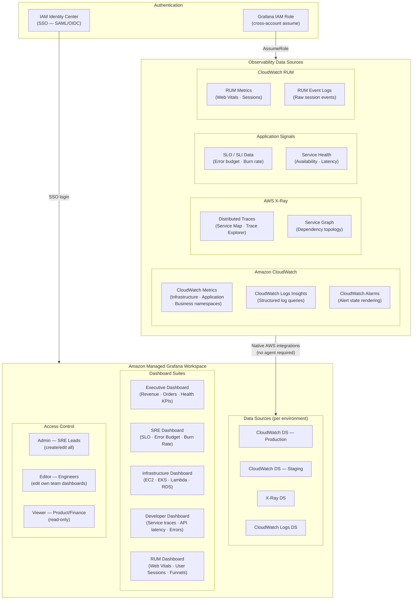
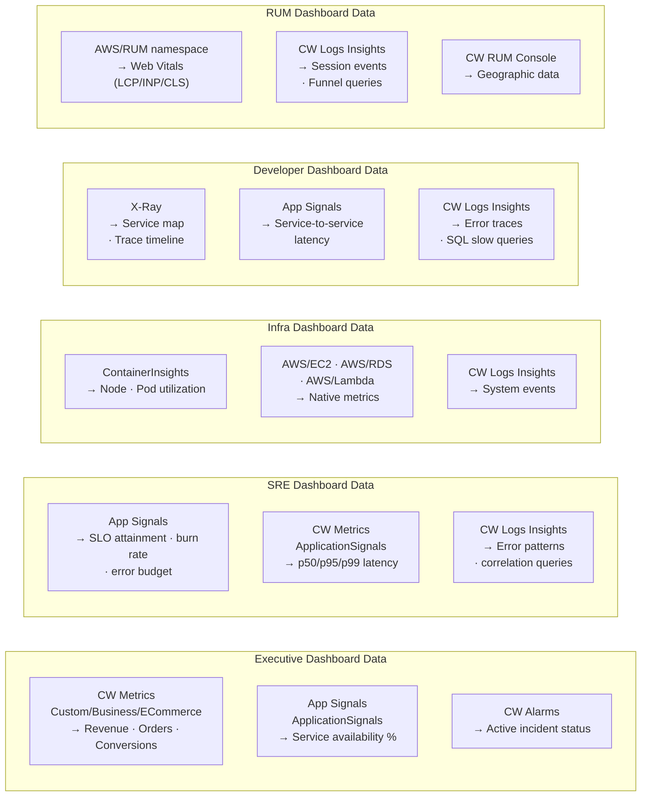
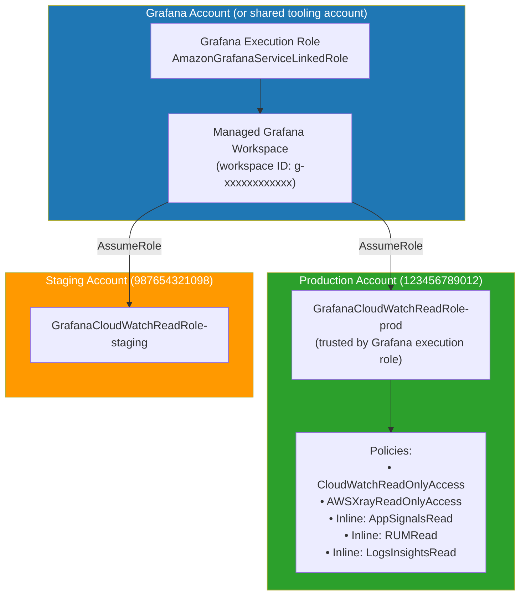
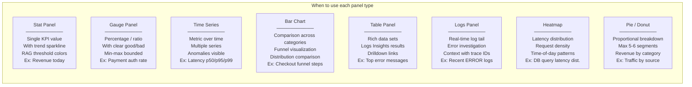
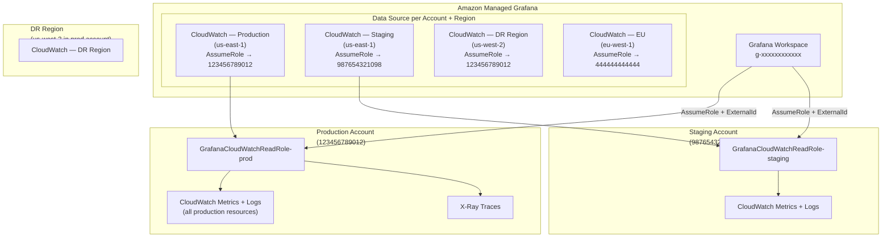

# Amazon Managed Grafana — Production Integration
## CloudWatch · CloudWatch Logs · X-Ray · Application Signals

> **Role**: Grafana Architect
> **Date**: 2026-07-18
> **Grafana Version**: Amazon Managed Grafana v10.4
> **Scope**: Multi-source observability · 5 dashboard suites · Multi-account monitoring

---

## Table of Contents

1. [Architecture](#1-architecture)
2. [IAM Setup](#2-iam-setup)
3. [Workspace Configuration](#3-workspace-configuration)
4. [Data Source Configuration](#4-data-source-configuration)
5. [Dashboard JSON Examples](#5-dashboard-json-examples)
6. [Visualization Best Practices](#6-visualization-best-practices)
7. [Multi-Account Monitoring Design](#7-multi-account-monitoring-design)

---

## 1. Architecture

### 1.1 Full Integration Architecture



### 1.2 Data Flow per Dashboard Type



---

## 2. IAM Setup

### 2.1 IAM Architecture



### 2.2 Grafana Workspace IAM Role (Terraform)

```hcl
# grafana-iam.tf

data "aws_caller_identity" "current" {}
data "aws_region"          "current" {}

# ── Grafana Service Role (in Grafana account) ─────────────────────────────
resource "aws_iam_role" "grafana_execution" {
  name = "AmazonGrafanaServiceRole-ecommerce"

  assume_role_policy = jsonencode({
    Version = "2012-10-17"
    Statement = [{
      Effect    = "Allow"
      Principal = { Service = "grafana.amazonaws.com" }
      Action    = "sts:AssumeRole"
      Condition = {
        StringEquals = {
          "aws:SourceAccount" = data.aws_caller_identity.current.account_id
        }
        ArnLike = {
          "aws:SourceArn" = "arn:aws:grafana:${data.aws_region.current.name}:${data.aws_caller_identity.current.account_id}:/workspaces/*"
        }
      }
    }]
  })

  tags = {
    Project   = "ecommerce-grafana"
    ManagedBy = "terraform"
  }
}

# Allow Grafana role to assume target account roles
resource "aws_iam_role_policy" "grafana_assume_target_roles" {
  name = "AssumeTargetAccountRoles"
  role = aws_iam_role.grafana_execution.id

  policy = jsonencode({
    Version = "2012-10-17"
    Statement = [{
      Sid    = "AssumeObservabilityRoles"
      Effect = "Allow"
      Action = "sts:AssumeRole"
      Resource = [
        "arn:aws:iam::123456789012:role/GrafanaCloudWatchReadRole-prod",
        "arn:aws:iam::987654321098:role/GrafanaCloudWatchReadRole-staging",
        "arn:aws:iam::111111111111:role/GrafanaCloudWatchReadRole-dev"
      ]
    }]
  })
}

# ── Target Account Read Role (deployed to each AWS account) ───────────────
resource "aws_iam_role" "grafana_cloudwatch_read" {
  name     = "GrafanaCloudWatchReadRole-${var.environment}"
  provider = aws.production   # Use appropriate provider per account

  assume_role_policy = jsonencode({
    Version = "2012-10-17"
    Statement = [{
      Effect    = "Allow"
      Principal = {
        AWS = "arn:aws:iam::${var.grafana_account_id}:role/AmazonGrafanaServiceRole-ecommerce"
      }
      Action = "sts:AssumeRole"
      Condition = {
        StringEquals = {
          "sts:ExternalId" = var.grafana_workspace_id
        }
      }
    }]
  })

  tags = {
    Purpose    = "grafana-cloudwatch-read"
    ManagedBy  = "terraform"
    Environment = var.environment
  }
}

# Attach AWS managed policies
resource "aws_iam_role_policy_attachment" "grafana_cloudwatch_read" {
  role       = aws_iam_role.grafana_cloudwatch_read.name
  policy_arn = "arn:aws:iam::aws:policy/CloudWatchReadOnlyAccess"
}

resource "aws_iam_role_policy_attachment" "grafana_xray_read" {
  role       = aws_iam_role.grafana_cloudwatch_read.name
  policy_arn = "arn:aws:iam::aws:policy/AWSXrayReadOnlyAccess"
}

# Inline policy for Application Signals + RUM + Logs Insights
resource "aws_iam_role_policy" "grafana_observability_read" {
  name = "GrafanaObservabilityRead"
  role = aws_iam_role.grafana_cloudwatch_read.id

  policy = jsonencode({
    Version = "2012-10-17"
    Statement = [
      {
        Sid    = "ApplicationSignalsRead"
        Effect = "Allow"
        Action = [
          "application-signals:BatchGetServiceLevelObjectiveBudgetReport",
          "application-signals:GetService",
          "application-signals:GetServiceLevelObjective",
          "application-signals:ListServiceDependencies",
          "application-signals:ListServiceDependents",
          "application-signals:ListServiceLevelObjectives",
          "application-signals:ListServiceOperations",
          "application-signals:ListServices"
        ]
        Resource = "*"
      },
      {
        Sid    = "RUMRead"
        Effect = "Allow"
        Action = [
          "rum:GetAppMonitor",
          "rum:GetAppMonitorData",
          "rum:ListAppMonitors",
          "rum:ListRumMetricsDestinations"
        ]
        Resource = "*"
      },
      {
        Sid    = "CloudWatchLogsInsights"
        Effect = "Allow"
        Action = [
          "logs:StartQuery",
          "logs:StopQuery",
          "logs:GetQueryResults",
          "logs:DescribeLogGroups",
          "logs:DescribeLogStreams",
          "logs:DescribeQueries",
          "logs:GetLogGroupFields",
          "logs:GetLogRecord"
        ]
        Resource = "*"
      },
      {
        Sid    = "TagsForResourceDiscovery"
        Effect = "Allow"
        Action = [
          "tag:GetResources",
          "ec2:DescribeInstances",
          "ec2:DescribeRegions",
          "eks:DescribeCluster",
          "eks:ListClusters"
        ]
        Resource = "*"
      }
    ]
  })
}
```

### 2.3 IAM Identity Center Integration

```hcl
# grafana-sso.tf — IAM Identity Center (SSO) groups → Grafana roles

resource "aws_grafana_workspace" "ecommerce" {
  name                     = "ecommerce-observability"
  account_access_type      = "CURRENT_ACCOUNT"
  authentication_providers = ["AWS_SSO"]
  permission_type          = "SERVICE_MANAGED"

  # Role associations (auto-managed by Grafana)
  role_arn = aws_iam_role.grafana_execution.arn

  data_sources = [
    "CLOUDWATCH",
    "XRAY",
    "AMAZON_OPENSEARCH_SERVICE"
  ]

  notification_destinations = ["SNS"]

  # VPC config — access Grafana within VPC
  vpc_configuration {
    subnet_ids         = var.private_subnet_ids
    security_group_ids = [aws_security_group.grafana.id]
  }

  tags = {
    Project     = "ecommerce"
    Environment = "production"
    ManagedBy   = "terraform"
  }
}

# Assign IAM Identity Center groups to Grafana roles
resource "aws_grafana_role_association" "sre_admins" {
  workspace_id = aws_grafana_workspace.ecommerce.id
  role         = "ADMIN"
  groups       = [var.sso_group_sre_leads]
}

resource "aws_grafana_role_association" "engineers_editors" {
  workspace_id = aws_grafana_workspace.ecommerce.id
  role         = "EDITOR"
  groups       = [var.sso_group_engineers]
}

resource "aws_grafana_role_association" "stakeholders_viewers" {
  workspace_id = aws_grafana_workspace.ecommerce.id
  role         = "VIEWER"
  groups = [
    var.sso_group_product,
    var.sso_group_finance,
    var.sso_group_leadership
  ]
}
```

---

## 3. Workspace Configuration

### 3.1 Grafana Workspace Settings

```bash
# Configure workspace via AWS CLI

WORKSPACE_ID="g-xxxxxxxxxxxx"
REGION="us-east-1"

# Update workspace data sources and notification destinations
aws grafana update-workspace \
  --workspace-id "$WORKSPACE_ID" \
  --workspace-name "ecommerce-observability" \
  --workspace-description "E-Commerce platform observability — production monitoring" \
  --account-access-type CURRENT_ACCOUNT \
  --authentication-providers AWS_SSO \
  --permission-type SERVICE_MANAGED \
  --data-sources CLOUDWATCH XRAY \
  --notification-destinations SNS \
  --region "$REGION"

# Get workspace URL for team access
aws grafana describe-workspace \
  --workspace-id "$WORKSPACE_ID" \
  --region "$REGION" \
  --query 'workspace.{URL:endpoint,Status:status,Version:grafanaVersion}'
```

### 3.2 Grafana Configuration (grafana.ini)

```ini
# grafana.ini — Managed Grafana configuration overrides
# Applied via AWS Console or API — not all settings are available in managed mode

[server]
root_url = https://g-xxxxxxxxxxxx.grafana-workspace.us-east-1.amazonaws.com

[auth]
# Managed by AWS SSO — no local auth needed
disable_login_form = true
oauth_auto_login   = true

[users]
default_theme          = dark
viewers_can_edit       = false
editors_can_admin      = false

[dashboards]
default_home_dashboard_path = /var/lib/grafana/dashboards/executive-overview.json
min_refresh_interval         = 5s

[unified_alerting]
enabled = true

[feature_toggles]
enable = traceToMetrics traceToLogs correlations newTraceViewHeader

[panels]
# Enable all panel types
disable_sanitize_html = false

[dataproxy]
timeout       = 300
max_idle_conns = 100
```

### 3.3 Alert Contact Points (Grafana Alerting)

```yaml
# grafana-alerts.yaml — Grafana Unified Alerting contact points
# Apply via Grafana API or GitOps

apiVersion: 1
contactPoints:
  - orgId: 1
    name: PagerDuty-Critical
    receivers:
      - uid: pd-critical-uid
        type: pagerduty
        settings:
          integrationKey: "${PAGERDUTY_INTEGRATION_KEY}"
          severity: critical
          class: "grafana-alert"
          component: "ecommerce"
          group: "production"
          details:
            runbook: "{{ .Annotations.runbook }}"
            dashboard: "{{ .Annotations.dashboard }}"

  - orgId: 1
    name: Slack-Incidents
    receivers:
      - uid: slack-incidents-uid
        type: slack
        settings:
          url: "${SLACK_WEBHOOK_URL}"
          channel: "#incidents"
          iconEmoji: ":grafana:"
          title: |
            [{{ .Status | toUpper }}] {{ .GroupLabels.alertname }}
          text: |
            *Severity*: {{ .CommonLabels.severity }}
            *Service*: {{ .CommonLabels.service }}
            {{ range .Alerts }}
            *Message*: {{ .Annotations.summary }}
            {{ end }}

  - orgId: 1
    name: Teams-Engineering
    receivers:
      - uid: teams-eng-uid
        type: teams
        settings:
          url: "${TEAMS_WEBHOOK_URL}"

policies:
  - orgId: 1
    receiver: Slack-Incidents
    group_by: [alertname, severity, service]
    group_wait:      30s
    group_interval:  5m
    repeat_interval: 4h
    routes:
      - receiver: PagerDuty-Critical
        matchers:
          - severity = critical
        group_wait:     10s
        repeat_interval: 1h
```

---

## 4. Data Source Configuration

### 4.1 CloudWatch Data Source

```json
{
  "name": "CloudWatch-Production",
  "type": "cloudwatch",
  "url": "https://monitoring.us-east-1.amazonaws.com",
  "access": "proxy",
  "jsonData": {
    "authType": "grafana_assume_role",
    "assumeRoleArn": "arn:aws:iam::123456789012:role/GrafanaCloudWatchReadRole-prod",
    "defaultRegion": "us-east-1",
    "externalId": "g-xxxxxxxxxxxx",
    "customMetricsNamespaces": "Custom/Business/ECommerce,Custom/Application/Services,Custom/Business/Payment,Custom/Lambda/ECommerce",
    "logsTimeout": "30m",
    "tracingDatasourceUid": "xray-prod-uid",
    "annotationsEnabled": true,
    "alertingEnabled": true
  }
}
```

### 4.2 CloudWatch Logs Data Source

```json
{
  "name": "CloudWatch-Logs-Production",
  "type": "cloudwatch",
  "url": "https://logs.us-east-1.amazonaws.com",
  "access": "proxy",
  "jsonData": {
    "authType": "grafana_assume_role",
    "assumeRoleArn": "arn:aws:iam::123456789012:role/GrafanaCloudWatchReadRole-prod",
    "defaultRegion": "us-east-1",
    "defaultLogGroups": [
      "/ecommerce/prod/eks/application",
      "/aws/lambda/order-processor",
      "/aws/api-gateway/ecommerce/access",
      "/aws/rds/cluster/ecommerce-aurora/slowquery"
    ],
    "logsTimeout": "30m"
  }
}
```

### 4.3 X-Ray Data Source

```json
{
  "name": "X-Ray-Production",
  "type": "grafana-x-ray-datasource",
  "url": "https://xray.us-east-1.amazonaws.com",
  "access": "proxy",
  "jsonData": {
    "authType": "grafana_assume_role",
    "assumeRoleArn": "arn:aws:iam::123456789012:role/GrafanaCloudWatchReadRole-prod",
    "defaultRegion": "us-east-1",
    "tracingDatasourceUid": "xray-prod-uid",
    "paginationEnabled": true
  }
}
```

### 4.4 Data Source Provisioning via Terraform

```hcl
# grafana-datasources.tf (using Grafana Terraform provider)

terraform {
  required_providers {
    grafana = {
      source  = "grafana/grafana"
      version = "~> 3.0"
    }
  }
}

provider "grafana" {
  url  = "https://g-xxxxxxxxxxxx.grafana-workspace.us-east-1.amazonaws.com"
  auth = var.grafana_service_account_token
}

# ── CloudWatch — Production ───────────────────────────────────────────────
resource "grafana_data_source" "cloudwatch_prod" {
  name = "CloudWatch-Production"
  type = "cloudwatch"

  json_data_encoded = jsonencode({
    authType                = "grafana_assume_role"
    assumeRoleArn           = "arn:aws:iam::123456789012:role/GrafanaCloudWatchReadRole-prod"
    defaultRegion           = "us-east-1"
    externalId              = var.grafana_workspace_id
    customMetricsNamespaces = join(",", [
      "Custom/Business/ECommerce",
      "Custom/Application/Services",
      "Custom/Business/Payment",
      "ApplicationSignals"
    ])
    logsTimeout        = "30m"
    tracingDatasourceUid = grafana_data_source.xray_prod.uid
  })
}

# ── X-Ray — Production ────────────────────────────────────────────────────
resource "grafana_data_source" "xray_prod" {
  name = "X-Ray-Production"
  type = "grafana-x-ray-datasource"

  json_data_encoded = jsonencode({
    authType      = "grafana_assume_role"
    assumeRoleArn = "arn:aws:iam::123456789012:role/GrafanaCloudWatchReadRole-prod"
    defaultRegion = "us-east-1"
  })
}

# ── Folders for dashboard organization ───────────────────────────────────
resource "grafana_folder" "executive" {
  title = "Executive"
}

resource "grafana_folder" "sre" {
  title = "SRE"
}

resource "grafana_folder" "infrastructure" {
  title = "Infrastructure"
}

resource "grafana_folder" "developer" {
  title = "Developer"
}

resource "grafana_folder" "rum" {
  title = "RUM"
}

# ── RBAC: restrict folder access by SSO group ─────────────────────────────
resource "grafana_folder_permission" "executive_viewers" {
  folder_uid = grafana_folder.executive.uid
  permissions = [
    { team_id = var.team_id_leadership, permission = "View" },
    { team_id = var.team_id_product,    permission = "View" },
    { team_id = var.team_id_sre,        permission = "Edit" }
  ]
}

resource "grafana_folder_permission" "sre_restricted" {
  folder_uid = grafana_folder.sre.uid
  permissions = [
    { team_id = var.team_id_sre,         permission = "Admin" },
    { team_id = var.team_id_engineering, permission = "View" }
  ]
}
```

---

## 5. Dashboard JSON Examples

### 5.1 Executive Dashboard

```json
{
  "title": "Executive Dashboard — E-Commerce Platform",
  "uid": "exec-overview-v1",
  "tags": ["executive", "business", "production"],
  "refresh": "5m",
  "time": {"from": "now-24h", "to": "now"},
  "panels": [
    {
      "id": 1,
      "type": "text",
      "gridPos": {"x": 0, "y": 0, "w": 24, "h": 2},
      "options": {
        "mode": "markdown",
        "content": "# 🏢 E-Commerce Platform — Executive Overview\n**Auto-refresh**: 5min | **Environment**: Production | **Region**: us-east-1"
      }
    },
    {
      "id": 2,
      "title": "💰 Revenue Today (USD)",
      "type": "stat",
      "gridPos": {"x": 0, "y": 2, "w": 6, "h": 4},
      "datasource": {"type": "cloudwatch", "uid": "${datasource_prod}"},
      "targets": [{
        "queryMode": "Metrics",
        "namespace": "Custom/Business/ECommerce",
        "metricName": "RevenueUSD",
        "dimensions": {"Environment": "production"},
        "statistic": "Sum",
        "period": "86400",
        "refId": "A"
      }],
      "options": {
        "reduceOptions": {"calcs": ["sum"]},
        "colorMode": "background",
        "graphMode": "area",
        "orientation": "auto"
      },
      "fieldConfig": {
        "defaults": {
          "unit": "currencyUSD",
          "decimals": 2,
          "thresholds": {
            "mode": "percentage",
            "steps": [
              {"color": "red",    "value": null},
              {"color": "orange", "value": 70},
              {"color": "green",  "value": 90}
            ]
          }
        }
      }
    },
    {
      "id": 3,
      "title": "📦 Orders Per Minute",
      "type": "stat",
      "gridPos": {"x": 6, "y": 2, "w": 6, "h": 4},
      "datasource": {"type": "cloudwatch", "uid": "${datasource_prod}"},
      "targets": [{
        "queryMode": "Metrics",
        "namespace": "Custom/Business/ECommerce",
        "metricName": "OrdersPlaced",
        "dimensions": {"Environment": "production"},
        "statistic": "Sum",
        "period": "300",
        "expression": "METRICS()/5",
        "refId": "A",
        "id": "orders_per_min"
      }],
      "options": {
        "reduceOptions": {"calcs": ["lastNotNull"]},
        "colorMode": "value",
        "graphMode": "area"
      },
      "fieldConfig": {
        "defaults": {
          "unit": "reqps",
          "displayName": "Orders/min",
          "thresholds": {
            "mode": "absolute",
            "steps": [
              {"color": "red",    "value": null},
              {"color": "yellow", "value": 5},
              {"color": "green",  "value": 10}
            ]
          }
        }
      }
    },
    {
      "id": 4,
      "title": "💳 Payment Auth Rate",
      "type": "gauge",
      "gridPos": {"x": 12, "y": 2, "w": 6, "h": 4},
      "datasource": {"type": "cloudwatch", "uid": "${datasource_prod}"},
      "targets": [
        {
          "queryMode": "Metrics",
          "namespace": "Custom/Business/Payment",
          "metricName": "PaymentSuccesses",
          "dimensions": {"Environment": "production"},
          "statistic": "Sum",
          "period": "3600",
          "refId": "A",
          "id": "successes"
        },
        {
          "queryMode": "Metrics",
          "namespace": "Custom/Business/Payment",
          "metricName": "PaymentAttempts",
          "dimensions": {"Environment": "production"},
          "statistic": "Sum",
          "period": "3600",
          "refId": "B",
          "id": "attempts",
          "hide": true
        },
        {
          "queryMode": "Metrics",
          "expression": "(successes / attempts) * 100",
          "id": "auth_rate",
          "refId": "C"
        }
      ],
      "fieldConfig": {
        "defaults": {
          "unit": "percent",
          "min": 90,
          "max": 100,
          "thresholds": {
            "mode": "absolute",
            "steps": [
              {"color": "red",    "value": null},
              {"color": "orange", "value": 95},
              {"color": "green",  "value": 97}
            ]
          }
        }
      }
    },
    {
      "id": 5,
      "title": "❌ Failed Transactions",
      "type": "stat",
      "gridPos": {"x": 18, "y": 2, "w": 6, "h": 4},
      "datasource": {"type": "cloudwatch", "uid": "${datasource_prod}"},
      "targets": [{
        "queryMode": "Metrics",
        "namespace": "Custom/Business/ECommerce",
        "metricName": "FailedTransactions",
        "dimensions": {"Environment": "production"},
        "statistic": "Sum",
        "period": "3600",
        "refId": "A"
      }],
      "fieldConfig": {
        "defaults": {
          "unit": "short",
          "thresholds": {
            "mode": "absolute",
            "steps": [
              {"color": "green",  "value": null},
              {"color": "yellow", "value": 10},
              {"color": "red",    "value": 50}
            ]
          }
        }
      }
    },
    {
      "id": 6,
      "title": "📈 Revenue Trend — Last 7 Days",
      "type": "timeseries",
      "gridPos": {"x": 0, "y": 6, "w": 16, "h": 8},
      "datasource": {"type": "cloudwatch", "uid": "${datasource_prod}"},
      "targets": [
        {
          "queryMode": "Metrics",
          "namespace": "Custom/Business/ECommerce",
          "metricName": "RevenueUSD",
          "dimensions": {"Environment": "production", "ProductCategory": "electronics"},
          "statistic": "Sum",
          "period": "3600",
          "refId": "A",
          "alias": "Electronics"
        },
        {
          "queryMode": "Metrics",
          "namespace": "Custom/Business/ECommerce",
          "metricName": "RevenueUSD",
          "dimensions": {"Environment": "production", "ProductCategory": "clothing"},
          "statistic": "Sum",
          "period": "3600",
          "refId": "B",
          "alias": "Clothing"
        },
        {
          "queryMode": "Metrics",
          "namespace": "Custom/Business/ECommerce",
          "metricName": "RevenueUSD",
          "dimensions": {"Environment": "production", "ProductCategory": "home"},
          "statistic": "Sum",
          "period": "3600",
          "refId": "C",
          "alias": "Home & Garden"
        }
      ],
      "options": {
        "tooltip": {"mode": "multi"},
        "legend": {"displayMode": "list", "placement": "bottom"}
      },
      "fieldConfig": {
        "defaults": {
          "unit": "currencyUSD",
          "custom": {"fillOpacity": 20, "lineWidth": 2}
        }
      }
    },
    {
      "id": 7,
      "title": "🛒 Checkout Funnel — Last 24h",
      "type": "barchart",
      "gridPos": {"x": 16, "y": 6, "w": 8, "h": 8},
      "datasource": {"type": "cloudwatch", "uid": "${datasource_prod}"},
      "targets": [
        {
          "queryMode": "Metrics",
          "namespace": "Custom/Business/ECommerce",
          "metricName": "CheckoutStepReached",
          "dimensions": {"Environment": "production", "CheckoutStep": "cart"},
          "statistic": "Sum", "period": "86400", "refId": "A", "alias": "Cart"
        },
        {
          "queryMode": "Metrics",
          "namespace": "Custom/Business/ECommerce",
          "metricName": "CheckoutStepReached",
          "dimensions": {"Environment": "production", "CheckoutStep": "shipping"},
          "statistic": "Sum", "period": "86400", "refId": "B", "alias": "Shipping"
        },
        {
          "queryMode": "Metrics",
          "namespace": "Custom/Business/ECommerce",
          "metricName": "CheckoutStepReached",
          "dimensions": {"Environment": "production", "CheckoutStep": "payment"},
          "statistic": "Sum", "period": "86400", "refId": "C", "alias": "Payment"
        },
        {
          "queryMode": "Metrics",
          "namespace": "Custom/Business/ECommerce",
          "metricName": "CheckoutStepCompleted",
          "dimensions": {"Environment": "production", "CheckoutStep": "confirmation"},
          "statistic": "Sum", "period": "86400", "refId": "D", "alias": "Confirmed"
        }
      ],
      "options": {
        "orientation": "horizontal",
        "barWidth": 0.8
      },
      "fieldConfig": {
        "defaults": {"unit": "short"}
      }
    },
    {
      "id": 8,
      "title": "🎯 Platform Health — Service Availability",
      "type": "stat",
      "gridPos": {"x": 0, "y": 14, "w": 24, "h": 4},
      "datasource": {"type": "cloudwatch", "uid": "${datasource_prod}"},
      "targets": [
        {
          "queryMode": "Metrics",
          "namespace": "ApplicationSignals",
          "metricName": "Availability",
          "dimensions": {"Service": "order-service",   "Environment": "production"},
          "statistic": "Average", "period": "3600", "refId": "A", "alias": "Order"
        },
        {
          "queryMode": "Metrics",
          "namespace": "ApplicationSignals",
          "metricName": "Availability",
          "dimensions": {"Service": "payment-service", "Environment": "production"},
          "statistic": "Average", "period": "3600", "refId": "B", "alias": "Payment"
        },
        {
          "queryMode": "Metrics",
          "namespace": "ApplicationSignals",
          "metricName": "Availability",
          "dimensions": {"Service": "product-service", "Environment": "production"},
          "statistic": "Average", "period": "3600", "refId": "C", "alias": "Product"
        }
      ],
      "options": {
        "reduceOptions": {"calcs": ["lastNotNull"]},
        "colorMode": "background",
        "orientation": "horizontal"
      },
      "fieldConfig": {
        "defaults": {
          "unit": "percentunit",
          "min": 0.99,
          "max": 1.0,
          "thresholds": {
            "mode": "absolute",
            "steps": [
              {"color": "red",    "value": null},
              {"color": "yellow", "value": 0.999},
              {"color": "green",  "value": 0.9995}
            ]
          }
        }
      }
    }
  ],
  "templating": {
    "list": [
      {
        "name": "datasource_prod",
        "type": "datasource",
        "pluginId": "cloudwatch",
        "label": "Data Source",
        "current": {"text": "CloudWatch-Production", "value": "CloudWatch-Production"}
      },
      {
        "name": "environment",
        "type": "custom",
        "label": "Environment",
        "options": [
          {"text": "production", "value": "production", "selected": true},
          {"text": "staging",    "value": "staging"}
        ]
      }
    ]
  }
}
```

### 5.2 SRE Dashboard — SLO & Error Budget

```json
{
  "title": "SRE Dashboard — SLO & Error Budget",
  "uid": "sre-slo-v1",
  "tags": ["sre", "slo", "error-budget", "production"],
  "refresh": "1m",
  "panels": [
    {
      "id": 10,
      "title": "🎯 SLO Attainment — All Services (Rolling 30d)",
      "type": "bargauge",
      "gridPos": {"x": 0, "y": 0, "w": 12, "h": 6},
      "datasource": {"type": "cloudwatch", "uid": "${datasource_prod}"},
      "targets": [
        {
          "queryMode": "Metrics",
          "namespace": "ApplicationSignals",
          "metricName": "Availability",
          "dimensions": {"Service": "order-service",   "Environment": "production"},
          "statistic": "Average", "period": "2592000", "refId": "A", "alias": "Order Service"
        },
        {
          "queryMode": "Metrics",
          "namespace": "ApplicationSignals",
          "metricName": "Availability",
          "dimensions": {"Service": "payment-service", "Environment": "production"},
          "statistic": "Average", "period": "2592000", "refId": "B", "alias": "Payment Service"
        },
        {
          "queryMode": "Metrics",
          "namespace": "ApplicationSignals",
          "metricName": "Availability",
          "dimensions": {"Service": "product-service", "Environment": "production"},
          "statistic": "Average", "period": "2592000", "refId": "C", "alias": "Product Service"
        },
        {
          "queryMode": "Metrics",
          "namespace": "ApplicationSignals",
          "metricName": "Availability",
          "dimensions": {"Service": "cart-service",    "Environment": "production"},
          "statistic": "Average", "period": "2592000", "refId": "D", "alias": "Cart Service"
        }
      ],
      "options": {
        "orientation": "horizontal",
        "reduceOptions": {"calcs": ["lastNotNull"]},
        "displayMode": "gradient"
      },
      "fieldConfig": {
        "defaults": {
          "unit": "percentunit",
          "min": 0.99, "max": 1.0,
          "thresholds": {
            "mode": "absolute",
            "steps": [
              {"color": "red",    "value": null},
              {"color": "yellow", "value": 0.999},
              {"color": "green",  "value": 0.9995}
            ]
          }
        }
      }
    },
    {
      "id": 11,
      "title": "🔥 Error Budget Consumed % — Rolling 30d",
      "type": "timeseries",
      "gridPos": {"x": 12, "y": 0, "w": 12, "h": 6},
      "datasource": {"type": "cloudwatch", "uid": "${datasource_prod}"},
      "targets": [
        {
          "queryMode": "Metrics",
          "expression": "((1 - order_avail) / 0.0005) * 100",
          "id": "order_budget_consumed",
          "refId": "A",
          "alias": "Order Budget Consumed %"
        },
        {
          "queryMode": "Metrics",
          "namespace": "ApplicationSignals",
          "metricName": "Availability",
          "dimensions": {"Service": "order-service", "Environment": "production"},
          "statistic": "Average", "period": "86400",
          "id": "order_avail", "hide": true, "refId": "E"
        }
      ],
      "fieldConfig": {
        "defaults": {
          "unit": "percent",
          "custom": {"lineWidth": 2, "fillOpacity": 15},
          "thresholds": {
            "mode": "absolute",
            "steps": [
              {"color": "green",  "value": null},
              {"color": "yellow", "value": 50},
              {"color": "orange", "value": 75},
              {"color": "red",    "value": 100}
            ]
          }
        }
      }
    },
    {
      "id": 12,
      "title": "⏱ p50 / p95 / p99 Latency — Order Service",
      "type": "timeseries",
      "gridPos": {"x": 0, "y": 6, "w": 12, "h": 6},
      "datasource": {"type": "cloudwatch", "uid": "${datasource_prod}"},
      "targets": [
        {
          "queryMode": "Metrics",
          "namespace": "ApplicationSignals",
          "metricName": "Latency",
          "dimensions": {"Service": "order-service", "Environment": "production"},
          "statistic": "p50",  "period": "300", "refId": "A", "alias": "p50"
        },
        {
          "queryMode": "Metrics",
          "namespace": "ApplicationSignals",
          "metricName": "Latency",
          "dimensions": {"Service": "order-service", "Environment": "production"},
          "statistic": "p95",  "period": "300", "refId": "B", "alias": "p95"
        },
        {
          "queryMode": "Metrics",
          "namespace": "ApplicationSignals",
          "metricName": "Latency",
          "dimensions": {"Service": "order-service", "Environment": "production"},
          "statistic": "p99",  "period": "300", "refId": "C", "alias": "p99"
        }
      ],
      "fieldConfig": {
        "defaults": {
          "unit": "ms",
          "custom": {"lineWidth": 2}
        }
      },
      "options": {
        "annotations": {
          "enabled": true,
          "datasource": "${datasource_prod}"
        }
      }
    },
    {
      "id": 13,
      "title": "Recent Errors — Cross-Service (Logs Insights)",
      "type": "logs",
      "gridPos": {"x": 12, "y": 6, "w": 12, "h": 6},
      "datasource": {"type": "cloudwatch", "uid": "${datasource_prod}"},
      "targets": [{
        "queryMode": "Logs",
        "logGroups": ["/ecommerce/prod/eks/application"],
        "expression": "fields @timestamp, service, level, message, traceId | filter level in ['ERROR', 'FATAL'] | sort @timestamp desc | limit 50",
        "refId": "A"
      }],
      "options": {
        "showTime": true,
        "sortOrder": "Descending",
        "enableLogDetails": true
      }
    }
  ]
}
```

### 5.3 Infrastructure Dashboard

```json
{
  "title": "Infrastructure Dashboard — EKS · EC2 · Lambda · RDS",
  "uid": "infra-v1",
  "tags": ["infrastructure", "eks", "lambda", "rds"],
  "refresh": "1m",
  "panels": [
    {
      "id": 20,
      "title": "EKS — Node CPU Utilization (p50/p90/p99)",
      "type": "timeseries",
      "gridPos": {"x": 0, "y": 0, "w": 12, "h": 6},
      "datasource": {"type": "cloudwatch", "uid": "${datasource_prod}"},
      "targets": [
        {
          "queryMode": "Metrics",
          "namespace": "ContainerInsights",
          "metricName": "node_cpu_utilization",
          "dimensions": {"ClusterName": "${eks_cluster}"},
          "statistic": "p50", "period": "300", "refId": "A", "alias": "p50"
        },
        {
          "queryMode": "Metrics",
          "namespace": "ContainerInsights",
          "metricName": "node_cpu_utilization",
          "dimensions": {"ClusterName": "${eks_cluster}"},
          "statistic": "p90", "period": "300", "refId": "B", "alias": "p90"
        },
        {
          "queryMode": "Metrics",
          "namespace": "ContainerInsights",
          "metricName": "node_cpu_utilization",
          "dimensions": {"ClusterName": "${eks_cluster}"},
          "statistic": "p99", "period": "300", "refId": "C", "alias": "p99"
        }
      ],
      "fieldConfig": {
        "defaults": {
          "unit": "percent",
          "min": 0, "max": 100,
          "thresholds": {
            "mode": "absolute",
            "steps": [
              {"color": "green",  "value": null},
              {"color": "yellow", "value": 70},
              {"color": "red",    "value": 90}
            ]
          }
        }
      }
    },
    {
      "id": 21,
      "title": "Lambda — Duration p99 + Cold Starts",
      "type": "timeseries",
      "gridPos": {"x": 12, "y": 0, "w": 12, "h": 6},
      "datasource": {"type": "cloudwatch", "uid": "${datasource_prod}"},
      "targets": [
        {
          "queryMode": "Metrics",
          "namespace": "AWS/Lambda",
          "metricName": "Duration",
          "dimensions": {"FunctionName": "order-processor"},
          "statistic": "p99", "period": "300", "refId": "A", "alias": "Duration p99"
        },
        {
          "queryMode": "Metrics",
          "namespace": "AWS/Lambda",
          "metricName": "InitDuration",
          "dimensions": {"FunctionName": "order-processor"},
          "statistic": "SampleCount", "period": "300",
          "refId": "B", "alias": "Cold Starts/5min"
        }
      ],
      "fieldConfig": {
        "overrides": [
          {
            "matcher": {"id": "byName", "options": "Cold Starts/5min"},
            "properties": [
              {"id": "custom.axisPlacement", "value": "right"},
              {"id": "unit", "value": "short"},
              {"id": "custom.drawStyle", "value": "bars"}
            ]
          },
          {
            "matcher": {"id": "byName", "options": "Duration p99"},
            "properties": [{"id": "unit", "value": "ms"}]
          }
        ]
      }
    },
    {
      "id": 22,
      "title": "RDS — Read/Write Latency + Connections",
      "type": "timeseries",
      "gridPos": {"x": 0, "y": 6, "w": 12, "h": 6},
      "datasource": {"type": "cloudwatch", "uid": "${datasource_prod}"},
      "targets": [
        {
          "queryMode": "Metrics",
          "namespace": "AWS/RDS",
          "metricName": "ReadLatency",
          "dimensions": {"DBClusterIdentifier": "ecommerce-aurora"},
          "statistic": "p99", "period": "300", "refId": "A", "alias": "Read p99"
        },
        {
          "queryMode": "Metrics",
          "namespace": "AWS/RDS",
          "metricName": "WriteLatency",
          "dimensions": {"DBClusterIdentifier": "ecommerce-aurora"},
          "statistic": "p99", "period": "300", "refId": "B", "alias": "Write p99"
        },
        {
          "queryMode": "Metrics",
          "namespace": "AWS/RDS",
          "metricName": "DatabaseConnections",
          "dimensions": {"DBClusterIdentifier": "ecommerce-aurora"},
          "statistic": "Maximum", "period": "300", "refId": "C", "alias": "Connections"
        }
      ],
      "fieldConfig": {
        "overrides": [{
          "matcher": {"id": "byName", "options": "Connections"},
          "properties": [
            {"id": "custom.axisPlacement", "value": "right"},
            {"id": "unit", "value": "short"}
          ]
        }],
        "defaults": {"unit": "s"}
      }
    }
  ],
  "templating": {
    "list": [
      {
        "name": "eks_cluster",
        "type": "custom",
        "label": "EKS Cluster",
        "options": [{"text": "ecommerce-prod", "value": "ecommerce-prod", "selected": true}]
      }
    ]
  }
}
```

### 5.4 Developer Dashboard — Traces & Service Map

```json
{
  "title": "Developer Dashboard — Service Traces & Latency",
  "uid": "developer-traces-v1",
  "tags": ["developer", "traces", "xray", "service-map"],
  "refresh": "30s",
  "panels": [
    {
      "id": 30,
      "title": "🗺 X-Ray Service Map",
      "type": "grafana-x-ray-datasource-service-map",
      "gridPos": {"x": 0, "y": 0, "w": 24, "h": 10},
      "datasource": {"type": "grafana-x-ray-datasource", "uid": "${datasource_xray}"},
      "targets": [{
        "queryType": "getServiceGraph",
        "region": "us-east-1",
        "refId": "A"
      }]
    },
    {
      "id": 31,
      "title": "🔍 Trace Explorer — Recent Faults",
      "type": "grafana-x-ray-datasource-trace-list",
      "gridPos": {"x": 0, "y": 10, "w": 12, "h": 8},
      "datasource": {"type": "grafana-x-ray-datasource", "uid": "${datasource_xray}"},
      "targets": [{
        "queryType": "getTraceSummaries",
        "region": "us-east-1",
        "filter": "fault = true",
        "refId": "A"
      }]
    },
    {
      "id": 32,
      "title": "⏱ Service Latency — All Services (p99)",
      "type": "timeseries",
      "gridPos": {"x": 12, "y": 10, "w": 12, "h": 8},
      "datasource": {"type": "cloudwatch", "uid": "${datasource_prod}"},
      "targets": [
        {
          "queryMode": "Metrics",
          "namespace": "ApplicationSignals",
          "metricName": "Latency",
          "dimensions": {"Service": "order-service",   "Environment": "production"},
          "statistic": "p99", "period": "60", "refId": "A", "alias": "order-service"
        },
        {
          "queryMode": "Metrics",
          "namespace": "ApplicationSignals",
          "metricName": "Latency",
          "dimensions": {"Service": "payment-service", "Environment": "production"},
          "statistic": "p99", "period": "60", "refId": "B", "alias": "payment-service"
        },
        {
          "queryMode": "Metrics",
          "namespace": "ApplicationSignals",
          "metricName": "Latency",
          "dimensions": {"Service": "product-service", "Environment": "production"},
          "statistic": "p99", "period": "60", "refId": "C", "alias": "product-service"
        }
      ],
      "fieldConfig": {
        "defaults": {
          "unit": "ms",
          "custom": {"lineWidth": 2}
        }
      }
    },
    {
      "id": 33,
      "title": "📋 Error Log Correlation (with Trace ID)",
      "type": "logs",
      "gridPos": {"x": 0, "y": 18, "w": 24, "h": 6},
      "datasource": {"type": "cloudwatch", "uid": "${datasource_prod}"},
      "targets": [{
        "queryMode": "Logs",
        "logGroups": ["/ecommerce/prod/eks/application"],
        "expression": "fields @timestamp, service, level, message, traceId, spanId | filter level = 'ERROR' | sort @timestamp desc | limit 30",
        "refId": "A"
      }],
      "options": {
        "showTime": true,
        "dedupStrategy": "none",
        "enableLogDetails": true,
        "wrapLogMessage": false
      },
      "transformations": [{
        "id": "organize",
        "options": {
          "renameByName": {
            "traceId": "Trace ID (click → X-Ray)"
          }
        }
      }]
    }
  ]
}
```

### 5.5 RUM Dashboard

```json
{
  "title": "RUM Dashboard — Web Vitals & User Experience",
  "uid": "rum-webvitals-v1",
  "tags": ["rum", "web-vitals", "frontend", "performance"],
  "refresh": "5m",
  "panels": [
    {
      "id": 40,
      "title": "LCP — Largest Contentful Paint p75",
      "type": "gauge",
      "gridPos": {"x": 0, "y": 0, "w": 6, "h": 4},
      "datasource": {"type": "cloudwatch", "uid": "${datasource_prod}"},
      "targets": [{
        "queryMode": "Metrics",
        "namespace": "AWS/RUM",
        "metricName": "NavigationLargestContentfulPaint",
        "dimensions": {"application_name": "ecommerce-production"},
        "statistic": "p75", "period": "3600", "refId": "A"
      }],
      "fieldConfig": {
        "defaults": {
          "unit": "ms",
          "min": 0, "max": 6000,
          "thresholds": {
            "mode": "absolute",
            "steps": [
              {"color": "green",  "value": null},
              {"color": "yellow", "value": 2500},
              {"color": "red",    "value": 4000}
            ]
          }
        }
      }
    },
    {
      "id": 41,
      "title": "INP — Interaction to Next Paint p75",
      "type": "gauge",
      "gridPos": {"x": 6, "y": 0, "w": 6, "h": 4},
      "datasource": {"type": "cloudwatch", "uid": "${datasource_prod}"},
      "targets": [{
        "queryMode": "Metrics",
        "namespace": "AWS/RUM",
        "metricName": "InteractionToNextPaint",
        "dimensions": {"application_name": "ecommerce-production"},
        "statistic": "p75", "period": "3600", "refId": "A"
      }],
      "fieldConfig": {
        "defaults": {
          "unit": "ms",
          "min": 0, "max": 800,
          "thresholds": {
            "mode": "absolute",
            "steps": [
              {"color": "green",  "value": null},
              {"color": "yellow", "value": 200},
              {"color": "red",    "value": 500}
            ]
          }
        }
      }
    },
    {
      "id": 42,
      "title": "CLS — Cumulative Layout Shift p75",
      "type": "gauge",
      "gridPos": {"x": 12, "y": 0, "w": 6, "h": 4},
      "datasource": {"type": "cloudwatch", "uid": "${datasource_prod}"},
      "targets": [{
        "queryMode": "Metrics",
        "namespace": "AWS/RUM",
        "metricName": "CumulativeLayoutShift",
        "dimensions": {"application_name": "ecommerce-production"},
        "statistic": "p75", "period": "3600", "refId": "A"
      }],
      "fieldConfig": {
        "defaults": {
          "unit": "short",
          "min": 0, "max": 0.5,
          "thresholds": {
            "mode": "absolute",
            "steps": [
              {"color": "green",  "value": null},
              {"color": "yellow", "value": 0.1},
              {"color": "red",    "value": 0.25}
            ]
          }
        }
      }
    },
    {
      "id": 43,
      "title": "Session Volume + JS Error Rate",
      "type": "timeseries",
      "gridPos": {"x": 0, "y": 4, "w": 16, "h": 6},
      "datasource": {"type": "cloudwatch", "uid": "${datasource_prod}"},
      "targets": [
        {
          "queryMode": "Metrics",
          "namespace": "AWS/RUM",
          "metricName": "SessionCount",
          "dimensions": {"application_name": "ecommerce-production"},
          "statistic": "Sum", "period": "300", "refId": "A", "alias": "Sessions/5min"
        },
        {
          "queryMode": "Metrics",
          "expression": "(js_errors / page_views) * 100",
          "id": "js_error_rate",
          "refId": "D",
          "alias": "JS Error Rate %"
        },
        {
          "queryMode": "Metrics",
          "namespace": "AWS/RUM",
          "metricName": "JsErrorCount",
          "dimensions": {"application_name": "ecommerce-production"},
          "statistic": "Sum", "period": "300",
          "id": "js_errors", "hide": true, "refId": "B"
        },
        {
          "queryMode": "Metrics",
          "namespace": "AWS/RUM",
          "metricName": "PageViewCount",
          "dimensions": {"application_name": "ecommerce-production"},
          "statistic": "Sum", "period": "300",
          "id": "page_views", "hide": true, "refId": "C"
        }
      ],
      "fieldConfig": {
        "overrides": [{
          "matcher": {"id": "byName", "options": "JS Error Rate %"},
          "properties": [
            {"id": "custom.axisPlacement", "value": "right"},
            {"id": "unit", "value": "percent"},
            {"id": "color", "value": {"fixedColor": "red", "mode": "fixed"}}
          ]
        }],
        "defaults": {"unit": "short"}
      }
    },
    {
      "id": 44,
      "title": "Core Web Vitals — Trend (7 days, p75)",
      "type": "timeseries",
      "gridPos": {"x": 0, "y": 10, "w": 24, "h": 6},
      "datasource": {"type": "cloudwatch", "uid": "${datasource_prod}"},
      "targets": [
        {
          "queryMode": "Metrics",
          "namespace": "AWS/RUM",
          "metricName": "NavigationLargestContentfulPaint",
          "dimensions": {"application_name": "ecommerce-production"},
          "statistic": "p75", "period": "3600", "refId": "A", "alias": "LCP p75"
        },
        {
          "queryMode": "Metrics",
          "namespace": "AWS/RUM",
          "metricName": "InteractionToNextPaint",
          "dimensions": {"application_name": "ecommerce-production"},
          "statistic": "p75", "period": "3600", "refId": "B", "alias": "INP p75"
        },
        {
          "queryMode": "Metrics",
          "namespace": "AWS/RUM",
          "metricName": "NavigationResponseStart",
          "dimensions": {"application_name": "ecommerce-production"},
          "statistic": "p75", "period": "3600", "refId": "C", "alias": "TTFB p75"
        }
      ],
      "fieldConfig": {
        "defaults": {"unit": "ms", "custom": {"lineWidth": 2}}
      }
    },
    {
      "id": 45,
      "title": "Page Load Distribution — Session Query",
      "type": "table",
      "gridPos": {"x": 0, "y": 16, "w": 24, "h": 6},
      "datasource": {"type": "cloudwatch", "uid": "${datasource_prod}"},
      "targets": [{
        "queryMode": "Logs",
        "logGroups": ["/aws/rum/ecommerce-production"],
        "expression": "fields event.pageId, event.version.value | filter event.type = 'com.amazon.rum.largest_contentful_paint_event' | stats pct(event.version.value, 75) as lcp_p75, count() as samples by event.pageId | sort lcp_p75 desc | limit 10",
        "refId": "A"
      }]
    }
  ]
}
```

---

## 6. Visualization Best Practices

### 6.1 Panel Type Selection Guide



### 6.2 Color + Threshold Standards

```json
{
  "_comment": "Standard Grafana threshold config — apply consistently across dashboards",
  "thresholds_availability": {
    "mode": "absolute",
    "steps": [
      {"color": "red",    "value": null,   "_comment": "< 99% = red"},
      {"color": "yellow", "value": 0.999,  "_comment": "99–99.95% = yellow"},
      {"color": "green",  "value": 0.9995, "_comment": "> 99.95% = green (SLO target)"}
    ]
  },
  "thresholds_latency_ms": {
    "mode": "absolute",
    "steps": [
      {"color": "green",  "value": null, "_comment": "< 200ms = good"},
      {"color": "yellow", "value": 300,  "_comment": "200–500ms = warning"},
      {"color": "red",    "value": 500,  "_comment": "> 500ms = critical"}
    ]
  },
  "thresholds_error_rate": {
    "mode": "absolute",
    "steps": [
      {"color": "green",  "value": null, "_comment": "< 0.5% = good"},
      {"color": "yellow", "value": 1,    "_comment": "0.5–5% = warning"},
      {"color": "red",    "value": 5,    "_comment": "> 5% = critical"}
    ]
  },
  "thresholds_cpu": {
    "mode": "absolute",
    "steps": [
      {"color": "green",  "value": null},
      {"color": "yellow", "value": 70},
      {"color": "red",    "value": 90}
    ]
  },
  "thresholds_web_vitals_lcp": {
    "mode": "absolute",
    "steps": [
      {"color": "green",  "value": null},
      {"color": "yellow", "value": 2500},
      {"color": "red",    "value": 4000}
    ]
  }
}
```

### 6.3 Dashboard Variables (Templating)

```json
{
  "templating": {
    "list": [
      {
        "name": "datasource",
        "type": "datasource",
        "pluginId": "cloudwatch",
        "label": "Data Source",
        "multi": false,
        "includeAll": false
      },
      {
        "name": "environment",
        "type": "custom",
        "label": "Environment",
        "options": [
          {"text": "production", "value": "production", "selected": true},
          {"text": "staging",    "value": "staging"},
          {"text": "dev",        "value": "dev"}
        ],
        "multi": false
      },
      {
        "name": "service",
        "type": "custom",
        "label": "Service",
        "options": [
          {"text": "All",             "value": ".*"},
          {"text": "order-service",   "value": "order-service",   "selected": true},
          {"text": "payment-service", "value": "payment-service"},
          {"text": "product-service", "value": "product-service"},
          {"text": "cart-service",    "value": "cart-service"}
        ],
        "multi": true,
        "includeAll": true,
        "allValue": ".*"
      },
      {
        "name": "region",
        "type": "custom",
        "label": "Region",
        "options": [
          {"text": "us-east-1",      "value": "us-east-1",      "selected": true},
          {"text": "eu-west-1",      "value": "eu-west-1"},
          {"text": "ap-southeast-1", "value": "ap-southeast-1"}
        ]
      },
      {
        "name": "time_window",
        "type": "interval",
        "label": "Aggregation",
        "options": [
          {"text": "1m",  "value": "1m"},
          {"text": "5m",  "value": "5m",  "selected": true},
          {"text": "15m", "value": "15m"},
          {"text": "1h",  "value": "1h"},
          {"text": "6h",  "value": "6h"}
        ]
      }
    ]
  }
}
```

### 6.4 Log-to-Trace Correlation (Derived Fields)

```json
{
  "name": "CloudWatch-Logs-Production",
  "type": "cloudwatch",
  "jsonData": {
    "derivedFields": [
      {
        "matcherRegex": "traceId\\\":\\\"([^\\\"]+)\\\"",
        "name": "TraceID",
        "url": "${__value.raw}",
        "datasourceUid": "xray-prod-uid",
        "urlDisplayLabel": "🔍 Open in X-Ray"
      },
      {
        "matcherRegex": "correlationId\\\":\\\"([^\\\"]+)\\\"",
        "name": "CorrelationID",
        "url": "/explore?left=%7B%22queries%22:%5B%7B%22expr%22:%22correlationId%3D${__value.raw}%22%7D%5D%7D",
        "urlDisplayLabel": "🔗 Find all logs"
      }
    ]
  }
}
```

---

## 7. Multi-Account Monitoring Design

### 7.1 Multi-Account Architecture



### 7.2 Cross-Account Role Deployment Script

```bash
#!/bin/bash
# deploy-grafana-roles.sh — Deploy read role to all target accounts

set -euo pipefail

GRAFANA_ACCOUNT_ID="999999999999"
GRAFANA_WORKSPACE_ID="g-xxxxxxxxxxxx"
ROLE_NAME="GrafanaCloudWatchReadRole"
REGION="us-east-1"

declare -A ACCOUNTS=(
  ["production"]="123456789012"
  ["staging"]="987654321098"
  ["dr"]="123456789012"
  ["eu-production"]="444444444444"
)

deploy_role_to_account() {
  local env=$1
  local account_id=$2
  local profile="aws-${env}"   # Assumes AWS CLI profiles configured

  echo "Deploying Grafana read role to $env ($account_id)..."

  # Create CloudFormation stack in target account
  aws cloudformation deploy \
    --stack-name "grafana-cloudwatch-read-role" \
    --template-file ./grafana-role.yaml \
    --parameter-overrides \
      "GrafanaAccountId=$GRAFANA_ACCOUNT_ID" \
      "GrafanaWorkspaceId=$GRAFANA_WORKSPACE_ID" \
      "Environment=$env" \
    --capabilities CAPABILITY_NAMED_IAM \
    --region "$REGION" \
    --profile "$profile" \
    --no-fail-on-empty-changeset

  echo "✅ Role deployed to $env"
}

for env in "${!ACCOUNTS[@]}"; do
  deploy_role_to_account "$env" "${ACCOUNTS[$env]}"
done

echo "=== All roles deployed ==="
```

```yaml
# grafana-role.yaml — CloudFormation template deployed to each account
AWSTemplateFormatVersion: "2010-09-09"
Description: Grafana CloudWatch read role for cross-account monitoring

Parameters:
  GrafanaAccountId:
    Type: String
  GrafanaWorkspaceId:
    Type: String
  Environment:
    Type: String

Resources:
  GrafanaReadRole:
    Type: AWS::IAM::Role
    Properties:
      RoleName: !Sub "GrafanaCloudWatchReadRole-${Environment}"
      AssumeRolePolicyDocument:
        Version: "2012-10-17"
        Statement:
          - Effect: Allow
            Principal:
              AWS: !Sub "arn:aws:iam::${GrafanaAccountId}:role/AmazonGrafanaServiceRole-ecommerce"
            Action: sts:AssumeRole
            Condition:
              StringEquals:
                sts:ExternalId: !Ref GrafanaWorkspaceId
      ManagedPolicyArns:
        - arn:aws:iam::aws:policy/CloudWatchReadOnlyAccess
        - arn:aws:iam::aws:policy/AWSXrayReadOnlyAccess
      Policies:
        - PolicyName: GrafanaObservabilityRead
          PolicyDocument:
            Version: "2012-10-17"
            Statement:
              - Sid: ApplicationSignalsRead
                Effect: Allow
                Action:
                  - application-signals:*
                  - rum:GetAppMonitor
                  - rum:GetAppMonitorData
                  - rum:ListAppMonitors
                  - logs:StartQuery
                  - logs:GetQueryResults
                  - logs:DescribeLogGroups
                  - tag:GetResources
                Resource: "*"

Outputs:
  RoleArn:
    Value: !GetAtt GrafanaReadRole.Arn
    Export:
      Name: !Sub "GrafanaReadRoleArn-${Environment}"
```

### 7.3 Multi-Account Dashboard with Account Switcher

```json
{
  "title": "Multi-Account Overview",
  "uid": "multi-account-v1",
  "templating": {
    "list": [
      {
        "name": "account",
        "type": "custom",
        "label": "AWS Account",
        "options": [
          {"text": "Production (us-east-1)", "value": "cloudwatch-prod-us-east-1",    "selected": true},
          {"text": "Production (us-west-2)", "value": "cloudwatch-prod-us-west-2"},
          {"text": "Production (eu-west-1)", "value": "cloudwatch-prod-eu-west-1"},
          {"text": "Staging",               "value": "cloudwatch-staging"}
        ]
      }
    ]
  },
  "panels": [
    {
      "id": 50,
      "title": "Service Availability — ${account}",
      "type": "stat",
      "gridPos": {"x": 0, "y": 0, "w": 24, "h": 4},
      "datasource": {"type": "cloudwatch", "uid": "${account}"},
      "targets": [
        {
          "queryMode": "Metrics",
          "namespace": "ApplicationSignals",
          "metricName": "Availability",
          "dimensions": {"Service": "order-service", "Environment": "production"},
          "statistic": "Average", "period": "3600", "refId": "A", "alias": "Order"
        }
      ]
    }
  ]
}
```

### 7.4 GitOps — Dashboard as Code

```bash
#!/bin/bash
# scripts/deploy-dashboards.sh — Deploy all dashboards via Grafana API

GRAFANA_URL="https://g-xxxxxxxxxxxx.grafana-workspace.us-east-1.amazonaws.com"
SERVICE_ACCOUNT_TOKEN=$(aws secretsmanager get-secret-value \
  --secret-id "ecommerce/grafana/service-account-token" \
  --query SecretString --output text)

deploy_dashboard() {
  local file=$1
  local folder_uid=$2

  echo "Deploying: $file → folder: $folder_uid"

  # Wrap dashboard JSON with folder context
  PAYLOAD=$(jq --arg folder_uid "$folder_uid" \
    '{dashboard: ., folderId: null, folderUid: $folder_uid, overwrite: true}' \
    "$file")

  curl -sf \
    -X POST "$GRAFANA_URL/api/dashboards/db" \
    -H "Authorization: Bearer $SERVICE_ACCOUNT_TOKEN" \
    -H "Content-Type: application/json" \
    -d "$PAYLOAD" | jq '.url'
}

# Deploy all dashboards to correct folders
deploy_dashboard "dashboards/executive-dashboard.json"  "executive-folder-uid"
deploy_dashboard "dashboards/sre-dashboard.json"        "sre-folder-uid"
deploy_dashboard "dashboards/infra-dashboard.json"      "infrastructure-folder-uid"
deploy_dashboard "dashboards/developer-dashboard.json"  "developer-folder-uid"
deploy_dashboard "dashboards/rum-dashboard.json"        "rum-folder-uid"

echo "✅ All dashboards deployed"
```

```yaml
# .github/workflows/deploy-grafana.yml
name: Deploy Grafana Dashboards

on:
  push:
    branches: [main]
    paths: ["dashboards/**"]

jobs:
  deploy:
    runs-on: ubuntu-latest
    steps:
      - uses: actions/checkout@v4

      - name: Configure AWS credentials
        uses: aws-actions/configure-aws-credentials@v4
        with:
          role-to-assume: arn:aws:iam::123456789012:role/GrafanaDeployRole
          aws-region: us-east-1

      - name: Validate JSON syntax
        run: |
          for f in dashboards/*.json; do
            jq empty "$f" && echo "✅ $f" || (echo "❌ Invalid JSON: $f"; exit 1)
          done

      - name: Deploy dashboards
        env:
          GRAFANA_URL: https://g-xxxxxxxxxxxx.grafana-workspace.us-east-1.amazonaws.com
        run: bash scripts/deploy-dashboards.sh
```

---

*Amazon Managed Grafana v10.4 · AWS Grafana Terraform provider v3.x · X-Ray Grafana plugin v1.x. All cross-account access uses `sts:ExternalId` to prevent confused deputy attacks. Service account tokens stored in AWS Secrets Manager — never in environment variables or code.*
