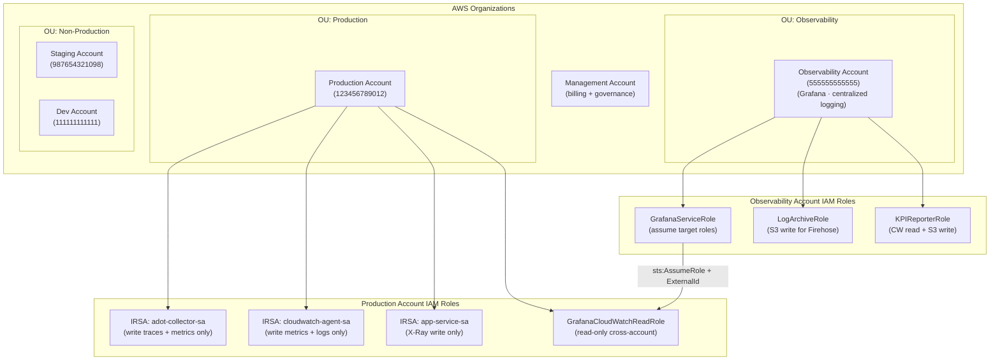
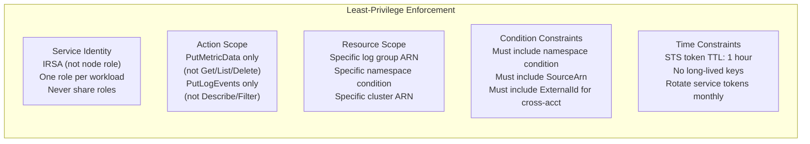
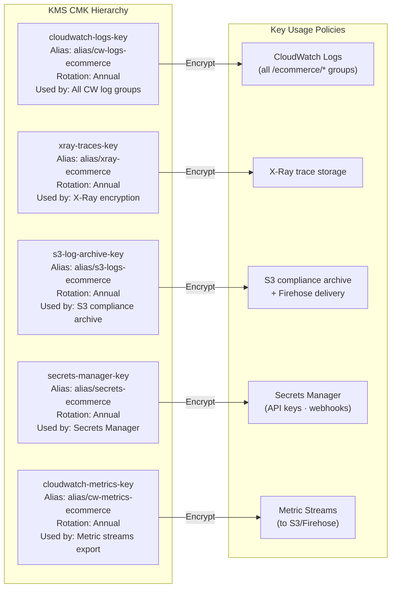
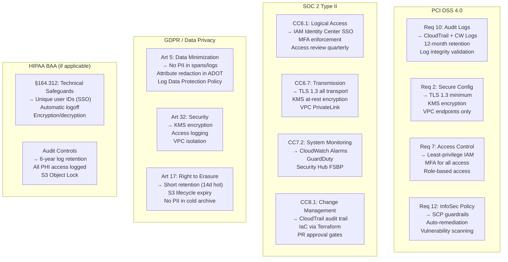
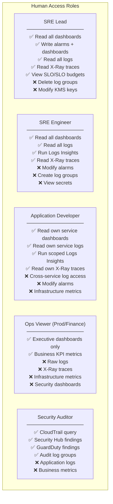
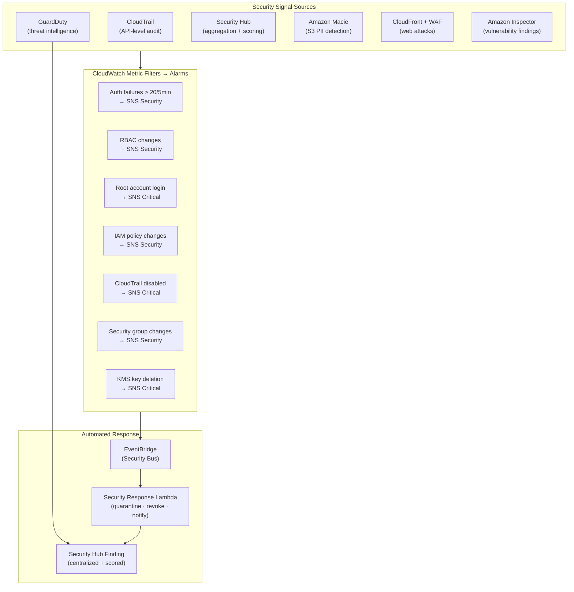
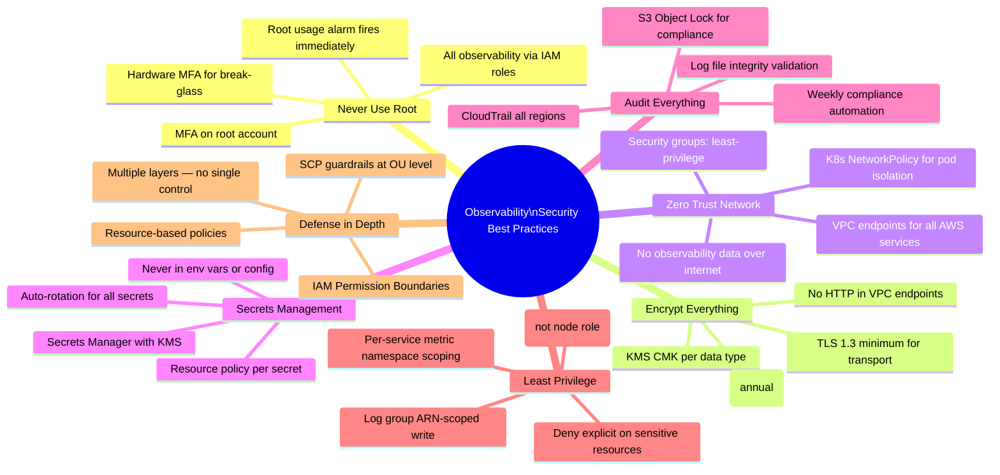

# Observability Security Architecture
## AWS Security Controls — IAM · KMS · TLS · Secrets Manager · Audit

> **Role**: AWS Security Architect
> **Date**: 2026-07-18
> **Platform**: E-Commerce Microservices Observability Stack
> **Frameworks**: AWS Well-Architected Security Pillar · NIST CSF · PCI DSS · SOC 2 Type II

---

## Table of Contents

1. [IAM Strategy](#1-iam-strategy)
2. [Security Architecture](#2-security-architecture)
3. [Compliance Considerations](#3-compliance-considerations)
4. [Access Control Design](#4-access-control-design)
5. [Monitoring Security Events](#5-monitoring-security-events)
6. [Best Practices](#6-best-practices)

---

## 1. IAM Strategy

### 1.1 IAM Hierarchy



### 1.2 Least-Privilege IAM Policy Design



### 1.3 ADOT Collector — Minimum Required Policy

```json
{
  "Version": "2012-10-17",
  "Statement": [
    {
      "Sid": "XRayWriteOnly",
      "Effect": "Allow",
      "Action": [
        "xray:PutTraceSegments",
        "xray:PutTelemetryRecords",
        "xray:GetSamplingRules",
        "xray:GetSamplingTargets",
        "xray:GetSamplingStatisticSummaries"
      ],
      "Resource": "*",
      "Condition": {
        "StringEquals": {
          "aws:RequestedRegion": "us-east-1"
        }
      }
    },
    {
      "Sid": "CloudWatchMetricsScopedWrite",
      "Effect": "Allow",
      "Action": ["cloudwatch:PutMetricData"],
      "Resource": "*",
      "Condition": {
        "StringLike": {
          "cloudwatch:namespace": [
            "ContainerInsights",
            "ApplicationSignals",
            "Custom/ECommerce*",
            "Custom/Application*",
            "Custom/Business*"
          ]
        }
      }
    },
    {
      "Sid": "CloudWatchLogsScopedWrite",
      "Effect": "Allow",
      "Action": [
        "logs:CreateLogGroup",
        "logs:CreateLogStream",
        "logs:PutLogEvents",
        "logs:DescribeLogStreams"
      ],
      "Resource": [
        "arn:aws:logs:us-east-1:123456789012:log-group:/ecommerce/prod/*",
        "arn:aws:logs:us-east-1:123456789012:log-group:/aws/containerinsights/ecommerce-prod/*",
        "arn:aws:logs:us-east-1:123456789012:log-group:/aws/otel/*"
      ]
    },
    {
      "Sid": "ApplicationSignalsWrite",
      "Effect": "Allow",
      "Action": [
        "application-signals:StartDiscovery",
        "application-signals:ListServices",
        "application-signals:GetService"
      ],
      "Resource": "*"
    },
    {
      "Sid": "EKSDescribeForEnrichment",
      "Effect": "Allow",
      "Action": ["eks:DescribeCluster"],
      "Resource": "arn:aws:eks:us-east-1:123456789012:cluster/ecommerce-prod"
    },
    {
      "Sid": "DenyEverythingElse",
      "Effect": "Deny",
      "NotAction": [
        "xray:PutTraceSegments",
        "xray:PutTelemetryRecords",
        "xray:GetSamplingRules",
        "xray:GetSamplingTargets",
        "cloudwatch:PutMetricData",
        "logs:CreateLogGroup",
        "logs:CreateLogStream",
        "logs:PutLogEvents",
        "logs:DescribeLogStreams",
        "application-signals:StartDiscovery",
        "application-signals:ListServices",
        "application-signals:GetService",
        "eks:DescribeCluster"
      ],
      "Resource": "*"
    }
  ]
}
```

### 1.4 Application Pod IRSA Policy (Per-Service Scoping)

```hcl
# iam-per-service.tf — Each service gets its own IRSA role

locals {
  services = {
    "order-service" = {
      namespace     = "Custom/ECommerce/OrderService"
      log_group     = "/ecommerce/prod/eks/application"
      x_ray         = true
    }
    "payment-service" = {
      namespace     = "Custom/ECommerce/PaymentService"
      log_group     = "/ecommerce/prod/eks/application"
      x_ray         = true
    }
    "product-service" = {
      namespace     = "Custom/ECommerce/ProductService"
      log_group     = "/ecommerce/prod/eks/application"
      x_ray         = true
    }
  }
}

resource "aws_iam_role" "service_irsa" {
  for_each = local.services

  name = "IRSA-${each.key}-production"

  assume_role_policy = jsonencode({
    Version = "2012-10-17"
    Statement = [{
      Effect    = "Allow"
      Principal = { Federated = var.oidc_provider_arn }
      Action    = "sts:AssumeRoleWithWebIdentity"
      Condition = {
        StringEquals = {
          # Tight binding: ONLY this specific service account
          "${var.oidc_issuer}:sub" = "system:serviceaccount:ecommerce:${each.key}-sa"
          "${var.oidc_issuer}:aud" = "sts.amazonaws.com"
        }
      }
    }]
  })

  tags = {
    Service     = each.key
    Environment = "production"
    ManagedBy   = "terraform"
  }
}

resource "aws_iam_role_policy" "service_observability" {
  for_each = local.services

  name = "ObservabilityWrite-${each.key}"
  role = aws_iam_role.service_irsa[each.key].id

  policy = jsonencode({
    Version = "2012-10-17"
    Statement = [
      {
        Sid      = "XRayWriteOnly"
        Effect   = "Allow"
        Action   = [
          "xray:PutTraceSegments",
          "xray:PutTelemetryRecords",
          "xray:GetSamplingRules",
          "xray:GetSamplingTargets"
        ]
        Resource = "*"
      },
      {
        Sid      = "MetricWriteScoped"
        Effect   = "Allow"
        Action   = ["cloudwatch:PutMetricData"]
        Resource = "*"
        Condition = {
          StringEquals = {
            "cloudwatch:namespace" = each.value.namespace
          }
        }
      }
    ]
  })
}
```

### 1.5 Service Control Policies (SCP)

```json
{
  "_comment": "SCP applied at OU level — enforces observability security guardrails",
  "Version": "2012-10-17",
  "Statement": [
    {
      "Sid": "DenyCloudWatchLogsDeletion",
      "Effect": "Deny",
      "Action": [
        "logs:DeleteLogGroup",
        "logs:DeleteLogStream",
        "logs:DeleteRetentionPolicy",
        "logs:DisassociateKmsKey"
      ],
      "Resource": [
        "arn:aws:logs:*:*:log-group:/ecommerce/prod/*/audit",
        "arn:aws:logs:*:*:log-group:/aws/rds/cluster/ecommerce-aurora/audit",
        "arn:aws:logs:*:*:log-group:/aws/cloudtrail/*"
      ],
      "Condition": {
        "StringNotEquals": {
          "aws:PrincipalARN": [
            "arn:aws:iam::123456789012:role/BreakGlassAdmin",
            "arn:aws:iam::123456789012:role/SecurityAuditAdmin"
          ]
        }
      }
    },
    {
      "Sid": "DenyXRayEncryptionDisable",
      "Effect": "Deny",
      "Action": [
        "xray:PutEncryptionConfig"
      ],
      "Resource": "*",
      "Condition": {
        "StringEquals": {
          "xray:EncryptionType": "NONE"
        }
      }
    },
    {
      "Sid": "DenyCloudTrailDisable",
      "Effect": "Deny",
      "Action": [
        "cloudtrail:DeleteTrail",
        "cloudtrail:StopLogging",
        "cloudtrail:UpdateTrail"
      ],
      "Resource": "*",
      "Condition": {
        "StringNotLike": {
          "aws:PrincipalARN": "arn:aws:iam::*:role/BreakGlassAdmin"
        }
      }
    },
    {
      "Sid": "RequireKMSForLogGroups",
      "Effect": "Deny",
      "Action": ["logs:CreateLogGroup"],
      "Resource": "*",
      "Condition": {
        "Null": {
          "logs:kmsKeyId": "true"
        },
        "StringLike": {
          "aws:RequestedRegion": "us-east-1"
        }
      }
    }
  ]
}
```

---

## 2. Security Architecture

### 2.1 Defense-in-Depth Model

```mermaid
graph TB
    subgraph LAYER1["Layer 1 — Network Security"]
        VPC_EP["VPC Private Endpoints\n(CloudWatch · X-Ray · Logs\n= no internet egress)"]
        SG["Security Groups\nADOT: inbound 4317 from pods only\noutbound 443 to VPC endpoints only"]
        NP["K8s NetworkPolicy\nPod → ADOT: :4317 only\nADOT → VPC endpoints: :443 only"]
        TLS["TLS 1.3 Minimum\nAll OTLP gRPC connections\nAll HTTPS to AWS endpoints"]
    end

    subgraph LAYER2["Layer 2 — Identity & Access"]
        IRSA["IRSA per Workload\n(not node instance role)\nTightly scoped per service"]
        MFA["MFA Required\nAll human console access\nBreakglass accounts"]
        SCP_L["SCP Guardrails\n(cannot be overridden)"]
        PERM_BOUND["IAM Permission Boundaries\n(cap what roles can grant)"]
    end

    subgraph LAYER3["Layer 3 — Data Protection"]
        KMS["KMS CMK per Data Type\nLogs · Metrics · Traces\nKey rotation enabled"]
        DATA_PROTECT["CW Logs Data Protection\nPII masking at ingestion\n(credit cards · SSN · email)"]
        ATTR_REDACT["ADOT Attribute Redaction\nAuth headers · cookies\nSQL statements · tokens"]
        S3_LOCK["S3 Object Lock COMPLIANCE\nAudit logs tamper-proof\n7-year retention"]
    end

    subgraph LAYER4["Layer 4 — Audit & Detection"]
        CLOUDTRAIL["CloudTrail Multi-Region\nAll API calls logged\nlog file integrity enabled"]
        GUARDDUTY["GuardDuty\nThreat detection\nFinding to Security Hub"]
        SEC_HUB["Security Hub\nFSBP Standard\nCIS Benchmark"]
        MACIE["Amazon Macie\nS3 PII scanning\nLog archive buckets"]
    end

    LAYER1 --> LAYER2 --> LAYER3 --> LAYER4
```



### 2.2 KMS Key Architecture



### 2.3 KMS Key Terraform

```hcl
# kms-keys.tf

locals {
  account_id = data.aws_caller_identity.current.account_id
  region     = data.aws_region.current.name
}

# ── CloudWatch Logs Encryption Key ───────────────────────────────────────
resource "aws_kms_key" "cloudwatch_logs" {
  description             = "KMS CMK for CloudWatch Logs — ecommerce-prod"
  deletion_window_in_days = 14
  enable_key_rotation     = true
  multi_region            = false

  policy = jsonencode({
    Version = "2012-10-17"
    Statement = [
      # Root account full access
      {
        Sid       = "EnableRootAccess"
        Effect    = "Allow"
        Principal = { AWS = "arn:aws:iam::${local.account_id}:root" }
        Action    = "kms:*"
        Resource  = "*"
      },
      # CloudWatch Logs service access (required for log group encryption)
      {
        Sid    = "CloudWatchLogsEncryption"
        Effect = "Allow"
        Principal = { Service = "logs.${local.region}.amazonaws.com" }
        Action = [
          "kms:Encrypt", "kms:Decrypt", "kms:ReEncrypt*",
          "kms:GenerateDataKey", "kms:DescribeKey"
        ]
        Resource = "*"
        Condition = {
          ArnLike = {
            "kms:EncryptionContext:aws:logs:arn" =
              "arn:aws:logs:${local.region}:${local.account_id}:*"
          }
        }
      },
      # Firehose delivery stream access (for log archival)
      {
        Sid    = "FirehoseAccess"
        Effect = "Allow"
        Principal = {
          AWS = "arn:aws:iam::${local.account_id}:role/ecommerce-log-archive-firehose"
        }
        Action = ["kms:Decrypt", "kms:GenerateDataKey"]
        Resource = "*"
      },
      # Deny key deletion without explicit approval
      {
        Sid    = "DenyDirectDelete"
        Effect = "Deny"
        Principal = { AWS = "*" }
        Action = ["kms:ScheduleKeyDeletion", "kms:DeleteImportedKeyMaterial"]
        Resource = "*"
        Condition = {
          StringNotEquals = {
            "aws:PrincipalARN" = [
              "arn:aws:iam::${local.account_id}:role/BreakGlassAdmin",
              "arn:aws:iam::${local.account_id}:role/SecurityAuditAdmin"
            ]
          }
        }
      }
    ]
  })

  tags = {
    Purpose     = "cloudwatch-logs-encryption"
    DataClass   = "confidential"
    Compliance  = "pci-soc2"
    ManagedBy   = "terraform"
    CostCenter  = "security"
  }
}

resource "aws_kms_alias" "cloudwatch_logs" {
  name          = "alias/cw-logs-ecommerce"
  target_key_id = aws_kms_key.cloudwatch_logs.key_id
}

# ── X-Ray Encryption Key ──────────────────────────────────────────────────
resource "aws_kms_key" "xray" {
  description             = "KMS CMK for AWS X-Ray trace encryption"
  deletion_window_in_days = 14
  enable_key_rotation     = true

  policy = jsonencode({
    Version = "2012-10-17"
    Statement = [
      {
        Sid       = "EnableRootAccess"
        Effect    = "Allow"
        Principal = { AWS = "arn:aws:iam::${local.account_id}:root" }
        Action    = "kms:*"
        Resource  = "*"
      },
      {
        Sid    = "XRayServiceAccess"
        Effect = "Allow"
        Principal = { Service = "xray.amazonaws.com" }
        Action = ["kms:Decrypt", "kms:GenerateDataKey"]
        Resource = "*"
        Condition = {
          StringEquals = {
            "aws:SourceAccount" = local.account_id
          }
        }
      }
    ]
  })

  tags = {
    Purpose   = "xray-trace-encryption"
    DataClass = "confidential"
    ManagedBy = "terraform"
  }
}

resource "aws_kms_alias" "xray" {
  name          = "alias/xray-ecommerce"
  target_key_id = aws_kms_key.xray.key_id
}

# Apply X-Ray encryption
resource "aws_xray_encryption_config" "main" {
  type   = "KMS"
  key_id = aws_kms_key.xray.arn
}

# ── Secrets Manager Key ───────────────────────────────────────────────────
resource "aws_kms_key" "secrets" {
  description             = "KMS CMK for Secrets Manager — observability secrets"
  deletion_window_in_days = 14
  enable_key_rotation     = true

  policy = jsonencode({
    Version = "2012-10-17"
    Statement = [
      {
        Sid       = "EnableRootAccess"
        Effect    = "Allow"
        Principal = { AWS = "arn:aws:iam::${local.account_id}:root" }
        Action    = "kms:*"
        Resource  = "*"
      },
      {
        Sid    = "SecretsManagerAccess"
        Effect = "Allow"
        Principal = { Service = "secretsmanager.amazonaws.com" }
        Action = ["kms:Decrypt", "kms:GenerateDataKey", "kms:DescribeKey"]
        Resource = "*"
        Condition = {
          StringEquals = {
            "aws:SourceAccount" = local.account_id
          }
        }
      }
    ]
  })

  tags = { Purpose = "secrets-manager", DataClass = "restricted" }
}
```

### 2.4 Secrets Manager — Observability Secrets

```hcl
# secrets.tf

# ── Slack Webhook ─────────────────────────────────────────────────────────
resource "aws_secretsmanager_secret" "slack_webhook" {
  name                    = "ecommerce/production/slack/webhook-url"
  description             = "Slack webhook for incident notifications"
  kms_key_id              = aws_kms_key.secrets.arn
  recovery_window_in_days = 14

  # Rotation: quarterly (webhooks don't expire but rotate for hygiene)
  tags = {
    SecretType  = "webhook"
    Application = "incident-router"
    DataClass   = "confidential"
    Rotation    = "quarterly"
  }
}

resource "aws_secretsmanager_secret_version" "slack_webhook" {
  secret_id     = aws_secretsmanager_secret.slack_webhook.id
  secret_string = var.slack_webhook_url   # Provided via TF var, never hardcoded
}

# ── PagerDuty Routing Key ─────────────────────────────────────────────────
resource "aws_secretsmanager_secret" "pagerduty_key" {
  name                    = "ecommerce/production/pagerduty/routing-key"
  description             = "PagerDuty Events API v2 routing key"
  kms_key_id              = aws_kms_key.secrets.arn
  recovery_window_in_days = 14

  rotation_rules {
    automatically_after_days = 90   # 90-day auto-rotation
  }

  tags = {
    SecretType  = "api-key"
    Application = "incident-router"
    DataClass   = "restricted"
  }
}

# ── Grafana Service Account Token ─────────────────────────────────────────
resource "aws_secretsmanager_secret" "grafana_token" {
  name                    = "ecommerce/production/grafana/service-account-token"
  description             = "Grafana service account token for GitOps dashboard deployment"
  kms_key_id              = aws_kms_key.secrets.arn
  recovery_window_in_days = 14

  rotation_rules {
    automatically_after_days = 30   # Rotate monthly
    rotation_lambda_arn      = aws_lambda_function.rotate_grafana_token.arn
  }

  tags = {
    SecretType  = "service-token"
    Application = "grafana-gitops"
    DataClass   = "restricted"
    Rotation    = "monthly"
  }
}

# ── Resource Policy: restrict access to specific Lambda roles ─────────────
resource "aws_secretsmanager_secret_policy" "slack_webhook" {
  secret_arn = aws_secretsmanager_secret.slack_webhook.arn

  policy = jsonencode({
    Version = "2012-10-17"
    Statement = [
      {
        Sid    = "AllowIncidentRouter"
        Effect = "Allow"
        Principal = {
          AWS = [
            "arn:aws:iam::${local.account_id}:role/lambda-incident-router-role",
            "arn:aws:iam::${local.account_id}:role/lambda-auto-remediation-role"
          ]
        }
        Action   = ["secretsmanager:GetSecretValue"]
        Resource = "*"
      },
      {
        Sid    = "DenyAll"
        Effect = "Deny"
        Principal = { AWS = "*" }
        Action = ["secretsmanager:GetSecretValue"]
        Resource = "*"
        Condition = {
          StringNotEquals = {
            "aws:PrincipalARN" = [
              "arn:aws:iam::${local.account_id}:role/lambda-incident-router-role",
              "arn:aws:iam::${local.account_id}:role/lambda-auto-remediation-role",
              "arn:aws:iam::${local.account_id}:root"
            ]
          }
        }
      }
    ]
  })
}
```

### 2.5 TLS Configuration

```hcl
# tls-config.tf — VPC endpoints enforce TLS for all observability traffic

# CloudWatch Logs VPC Endpoint (no internet egress)
resource "aws_vpc_endpoint" "cloudwatch_logs" {
  vpc_id              = var.vpc_id
  service_name        = "com.amazonaws.${local.region}.logs"
  vpc_endpoint_type   = "Interface"
  subnet_ids          = var.private_subnet_ids
  security_group_ids  = [aws_security_group.vpc_endpoint.id]
  private_dns_enabled = true   # Resolve AWS hostnames to private IPs

  policy = jsonencode({
    Version = "2012-10-17"
    Statement = [{
      Sid       = "AllowTLSOnly"
      Effect    = "Allow"
      Principal = "*"
      Action    = ["logs:*"]
      Resource  = "*"
      Condition = {
        Bool = { "aws:SecureTransport" = "true" }   # Reject HTTP
      }
    }]
  })

  tags = { Name = "cwlogs-vpc-endpoint", Purpose = "observability" }
}

# CloudWatch Monitoring VPC Endpoint
resource "aws_vpc_endpoint" "cloudwatch_monitoring" {
  vpc_id              = var.vpc_id
  service_name        = "com.amazonaws.${local.region}.monitoring"
  vpc_endpoint_type   = "Interface"
  subnet_ids          = var.private_subnet_ids
  security_group_ids  = [aws_security_group.vpc_endpoint.id]
  private_dns_enabled = true

  policy = jsonencode({
    Version = "2012-10-17"
    Statement = [{
      Effect    = "Allow"
      Principal = "*"
      Action    = ["cloudwatch:PutMetricData"]
      Resource  = "*"
      Condition = { Bool = { "aws:SecureTransport" = "true" } }
    }]
  })
}

# X-Ray VPC Endpoint
resource "aws_vpc_endpoint" "xray" {
  vpc_id              = var.vpc_id
  service_name        = "com.amazonaws.${local.region}.xray"
  vpc_endpoint_type   = "Interface"
  subnet_ids          = var.private_subnet_ids
  security_group_ids  = [aws_security_group.vpc_endpoint.id]
  private_dns_enabled = true

  policy = jsonencode({
    Version = "2012-10-17"
    Statement = [{
      Effect    = "Allow"
      Principal = "*"
      Action    = [
        "xray:PutTraceSegments",
        "xray:PutTelemetryRecords",
        "xray:GetSamplingRules",
        "xray:GetSamplingTargets"
      ]
      Resource  = "*"
      Condition = { Bool = { "aws:SecureTransport" = "true" } }
    }]
  })
}

# Security group for VPC endpoints — restrict inbound to VPC CIDR only
resource "aws_security_group" "vpc_endpoint" {
  name        = "vpc-endpoint-observability"
  description = "Security group for observability VPC endpoints"
  vpc_id      = var.vpc_id

  ingress {
    description = "HTTPS from VPC only"
    from_port   = 443
    to_port     = 443
    protocol    = "tcp"
    cidr_blocks = [var.vpc_cidr]
  }

  egress {
    description = "No outbound from endpoints"
    from_port   = 0
    to_port     = 0
    protocol    = "-1"
    cidr_blocks = []
  }

  tags = { Name = "vpc-endpoint-observability-sg" }
}
```

---

## 3. Compliance Considerations

### 3.1 Compliance Matrix



### 3.2 Compliance Automation

```python
#!/usr/bin/env python3
# lambda/compliance_checker/handler.py
# Weekly compliance validation — runs via EventBridge schedule

import boto3
import json
from datetime import datetime, timezone
from dataclasses import dataclass, field, asdict
from typing import List

logs_client    = boto3.client("logs",         region_name="us-east-1")
kms_client     = boto3.client("kms",          region_name="us-east-1")
xray_client    = boto3.client("xray",         region_name="us-east-1")
cloudtrail     = boto3.client("cloudtrail",   region_name="us-east-1")
config_client  = boto3.client("config",       region_name="us-east-1")
iam_client     = boto3.client("iam",          region_name="us-east-1")


@dataclass
class ComplianceCheck:
    check_id:    str
    description: str
    status:      str       # "PASS" | "FAIL" | "WARN"
    details:     str
    framework:   str       # "PCI-DSS" | "SOC2" | "GDPR"
    severity:    str       # "CRITICAL" | "HIGH" | "MEDIUM" | "LOW"


@dataclass
class ComplianceReport:
    generated_at:  str
    account_id:    str
    region:        str
    total_checks:  int
    passed:        int
    failed:        int
    warnings:      int
    critical_fails: List[str] = field(default_factory=list)
    checks:        List[ComplianceCheck] = field(default_factory=list)


def lambda_handler(event, context):
    checks = []

    # ── PCI DSS Checks ─────────────────────────────────────────────────────
    checks.append(_check_cloudtrail_enabled())
    checks.append(_check_cloudtrail_log_integrity())
    checks.append(_check_log_group_encryption())
    checks.append(_check_xray_encryption())
    checks.append(_check_log_retention_policies())
    checks.append(_check_s3_object_lock())

    # ── SOC 2 Checks ───────────────────────────────────────────────────────
    checks.append(_check_vpc_endpoints_exist())
    checks.append(_check_kms_key_rotation())
    checks.append(_check_secrets_manager_rotation())
    checks.append(_check_guardduty_enabled())
    checks.append(_check_security_hub_enabled())

    # ── GDPR Checks ────────────────────────────────────────────────────────
    checks.append(_check_data_protection_policies())
    checks.append(_check_log_retention_short())

    account_id = boto3.client("sts").get_caller_identity()["Account"]

    report = ComplianceReport(
        generated_at  = datetime.now(timezone.utc).isoformat(),
        account_id    = account_id,
        region        = "us-east-1",
        total_checks  = len(checks),
        passed        = sum(1 for c in checks if c.status == "PASS"),
        failed        = sum(1 for c in checks if c.status == "FAIL"),
        warnings      = sum(1 for c in checks if c.status == "WARN"),
        critical_fails = [c.check_id for c in checks if c.status == "FAIL" and c.severity == "CRITICAL"],
        checks        = checks
    )

    # Archive report to S3
    s3 = boto3.client("s3")
    now = datetime.now(timezone.utc)
    s3.put_object(
        Bucket="ecommerce-compliance-reports",
        Key=f"observability/{now.year}/{now.month:02d}/{now.day:02d}/compliance-report.json",
        Body=json.dumps(asdict(report), indent=2),
        ContentType="application/json",
        ServerSideEncryption="aws:kms"
    )

    # Alert if critical failures
    if report.critical_fails:
        _send_critical_alert(report)

    print(f"Compliance: {report.passed}/{report.total_checks} passed, {report.failed} failed, {len(report.critical_fails)} critical")
    return asdict(report)


def _check_cloudtrail_enabled() -> ComplianceCheck:
    try:
        trails = cloudtrail.describe_trails(includeShadowTrails=False)
        multi_region = [t for t in trails["trailList"] if t.get("IsMultiRegionTrail")]
        if multi_region:
            return ComplianceCheck("CT-001", "CloudTrail multi-region enabled", "PASS",
                f"{len(multi_region)} multi-region trail(s) found", "PCI-DSS", "CRITICAL")
        return ComplianceCheck("CT-001", "CloudTrail multi-region enabled", "FAIL",
            "No multi-region CloudTrail found", "PCI-DSS", "CRITICAL")
    except Exception as e:
        return ComplianceCheck("CT-001", "CloudTrail multi-region enabled", "FAIL", str(e), "PCI-DSS", "CRITICAL")


def _check_cloudtrail_log_integrity() -> ComplianceCheck:
    try:
        trails = cloudtrail.describe_trails(includeShadowTrails=False)
        trails_without_integrity = [
            t["Name"] for t in trails["trailList"]
            if not t.get("LogFileValidationEnabled")
        ]
        if not trails_without_integrity:
            return ComplianceCheck("CT-002", "CloudTrail log file integrity validation", "PASS",
                "All trails have integrity validation enabled", "PCI-DSS", "HIGH")
        return ComplianceCheck("CT-002", "CloudTrail log file integrity validation", "FAIL",
            f"Trails without integrity: {trails_without_integrity}", "PCI-DSS", "HIGH")
    except Exception as e:
        return ComplianceCheck("CT-002", "CloudTrail log file integrity validation", "FAIL", str(e), "PCI-DSS", "HIGH")


def _check_log_group_encryption() -> ComplianceCheck:
    """Verify all production log groups are KMS-encrypted."""
    try:
        paginator  = logs_client.get_paginator("describe_log_groups")
        unencrypted = []
        for page in paginator.paginate(logGroupNamePrefix="/ecommerce/prod"):
            for lg in page["logGroups"]:
                if not lg.get("kmsKeyId"):
                    unencrypted.append(lg["logGroupName"])

        if not unencrypted:
            return ComplianceCheck("ENC-001", "Log group KMS encryption", "PASS",
                "All production log groups are KMS-encrypted", "PCI-DSS", "CRITICAL")
        return ComplianceCheck("ENC-001", "Log group KMS encryption", "FAIL",
            f"Unencrypted log groups: {unencrypted}", "PCI-DSS", "CRITICAL")
    except Exception as e:
        return ComplianceCheck("ENC-001", "Log group KMS encryption", "FAIL", str(e), "PCI-DSS", "CRITICAL")


def _check_xray_encryption() -> ComplianceCheck:
    try:
        config = xray_client.get_encryption_config()
        enc_type = config["EncryptionConfig"]["Type"]
        if enc_type == "KMS":
            return ComplianceCheck("ENC-002", "X-Ray KMS encryption", "PASS",
                f"X-Ray encrypted with KMS key: {config['EncryptionConfig'].get('KeyId','')}", "PCI-DSS", "HIGH")
        return ComplianceCheck("ENC-002", "X-Ray KMS encryption", "FAIL",
            f"X-Ray using {enc_type} encryption (should be KMS)", "PCI-DSS", "HIGH")
    except Exception as e:
        return ComplianceCheck("ENC-002", "X-Ray KMS encryption", "FAIL", str(e), "PCI-DSS", "HIGH")


def _check_kms_key_rotation() -> ComplianceCheck:
    try:
        paginator = kms_client.get_paginator("list_keys")
        non_rotating = []
        for page in paginator.paginate():
            for key in page["Keys"]:
                try:
                    meta = kms_client.describe_key(KeyId=key["KeyId"])
                    if meta["KeyMetadata"]["KeyManager"] == "CUSTOMER":
                        rotation = kms_client.get_key_rotation_status(KeyId=key["KeyId"])
                        if not rotation["KeyRotationEnabled"]:
                            non_rotating.append(key["KeyId"])
                except Exception:
                    pass

        if not non_rotating:
            return ComplianceCheck("KMS-001", "KMS key rotation enabled", "PASS",
                "All customer-managed KMS keys have rotation enabled", "SOC2", "HIGH")
        return ComplianceCheck("KMS-001", "KMS key rotation enabled", "FAIL",
            f"Keys without rotation: {non_rotating}", "SOC2", "HIGH")
    except Exception as e:
        return ComplianceCheck("KMS-001", "KMS key rotation enabled", "FAIL", str(e), "SOC2", "HIGH")


def _check_log_retention_policies() -> ComplianceCheck:
    """Verify audit log groups have minimum 90-day retention."""
    AUDIT_GROUPS = [
        "/ecommerce/prod/ec2/audit",
        "/aws/rds/cluster/ecommerce-aurora/audit",
        "/ecommerce/prod/eks/controlplane"
    ]
    short_retention = []
    for lg_name in AUDIT_GROUPS:
        try:
            resp = logs_client.describe_log_groups(logGroupNamePrefix=lg_name)
            for lg in resp.get("logGroups", []):
                ret = lg.get("retentionInDays", 0)
                if ret and ret < 90:
                    short_retention.append(f"{lg_name}: {ret}d")
        except Exception:
            pass

    if not short_retention:
        return ComplianceCheck("RET-001", "Audit log retention >= 90 days", "PASS",
            "All audit log groups have >= 90 day retention", "PCI-DSS", "HIGH")
    return ComplianceCheck("RET-001", "Audit log retention >= 90 days", "FAIL",
        f"Short retention: {short_retention}", "PCI-DSS", "HIGH")


def _check_vpc_endpoints_exist() -> ComplianceCheck:
    ec2 = boto3.client("ec2", region_name="us-east-1")
    required_services = [
        f"com.amazonaws.us-east-1.logs",
        f"com.amazonaws.us-east-1.monitoring",
        f"com.amazonaws.us-east-1.xray"
    ]
    endpoints = ec2.describe_vpc_endpoints(
        Filters=[{"Name": "service-name", "Values": required_services},
                 {"Name": "state", "Values": ["available"]}]
    )
    found = {ep["ServiceName"] for ep in endpoints["VpcEndpoints"]}
    missing = [s for s in required_services if s not in found]

    if not missing:
        return ComplianceCheck("NET-001", "VPC endpoints for observability services", "PASS",
            "CloudWatch, Monitoring, X-Ray VPC endpoints present", "SOC2", "HIGH")
    return ComplianceCheck("NET-001", "VPC endpoints for observability services", "FAIL",
        f"Missing endpoints: {missing}", "SOC2", "HIGH")


def _check_data_protection_policies() -> ComplianceCheck:
    try:
        policies = logs_client.describe_account_policies(policyType="DATA_PROTECTION_POLICY")
        if policies.get("accountPolicies"):
            return ComplianceCheck("GDPR-001", "CloudWatch Logs Data Protection Policy", "PASS",
                f"{len(policies['accountPolicies'])} data protection policy/policies active", "GDPR", "HIGH")
        return ComplianceCheck("GDPR-001", "CloudWatch Logs Data Protection Policy", "FAIL",
            "No data protection policies found — PII may not be masked", "GDPR", "HIGH")
    except Exception as e:
        return ComplianceCheck("GDPR-001", "CloudWatch Logs Data Protection Policy", "FAIL", str(e), "GDPR", "HIGH")


def _check_s3_object_lock() -> ComplianceCheck:
    s3 = boto3.client("s3")
    bucket = "ecommerce-compliance-log-archive"
    try:
        lock = s3.get_object_lock_configuration(Bucket=bucket)
        if lock["ObjectLockConfiguration"]["ObjectLockEnabled"] == "Enabled":
            return ComplianceCheck("INT-001", "S3 Object Lock for audit archive", "PASS",
                f"Object Lock ENABLED on {bucket}", "PCI-DSS", "HIGH")
    except Exception:
        pass
    return ComplianceCheck("INT-001", "S3 Object Lock for audit archive", "FAIL",
        f"Object Lock NOT enabled on {bucket}", "PCI-DSS", "HIGH")


def _check_guardduty_enabled() -> ComplianceCheck:
    gd = boto3.client("guardduty", region_name="us-east-1")
    detectors = gd.list_detectors()
    if detectors.get("DetectorIds"):
        det_id = detectors["DetectorIds"][0]
        det    = gd.get_detector(DetectorId=det_id)
        if det["Status"] == "ENABLED":
            return ComplianceCheck("THREAT-001", "GuardDuty enabled", "PASS",
                f"GuardDuty active: {det_id}", "SOC2", "HIGH")
    return ComplianceCheck("THREAT-001", "GuardDuty enabled", "FAIL",
        "GuardDuty not enabled", "SOC2", "HIGH")


def _check_security_hub_enabled() -> ComplianceCheck:
    sh = boto3.client("securityhub", region_name="us-east-1")
    try:
        hub = sh.describe_hub()
        return ComplianceCheck("THREAT-002", "Security Hub enabled", "PASS",
            f"Security Hub active: {hub['HubArn']}", "SOC2", "MEDIUM")
    except Exception:
        return ComplianceCheck("THREAT-002", "Security Hub enabled", "FAIL",
            "Security Hub not enabled", "SOC2", "MEDIUM")


def _check_secrets_manager_rotation() -> ComplianceCheck:
    sm = boto3.client("secretsmanager", region_name="us-east-1")
    paginator = sm.get_paginator("list_secrets")
    no_rotation = []
    for page in paginator.paginate(Filters=[{"Key": "tag-key", "Values": ["Application"]}]):
        for secret in page["SecretList"]:
            if not secret.get("RotationEnabled"):
                no_rotation.append(secret["Name"])
    if not no_rotation:
        return ComplianceCheck("SEC-001", "Secrets Manager rotation enabled", "PASS",
            "All tagged secrets have rotation enabled", "SOC2", "MEDIUM")
    return ComplianceCheck("SEC-001", "Secrets Manager rotation enabled", "WARN",
        f"Secrets without rotation: {no_rotation[:5]}", "SOC2", "MEDIUM")


def _check_log_retention_short() -> ComplianceCheck:
    """GDPR: application logs should not be kept indefinitely."""
    paginator = logs_client.get_paginator("describe_log_groups")
    no_retention = []
    for page in paginator.paginate(logGroupNamePrefix="/ecommerce/"):
        for lg in page["logGroups"]:
            if not lg.get("retentionInDays"):
                no_retention.append(lg["logGroupName"])
    if not no_retention:
        return ComplianceCheck("GDPR-002", "Application log groups have retention limits", "PASS",
            "All log groups have expiry set", "GDPR", "MEDIUM")
    return ComplianceCheck("GDPR-002", "Application log groups have retention limits", "FAIL",
        f"No retention set: {no_retention[:5]}", "GDPR", "MEDIUM")


def _send_critical_alert(report: ComplianceReport) -> None:
    sns = boto3.client("sns", region_name="us-east-1")
    sns.publish(
        TopicArn="arn:aws:sns:us-east-1:123456789012:ecommerce-security-critical",
        Subject=f"🔴 Compliance Failures: {len(report.critical_fails)} critical checks failed",
        Message=json.dumps({
            "account":       report.account_id,
            "date":          report.generated_at[:10],
            "criticalFails": report.critical_fails,
            "totalFailed":   report.failed,
            "details":       "Review: s3://ecommerce-compliance-reports/observability/"
        }, indent=2)
    )
```

---

## 4. Access Control Design

### 4.1 Access Control Matrix



### 4.2 Developer Scoped Access Policy

```json
{
  "_comment": "Developer: read-only access scoped to own team's service logs + metrics",
  "Version": "2012-10-17",
  "Statement": [
    {
      "Sid": "CloudWatchLogsInsightsOwnService",
      "Effect": "Allow",
      "Action": [
        "logs:StartQuery",
        "logs:StopQuery",
        "logs:GetQueryResults",
        "logs:DescribeLogGroups",
        "logs:GetLogGroupFields"
      ],
      "Resource": [
        "arn:aws:logs:us-east-1:123456789012:log-group:/ecommerce/prod/eks/application:*"
      ],
      "Condition": {
        "StringEquals": {
          "aws:RequestedRegion": "us-east-1"
        }
      }
    },
    {
      "Sid": "CloudWatchMetricsOwnService",
      "Effect": "Allow",
      "Action": [
        "cloudwatch:GetMetricData",
        "cloudwatch:GetMetricStatistics",
        "cloudwatch:ListMetrics"
      ],
      "Resource": "*",
      "Condition": {
        "StringLike": {
          "cloudwatch:namespace": "Custom/Application/Services"
        }
      }
    },
    {
      "Sid": "XRayReadOwnService",
      "Effect": "Allow",
      "Action": [
        "xray:GetTraceSummaries",
        "xray:BatchGetTraces",
        "xray:GetServiceGraph"
      ],
      "Resource": "*",
      "Condition": {
        "StringEquals": {
          "xray:service_name": "${aws:username}"
        }
      }
    },
    {
      "Sid": "DenyAuditLogs",
      "Effect": "Deny",
      "Action": ["logs:*"],
      "Resource": [
        "arn:aws:logs:us-east-1:123456789012:log-group:/ecommerce/prod/*/audit",
        "arn:aws:logs:us-east-1:123456789012:log-group:/aws/rds/cluster/*/audit",
        "arn:aws:logs:us-east-1:123456789012:log-group:/aws/cloudtrail/*"
      ]
    },
    {
      "Sid": "DenySecretAccess",
      "Effect": "Deny",
      "Action": [
        "secretsmanager:GetSecretValue",
        "secretsmanager:DescribeSecret"
      ],
      "Resource": "*"
    }
  ]
}
```

### 4.3 CloudWatch Logs Resource Policy (Log Group Level)

```hcl
# log-group-resource-policies.tf

# Restrict audit log access to SecOps + SRE Leads only
resource "aws_cloudwatch_log_resource_policy" "audit_restricted" {
  policy_name     = "audit-logs-restricted-access"
  policy_document = jsonencode({
    Version = "2012-10-17"
    Statement = [
      {
        Sid    = "AllowSecOpsAuditAccess"
        Effect = "Allow"
        Principal = {
          AWS = [
            "arn:aws:iam::123456789012:role/SecurityAuditorRole",
            "arn:aws:iam::123456789012:role/SRELeadRole",
            "arn:aws:iam::123456789012:role/lambda-compliance-checker-role"
          ]
        }
        Action = [
          "logs:FilterLogEvents",
          "logs:StartQuery",
          "logs:GetQueryResults",
          "logs:DescribeLogStreams"
        ]
        Resource = [
          "arn:aws:logs:us-east-1:123456789012:log-group:/ecommerce/prod/*/audit:*",
          "arn:aws:logs:us-east-1:123456789012:log-group:/aws/rds/cluster/*/audit:*"
        ]
      },
      {
        Sid    = "DenyAllOthers"
        Effect = "Deny"
        Principal = { AWS = "*" }
        Action = ["logs:FilterLogEvents", "logs:StartQuery", "logs:GetQueryResults"]
        Resource = [
          "arn:aws:logs:us-east-1:123456789012:log-group:/ecommerce/prod/*/audit:*",
          "arn:aws:logs:us-east-1:123456789012:log-group:/aws/rds/cluster/*/audit:*"
        ]
        Condition = {
          StringNotEquals = {
            "aws:PrincipalARN" = [
              "arn:aws:iam::123456789012:role/SecurityAuditorRole",
              "arn:aws:iam::123456789012:role/SRELeadRole",
              "arn:aws:iam::123456789012:role/lambda-compliance-checker-role"
            ]
          }
        }
      }
    ]
  })
}
```

---

## 5. Monitoring Security Events

### 5.1 Security Event Detection Architecture



### 5.2 Security Metric Filters

```hcl
# security-metric-filters.tf

locals {
  cloudtrail_log_group = "/aws/cloudtrail/ecommerce-prod"
  security_sns_arn     = var.sns_security_critical_arn
}

# ── Root Account Usage ────────────────────────────────────────────────────
resource "aws_cloudwatch_log_metric_filter" "root_usage" {
  name           = "sec-root-account-usage"
  log_group_name = local.cloudtrail_log_group
  pattern        = "{ $.userIdentity.type = \"Root\" && $.userIdentity.invokedBy NOT EXISTS && $.eventType != \"AwsServiceEvent\" }"

  metric_transformation {
    name          = "RootAccountUsage"
    namespace     = "Security/CloudTrail"
    value         = "1"
    default_value = "0"
  }
}

resource "aws_cloudwatch_metric_alarm" "root_usage" {
  alarm_name          = "sec-root-account-usage"
  alarm_description   = <<-EOT
    SECURITY P1: Root account was used.
    Root usage should NEVER occur in production.
    Investigate immediately — possible account compromise.
    Runbook: https://wiki.internal/runbooks/sec-root-account-usage
  EOT
  namespace           = "Security/CloudTrail"
  metric_name         = "RootAccountUsage"
  statistic           = "Sum"
  period              = 60
  evaluation_periods  = 1
  threshold           = 0
  comparison_operator = "GreaterThanThreshold"
  treat_missing_data  = "notBreaching"
  alarm_actions       = [local.security_sns_arn]
}

# ── CloudTrail Disabled ───────────────────────────────────────────────────
resource "aws_cloudwatch_log_metric_filter" "cloudtrail_disabled" {
  name           = "sec-cloudtrail-disabled"
  log_group_name = local.cloudtrail_log_group
  pattern        = "{ ($.eventName = \"StopLogging\") || ($.eventName = \"DeleteTrail\") || ($.eventName = \"UpdateTrail\") }"

  metric_transformation {
    name      = "CloudTrailModification"
    namespace = "Security/CloudTrail"
    value     = "1"
    default_value = "0"
  }
}

resource "aws_cloudwatch_metric_alarm" "cloudtrail_disabled" {
  alarm_name          = "sec-cloudtrail-modified"
  alarm_description   = "SECURITY P1: CloudTrail was stopped or deleted. Audit integrity at risk."
  namespace           = "Security/CloudTrail"
  metric_name         = "CloudTrailModification"
  statistic           = "Sum"
  period              = 60
  evaluation_periods  = 1
  threshold           = 0
  comparison_operator = "GreaterThanThreshold"
  treat_missing_data  = "notBreaching"
  alarm_actions       = [local.security_sns_arn]
}

# ── IAM Policy Changes ────────────────────────────────────────────────────
resource "aws_cloudwatch_log_metric_filter" "iam_changes" {
  name           = "sec-iam-policy-changes"
  log_group_name = local.cloudtrail_log_group
  pattern        = "{ ($.eventName=DeleteGroupPolicy) || ($.eventName=DeleteRolePolicy) || ($.eventName=DeleteUserPolicy) || ($.eventName=PutGroupPolicy) || ($.eventName=PutRolePolicy) || ($.eventName=PutUserPolicy) || ($.eventName=CreatePolicy) || ($.eventName=DeletePolicy) || ($.eventName=CreatePolicyVersion) || ($.eventName=DeletePolicyVersion) || ($.eventName=SetDefaultPolicyVersion) || ($.eventName=AttachRolePolicy) || ($.eventName=DetachRolePolicy) }"

  metric_transformation {
    name          = "IAMPolicyChanges"
    namespace     = "Security/CloudTrail"
    value         = "1"
    default_value = "0"
  }
}

resource "aws_cloudwatch_metric_alarm" "iam_changes" {
  alarm_name          = "sec-iam-policy-changes"
  alarm_description   = "SECURITY: IAM policy was created, modified, or deleted. Verify it is an authorized change."
  namespace           = "Security/CloudTrail"
  metric_name         = "IAMPolicyChanges"
  statistic           = "Sum"
  period              = 300
  evaluation_periods  = 1
  threshold           = 0
  comparison_operator = "GreaterThanThreshold"
  treat_missing_data  = "notBreaching"
  alarm_actions       = [local.security_sns_arn]
}

# ── KMS Key Deletion ──────────────────────────────────────────────────────
resource "aws_cloudwatch_log_metric_filter" "kms_deletion" {
  name           = "sec-kms-key-deletion"
  log_group_name = local.cloudtrail_log_group
  pattern        = "{ ($.eventSource = \"kms.amazonaws.com\") && (($.eventName = \"DisableKey\") || ($.eventName = \"ScheduleKeyDeletion\")) }"

  metric_transformation {
    name          = "KMSKeyDeletion"
    namespace     = "Security/CloudTrail"
    value         = "1"
    default_value = "0"
  }
}

resource "aws_cloudwatch_metric_alarm" "kms_key_deletion" {
  alarm_name          = "sec-kms-key-deletion"
  alarm_description   = "SECURITY CRITICAL: KMS key scheduled for deletion or disabled. Log encryption at risk."
  namespace           = "Security/CloudTrail"
  metric_name         = "KMSKeyDeletion"
  statistic           = "Sum"
  period              = 60
  evaluation_periods  = 1
  threshold           = 0
  comparison_operator = "GreaterThanThreshold"
  treat_missing_data  = "notBreaching"
  alarm_actions       = [local.security_sns_arn]
}

# ── Unauthorized API Calls ────────────────────────────────────────────────
resource "aws_cloudwatch_log_metric_filter" "unauthorized_api_calls" {
  name           = "sec-unauthorized-api-calls"
  log_group_name = local.cloudtrail_log_group
  pattern        = "{ ($.errorCode = \"*UnauthorizedAccess*\") || ($.errorCode = \"AccessDenied*\") || ($.errorCode = \"AuthFailure*\") }"

  metric_transformation {
    name          = "UnauthorizedAPICalls"
    namespace     = "Security/CloudTrail"
    value         = "1"
    default_value = "0"
  }
}

resource "aws_cloudwatch_metric_alarm" "unauthorized_api_calls" {
  alarm_name          = "sec-unauthorized-api-calls-spike"
  alarm_description   = "Spike in unauthorized API calls. Possible credentials compromise or misconfiguration."
  namespace           = "Security/CloudTrail"
  metric_name         = "UnauthorizedAPICalls"
  statistic           = "Sum"
  period              = 300
  evaluation_periods  = 1
  threshold           = 20
  comparison_operator = "GreaterThanThreshold"
  treat_missing_data  = "notBreaching"
  alarm_actions       = [local.security_sns_arn]
}
```

### 5.3 GuardDuty → Security Hub → EventBridge Integration

```hcl
# guardduty-integration.tf

# EventBridge rule: route high-severity GuardDuty findings to response Lambda
resource "aws_cloudwatch_event_rule" "guardduty_high_severity" {
  name           = "guardduty-high-severity-findings"
  description    = "Route GuardDuty HIGH/CRITICAL findings to security response"
  event_pattern  = jsonencode({
    source      = ["aws.guardduty"]
    detail-type = ["GuardDuty Finding"]
    detail = {
      severity = [{ numeric = [">=", 7] }]  # HIGH (7-8.9) + CRITICAL (9-10)
    }
  })
}

resource "aws_cloudwatch_event_target" "guardduty_response" {
  rule      = aws_cloudwatch_event_rule.guardduty_high_severity.name
  target_id = "SecurityResponseLambda"
  arn       = aws_lambda_function.security_response.arn
}

# Security response Lambda: auto-respond to GuardDuty findings
# (Implemented separately — actions: quarantine IAM key, block IP, notify)
```

---

## 6. Best Practices

### 6.1 Security Best Practices Summary



### 6.2 Security Governance Checklist

```bash
#!/bin/bash
# security-governance-check.sh — Run daily in CI/CD pipeline

echo "=== Observability Security Governance Check ==="
REGION="us-east-1"
ACCOUNT_ID=$(aws sts get-caller-identity --query Account --output text)
FAIL_COUNT=0

check() {
  local desc=$1 result=$2 expected=$3 severity=$4
  if [ "$result" = "$expected" ]; then
    echo "  ✅ $desc"
  else
    echo "  ❌ [$severity] FAIL: $desc (got: $result, expected: $expected)"
    FAIL_COUNT=$((FAIL_COUNT + 1))
  fi
}

echo ""
echo "[1] KMS Keys — Rotation Enabled"
aws kms list-keys --region "$REGION" --query 'Keys[*].KeyId' --output text | tr '\t' '\n' | \
  while read key_id; do
    MANAGER=$(aws kms describe-key --key-id "$key_id" \
      --query 'KeyMetadata.KeyManager' --output text 2>/dev/null)
    if [ "$MANAGER" = "CUSTOMER" ]; then
      ROTATION=$(aws kms get-key-rotation-status --key-id "$key_id" \
        --query 'KeyRotationEnabled' --output text 2>/dev/null)
      check "KMS key rotation: $key_id" "$ROTATION" "True" "HIGH"
    fi
  done

echo ""
echo "[2] X-Ray — KMS Encryption"
ENC_TYPE=$(aws xray get-encryption-config --region "$REGION" \
  --query 'EncryptionConfig.Type' --output text)
check "X-Ray KMS encryption" "$ENC_TYPE" "KMS" "HIGH"

echo ""
echo "[3] CloudTrail — Active + Integrity Validation"
TRAIL_COUNT=$(aws cloudtrail describe-trails --include-shadow-trails false \
  --query 'length(trailList[?IsMultiRegionTrail==`true`])' --output text)
check "CloudTrail multi-region trail count >= 1" "$([[ $TRAIL_COUNT -ge 1 ]] && echo OK || echo FAIL)" "OK" "CRITICAL"

INTEGRITY=$(aws cloudtrail describe-trails --include-shadow-trails false \
  --query 'trailList[?IsMultiRegionTrail==`true`].LogFileValidationEnabled' \
  --output text | grep -c "True")
check "CloudTrail log integrity" "$([[ $INTEGRITY -ge 1 ]] && echo OK || echo FAIL)" "OK" "HIGH"

echo ""
echo "[4] GuardDuty — Enabled"
GD_STATUS=$(aws guardduty list-detectors --region "$REGION" \
  --query 'length(DetectorIds)' --output text)
check "GuardDuty detectors count >= 1" "$([[ $GD_STATUS -ge 1 ]] && echo OK || echo FAIL)" "OK" "HIGH"

echo ""
echo "[5] VPC Endpoints — Observability Services"
for svc in "logs" "monitoring" "xray"; do
  EP_COUNT=$(aws ec2 describe-vpc-endpoints --region "$REGION" \
    --filters "Name=service-name,Values=com.amazonaws.${REGION}.${svc}" \
              "Name=state,Values=available" \
    --query 'length(VpcEndpoints)' --output text)
  check "VPC endpoint: $svc" "$([[ $EP_COUNT -ge 1 ]] && echo OK || echo FAIL)" "OK" "HIGH"
done

echo ""
echo "[6] S3 Object Lock — Compliance Archive"
LOCK=$(aws s3api get-object-lock-configuration \
  --bucket "ecommerce-compliance-log-archive-${ACCOUNT_ID}" \
  --query 'ObjectLockConfiguration.ObjectLockEnabled' \
  --output text 2>/dev/null || echo "FAIL")
check "S3 Object Lock ENABLED" "$LOCK" "Enabled" "HIGH"

echo ""
echo "[7] Log Groups — No Unencrypted Production Groups"
UNENCRYPTED=$(aws logs describe-log-groups --region "$REGION" \
  --log-group-name-prefix "/ecommerce/prod" \
  --query 'length(logGroups[?!kmsKeyId])' --output text)
check "Unencrypted production log groups = 0" "$UNENCRYPTED" "0" "CRITICAL"

echo ""
echo "=== Security Check Complete: $FAIL_COUNT failure(s) ==="
[ $FAIL_COUNT -gt 0 ] && exit 1 || exit 0
```

### 6.3 Security Control Summary Matrix

| Control | Service | Implementation | Compliance |
|---|---|---|---|
| Encryption at rest | CloudWatch Logs | KMS CMK + key rotation | PCI DSS Req 3, SOC 2 CC6.7 |
| Encryption at rest | X-Ray Traces | KMS CMK via `PutEncryptionConfig` | PCI DSS Req 3 |
| Encryption at rest | S3 Log Archive | SSE-KMS + Object Lock COMPLIANCE | PCI DSS Req 10, HIPAA |
| Encryption in transit | All OTLP traffic | TLS 1.3 via gRPC + HTTPS | SOC 2 CC6.7 |
| Network isolation | All observability | VPC PrivateLink endpoints | SOC 2 CC6.6 |
| Least privilege | All workloads | IRSA per service, scoped policies | SOC 2 CC6.3 |
| PII protection | CloudWatch Logs | Data Protection Policy (auto-mask) | GDPR Art 5/32 |
| PII protection | ADOT pipeline | Attribute redaction processor | GDPR Art 5 |
| Audit trail | All API calls | CloudTrail + log integrity validation | PCI DSS Req 10 |
| Log immutability | Compliance archive | S3 Object Lock COMPLIANCE mode | PCI DSS Req 10.5 |
| Secrets management | Webhooks/API keys | Secrets Manager + KMS + rotation | SOC 2 CC6.1 |
| Threat detection | All accounts | GuardDuty + Security Hub FSBP | SOC 2 CC7.2 |
| Access reviews | Human access | IAM Access Analyzer + quarterly review | SOC 2 CC6.2 |
| Guardrails | Organization | SCP preventing log deletion + CT disable | All frameworks |

---

*Security architecture aligned with AWS Security Hub FSBP (Foundational Security Best Practices), CIS AWS Foundations Benchmark v1.4, NIST CSF 2.0, PCI DSS v4.0, and SOC 2 Trust Services Criteria. All KMS key policies use resource-based conditions to prevent confused deputy attacks.*
