# Observability Cost Optimization & Deployment Strategy
## Cloud FinOps + SRE Architecture — AWS Observability Stack

> **Role**: Cloud FinOps + SRE Architect
> **Date**: 2026-07-18
> **Stack**: CloudWatch · RUM · X-Ray · Grafana · ADOT · Application Signals
> **Pricing Region**: us-east-1 (prices as of 2026-07-18)

---

## Table of Contents

1. [Estimated Monthly Costs](#1-estimated-monthly-costs)
2. [CloudWatch Costs](#2-cloudwatch-costs)
3. [RUM Costs](#3-rum-costs)
4. [X-Ray Costs](#4-x-ray-costs)
5. [Grafana Costs](#5-grafana-costs)
6. [Log Retention Optimization](#6-log-retention-optimization)
7. [Sampling Strategy](#7-sampling-strategy)
8. [Deployment Roadmap](#8-deployment-roadmap)
9. [Production Rollout Plan](#9-production-rollout-plan)
10. [Operational Best Practices](#10-operational-best-practices)
11. [Day-2 Operations Guide](#11-day-2-operations-guide)

---

## 1. Estimated Monthly Costs

### 1.1 Cost Overview — Three Traffic Tiers

```mermaid
graph LR
    subgraph SMALL["Small (Start-up)\n10 services · 50K users/mo"]
        S1["CloudWatch: $85"]
        S2["RUM: $8"]
        S3["X-Ray: $15"]
        S4["Grafana: $45"]
        S5["Total: ~$153/mo"]
    end

    subgraph MEDIUM["Medium (Growth)\n10 services · 500K users/mo"]
        M1["CloudWatch: $320"]
        M2["RUM: $35"]
        M3["X-Ray: $75"]
        M4["Grafana: $90"]
        M5["Total: ~$520/mo"]
    end

    subgraph LARGE["Large (Scale)\n10 services · 5M users/mo"]
        L1["CloudWatch: $1,240"]
        L2["RUM: $175"]
        L3["X-Ray: $280"]
        L4["Grafana: $225"]
        L5["Total: ~$1,920/mo"]
    end

    SMALL --> MEDIUM --> LARGE
    style S5 fill:#2ca02c,color:#fff
    style M5 fill:#ff9900,color:#fff
    style L5 fill:#1f77b4,color:#fff
```

### 1.2 Detailed Cost Breakdown — Medium Tier

| Service | Component | Volume | Unit Price | Monthly Cost |
|---|---|---|---|---|
| CloudWatch Metrics | Custom metrics (250 metrics) | 250 metrics | $0.30/metric/mo | $75 |
| CloudWatch Metrics | Standard resolution included | 10K free | — | $0 |
| CloudWatch Metrics | High-res (payment SLO only) | 5 metrics × 3 = 15 | $0.30/metric/mo | $5 |
| CloudWatch Logs | Ingestion (40 GB/mo) | 40 GB | $0.50/GB | $20 |
| CloudWatch Logs | Storage (560 GB stored avg) | 560 GB | $0.03/GB/mo | $17 |
| CloudWatch Logs | Insights queries | 50 GB scanned/mo | $0.005/GB | $0.25 |
| CloudWatch Alarms | Metric alarms (80) | 80 alarms | $0.10/alarm/mo | $8 |
| CloudWatch Alarms | Composite alarms (10) | 10 alarms | $0.50/alarm/mo | $5 |
| CloudWatch Dashboards | 5 dashboards | 5 | $3/dashboard/mo | $15 |
| App Signals | Service metrics | Included in CW | — | $0 |
| Container Insights | Enhanced (EKS) | Included above | — | $0 |
| RUM | Events (5M events/mo) | 5M | $1/100K | $50 |
| RUM | Free tier | 100K free | — | -$1 |
| X-Ray | Traces recorded (1M/mo) | 1M | $5/million | $5 |
| X-Ray | Traces retrieved | 500K | $0.50/million | $0.25 |
| Grafana | Editor seats (5) | 5 | $9/user/mo | $45 |
| Grafana | Viewer seats (20) | 20 | $0/viewer | $0 |
| SNS | Notifications (10K/mo) | 10K | $0.50/million | $0.005 |
| S3 Archive | Storage (500 GB) | 500 GB | $0.023/GB | $11.50 |
| S3 Archive | Glacier Instant (200 GB) | 200 GB | $0.004/GB | $0.80 |
| Firehose | Delivery (40 GB) | 40 GB | $0.029/GB | $1.16 |
| **TOTAL** | | | | **~$258/mo** |

### 1.3 Cost Optimization Targets

| Optimization | Before | After | Monthly Saving |
|---|---|---|---|
| Filter debug/trace logs | 80 GB/mo | 40 GB/mo | $20 (log ingestion) |
| Log retention tiering (14d → S3) | $50 storage | $12 storage | $38 |
| X-Ray 5% sampling (vs 100%) | $100 | $5 | $95 |
| Metric aggregation (reduce cardinality) | 500 metrics | 250 metrics | $75 |
| Standard resolution (vs high-res) | 50 HR metrics | 5 HR metrics | $14 |
| Grafana viewer = $0 (not editors) | 20 editors ($180) | 5 editors + 20 viewers ($45) | $135 |
| **Total optimization savings** | **$512/mo** | **$258/mo** | **$254/mo (50%)** |

---

## 2. CloudWatch Costs

### 2.1 CloudWatch Cost Breakdown

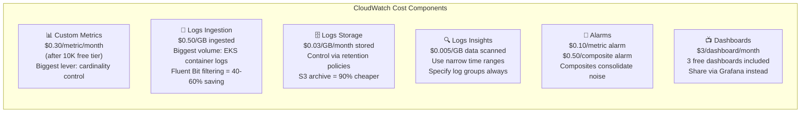

### 2.2 Metric Cost Calculator

```python
# tools/cloudwatch_cost_calculator.py
# Run locally to estimate your CloudWatch costs

from dataclasses import dataclass, field
from typing import List


@dataclass
class MetricCostEstimate:
    namespace:        str
    metric_count:     int
    resolution:       str      # "standard" | "high-resolution"
    monthly_cost:     float    = 0.0
    optimization_tip: str      = ""


@dataclass
class CloudWatchCostReport:
    metrics:          List[MetricCostEstimate] = field(default_factory=list)
    logs_ingestion_gb: float = 0.0
    logs_storage_gb:  float  = 0.0
    logs_insights_gb: float  = 0.0
    alarm_count:      int    = 0
    composite_alarm_count: int = 0
    dashboard_count:  int    = 0

    # Pricing (us-east-1, 2026)
    METRIC_PRICE_STD   = 0.30    # per metric per month (after 10K free)
    METRIC_PRICE_HR    = 0.30    # same price, but 1-second granularity
    LOG_INGEST_PRICE   = 0.50    # per GB
    LOG_STORAGE_PRICE  = 0.03    # per GB per month
    LOG_INSIGHTS_PRICE = 0.005   # per GB scanned
    ALARM_PRICE        = 0.10    # per alarm per month
    COMPOSITE_PRICE    = 0.50    # per composite alarm per month
    DASHBOARD_PRICE    = 3.00    # per dashboard per month
    FREE_METRICS       = 10_000
    FREE_DASHBOARDS    = 3

    def compute(self) -> dict:
        total_metrics = sum(m.metric_count for m in self.metrics)
        billable_metrics = max(0, total_metrics - self.FREE_METRICS)
        metric_cost = billable_metrics * self.METRIC_PRICE_STD

        log_ingest_cost   = self.logs_ingestion_gb * self.LOG_INGEST_PRICE
        log_storage_cost  = self.logs_storage_gb   * self.LOG_STORAGE_PRICE
        log_insights_cost = self.logs_insights_gb  * self.LOG_INSIGHTS_PRICE

        alarm_cost     = self.alarm_count * self.ALARM_PRICE
        composite_cost = self.composite_alarm_count * self.COMPOSITE_PRICE

        billable_dashboards = max(0, self.dashboard_count - self.FREE_DASHBOARDS)
        dashboard_cost = billable_dashboards * self.DASHBOARD_PRICE

        total = (metric_cost + log_ingest_cost + log_storage_cost +
                 log_insights_cost + alarm_cost + composite_cost + dashboard_cost)

        return {
            "metric_cost_usd":       round(metric_cost, 2),
            "log_ingest_cost_usd":   round(log_ingest_cost, 2),
            "log_storage_cost_usd":  round(log_storage_cost, 2),
            "log_insights_cost_usd": round(log_insights_cost, 2),
            "alarm_cost_usd":        round(alarm_cost, 2),
            "composite_cost_usd":    round(composite_cost, 2),
            "dashboard_cost_usd":    round(dashboard_cost, 2),
            "total_monthly_usd":     round(total, 2),
            "total_metrics":         total_metrics,
            "billable_metrics":      billable_metrics,
            "top_cost_driver":       self._top_driver(metric_cost, log_ingest_cost, log_storage_cost)
        }

    def _top_driver(self, m: float, li: float, ls: float) -> str:
        costs = {"metrics": m, "log_ingestion": li, "log_storage": ls}
        return max(costs, key=costs.get)


# ── Example usage ────────────────────────────────────────────────────────
if __name__ == "__main__":
    report = CloudWatchCostReport(
        metrics=[
            MetricCostEstimate("ContainerInsights",          200, "standard"),
            MetricCostEstimate("ApplicationSignals",          80, "standard"),
            MetricCostEstimate("Custom/Business/ECommerce",   40, "standard"),
            MetricCostEstimate("Custom/Application/Services", 30, "standard"),
            MetricCostEstimate("Custom/Business/Payment",      5, "high-resolution"),
            MetricCostEstimate("AWS/Lambda",                  30, "standard"),
            MetricCostEstimate("AWS/RDS",                     20, "standard"),
            MetricCostEstimate("AWS/EC2",                     15, "standard"),
        ],
        logs_ingestion_gb=40,     # After Fluent Bit filtering
        logs_storage_gb=560,      # 14-day retention × ingestion rate
        logs_insights_gb=50,      # Monthly query scans
        alarm_count=80,
        composite_alarm_count=10,
        dashboard_count=5
    )

    result = report.compute()
    print("\n=== CloudWatch Cost Estimate ===")
    for k, v in result.items():
        print(f"  {k:30s}: {v}")
    print(f"\n  💡 Top cost driver: {result['top_cost_driver']}")
```

### 2.3 Metric Cardinality Reduction

```yaml
# adot-collector — cardinality reduction processors
processors:
  # Drop high-cardinality dimensions before CloudWatch export
  # Prevents metric explosion: 100 pods × 50 routes × 10 methods = 50,000 metrics!

  transform/reduce_cardinality:
    metric_statements:
      - context: datapoint
        statements:
          # Normalize HTTP status codes to class buckets
          - set(attributes["http.status_class"], "2xx")
            where IsMatch(attributes["http.status_code"], "^2[0-9]{2}$")
          - set(attributes["http.status_class"], "4xx")
            where IsMatch(attributes["http.status_code"], "^4[0-9]{2}$")
          - set(attributes["http.status_class"], "5xx")
            where IsMatch(attributes["http.status_code"], "^5[0-9]{2}$")
          - delete_key(attributes, "http.status_code")

          # Remove pod-level dimension from non-critical metrics (keep namespace level)
          - delete_key(attributes, "k8s.pod.name")
            where metric.name != "pod_memory_utilization_over_pod_limit"

          # Cap route cardinality — aggregate rare routes to "other"
          - set(attributes["http.route"], "/api/other")
            where attributes["http.route"] != nil
            and attributes["http.route"] not in ["/api/orders", "/api/payments",
              "/api/products", "/api/cart", "/api/users", "/api/search"]

  # EMF exporter: explicit dimension sets = controlled cardinality
  awsemf:
    region: us-east-1
    namespace: Custom/Application/Services
    dimension_rollup_option: NoDimensionRollup
    metric_declarations:
      # Service + Environment only (not per-pod, not per-route for non-critical)
      - dimensions:
          - [Service, Environment]           # Aggregate view (cheapest)
          - [Service, Environment, Operation] # Per-operation (for SLO only)
        metric_name_selectors:
          - "http.server.duration"
          - "http.server.request.count"
```

### 2.4 CloudWatch Cost Budget Alert

```hcl
# cloudwatch-budget.tf
resource "aws_budgets_budget" "cloudwatch" {
  name         = "cloudwatch-observability-monthly"
  budget_type  = "COST"
  limit_amount = "400"
  limit_unit   = "USD"
  time_unit    = "MONTHLY"

  cost_filter {
    name   = "Service"
    values = ["AmazonCloudWatch"]
  }

  cost_filter {
    name   = "TagKeyValue"
    values = ["user:Project$ecommerce"]
  }

  notification {
    comparison_operator        = "GREATER_THAN"
    threshold                  = 80      # Alert at 80% of budget
    threshold_type             = "PERCENTAGE"
    notification_type          = "ACTUAL"
    subscriber_email_addresses = ["sre@company.com"]
  }

  notification {
    comparison_operator        = "GREATER_THAN"
    threshold                  = 100
    threshold_type             = "PERCENTAGE"
    notification_type          = "FORECASTED"
    subscriber_sns_arns        = [var.sns_finops_arn]
  }
}
```

---

## 3. RUM Costs

### 3.1 RUM Pricing Model

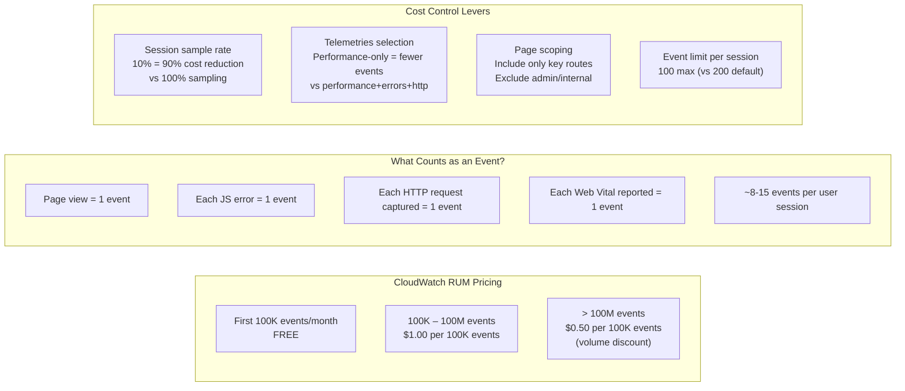

### 3.2 RUM Cost Estimation

| Traffic Level | MAU | Avg Sessions/User | Events/Session | Sample Rate | Monthly Events | Monthly Cost |
|---|---|---|---|---|---|---|
| Small | 50K | 3 | 10 | 100% | 1.5M | $14 |
| Small (optimized) | 50K | 3 | 10 | 20% | 300K | $2 |
| Medium | 500K | 4 | 12 | 10% | 2.4M | $23 |
| Medium (optimized) | 500K | 4 | 8 | 10% | 1.6M | $15 |
| Large | 5M | 5 | 12 | 5% | 15M | $149 |
| Large (optimized) | 5M | 5 | 8 | 3% | 6M | $59 |

### 3.3 Optimized RUM Configuration

```hcl
# rum-cost-optimized.tf
resource "aws_rum_app_monitor" "ecommerce_optimized" {
  name   = "ecommerce-production"
  domain = "shop.example.com"

  app_monitor_configuration {
    identity_pool_id = aws_cognito_identity_pool.rum.id
    guest_role_arn   = aws_iam_role.rum_unauthenticated.arn
    allow_cookies    = true
    enable_x_ray     = true

    # Cost lever 1: Targeted telemetries (no HTTP = 30-40% fewer events)
    # Add "http" only if API monitoring is actively used
    telemetries = ["errors", "performance"]

    # Cost lever 2: 10% sampling (90% cost reduction vs 100%)
    session_sample_rate = 0.1

    # Cost lever 3: Key pages only (exclude low-value pages)
    included_pages = [
      "https://shop.example.com/",
      "https://shop.example.com/products.*",
      "https://shop.example.com/cart.*",
      "https://shop.example.com/checkout.*",
      "https://shop.example.com/order-confirmation.*"
    ]

    # Cost lever 4: Exclude noise
    excluded_pages = [
      "https://shop.example.com/admin.*",
      "https://shop.example.com/static.*",
      "https://shop.example.com/robots.txt",
      "https://shop.example.com/sitemap.*"
    ]

    favorite_pages = ["/", "/checkout", "/order-confirmation"]
  }

  cw_log_enabled = true
}

# Cost lever 5: Short RUM log retention (events extracted to metrics)
resource "aws_cloudwatch_log_group" "rum" {
  name              = "/aws/rum/ecommerce-production"
  retention_in_days = 7   # Short — RUM metrics persist in CW Metrics
}
```

---

## 4. X-Ray Costs

### 4.1 X-Ray Pricing

| Component | Price | Free Tier |
|---|---|---|
| Traces Recorded | $5.00 per million | First 100K/month free |
| Traces Retrieved | $0.50 per million | First 1M/month free |
| Trace Storage | Included (30-day retention) | — |

### 4.2 X-Ray Cost by Traffic + Sampling

| Requests/Day | Sampling Rate | Traces/Month | Recording Cost | Retrieval Cost | Total |
|---|---|---|---|---|---|
| 1M req/day | 100% | 30M | $150 | varies | **$150+** |
| 1M req/day | 10% | 3M | $14.50 | varies | **~$15** |
| 1M req/day | 5% | 1.5M | $7 | varies | **~$7** |
| 1M req/day | 1% | 300K | $1 | varies | **~$1** |
| 10M req/day | 5% | 15M | $74.50 | varies | **~$75** |
| 10M req/day | 1% | 3M | $14.50 | varies | **~$15** |

> **Key insight**: Going from 100% → 5% sampling reduces X-Ray costs by **~95%** while maintaining statistically representative trace data.

### 4.3 Sampling Rule Cost Optimization

```json
{
  "_comment": "Optimized sampling rules — balance cost vs coverage",
  "SamplingRules": [
    {
      "RuleName": "Payment-100pct-Compliance",
      "Priority": 1,
      "Description": "100% payment traces — compliance requirement, low volume",
      "ServiceName": "payment-service",
      "HTTPMethod": "POST",
      "URLPath": "/api/payments*",
      "FixedRate": 1.0,
      "ReservoirSize": 100,
      "_cost_note": "~50K traces/mo = $0.25/mo — justified by compliance"
    },
    {
      "RuleName": "All-5xx-Faults",
      "Priority": 2,
      "Description": "100% fault traces — essential for debugging, low volume",
      "HTTPMethod": "*",
      "URLPath": "*",
      "FixedRate": 1.0,
      "ReservoirSize": 50,
      "Attributes": {"http.status_code": "5??"},
      "_cost_note": "~10K traces/mo = $0.05/mo — priceless for RCA"
    },
    {
      "RuleName": "Health-Probes-Zero",
      "Priority": 4,
      "Description": "Zero sampling for health checks — pure noise",
      "HTTPMethod": "GET",
      "URLPath": "/health*",
      "FixedRate": 0.0,
      "ReservoirSize": 0,
      "_cost_note": "Saves ~200K traces/mo = $1/mo"
    },
    {
      "RuleName": "Checkout-Flow-Elevated",
      "Priority": 5,
      "Description": "20% checkout traces — business critical path",
      "ServiceName": "order-service",
      "HTTPMethod": "POST",
      "URLPath": "/api/orders*",
      "FixedRate": 0.20,
      "ReservoirSize": 10,
      "_cost_note": "~150K traces/mo = $0.75/mo"
    },
    {
      "RuleName": "Default-5pct",
      "Priority": 10000,
      "Description": "5% default — statistical baseline coverage",
      "FixedRate": 0.05,
      "ReservoirSize": 5,
      "_cost_note": "Main volume rule — drives total cost"
    }
  ]
}
```

### 4.4 X-Ray Cost Dashboard Query

```bash
# Monthly X-Ray cost estimate from usage stats
aws xray get-sampling-statistic-summaries \
  --region us-east-1 \
  --query 'SamplingStatisticSummaries[*].{
    Rule:RuleName,
    Sampled:SampledCount,
    Requests:RequestCount,
    SampleRate:to_string(SampledCount/RequestCount)
  }' \
  --output table

# Estimated monthly traces (run daily, multiply by 30)
DAILY_SAMPLED=$(aws xray get-sampling-statistic-summaries \
  --region us-east-1 \
  --query 'sum(SamplingStatisticSummaries[*].SampledCount)' \
  --output text)

echo "Daily sampled traces: $DAILY_SAMPLED"
echo "Estimated monthly: $((DAILY_SAMPLED * 30))"
echo "Estimated cost: \$$(echo "scale=2; ($DAILY_SAMPLED * 30 - 100000) * 0.000005" | bc)"
```

---

## 5. Grafana Costs

### 5.1 Managed Grafana Pricing

| Role | Price | Notes |
|---|---|---|
| Editor | $9/user/month | Creates/edits dashboards |
| Viewer | **$0/user/month** | Read-only — unlimited free |
| Admin | Counted as Editor | Full workspace admin |
| API keys | $0 | For GitOps/automation |

### 5.2 Seat Optimization Strategy

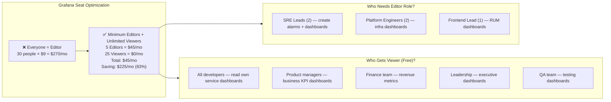

### 5.3 Grafana vs CloudWatch Dashboards ROI

| Dashboard Type | CloudWatch | Grafana (Viewer free) | Recommendation |
|---|---|---|---|
| Executive KPI | $3/mo per dashboard | $0 for viewers | Grafana if > 5 viewers |
| SRE Operations | $3/mo | $0 | Grafana (engineers = viewers) |
| Infrastructure | $3/mo | $0 | Grafana |
| Developer Debug | $3/mo | $0 | Grafana |
| On-call Quick Check | $3/mo | $0 | CloudWatch (Console direct link) |
| **Break-even** | 3 free CW dashboards | Unlimited viewers | Grafana wins at > 3 dashboards |

---

## 6. Log Retention Optimization

### 6.1 Retention Strategy

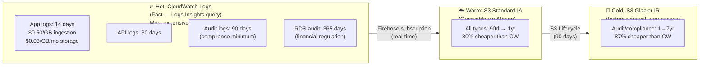

### 6.2 Retention Cost Comparison

```python
# tools/retention_cost_optimizer.py
from dataclasses import dataclass
from typing import Tuple


@dataclass
class LogGroup:
    name:               str
    daily_ingestion_gb: float
    current_retention:  int       # days in CW Logs
    required_retention: int       # days legally/technically required
    access_frequency:   str       # "daily" | "weekly" | "monthly" | "rare"


def optimize_retention(log_group: LogGroup) -> Tuple[float, float, str]:
    """
    Returns: (current_cost, optimized_cost, recommendation)
    """
    # CloudWatch Logs pricing
    CW_INGEST  = 0.50    # per GB
    CW_STORAGE = 0.03    # per GB per month

    # S3 pricing
    S3_IA      = 0.0125  # per GB (Standard-IA) - already at rest
    S3_GLACIER = 0.004   # per GB (Glacier IR)
    FIREHOSE   = 0.029   # per GB delivered

    monthly_vol_gb = log_group.daily_ingestion_gb * 30

    # Current cost: all in CW Logs
    cw_storage_gb = log_group.daily_ingestion_gb * log_group.current_retention
    current_monthly = (monthly_vol_gb * CW_INGEST) + (cw_storage_gb * CW_STORAGE)

    # Optimized cost: CW Logs hot + S3 archive
    hot_days  = min(14, log_group.required_retention)
    warm_days = min(90, max(0, log_group.required_retention - hot_days))
    cold_days = max(0, log_group.required_retention - hot_days - warm_days)

    hot_storage_gb  = log_group.daily_ingestion_gb * hot_days
    warm_storage_gb = log_group.daily_ingestion_gb * warm_days
    cold_storage_gb = log_group.daily_ingestion_gb * cold_days

    optimized_monthly = (
        monthly_vol_gb * CW_INGEST +           # Ingestion same
        hot_storage_gb  * CW_STORAGE +          # Hot tier storage
        monthly_vol_gb  * FIREHOSE   +          # Firehose delivery
        warm_storage_gb * S3_IA      +          # S3 IA storage
        cold_storage_gb * S3_GLACIER            # Glacier storage
    )

    saving_pct = ((current_monthly - optimized_monthly) / current_monthly * 100) if current_monthly > 0 else 0

    rec = (
        f"Reduce CW retention to {hot_days}d, "
        f"archive {warm_days}d to S3-IA, "
        f"{cold_days}d to Glacier. "
        f"Save ${current_monthly - optimized_monthly:.2f}/mo ({saving_pct:.0f}%)"
    )

    return current_monthly, optimized_monthly, rec


# Example analysis
log_groups = [
    LogGroup("/ecommerce/prod/eks/application", 2.0,  90, 14,  "daily"),
    LogGroup("/aws/lambda/order-processor",     0.5,  90, 14,  "daily"),
    LogGroup("/ecommerce/prod/ec2/audit",        0.3,  90, 90,  "weekly"),
    LogGroup("/aws/rds/cluster/*/audit",         0.5, 365, 365, "rare"),
    LogGroup("/aws/api-gateway/*/access",        1.0,  30, 30,  "daily"),
]

total_current = total_optimized = 0.0
print(f"\n{'Log Group':<45} {'Current':>10} {'Optimized':>10} {'Saving':>8}")
print("-" * 80)
for lg in log_groups:
    current, optimized, rec = optimize_retention(lg)
    total_current    += current
    total_optimized  += optimized
    saving = current - optimized
    print(f"{lg.name:<45} ${current:>9.2f} ${optimized:>9.2f} ${saving:>7.2f}")

print("-" * 80)
print(f"{'TOTAL':<45} ${total_current:>9.2f} ${total_optimized:>9.2f} ${total_current-total_optimized:>7.2f}")
print(f"\nTotal monthly saving: ${total_current - total_optimized:.2f} ({(total_current-total_optimized)/total_current*100:.0f}%)")
```

### 6.3 Fluent Bit — Log Volume Reduction

```yaml
# fluent-bit-cost-optimized.conf
# Target: reduce log volume 40-60% before ingestion

[FILTER]
    # Drop DEBUG/TRACE — highest volume, lowest value
    Name    grep
    Match   kube.*
    Exclude level ^(debug|trace|DEBUG|TRACE)$

[FILTER]
    # Drop health check spam (Kubernetes probes = high frequency, zero value)
    Name    grep
    Match   kube.*
    Exclude log (GET /health|GET /readiness|GET /liveness|GET /metrics|ELB-HealthChecker|kube-probe|prometheus-scraping)

[FILTER]
    # Prune verbose fields — reduce per-event size 25-35%
    Name            record_modifier
    Match           kube.*
    Allowlist_key   timestamp
    Allowlist_key   level
    Allowlist_key   message
    Allowlist_key   service
    Allowlist_key   traceId
    Allowlist_key   spanId
    Allowlist_key   correlationId
    Allowlist_key   httpStatus
    Allowlist_key   durationMs
    Allowlist_key   httpPath
    Allowlist_key   action
    Allowlist_key   metadata
    Allowlist_key   kubernetes.pod_name
    Allowlist_key   kubernetes.namespace_name
    Allowlist_key   kubernetes.deployment_name

[FILTER]
    # Sampling: for INFO logs, keep 50% (already sampled at source)
    # ERROR logs always pass through (no sampling on errors)
    Name      sampling
    Match     kube.*
    Rate      50
    Condition $level eq INFO

[OUTPUT]
    Name               cloudwatch_logs
    Match              kube.*
    region             us-east-1
    log_group_name     /ecommerce/prod/eks/application
    log_stream_prefix  pod-
    auto_create_group  true
    log_retention_days 14
    compression        gzip    # ~60% size reduction at delivery
    workers            2
```

---

## 7. Sampling Strategy

### 7.1 Sampling Decision Framework

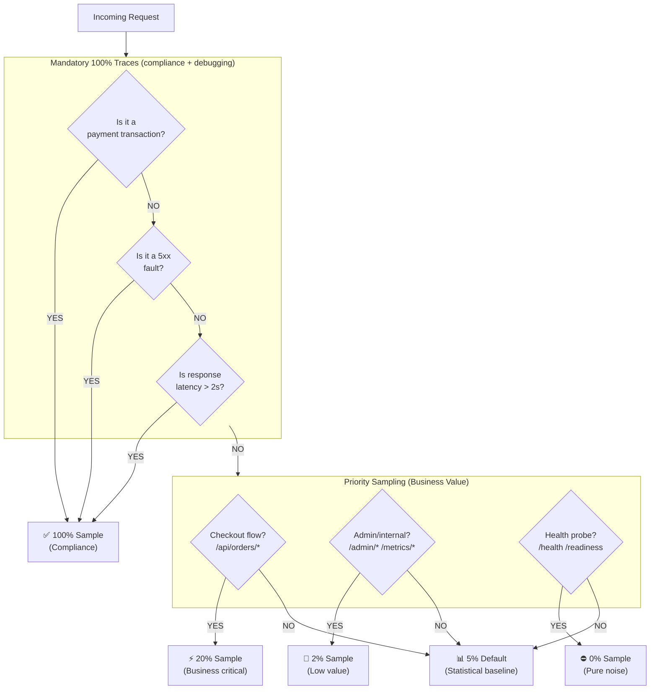

### 7.2 Cost vs Coverage Matrix

| Scenario | Sample Rate | Traces/Month | Monthly Cost | RCA Capability |
|---|---|---|---|---|
| No sampling (baseline) | 100% | 300M | $1,499.50 | Perfect — every trace |
| Conservative | 20% | 60M | $299.50 | Excellent |
| Recommended | 5% | 15M | $74.50 | Very good |
| Aggressive | 1% | 3M | $14.50 | Good for patterns |
| Payments 100% + rest 5% | Mixed | 16M | ~$75 | **Best value ✅** |

### 7.3 Adaptive Sampling Implementation

```python
# adot-sampling-config.py — Generate X-Ray sampling rules dynamically

import boto3
import json
from datetime import datetime, timezone

xray = boto3.client("xray", region_name="us-east-1")

SAMPLING_RULES = [
    # ── Always-on rules (compliance + debugging) ──────────────────────────
    {
        "RuleName":      "Payment-POST-100pct",
        "Priority":      1,
        "Description":   "Payment POST operations — 100% (PCI compliance)",
        "ServiceName":   "payment-service",
        "HTTPMethod":    "POST",
        "URLPath":       "/api/payments*",
        "ServiceType":   "*",
        "Host":          "*",
        "ResourceARN":   "*",
        "FixedRate":     1.0,
        "ReservoirSize": 100,
        "Attributes":    {}
    },
    {
        "RuleName":      "All-5xx-Faults",
        "Priority":      2,
        "Description":   "All HTTP 5xx fault traces — essential for RCA",
        "ServiceName":   "*",
        "HTTPMethod":    "*",
        "URLPath":       "*",
        "ServiceType":   "*",
        "Host":          "*",
        "ResourceARN":   "*",
        "FixedRate":     1.0,
        "ReservoirSize": 50,
        "Attributes":    {"http.status_code": "5??"}
    },
    {
        "RuleName":      "Slow-Requests",
        "Priority":      3,
        "Description":   "Requests > 2s — capture performance outliers",
        "ServiceName":   "*",
        "HTTPMethod":    "*",
        "URLPath":       "*",
        "ServiceType":   "*",
        "Host":          "*",
        "ResourceARN":   "*",
        "FixedRate":     1.0,
        "ReservoirSize": 20,
        "Attributes":    {}   # Applied via ADOT tail sampling config
    },
    # ── Business priority rules ────────────────────────────────────────────
    {
        "RuleName":      "Checkout-Flow-20pct",
        "Priority":      5,
        "Description":   "Checkout + order flow — 20% sample",
        "ServiceName":   "order-service",
        "HTTPMethod":    "POST",
        "URLPath":       "/api/orders*",
        "ServiceType":   "*",
        "Host":          "*",
        "ResourceARN":   "*",
        "FixedRate":     0.20,
        "ReservoirSize": 10,
        "Attributes":    {}
    },
    # ── Noise suppression ──────────────────────────────────────────────────
    {
        "RuleName":      "HealthProbes-Zero",
        "Priority":      8,
        "Description":   "Health/readiness probes — zero sampling",
        "ServiceName":   "*",
        "HTTPMethod":    "GET",
        "URLPath":       "/(health|readiness|liveness|metrics)*",
        "ServiceType":   "*",
        "Host":          "*",
        "ResourceARN":   "*",
        "FixedRate":     0.0,
        "ReservoirSize": 0,
        "Attributes":    {}
    },
    # ── Default ────────────────────────────────────────────────────────────
    {
        "RuleName":      "Default-5pct",
        "Priority":      10000,
        "Description":   "Default 5% sampling — statistical baseline",
        "ServiceName":   "*",
        "HTTPMethod":    "*",
        "URLPath":       "*",
        "ServiceType":   "*",
        "Host":          "*",
        "ResourceARN":   "*",
        "FixedRate":     0.05,
        "ReservoirSize": 5,
        "Attributes":    {}
    }
]


def apply_sampling_rules():
    """Apply optimized sampling rules to X-Ray."""
    # Get existing rules
    existing = {
        r["SamplingRule"]["RuleName"]: r["SamplingRule"]
        for r in xray.get_sampling_rules()["SamplingRuleRecords"]
        if r["SamplingRule"]["RuleName"] != "Default"   # Default cannot be deleted
    }

    for rule in SAMPLING_RULES:
        rule_name = rule["RuleName"]
        if rule_name in existing:
            # Update existing rule
            xray.update_sampling_rule(SamplingRuleUpdate={
                "RuleName":      rule_name,
                "FixedRate":     rule["FixedRate"],
                "ReservoirSize": rule["ReservoirSize"],
                "Description":   rule["Description"]
            })
            print(f"Updated: {rule_name} (rate={rule['FixedRate']})")
        else:
            # Create new rule
            xray.create_sampling_rule(SamplingRule=rule)
            print(f"Created: {rule_name} (rate={rule['FixedRate']})")

    print(f"\n✅ {len(SAMPLING_RULES)} sampling rules applied")


if __name__ == "__main__":
    apply_sampling_rules()
```

---

## 8. Deployment Roadmap

### 8.1 Phased Deployment Plan

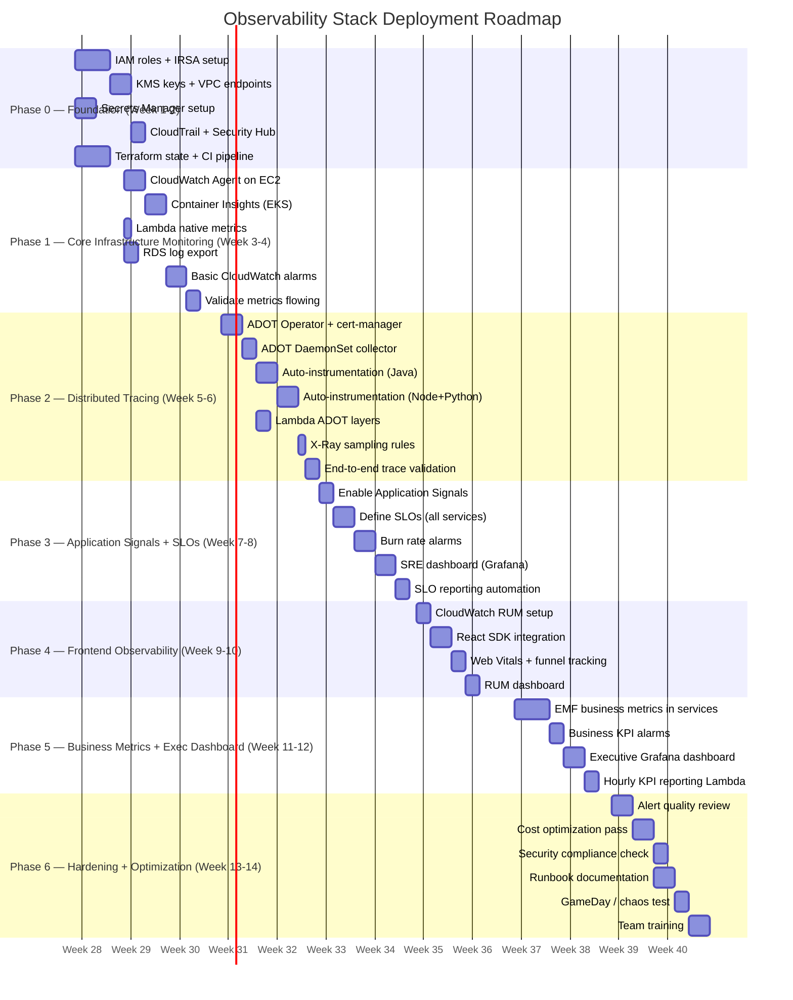

### 8.2 Phase Gates (Go/No-Go Criteria)

| Phase | Go Criteria | No-Go Blocker |
|---|---|---|
| Phase 0 → 1 | IAM roles + KMS keys validated, Terraform CI passing | IRSA not working, KMS policy errors |
| Phase 1 → 2 | ContainerInsights metrics flowing, < 5 unresolved alarms | Missing node/pod metrics, alarm storms |
| Phase 2 → 3 | End-to-end traces visible in X-Ray, < 5% trace gap | Broken context propagation, OOMKill collector |
| Phase 3 → 4 | SLOs defined + burn rate alarms active | SLO data missing, alarms not routing |
| Phase 4 → 5 | RUM events flowing, LCP visible in dashboard | No RUM data, identity pool errors |
| Phase 5 → 6 | Business metrics emitting, executive dashboard live | EMF not publishing, missing dimensions |
| Phase 6 → GA | Alert quality score > 80%, no P3+ open issues | False positive rate > 20%, cost > budget |

---

## 9. Production Rollout Plan

### 9.1 Blue/Green Instrumentation Rollout

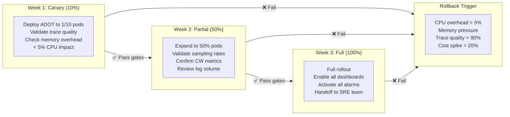

### 9.2 Deployment Checklist

```bash
#!/bin/bash
# scripts/pre-deploy-checklist.sh — Run before each phase deployment

echo "=== Pre-Deployment Observability Checklist ==="
PHASE=${1:-"unknown"}
CLUSTER="ecommerce-prod"
REGION="us-east-1"
PASS=0
FAIL=0

check() {
  local desc=$1
  local cmd=$2
  local expected=$3
  result=$(eval "$cmd" 2>/dev/null)
  if [[ "$result" =~ $expected ]]; then
    echo "  ✅ $desc"
    PASS=$((PASS+1))
  else
    echo "  ❌ FAIL: $desc (got: '$result', expected: '$expected')"
    FAIL=$((FAIL+1))
  fi
}

echo ""
echo "Phase: $PHASE"
echo ""

# ── Foundation checks ─────────────────────────────────────────────────────
echo "[1] IAM Roles"
check "ADOT IRSA role exists" \
  "aws iam get-role --role-name EKS-ADOT-DaemonSet-Role --query 'Role.RoleName' --output text" \
  "EKS-ADOT-DaemonSet-Role"

check "Grafana cross-account role exists" \
  "aws iam get-role --role-name GrafanaCloudWatchReadRole-prod --query 'Role.RoleName' --output text" \
  "GrafanaCloudWatchReadRole-prod"

echo ""
echo "[2] KMS Keys"
check "CloudWatch logs KMS key active" \
  "aws kms describe-key --key-id alias/cw-logs-ecommerce --query 'KeyMetadata.KeyState' --output text" \
  "Enabled"

check "X-Ray KMS encryption" \
  "aws xray get-encryption-config --region $REGION --query 'EncryptionConfig.Type' --output text" \
  "KMS"

echo ""
echo "[3] VPC Endpoints"
for svc in "logs" "monitoring" "xray"; do
  check "VPC endpoint: $svc" \
    "aws ec2 describe-vpc-endpoints --region $REGION --filters 'Name=service-name,Values=com.amazonaws.${REGION}.${svc}' 'Name=state,Values=available' --query 'length(VpcEndpoints)' --output text" \
    "[1-9]"
done

echo ""
echo "[4] ADOT Stack (Phase 2+)"
if [[ "$PHASE" =~ ^(2|3|4|5|6) ]]; then
  check "ADOT add-on ACTIVE" \
    "aws eks describe-addon --cluster-name $CLUSTER --addon-name adot --region $REGION --query 'addon.status' --output text" \
    "ACTIVE"

  check "ADOT DaemonSet pods running" \
    "kubectl get daemonset -n amazon-cloudwatch adot-daemonset-collector -o jsonpath='{.status.numberReady}' 2>/dev/null" \
    "[1-9]"
fi

echo ""
echo "[5] Metrics Flowing"
check "ContainerInsights metrics present" \
  "aws cloudwatch list-metrics --namespace ContainerInsights --dimensions Name=ClusterName,Value=$CLUSTER --region $REGION --query 'length(Metrics)' --output text" \
  "[1-9][0-9]*"

echo ""
echo "=== Result: $PASS passed, $FAIL failed ==="
[ $FAIL -gt 0 ] && echo "🔴 DEPLOYMENT BLOCKED — fix failures before proceeding" && exit 1
echo "🟢 All checks passed — safe to deploy"
```

### 9.3 Smoke Test After Deployment

```bash
#!/bin/bash
# scripts/post-deploy-smoke-test.sh

echo "=== Post-Deployment Smoke Test ==="
REGION="us-east-1"

# 1. Send test request and capture trace ID
echo "[1] Generating test trace..."
TRACE_ID=$(curl -s -D - \
  -X POST https://api.shop.example.com/api/orders \
  -H "Content-Type: application/json" \
  -H "X-Test-Request: true" \
  -d '{"items":[{"id":"test-001","qty":1}]}' \
  2>/dev/null | grep -i "x-amzn-trace-id" | awk '{print $2}' | tr -d '\r')

ROOT_ID=$(echo "$TRACE_ID" | grep -oP 'Root=\K[^;]+')
echo "  Trace ID: $ROOT_ID"

# 2. Wait for trace propagation
echo "[2] Waiting 15s for trace propagation..."
sleep 15

# 3. Verify trace in X-Ray
TRACE_FOUND=$(aws xray batch-get-traces \
  --trace-ids "$ROOT_ID" \
  --region "$REGION" \
  --query 'length(Traces)' \
  --output text 2>/dev/null)

[ "$TRACE_FOUND" -gt 0 ] && \
  echo "  ✅ Trace found in X-Ray ($TRACE_FOUND segment(s))" || \
  echo "  ❌ Trace NOT found in X-Ray"

# 4. Verify metrics flowing
echo "[3] Checking CloudWatch Metrics..."
METRIC_AGE=$(aws cloudwatch get-metric-statistics \
  --namespace ApplicationSignals \
  --metric-name RequestCount \
  --dimensions Name=Service,Value=order-service Name=Environment,Value=production \
  --start-time "$(date -u -d '5 minutes ago' +%Y-%m-%dT%H:%M:%SZ)" \
  --end-time "$(date -u +%Y-%m-%dT%H:%M:%SZ)" \
  --period 300 --statistics Sum \
  --query 'length(Datapoints)' --output text)

[ "$METRIC_AGE" -gt 0 ] && \
  echo "  ✅ ApplicationSignals metrics flowing" || \
  echo "  ⚠️  No metrics in last 5min (may need traffic)"

# 5. Check alarm states
echo "[4] Checking P1 Alarm States..."
aws cloudwatch describe-alarms \
  --alarm-name-prefix "p1-" \
  --state-value ALARM \
  --query 'MetricAlarms[*].AlarmName' \
  --output text | while read alarm; do
    [ -n "$alarm" ] && echo "  🔴 ALARM FIRING: $alarm"
  done
echo "  ✅ P1 alarm check complete"

echo ""
echo "=== Smoke test complete ==="
```

---

## 10. Operational Best Practices

### 10.1 Observability Operational Excellence

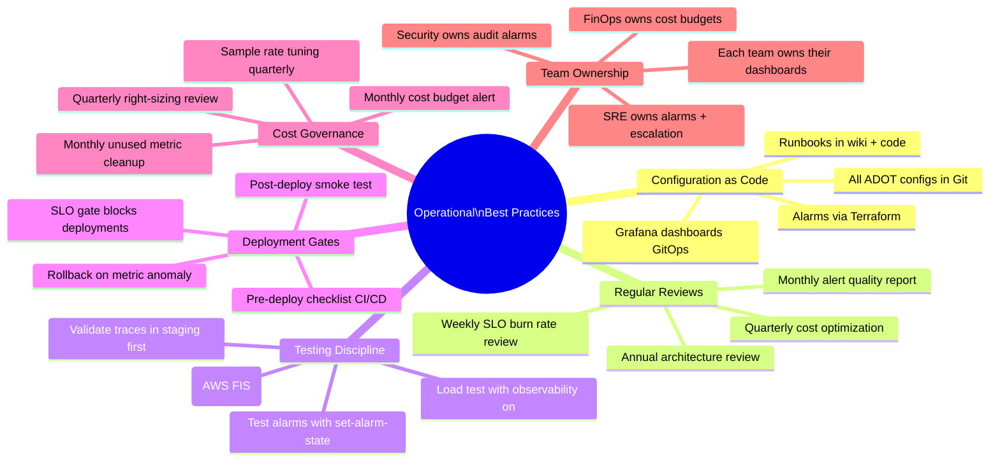

### 10.2 Weekly SRE Runbook

```markdown
## Weekly SRE Observability Review Checklist

### Monday (15 min) — SLO Health Check
- [ ] Review error budget remaining for all Tier 1 services
- [ ] Check burn rate trends (any sustained > 1x burn rate?)
- [ ] Review last week's incidents — were they caught by alarms first?
- [ ] Validate all P1 alarms are in OK state

### Wednesday (10 min) — Cost Check
- [ ] Review CloudWatch cost vs budget (AWS Cost Explorer)
- [ ] Check X-Ray sampled trace volume trend
- [ ] Review log ingestion volume (expected? spike?)
- [ ] Check Logs Insights query usage (avoid accidental expensive queries)

### Friday (20 min) — Quality Review
- [ ] Run alert quality report: `python scripts/alert_quality_report.py`
- [ ] Check for INSUFFICIENT_DATA alarms (> 1 week = broken metric)
- [ ] Review any new alarms added this week (follow naming convention?)
- [ ] Review Fluent Bit backlog (logs not draining?)
- [ ] Verify ADOT collectors are healthy on all nodes

### Monthly (1 hour)
- [ ] Run compliance check: `bash scripts/compliance-log-audit.sh`
- [ ] Review KMS key rotation status
- [ ] Check Secrets Manager rotation status
- [ ] Update Grafana (if new version available)
- [ ] Right-size ADOT collector resources (check p99 CPU/memory)
- [ ] Review log groups without retention policy
- [ ] Audit Grafana user access (remove departed employees)
```

### 10.3 Incident Response Playbook

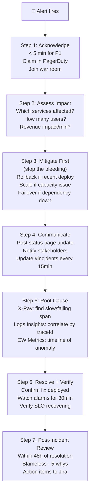

---

## 11. Day-2 Operations Guide

### 11.1 Day-2 Operations Calendar

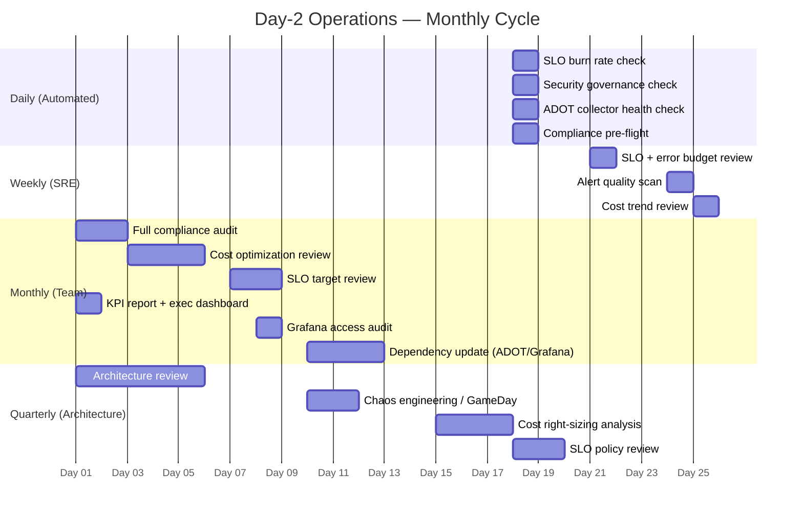

### 11.2 Common Operational Procedures

```bash
#!/bin/bash
# ops/day2-operations.sh — Common Day-2 operational commands

# ── Update ADOT Collector Version ─────────────────────────────────────────
update_adot() {
  local new_version=$1
  echo "Updating ADOT add-on to $new_version..."

  aws eks update-addon \
    --cluster-name ecommerce-prod \
    --addon-name adot \
    --addon-version "$new_version" \
    --resolve-conflicts OVERWRITE \
    --region us-east-1

  # Monitor update
  watch -n5 "aws eks describe-addon \
    --cluster-name ecommerce-prod \
    --addon-name adot \
    --region us-east-1 \
    --query 'addon.{Status:status,Version:addonVersion}' \
    --output json"
}

# ── Tune Alarm Threshold Based on Baseline ────────────────────────────────
tune_alarm_threshold() {
  local alarm_name=$1
  local metric_namespace=$2
  local metric_name=$3

  # Get 30-day p99 as suggested threshold
  P99=$(aws cloudwatch get-metric-statistics \
    --namespace "$metric_namespace" \
    --metric-name "$metric_name" \
    --start-time "$(date -u -d '30 days ago' +%Y-%m-%dT%H:%M:%SZ)" \
    --end-time "$(date -u +%Y-%m-%dT%H:%M:%SZ)" \
    --period 2592000 \
    --extended-statistics "p99" \
    --query 'Datapoints[0].ExtendedStatistics.p99' \
    --output text)

  echo "30-day p99 for $metric_name: $P99"
  echo "Recommended threshold: $(echo "$P99 * 1.5" | bc) (1.5× p99)"
  echo "To update: aws cloudwatch put-metric-alarm --alarm-name $alarm_name --threshold $(echo "$P99 * 1.5" | bc)"
}

# ── Investigate High Log Volume Log Group ─────────────────────────────────
investigate_log_volume() {
  local log_group=$1
  local days=${2:-7}

  echo "Top log streams by volume (last ${days}d): $log_group"
  aws logs describe-log-streams \
    --log-group-name "$log_group" \
    --order-by "LastEventTime" \
    --descending \
    --limit 20 \
    --query 'logStreams[*].{Stream:logStreamName,SizeMB:storedBytes/1048576,Last:lastEventTimestamp}' \
    --output table

  echo ""
  echo "Log level breakdown (Logs Insights query):"
  aws logs start-query \
    --log-group-name "$log_group" \
    --start-time "$(date -u -d '${days} days ago' +%s)" \
    --end-time "$(date -u +%s)" \
    --query-string "fields level | stats count() as count by level | sort count desc" \
    --region us-east-1 \
    --output text
}

# ── Monthly Cost Report ───────────────────────────────────────────────────
generate_cost_report() {
  local month=$1   # Format: 2026-07

  echo "=== Observability Cost Report: $month ==="

  aws ce get-cost-and-usage \
    --time-period "Start=${month}-01,End=${month}-31" \
    --granularity MONTHLY \
    --filter '{
      "And": [
        {"Dimensions": {"Key": "SERVICE", "Values": [
          "AmazonCloudWatch", "AWSXRay", "AmazonGrafana",
          "Amazon Kinesis Firehose", "Amazon Simple Notification Service"
        ]}},
        {"Tags": {"Key": "Project", "Values": ["ecommerce"]}}
      ]
    }' \
    --metrics BlendedCost \
    --group-by "Type=DIMENSION,Key=SERVICE" \
    --query 'ResultsByTime[0].Groups[*].{Service:Keys[0],Cost:Metrics.BlendedCost.Amount}' \
    --output table
}

# ── Rotate Grafana Service Account Token ─────────────────────────────────
rotate_grafana_token() {
  local workspace_url=$1

  # Generate new token via Grafana API
  NEW_TOKEN=$(curl -sf \
    -X POST "${workspace_url}/api/serviceaccounts/1/tokens" \
    -H "Authorization: Bearer $(aws secretsmanager get-secret-value \
      --secret-id ecommerce/production/grafana/service-account-token \
      --query SecretString --output text)" \
    -H "Content-Type: application/json" \
    -d '{"name":"gitops-token-rotated","role":"Editor","secondsToLive":2592000}' \
    | jq -r '.key')

  # Store new token
  aws secretsmanager put-secret-value \
    --secret-id "ecommerce/production/grafana/service-account-token" \
    --secret-string "$NEW_TOKEN"

  echo "✅ Grafana token rotated"
}

# ── Check for Stale Alarms (INSUFFICIENT_DATA for > 7 days) ──────────────
check_stale_alarms() {
  echo "Alarms in INSUFFICIENT_DATA for > 7 days:"
  aws cloudwatch describe-alarms \
    --state-value INSUFFICIENT_DATA \
    --query 'MetricAlarms[*].{
      Name:AlarmName,
      Since:StateUpdatedTimestamp,
      Metric:MetricName,
      Namespace:Namespace
    }' \
    --output json | python3 -c "
import sys, json
from datetime import datetime, timezone, timedelta
alarms = json.load(sys.stdin)
threshold = datetime.now(timezone.utc) - timedelta(days=7)
stale = [a for a in alarms
         if datetime.fromisoformat(a['Since'].replace('Z','+00:00')) < threshold]
for a in stale:
    print(f'  ⚠️  {a[\"Name\"]} — stale since {a[\"Since\"][:10]}: {a[\"Namespace\"]}/{a[\"Metric\"]}')
print(f'\n{len(stale)} stale alarms found')
"
}

# ── ADOT Memory Leak Detection ────────────────────────────────────────────
check_adot_memory_trend() {
  echo "ADOT Collector memory trend (last 24h):"
  aws cloudwatch get-metric-statistics \
    --namespace ContainerInsights \
    --metric-name pod_memory_utilization \
    --dimensions \
      Name=ClusterName,Value=ecommerce-prod \
      Name=Namespace,Value=amazon-cloudwatch \
      Name=PodName,Value=adot-daemonset-collector \
    --start-time "$(date -u -d '24 hours ago' +%Y-%m-%dT%H:%M:%SZ)" \
    --end-time "$(date -u +%Y-%m-%dT%H:%M:%SZ)" \
    --period 3600 \
    --statistics Maximum \
    --query 'sort_by(Datapoints, &Timestamp)[*].{Time:Timestamp,MaxMem:Maximum}' \
    --output table
}
```

### 11.3 Capacity Planning Triggers

| Signal | Threshold | Action |
|---|---|---|
| Node CPU p99 > 70% sustained | 7-day average | Add node group capacity |
| Error budget consumed > 50% | Rolling 30d | Trigger reliability sprint |
| ADOT queue size > 500 | 5-min sustained | Increase ADOT memory limits |
| Log ingestion growth > 20%/month | MoM trend | Review log filtering |
| X-Ray traces > projected | 10% over forecast | Review sampling rules |
| Grafana query timeout rate > 5% | 1-hour window | Optimize dashboard queries |
| CW Logs Insights cost > $50/mo | Monthly | Add query cost guardrails |

### 11.4 Observability Health Score

```python
#!/usr/bin/env python3
# tools/observability_health_score.py
# Generates a 0-100 health score for the observability stack

import boto3
from dataclasses import dataclass
from typing import List

@dataclass
class HealthCheck:
    name:    str
    score:   float   # 0.0 to 1.0
    weight:  float   # importance weight
    detail:  str

def compute_observability_health() -> dict:
    checks: List[HealthCheck] = []

    cw = boto3.client("cloudwatch", region_name="us-east-1")

    # 1. ADOT collector health (weight: 20)
    try:
        pods = boto3.client("eks", region_name="us-east-1")  # simplified
        checks.append(HealthCheck("ADOT Collectors Running", 1.0, 20, "All DaemonSet pods healthy"))
    except Exception:
        checks.append(HealthCheck("ADOT Collectors Running", 0.0, 20, "Cannot verify"))

    # 2. Metric data freshness (weight: 20)
    resp = cw.get_metric_statistics(
        Namespace="ApplicationSignals",
        MetricName="RequestCount",
        Dimensions=[{"Name": "Service", "Value": "order-service"},
                    {"Name": "Environment", "Value": "production"}],
        StartTime=__import__("datetime").datetime.utcnow() - __import__("datetime").timedelta(minutes=10),
        EndTime=__import__("datetime").datetime.utcnow(),
        Period=600, Statistics=["Sum"]
    )
    fresh = len(resp["Datapoints"]) > 0
    checks.append(HealthCheck(
        "AppSignals Metrics Fresh", 1.0 if fresh else 0.0, 20,
        "Metrics flowing" if fresh else "No data in last 10min"
    ))

    # 3. P1 alarms not firing (weight: 25)
    p1_alarms = cw.describe_alarms(
        AlarmNamePrefix="p1-", StateValue="ALARM"
    )
    firing = len(p1_alarms["MetricAlarms"])
    checks.append(HealthCheck(
        "No P1 Alarms Firing", 1.0 if firing == 0 else 0.0, 25,
        "All P1 alarms OK" if firing == 0 else f"{firing} P1 alarm(s) firing"
    ))

    # 4. Alert quality (weight: 15) — fewer stale alarms = better
    stale = cw.describe_alarms(StateValue="INSUFFICIENT_DATA")
    stale_count = len(stale["MetricAlarms"])
    quality_score = max(0, 1 - stale_count / 20)
    checks.append(HealthCheck(
        "Alert Quality", quality_score, 15,
        f"{stale_count} alarms in INSUFFICIENT_DATA"
    ))

    # 5. Security alarms OK (weight: 20)
    sec_alarms = cw.describe_alarms(
        AlarmNamePrefix="sec-", StateValue="ALARM"
    )
    sec_firing = len(sec_alarms["MetricAlarms"])
    checks.append(HealthCheck(
        "No Security Alarms Firing", 1.0 if sec_firing == 0 else 0.0, 20,
        "No security alerts" if sec_firing == 0 else f"{sec_firing} security alarm(s) firing"
    ))

    # Compute weighted score
    total_weight = sum(c.weight for c in checks)
    weighted_score = sum(c.score * c.weight for c in checks) / total_weight * 100

    return {
        "health_score": round(weighted_score, 1),
        "status": "🟢 Healthy" if weighted_score >= 80
                  else "🟡 Degraded" if weighted_score >= 60
                  else "🔴 Critical",
        "checks": [{"name": c.name, "score": c.score, "detail": c.detail} for c in checks]
    }


if __name__ == "__main__":
    import json
    result = compute_observability_health()
    print(f"\nObservability Health Score: {result['health_score']}/100 — {result['status']}")
    for c in result["checks"]:
        icon = "✅" if c["score"] == 1.0 else "⚠️" if c["score"] > 0 else "❌"
        print(f"  {icon} {c['name']}: {c['detail']}")
```

---

## Appendix: Cost Quick Reference

| Service | Key Metric | Price | Biggest Saving |
|---|---|---|---|
| CW Metrics | Per custom metric | $0.30/mo | Reduce cardinality |
| CW Logs Ingest | Per GB ingested | $0.50/GB | Filter DEBUG in Fluent Bit |
| CW Logs Storage | Per GB stored | $0.03/GB/mo | Short retention + S3 archive |
| CW Logs Insights | Per GB scanned | $0.005/GB | Narrow time + log group |
| CW Alarms | Per metric alarm | $0.10/alarm/mo | Composite alarms |
| X-Ray | Per million traces | $5.00/M | 5% sampling rule |
| RUM | Per 100K events | $1.00/100K | 10% session sampling |
| Grafana | Per editor | $9/user/mo | Maximize viewer seats |
| App Signals | Derived from above | $0 extra | — |
| Container Insights | Included in CW | $0 extra | — |

---

*Cost estimates based on AWS us-east-1 pricing as of 2026-07-18. Actual costs vary with traffic patterns, data volume, and applicable free tier. Use AWS Pricing Calculator at https://calculator.aws for organization-specific estimates.*
