# Production-Grade Observability Architecture
## AWS E-Commerce Microservices Platform

> **Role**: Senior AWS Observability Architect
> **Date**: 2026-07-18
> **Scope**: Full-Stack Observability — Metrics, Logs, Traces, RUM

---

## Table of Contents

1. [Architecture Diagram](#1-architecture-diagram)
2. [Component Interaction Flow](#2-component-interaction-flow)
3. [Monitoring Data Flow](#3-monitoring-data-flow)
4. [Logging Architecture](#4-logging-architecture)
5. [Tracing Architecture](#5-tracing-architecture)
6. [Security Architecture](#6-security-architecture)
7. [Multi-AZ Design](#7-multi-az-design)
8. [High Availability Considerations](#8-high-availability-considerations)
9. [AWS Well-Architected Best Practices](#9-aws-well-architected-best-practices)

---

## 1. Architecture Diagram

### 1.1 High-Level Observability Architecture

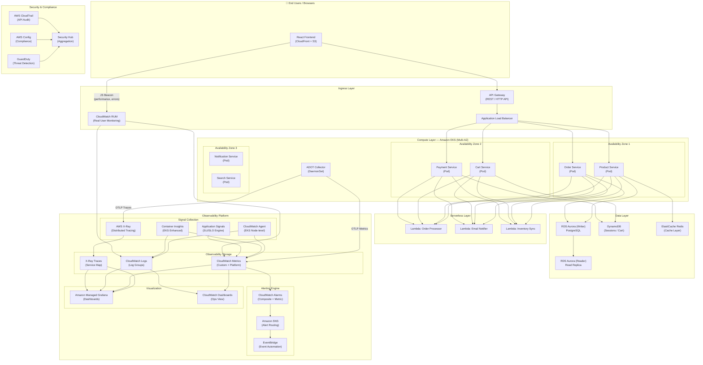

### 1.2 ADOT Instrumentation Detail (EKS)

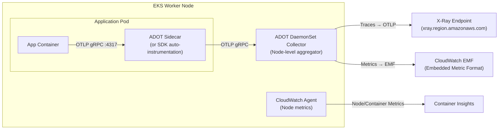

---

## 2. Component Interaction Flow

### 2.1 Request Lifecycle with Observability Hooks

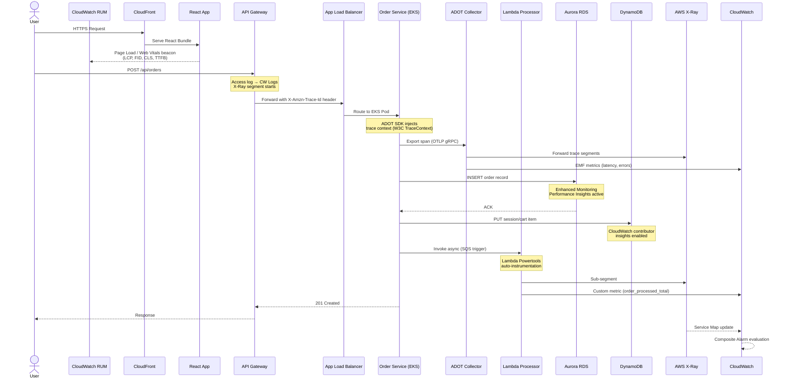

### 2.2 Observability Signal Categories per Component

| Component | Metrics | Logs | Traces | RUM |
|---|---|---|---|---|
| React Frontend | Web Vitals, JS Errors, API Latency | Console errors, JS stack traces | — | ✅ CloudWatch RUM |
| API Gateway | Latency, 4xx/5xx, Request Count | Access Logs → CW Logs | ✅ X-Ray active tracing | — |
| ALB | ActiveConnections, TargetResponseTime, HTTP_Fixed_Response | Access Logs → S3 → CW Logs Insights | ✅ X-Ray pass-through | — |
| EKS Pods | CPU, Memory, Disk I/O, Custom OTLP metrics | stdout/stderr → Fluent Bit → CW Logs | ✅ ADOT → X-Ray | — |
| Lambda | Duration, ConcurrentExecutions, Errors, Throttles | Function logs → CW Logs | ✅ Active tracing | — |
| RDS Aurora | CPUUtilization, FreeableMemory, DBConnections | Slow query, error logs | ✅ RDS Performance Insights | — |
| DynamoDB | ConsumedReadCapacityUnits, SystemErrors, SuccessfulRequestLatency | CloudTrail data events | — | — |

---

## 3. Monitoring Data Flow

### 3.1 Metrics Pipeline

```mermaid
flowchart LR
    subgraph SOURCES["Metric Sources"]
        AWS_NATIVE["AWS Native Metrics\n(RDS, DDB, Lambda, ALB, APIGW)"]
        CONTAINER["Container Insights\n(EKS Pod/Node/Namespace)"]
        APP_SIG["Application Signals\n(SLI: Latency, Availability, Errors)"]
        CUSTOM_EMF["Custom EMF Metrics\n(Business KPIs via ADOT)"]
        RUM_M["RUM Metrics\n(Web Vitals, Page Views)"]
    end

    subgraph CW_NS["CloudWatch Namespaces"]
        NS1["AWS/ApplicationELB"]
        NS2["AWS/ApiGateway"]
        NS3["AWS/EKS\nContainerInsights"]
        NS4["AWS/Lambda"]
        NS5["AWS/RDS"]
        NS6["AWS/DynamoDB"]
        NS7["Custom/ECommerce/*"]
        NS8["AWS/ApplicationSignals"]
    end

    subgraph PROCESSING["Processing Layer"]
        METRIC_MATH["Metric Math\n(Error Rate = Errors/Requests)"]
        ANOMALY["Anomaly Detection\n(ML-based bands)"]
        COMPOSITE["Composite Alarms\n(multi-condition)"]
    end

    subgraph DESTINATIONS["Destinations"]
        CW_DASH2["CloudWatch Dashboards\n(Ops team)"]
        GRAFANA2["Managed Grafana\n(Engineering)"]
        SNS2["SNS → PagerDuty / Slack"]
        S3_ARCHIVE["S3 Archive\n(long-term retention)"]
    end

    SOURCES --> CW_NS
    CW_NS --> PROCESSING
    PROCESSING --> DESTINATIONS
```

### 3.2 SLO / SLI Definition via Application Signals

| Service | SLI | SLO Target | Error Budget (30d) |
|---|---|---|---|
| Order Service | p99 Latency < 500ms | 99.5% | 3.6 hours |
| Payment Service | Availability (success rate) | 99.9% | 43.2 minutes |
| Product Service | p95 Latency < 200ms | 99.0% | 7.2 hours |
| Cart Service (DDB) | Read Latency p99 < 10ms | 99.5% | 3.6 hours |
| React Frontend | LCP < 2.5s | 95.0% | 36 hours |

### 3.3 Key CloudWatch Alarms

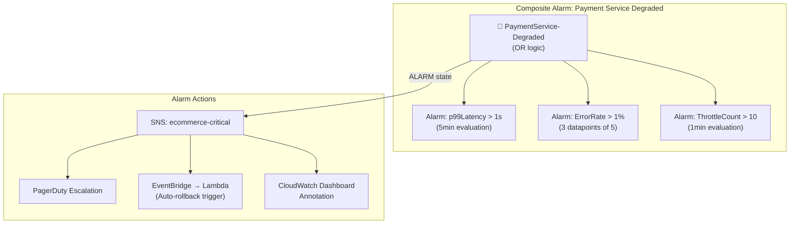

---

## 4. Logging Architecture

### 4.1 Log Pipeline

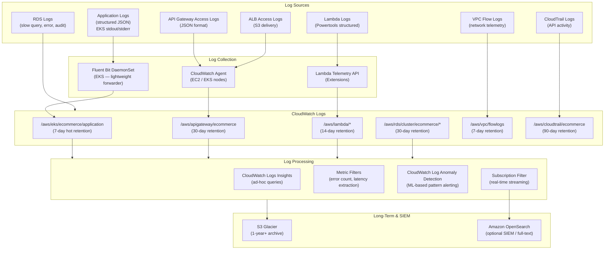

### 4.2 Structured Log Format (JSON Standard)

All application services **must** emit structured logs in this schema:

```json
{
  "timestamp": "2026-07-18T10:23:45.123Z",
  "level": "INFO",
  "service": "order-service",
  "version": "2.3.1",
  "environment": "production",
  "region": "us-east-1",
  "traceId": "1-abc12345-xyz98765432109876543210",
  "spanId": "abc1234567890abc",
  "userId": "usr_hashed_9f3a",
  "orderId": "ord_20260718_0042",
  "message": "Order created successfully",
  "durationMs": 142,
  "httpStatusCode": 201,
  "component": "OrderController",
  "action": "createOrder"
}
```

**Key rules:**
- No PII in log fields — use hashed/tokenized identifiers
- Always include `traceId` / `spanId` for log-trace correlation
- Use `ERROR` level only for actionable failures (triggers metric filters)
- `durationMs` enables latency-from-logs extraction via Metric Filters

### 4.3 Fluent Bit Configuration (EKS DaemonSet)

```yaml
# fluent-bit-config.yaml (key sections)
[INPUT]
    Name              tail
    Path              /var/log/containers/*ecommerce*.log
    Parser            docker
    Tag               kube.*
    Refresh_Interval  5
    Mem_Buf_Limit     50MB
    Skip_Long_Lines   On

[FILTER]
    Name                kubernetes
    Match               kube.*
    Kube_URL            https://kubernetes.default.svc:443
    Merge_Log           On          # Merge JSON app logs into record
    Keep_Log            Off
    Annotations         Off
    Labels              On

[FILTER]
    Name    record_modifier
    Match   *
    Record  environment production
    Record  region      us-east-1

[OUTPUT]
    Name               cloudwatch_logs
    Match              kube.*
    region             us-east-1
    log_group_name     /aws/eks/ecommerce/application
    log_stream_prefix  pod-
    auto_create_group  true
    log_retention_days 7
```

---

## 5. Tracing Architecture

### 5.1 Distributed Trace Flow

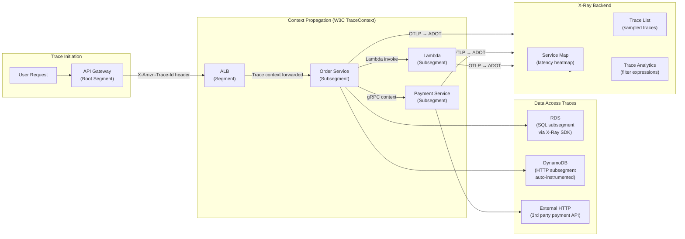

### 5.2 ADOT Collector Pipeline Configuration

```yaml
# adot-collector-config.yaml
receivers:
  otlp:
    protocols:
      grpc:
        endpoint: 0.0.0.0:4317
      http:
        endpoint: 0.0.0.0:4318

processors:
  batch:
    timeout: 1s
    send_batch_size: 50
  
  memory_limiter:
    limit_mib: 512
    spike_limit_mib: 128
    check_interval: 5s

  resourcedetection:
    detectors: [env, eks, ec2]
    timeout: 5s

  # Redact sensitive attributes before export
  attributes:
    actions:
      - key: user.email
        action: delete
      - key: http.request.header.authorization
        action: delete
      - key: db.statement
        action: hash   # Hash SQL containing PII

  filter/drop_health_checks:
    spans:
      exclude:
        match_type: strict
        attributes:
          - key: http.url
            value: "/health"

exporters:
  awsxray:
    region: us-east-1
    index_all_attributes: true

  awsemf:
    region: us-east-1
    namespace: Custom/ECommerce
    log_group_name: /aws/otel/ecommerce/metrics
    dimension_rollup_option: NoDimensionRollup
    metric_declarations:
      - dimensions: [[service.name, environment]]
        metric_name_selectors:
          - "http.server.duration"
          - "http.server.request.count"
          - "order.processing.duration"

service:
  pipelines:
    traces:
      receivers:  [otlp]
      processors: [memory_limiter, resourcedetection, attributes, filter/drop_health_checks, batch]
      exporters:  [awsxray]
    
    metrics:
      receivers:  [otlp]
      processors: [memory_limiter, resourcedetection, batch]
      exporters:  [awsemf]
```

### 5.3 Sampling Strategy

| Scenario | Sampling Rule | Rationale |
|---|---|---|
| Default (all services) | 5% reservoir + 5/s fixed | Baseline coverage |
| Payment Service | 100% (no sampling) | Compliance — all transactions traced |
| Error responses (5xx) | 100% forced | Every failure must be traceable |
| Health check endpoints | 0% (filtered in ADOT) | Noise reduction |
| Latency > 1s | 100% forced (X-Ray rule) | Capture all slow requests |
| Admin/internal APIs | 10% | Lower traffic value |

```json
// X-Ray Sampling Rules (via AWS Console / Terraform)
{
  "rules": [
    {
      "RuleName": "PaymentService-AllTraces",
      "Priority": 1,
      "ServiceName": "payment-service",
      "FixedRate": 1.0,
      "ReservoirSize": 100,
      "ResourceARN": "*",
      "HTTPMethod": "POST",
      "URLPath": "/api/payments/*"
    },
    {
      "RuleName": "SlowRequests",
      "Priority": 5,
      "FixedRate": 1.0,
      "ReservoirSize": 50,
      "Attributes": { "http.status_code": "5??" }
    },
    {
      "RuleName": "DefaultRule",
      "Priority": 10000,
      "FixedRate": 0.05,
      "ReservoirSize": 5
    }
  ]
}
```

---

## 6. Security Architecture

### 6.1 Observability Security Model

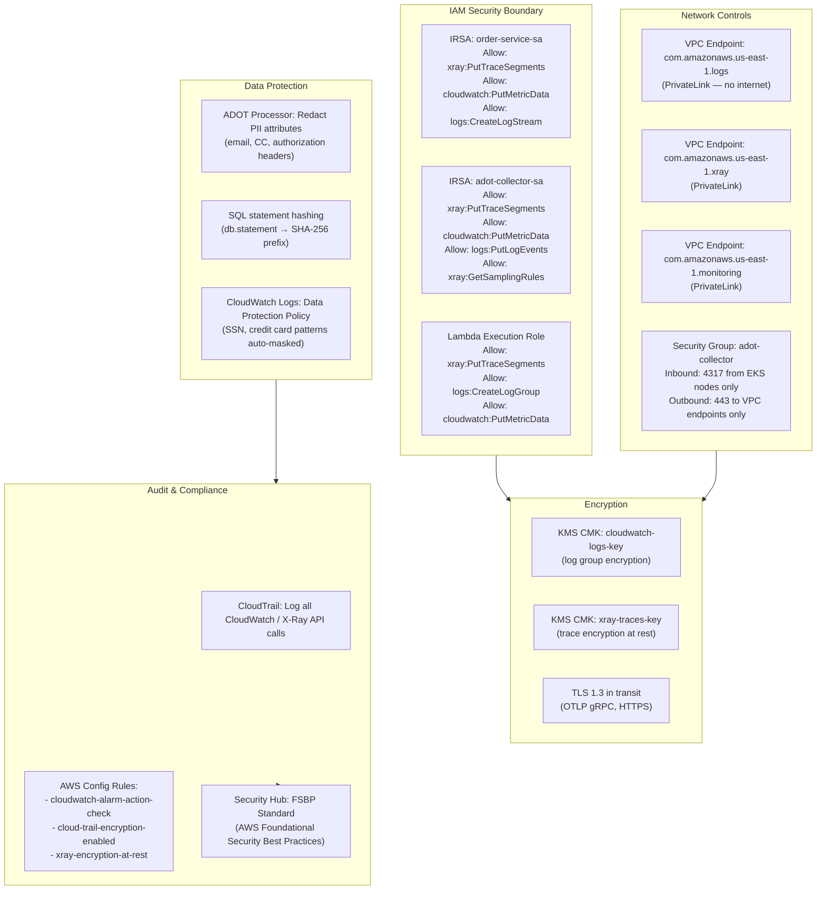

### 6.2 IAM Least-Privilege Policy (Application Pod)

```json
{
  "Version": "2012-10-17",
  "Statement": [
    {
      "Sid": "XRayWrite",
      "Effect": "Allow",
      "Action": [
        "xray:PutTraceSegments",
        "xray:PutTelemetryRecords",
        "xray:GetSamplingRules",
        "xray:GetSamplingTargets"
      ],
      "Resource": "*"
    },
    {
      "Sid": "CloudWatchMetrics",
      "Effect": "Allow",
      "Action": ["cloudwatch:PutMetricData"],
      "Resource": "*",
      "Condition": {
        "StringEquals": {
          "cloudwatch:namespace": [
            "Custom/ECommerce/OrderService",
            "Custom/ECommerce/PaymentService"
          ]
        }
      }
    },
    {
      "Sid": "CloudWatchLogs",
      "Effect": "Allow",
      "Action": [
        "logs:CreateLogStream",
        "logs:PutLogEvents",
        "logs:DescribeLogStreams"
      ],
      "Resource": "arn:aws:logs:us-east-1:123456789012:log-group:/aws/eks/ecommerce/*:*"
    }
  ]
}
```

### 6.3 CloudWatch Logs Data Protection Policy

```json
{
  "Name": "ecommerce-pii-protection",
  "DataIdentifiers": [
    "arn:aws:dataprotection::aws:data-identifier/CreditCardNumber",
    "arn:aws:dataprotection::aws:data-identifier/EmailAddress",
    "arn:aws:dataprotection::aws:data-identifier/USSocialSecurityNumber",
    "arn:aws:dataprotection::aws:data-identifier/IpAddress"
  ],
  "Configuration": {
    "CustomDataIdentifiers": [],
    "ManagedDataIdentifiers": ["CreditCardNumber", "EmailAddress", "USSocialSecurityNumber"]
  },
  "Statement": [
    {
      "Sid": "audit-policy",
      "DataIdentifier": ["CreditCardNumber", "EmailAddress", "USSocialSecurityNumber"],
      "Operation": {
        "Audit": {
          "FindingsDestination": {
            "S3": { "Bucket": "ecommerce-compliance-findings" }
          }
        }
      }
    },
    {
      "Sid": "redact-policy",
      "DataIdentifier": ["CreditCardNumber", "USSocialSecurityNumber"],
      "Operation": { "Deidentify": { "MaskConfig": {} } }
    }
  ]
}
```

---

## 7. Multi-AZ Design

### 7.1 Multi-AZ Observability Topology

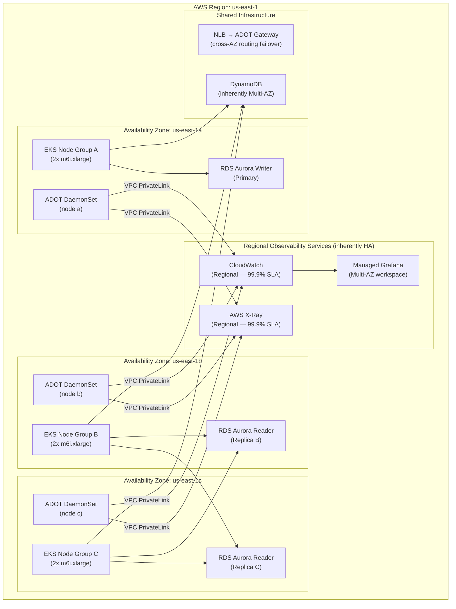

### 7.2 ADOT Collector High Availability Configuration

```yaml
# adot-daemonset.yaml — ensures one collector per node
apiVersion: apps/v1
kind: DaemonSet
metadata:
  name: adot-collector
  namespace: amazon-metrics
spec:
  selector:
    matchLabels:
      app: adot-collector
  template:
    metadata:
      labels:
        app: adot-collector
    spec:
      serviceAccountName: adot-collector-sa
      tolerations:
        - key: node-role.kubernetes.io/master
          effect: NoSchedule
      containers:
        - name: adot-collector
          image: public.ecr.aws/aws-observability/aws-otel-collector:latest
          resources:
            requests:
              cpu: "100m"
              memory: "256Mi"
            limits:
              cpu: "500m"
              memory: "512Mi"
          livenessProbe:
            httpGet:
              path: /
              port: 13133
            initialDelaySeconds: 30
            periodSeconds: 10
          readinessProbe:
            httpGet:
              path: /
              port: 13133
            initialDelaySeconds: 10
```

---

## 8. High Availability Considerations

### 8.1 Observability Resilience Design

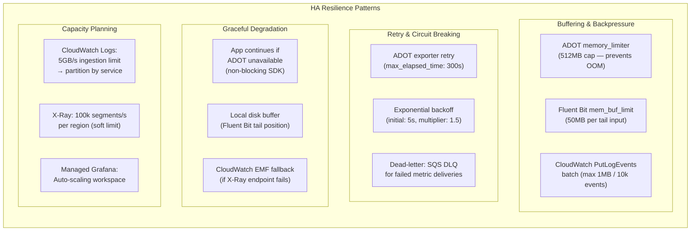

### 8.2 Observability Component SLA Matrix

| Component | AWS SLA | Recovery Approach | Data Loss Tolerance |
|---|---|---|---|
| CloudWatch Logs | 99.9% | Regional service — auto-HA | None (persistent) |
| CloudWatch Metrics | 99.9% | Regional service — auto-HA | 1-minute granularity gap |
| AWS X-Ray | 99.9% | Regional service — auto-HA | Sampled traces (acceptable) |
| ADOT DaemonSet | Per-node | DaemonSet restart policy + liveness | < 60s buffer during restart |
| Managed Grafana | 99.9% | Multi-AZ workspace | Dashboards are stateless config |
| Fluent Bit | Per-pod | DaemonSet + tail position file | Logs from crash window |
| RUM | CloudFront-backed | Global CDN delivery | Beacon loss < 1% |

### 8.3 Chaos Engineering Scenarios

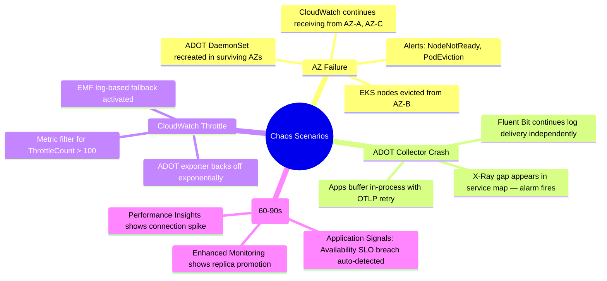

---

## 9. AWS Well-Architected Best Practices

### 9.1 Operational Excellence Pillar

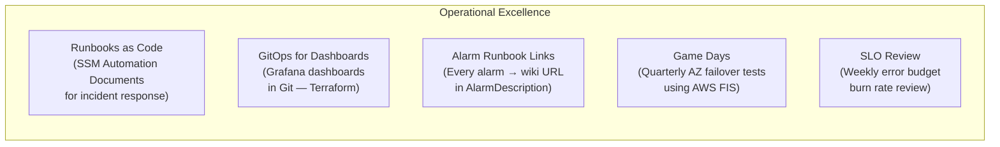

| Practice | Implementation |
|---|---|
| Define operations as code | ADOT config, Grafana dashboards, alarms via Terraform IaC |
| Annotate deployments | EventBridge → CloudWatch Annotations on every EKS deploy |
| Incremental change | Blue/green EKS deployments with automatic SLO rollback |
| Anticipate failure | Composite alarms + runbook automation (SSM OpsItems) |
| Learn from all operational events | Post-incident reviews → CloudWatch Insights queries saved |

### 9.2 Reliability Pillar

| Practice | Implementation |
|---|---|
| Monitor all layers | React (RUM) → API GW → ALB → EKS → Lambda → RDS — full coverage |
| Multi-AZ collector deployment | ADOT DaemonSet across all 3 AZs |
| Dead-letter queue for alerts | SNS DLQ for undelivered alarm notifications |
| Health checks | EKS liveness/readiness probes → ADOT health endpoint monitored |
| Tested disaster recovery | Quarterly GameDays with AWS FIS — inject ADOT pod failures |

### 9.3 Security Pillar

| Practice | Implementation |
|---|---|
| Least-privilege IAM | IRSA per service — scoped to specific CW namespaces |
| No credentials in code | All SDK auth via IRSA (EKS) / Lambda execution role |
| Encrypt data at rest | KMS CMKs for CloudWatch Logs + X-Ray traces |
| Encrypt data in transit | TLS 1.3 for all OTLP traffic + HTTPS for CloudWatch APIs |
| PII protection | CW Logs Data Protection Policy + ADOT attribute redaction |
| Network isolation | VPC PrivateLink endpoints — observability data never traverses internet |
| Audit all API calls | CloudTrail + Security Hub FSBP standard |

### 9.4 Performance Efficiency Pillar

| Practice | Implementation |
|---|---|
| Right-size collectors | ADOT: 100m CPU / 256Mi memory requests — tuned per node capacity |
| Efficient log filtering | Fluent Bit `grep` filter — drop debug logs in production |
| Sampling at the edge | X-Ray rules: 5% default, 100% for payments/errors |
| Metric cardinality control | ADOT dimension_rollup — avoid high-cardinality label explosions |
| CloudWatch Logs Insights | Use query caching + scoped log group queries |
| EMF over API calls | CloudWatch Embedded Metric Format — batch metrics via logs |

### 9.5 Cost Optimization Pillar

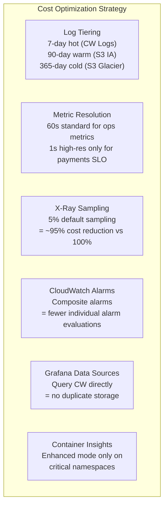

| Cost Lever | Estimated Saving |
|---|---|
| Log retention lifecycle (S3 tiering) | 60–75% vs indefinite CW retention |
| X-Ray 5% sampling (vs 100%) | ~95% trace cost reduction |
| Standard vs high-res metrics (60s default) | 70% metric cost reduction |
| Fluent Bit log filtering (drop DEBUG) | 30–50% log volume reduction |
| EMF batched metric delivery | Eliminates separate PutMetricData API calls |

### 9.6 Sustainability Pillar

| Practice | Implementation |
|---|---|
| Right-size ADOT collectors | DaemonSet resource limits prevent idle CPU waste |
| Aggregate metrics over time | Use CloudWatch metric math instead of raw high-frequency data |
| Delete unused dashboards | Monthly Grafana dashboard audit — auto-delete stale (90d no view) |
| Compress log data | Fluent Bit gzip compression before S3 archive |
| Spot instances for non-critical nodes | EKS node group with Spot for ADOT/Grafana workloads |

---

## Architecture Decision Records (ADRs)

### ADR-001: ADOT DaemonSet vs Sidecar
- **Decision**: DaemonSet collector per node
- **Rationale**: Lower resource overhead (1 collector per node vs 1 per pod). Sidecar used only for services requiring isolated sampling (Payment Service)
- **Trade-off**: Shared collector = single point of failure per node (mitigated by DaemonSet restart policy)

### ADR-002: Fluent Bit over CloudWatch Agent for Log Collection
- **Decision**: Fluent Bit DaemonSet as primary log forwarder
- **Rationale**: 10x lower memory footprint than CW Agent. Native Kubernetes metadata enrichment. CloudWatch Agent retained for node-level host metrics
- **Trade-off**: Two agents per node — mitigated by strict resource limits

### ADR-003: Application Signals for SLO Management
- **Decision**: CloudWatch Application Signals as SLO engine (not Prometheus Rules)
- **Rationale**: Native AWS integration, no additional infrastructure. Auto-discovers EKS services via ADOT. Integrated error budget burn alerting
- **Trade-off**: AWS-proprietary SLO format — lower portability than OpenSLO

### ADR-004: Managed Grafana over Self-Hosted
- **Decision**: Amazon Managed Grafana
- **Rationale**: IAM-native authentication (no Grafana user management), Multi-AZ by default, CloudWatch datasource pre-configured, SSO via IAM Identity Center
- **Trade-off**: Higher cost than self-hosted — justified by zero-ops overhead

---

## Operational Runbook: Critical Alert Response

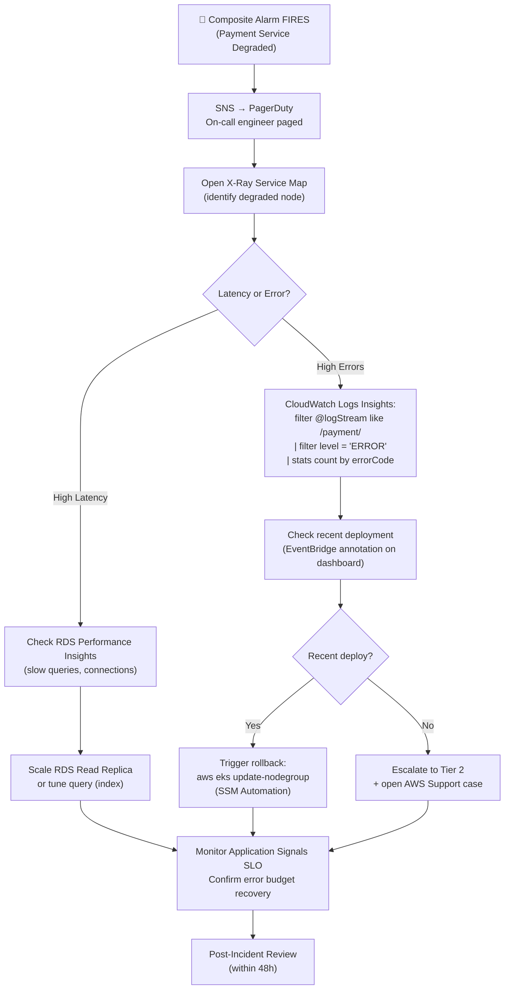

---

*Architecture designed following AWS Well-Architected Framework 2026 edition. All resource limits and SLAs subject to AWS regional service quotas.*
