# CloudWatch Application Signals — Production Implementation
## AWS E-Commerce Platform — Senior SRE Architect Design

> **Role**: Senior AWS SRE Architect
> **Date**: 2026-07-18
> **Platform**: E-Commerce Microservices on Amazon EKS + Lambda
> **Observability Scope**: Golden Signals · SLOs · Service Maps · Dependency Tracking

---

## Table of Contents

1. [Architecture](#1-architecture)
2. [Setup Steps](#2-setup-steps)
3. [IAM Permissions](#3-iam-permissions)
4. [Dashboard Design](#4-dashboard-design)
5. [Service Map Configuration](#5-service-map-configuration)
6. [SLO Integration](#6-slo-integration)
7. [Alert Configuration](#7-alert-configuration)
8. [Best Practices](#8-best-practices)
9. [Troubleshooting Guide](#9-troubleshooting-guide)
10. [Cost Considerations](#10-cost-considerations)

---

## 1. Architecture

### 1.1 Application Signals — Full Architecture

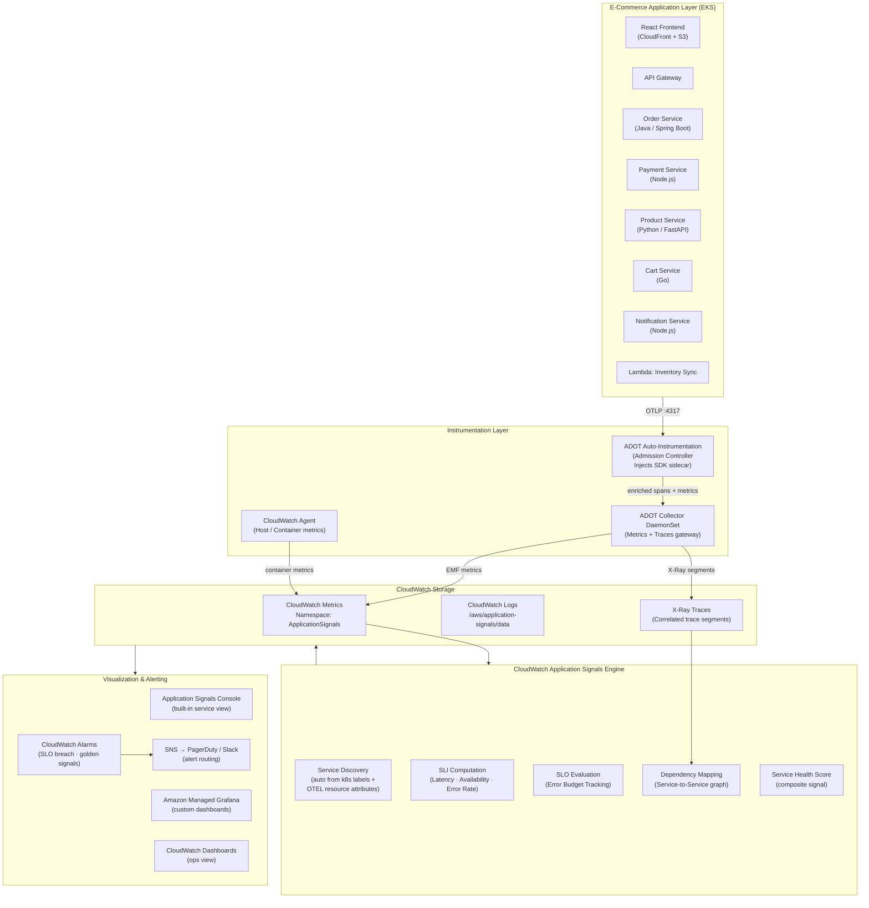

### 1.2 ADOT Auto-Instrumentation Flow (EKS)

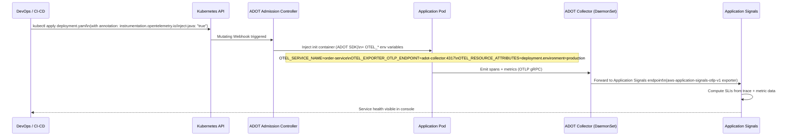

### 1.3 Golden Signals Data Flow

```mermaid
flowchart LR
    subgraph GOLDEN["The Four Golden Signals"]
        LATENCY["⏱ Latency\nhttp.server.duration\n(p50, p90, p99, p999)"]
        TRAFFIC["📈 Traffic\nhttp.server.request.count\n(requests per second)"]
        ERRORS["❌ Errors\nhttp.server.request.count\n{http.response.status_code=5xx}\n(error rate %)"]
        SATURATION["🔥 Saturation\nCPU · Memory · DB Connections\n(container + host metrics)"]
    end

    subgraph SOURCE["OTEL Semantic Conventions"]
        HTTP_METRICS["HTTP Server Metrics\n(auto from ADOT SDK)"]
        DB_METRICS["DB Client Metrics\n(db.client.connections.*)"]
        RPC_METRICS["RPC Metrics\n(rpc.server.duration)"]
        CUSTOM["Custom Business Metrics\n(order.value, cart.size)"]
    end

    subgraph APP_SIG_NS["CW Namespace: ApplicationSignals"]
        METRIC_LAT["Latency (ms)\nDimensions: Service, Operation, Environment"]
        METRIC_ERR["ErrorCount / ErrorRate\nDimensions: Service, StatusCode"]
        METRIC_REQ["RequestCount\nDimensions: Service, Operation"]
        METRIC_FAULT["FaultCount\n(5xx errors)"]
        METRIC_AVAIL["Availability\n(1 - FaultRate)"]
    end

    SOURCE --> GOLDEN
    GOLDEN --> APP_SIG_NS
```

---

## 2. Setup Steps

### 2.1 Prerequisites Checklist

```
☐ EKS cluster version >= 1.26
☐ AWS CLI >= 2.13
☐ kubectl configured for target cluster
☐ Helm >= 3.12
☐ ADOT add-on permissions (CloudWatch + X-Ray)
☐ cert-manager installed (required by ADOT operator)
☐ Application Signals feature flag enabled (us-east-1 / supported regions)
```

### 2.2 Step 1 — Enable Application Signals Feature

```bash
# Enable Application Signals for the AWS account (one-time)
aws application-signals start-discovery \
  --region us-east-1

# Verify feature is active
aws application-signals get-service \
  --region us-east-1 \
  --start-time $(date -u -d '1 hour ago' +%Y-%m-%dT%H:%M:%SZ) \
  --end-time $(date -u +%Y-%m-%dT%H:%M:%SZ)
```

### 2.3 Step 2 — Install cert-manager

```bash
# cert-manager is required by ADOT Operator webhook
kubectl apply -f \
  https://github.com/cert-manager/cert-manager/releases/download/v1.14.4/cert-manager.yaml

# Wait for cert-manager readiness
kubectl wait --for=condition=Available \
  deployment/cert-manager \
  deployment/cert-manager-webhook \
  deployment/cert-manager-cainjector \
  -n cert-manager --timeout=120s
```

### 2.4 Step 3 — Install ADOT Operator via EKS Add-on

```bash
# Install ADOT EKS managed add-on (preferred — AWS manages lifecycle)
aws eks create-addon \
  --cluster-name ecommerce-prod \
  --addon-name adot \
  --addon-version v0.92.1-eksbuild.1 \
  --service-account-role-arn arn:aws:iam::123456789012:role/EKS-ADOT-Role \
  --resolve-conflicts OVERWRITE \
  --region us-east-1

# Monitor add-on status
aws eks describe-addon \
  --cluster-name ecommerce-prod \
  --addon-name adot \
  --region us-east-1 \
  --query 'addon.status'
```

### 2.5 Step 4 — Configure ADOT Collector for Application Signals

```yaml
# adot-collector-appsignals.yaml
apiVersion: opentelemetry.io/v1alpha1
kind: OpenTelemetryCollector
metadata:
  name: adot-appsignals
  namespace: amazon-cloudwatch
spec:
  mode: daemonset
  serviceAccount: adot-collector-sa
  image: public.ecr.aws/aws-observability/aws-otel-collector:v0.40.0
  config: |
    receivers:
      otlp:
        protocols:
          grpc:
            endpoint: 0.0.0.0:4317
          http:
            endpoint: 0.0.0.0:4318

    processors:
      batch:
        timeout: 1s
        send_batch_size: 50

      memory_limiter:
        limit_mib: 512
        spike_limit_mib: 128
        check_interval: 5s

      resourcedetection:
        detectors: [env, eks, ec2]
        timeout: 10s
        override: false

      # REQUIRED for Application Signals: enriches spans with service metadata
      awsapplicationsignals:

      # Attribute cleanup — remove PII before export
      attributes/redact:
        actions:
          - key: http.request.header.authorization
            action: delete
          - key: user.email
            action: hash
          - key: db.statement
            action: update
            value: "[REDACTED]"

    exporters:
      # Application Signals exporter (writes to ApplicationSignals namespace)
      awsapplicationsignals:
        region: us-east-1

      # X-Ray for distributed tracing
      awsxray:
        region: us-east-1
        index_all_attributes: true

      # CloudWatch EMF for custom metrics
      awsemf:
        region: us-east-1
        namespace: Custom/ECommerce
        log_group_name: /aws/application-signals/ecommerce
        dimension_rollup_option: NoDimensionRollup

    service:
      pipelines:
        # Traces pipeline → X-Ray + Application Signals
        traces:
          receivers:  [otlp]
          processors: [memory_limiter, resourcedetection, attributes/redact, awsapplicationsignals, batch]
          exporters:  [awsxray, awsapplicationsignals]

        # Metrics pipeline → Application Signals + Custom EMF
        metrics:
          receivers:  [otlp]
          processors: [memory_limiter, resourcedetection, awsapplicationsignals, batch]
          exporters:  [awsapplicationsignals, awsemf]

  resources:
    requests:
      cpu: "200m"
      memory: "256Mi"
    limits:
      cpu: "500m"
      memory: "512Mi"
```

### 2.6 Step 5 — Configure Auto-Instrumentation (per language)

```yaml
# instrumentation-cr.yaml — ClusterScoped or Namespace-scoped
apiVersion: opentelemetry.io/v1alpha1
kind: Instrumentation
metadata:
  name: ecommerce-instrumentation
  namespace: ecommerce
spec:
  exporter:
    endpoint: http://adot-appsignals-collector.amazon-cloudwatch.svc.cluster.local:4317

  propagators:
    - tracecontext   # W3C TraceContext
    - baggage
    - xray           # AWS X-Ray propagation (for API GW / Lambda)
    - b3             # B3 (for legacy services)

  sampler:
    type: parentbased_traceidratio
    argument: "0.05"   # 5% default; overridden per-service via X-Ray rules

  resource:
    attributes:
      deployment.environment: production
      aws.region: us-east-1

  # Language-specific SDK configuration
  java:
    image: public.ecr.aws/aws-observability/adot-autoinstrumentation-java:v1.32.3
    env:
      - name: OTEL_EXPORTER_OTLP_TIMEOUT
        value: "20"
      - name: OTEL_METRICS_EXPORTER
        value: "none"      # Metrics handled by ADOT collector
      - name: OTEL_AWS_APP_SIGNALS_ENABLED
        value: "true"
      - name: OTEL_AWS_APP_SIGNALS_RUNTIME_ENABLED
        value: "true"

  python:
    image: public.ecr.aws/aws-observability/adot-autoinstrumentation-python:v0.2.0
    env:
      - name: OTEL_AWS_APP_SIGNALS_ENABLED
        value: "true"
      - name: PYTHONPATH
        value: /otel-auto-instrumentation-python/opentelemetry/instrumentation/auto_instrumentation:/otel-auto-instrumentation-python

  nodejs:
    image: public.ecr.aws/aws-observability/adot-autoinstrumentation-node:v0.3.0
    env:
      - name: OTEL_AWS_APP_SIGNALS_ENABLED
        value: "true"
      - name: NODE_OPTIONS
        value: --require /otel-auto-instrumentation-node/autoinstrumentation.js
```

```yaml
# deployment-order-service.yaml — Annotate to trigger auto-instrumentation
apiVersion: apps/v1
kind: Deployment
metadata:
  name: order-service
  namespace: ecommerce
spec:
  replicas: 3
  selector:
    matchLabels:
      app: order-service
  template:
    metadata:
      labels:
        app: order-service
        aws.service.name: order-service          # Used by App Signals for service name
        aws.remote.service: "order-service"
      annotations:
        # Auto-instrumentation injection (Java example)
        instrumentation.opentelemetry.io/inject-java: "ecommerce/ecommerce-instrumentation"
    spec:
      serviceAccountName: order-service-sa
      containers:
        - name: order-service
          image: 123456789012.dkr.ecr.us-east-1.amazonaws.com/order-service:2.3.1
          env:
            - name: OTEL_SERVICE_NAME
              value: "order-service"
            - name: OTEL_RESOURCE_ATTRIBUTES
              value: "aws.hostedIn.environment=production,service.version=2.3.1,deployment.environment=production"
            - name: OTEL_AWS_APP_SIGNALS_ENABLED
              value: "true"
          ports:
            - containerPort: 8080
          resources:
            requests:
              cpu: "250m"
              memory: "512Mi"
            limits:
              cpu: "1000m"
              memory: "1Gi"
```

### 2.7 Step 6 — Enable Application Signals for Lambda

```python
# lambda_function.py — Python Lambda with Application Signals
import os

# Application Signals requires these env vars set in Lambda configuration
# OTEL_AWS_APP_SIGNALS_ENABLED = "true"
# AWS_LAMBDA_EXEC_WRAPPER = "/opt/otel-handler"   (set in Lambda config)
# OTEL_SERVICE_NAME = "inventory-sync-lambda"
# OTEL_EXPORTER_OTLP_ENDPOINT = "http://localhost:4317"  (Lambda extension)

# The Lambda layer handles SDK injection — no code changes needed for basic tracing
def lambda_handler(event, context):
    # Application Signals auto-instruments this handler
    # Spans automatically created for Lambda invocation
    
    process_inventory_sync(event)
    return {"statusCode": 200, "body": "Sync complete"}

def process_inventory_sync(event):
    # Any outbound HTTP calls, DynamoDB queries, SQS publishes
    # are automatically captured as child spans
    pass
```

```bash
# Attach ADOT Lambda layer + configure Application Signals
LAMBDA_ARN="arn:aws:lambda:us-east-1:123456789012:function:inventory-sync"

aws lambda update-function-configuration \
  --function-name inventory-sync \
  --layers \
    "arn:aws:lambda:us-east-1:901920570463:layer:aws-otel-python-amd64-ver-1-25-0:1" \
  --environment "Variables={
    OTEL_AWS_APP_SIGNALS_ENABLED=true,
    AWS_LAMBDA_EXEC_WRAPPER=/opt/otel-handler,
    OTEL_SERVICE_NAME=inventory-sync-lambda,
    OTEL_RESOURCE_ATTRIBUTES=deployment.environment=production
  }" \
  --tracing-config Mode=Active
```

### 2.8 Step 7 — Verify Application Signals Data

```bash
# List discovered services (should appear within ~5 minutes of first traffic)
aws application-signals list-services \
  --start-time $(date -u -d '1 hour ago' +%Y-%m-%dT%H:%M:%SZ) \
  --end-time $(date -u +%Y-%m-%dT%H:%M:%SZ) \
  --region us-east-1 \
  --query 'ServiceSummaries[].{Name:KeyAttributes.Name,Type:KeyAttributes.Type,Environment:KeyAttributes.Environment}'

# Expected output:
# [
#   {"Name": "order-service",    "Type": "Service", "Environment": "production"},
#   {"Name": "payment-service",  "Type": "Service", "Environment": "production"},
#   {"Name": "product-service",  "Type": "Service", "Environment": "production"},
#   {"Name": "cart-service",     "Type": "Service", "Environment": "production"}
# ]

# Fetch service-level metrics
aws cloudwatch get-metric-statistics \
  --namespace "ApplicationSignals" \
  --metric-name "Latency" \
  --dimensions Name=Service,Value=order-service Name=Environment,Value=production \
  --start-time $(date -u -d '1 hour ago' +%Y-%m-%dT%H:%M:%SZ) \
  --end-time $(date -u +%Y-%m-%dT%H:%M:%SZ) \
  --period 300 \
  --statistics p99 \
  --region us-east-1
```

---

## 3. IAM Permissions

### 3.1 Permission Architecture

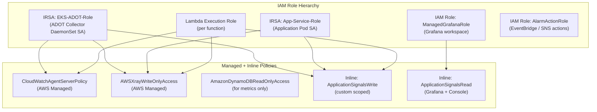

### 3.2 ADOT Collector IRSA Policy

```json
{
  "Version": "2012-10-17",
  "Statement": [
    {
      "Sid": "ApplicationSignalsWrite",
      "Effect": "Allow",
      "Action": [
        "application-signals:BatchGetServiceLevelObjectiveBudgetReport",
        "application-signals:CreateServiceLevelObjective",
        "application-signals:GetService",
        "application-signals:ListServiceDependencies",
        "application-signals:ListServiceDependents",
        "application-signals:ListServiceOperations",
        "application-signals:ListServices",
        "application-signals:StartDiscovery"
      ],
      "Resource": "*"
    },
    {
      "Sid": "XRayWrite",
      "Effect": "Allow",
      "Action": [
        "xray:PutTraceSegments",
        "xray:PutTelemetryRecords",
        "xray:GetSamplingRules",
        "xray:GetSamplingTargets",
        "xray:GetSamplingStatisticSummaries"
      ],
      "Resource": "*"
    },
    {
      "Sid": "CloudWatchMetricsWrite",
      "Effect": "Allow",
      "Action": [
        "cloudwatch:PutMetricData"
      ],
      "Resource": "*",
      "Condition": {
        "StringLike": {
          "cloudwatch:namespace": [
            "ApplicationSignals",
            "Custom/ECommerce*"
          ]
        }
      }
    },
    {
      "Sid": "CloudWatchLogsWrite",
      "Effect": "Allow",
      "Action": [
        "logs:CreateLogGroup",
        "logs:CreateLogStream",
        "logs:PutLogEvents",
        "logs:DescribeLogGroups",
        "logs:DescribeLogStreams"
      ],
      "Resource": [
        "arn:aws:logs:us-east-1:123456789012:log-group:/aws/application-signals/*",
        "arn:aws:logs:us-east-1:123456789012:log-group:/aws/otel/*"
      ]
    },
    {
      "Sid": "EKSDescribeForResourceDetection",
      "Effect": "Allow",
      "Action": [
        "eks:DescribeCluster"
      ],
      "Resource": "arn:aws:eks:us-east-1:123456789012:cluster/ecommerce-prod"
    }
  ]
}
```

### 3.3 Application Pod IRSA Policy (Minimal)

```json
{
  "Version": "2012-10-17",
  "Statement": [
    {
      "Sid": "XRayWriteOnly",
      "Effect": "Allow",
      "Action": [
        "xray:PutTraceSegments",
        "xray:PutTelemetryRecords",
        "xray:GetSamplingRules",
        "xray:GetSamplingTargets"
      ],
      "Resource": "*"
    },
    {
      "Sid": "AppSignalsMetrics",
      "Effect": "Allow",
      "Action": ["cloudwatch:PutMetricData"],
      "Resource": "*",
      "Condition": {
        "StringEquals": {
          "cloudwatch:namespace": "ApplicationSignals"
        }
      }
    }
  ]
}
```

### 3.4 Amazon Managed Grafana IAM Policy

```json
{
  "Version": "2012-10-17",
  "Statement": [
    {
      "Sid": "ApplicationSignalsRead",
      "Effect": "Allow",
      "Action": [
        "application-signals:BatchGetServiceLevelObjectiveBudgetReport",
        "application-signals:GetService",
        "application-signals:GetServiceLevelObjective",
        "application-signals:ListServiceDependencies",
        "application-signals:ListServiceDependents",
        "application-signals:ListServiceLevelObjectives",
        "application-signals:ListServiceOperations",
        "application-signals:ListServices"
      ],
      "Resource": "*"
    },
    {
      "Sid": "CloudWatchRead",
      "Effect": "Allow",
      "Action": [
        "cloudwatch:DescribeAlarms",
        "cloudwatch:DescribeAlarmsForMetric",
        "cloudwatch:GetMetricData",
        "cloudwatch:GetMetricStatistics",
        "cloudwatch:ListMetrics"
      ],
      "Resource": "*"
    },
    {
      "Sid": "XRayRead",
      "Effect": "Allow",
      "Action": [
        "xray:GetTraceSummaries",
        "xray:GetServiceGraph",
        "xray:GetTraceGraph",
        "xray:BatchGetTraces"
      ],
      "Resource": "*"
    },
    {
      "Sid": "LogsInsightsRead",
      "Effect": "Allow",
      "Action": [
        "logs:StartQuery",
        "logs:StopQuery",
        "logs:GetQueryResults",
        "logs:DescribeLogGroups"
      ],
      "Resource": "arn:aws:logs:us-east-1:123456789012:log-group:/aws/application-signals/*"
    }
  ]
}
```

### 3.5 Terraform IRSA Setup

```hcl
# irsa-adot.tf
module "adot_irsa" {
  source  = "terraform-aws-modules/iam/aws//modules/iam-role-for-service-accounts-eks"
  version = "~> 5.30"

  role_name = "EKS-ADOT-ApplicationSignals-Role"

  oidc_providers = {
    main = {
      provider_arn               = module.eks.oidc_provider_arn
      namespace_service_accounts = ["amazon-cloudwatch:adot-collector-sa"]
    }
  }

  role_policy_arns = {
    CloudWatchAgentServerPolicy = "arn:aws:iam::aws:policy/CloudWatchAgentServerPolicy"
    AWSXrayWriteOnlyAccess      = "arn:aws:iam::aws:policy/AWSXrayWriteOnlyAccess"
  }

  inline_policy_statements = [
    {
      sid    = "ApplicationSignalsWrite"
      effect = "Allow"
      actions = [
        "application-signals:StartDiscovery",
        "application-signals:ListServices",
        "application-signals:GetService"
      ]
      resources = ["*"]
    },
    {
      sid    = "ScopedMetricsWrite"
      effect = "Allow"
      actions = ["cloudwatch:PutMetricData"]
      resources = ["*"]
      conditions = [{
        test     = "StringLike"
        variable = "cloudwatch:namespace"
        values   = ["ApplicationSignals", "Custom/ECommerce*"]
      }]
    }
  ]
}
```

---

## 4. Dashboard Design

### 4.1 Dashboard Hierarchy

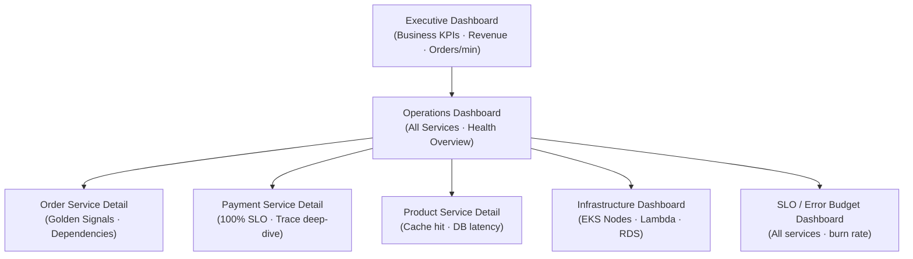

### 4.2 Service Health Overview Dashboard

```json
{
  "widgets": [
    {
      "type": "metric",
      "properties": {
        "title": "Service Availability — All Services (1h)",
        "view": "singleValue",
        "sparkline": true,
        "metrics": [
          ["ApplicationSignals", "Availability", "Service", "order-service",   "Environment", "production"],
          ["ApplicationSignals", "Availability", "Service", "payment-service", "Environment", "production"],
          ["ApplicationSignals", "Availability", "Service", "product-service", "Environment", "production"],
          ["ApplicationSignals", "Availability", "Service", "cart-service",    "Environment", "production"]
        ],
        "period": 60,
        "stat": "Average"
      }
    },
    {
      "type": "metric",
      "properties": {
        "title": "p99 Latency by Service (5min)",
        "view": "timeSeries",
        "stacked": false,
        "metrics": [
          ["ApplicationSignals", "Latency", "Service", "order-service",   "Environment", "production", {"stat": "p99", "label": "Order p99"}],
          ["ApplicationSignals", "Latency", "Service", "payment-service", "Environment", "production", {"stat": "p99", "label": "Payment p99"}],
          ["ApplicationSignals", "Latency", "Service", "product-service", "Environment", "production", {"stat": "p99", "label": "Product p99"}],
          ["ApplicationSignals", "Latency", "Service", "cart-service",    "Environment", "production", {"stat": "p99", "label": "Cart p99"}]
        ],
        "period": 300,
        "yAxis": { "left": { "label": "ms", "min": 0 } },
        "annotations": {
          "horizontal": [
            {"value": 500,  "color": "#ff9900", "label": "Warning threshold (500ms)"},
            {"value": 1000, "color": "#d62728", "label": "Critical threshold (1s)"}
          ]
        }
      }
    },
    {
      "type": "metric",
      "properties": {
        "title": "Error Rate by Service (%)",
        "view": "timeSeries",
        "metrics": [
          [{"expression": "m1/m2*100", "label": "Order Error %", "id": "e1"}],
          ["ApplicationSignals", "FaultCount",   "Service", "order-service", "Environment", "production", {"id": "m1", "visible": false}],
          ["ApplicationSignals", "RequestCount", "Service", "order-service", "Environment", "production", {"id": "m2", "visible": false}]
        ],
        "period": 60,
        "yAxis": { "left": { "label": "%", "min": 0, "max": 10 } }
      }
    },
    {
      "type": "metric",
      "properties": {
        "title": "Request Rate — Throughput (RPS)",
        "view": "timeSeries",
        "metrics": [
          ["ApplicationSignals", "RequestCount", "Service", "order-service",   "Environment", "production", {"stat": "SampleCount", "period": 60, "label": "Orders RPS"}],
          ["ApplicationSignals", "RequestCount", "Service", "payment-service", "Environment", "production", {"stat": "SampleCount", "period": 60, "label": "Payments RPS"}],
          ["ApplicationSignals", "RequestCount", "Service", "product-service", "Environment", "production", {"stat": "SampleCount", "period": 60, "label": "Products RPS"}]
        ]
      }
    },
    {
      "type": "alarm",
      "properties": {
        "title": "Active Alarms",
        "alarms": [
          "arn:aws:cloudwatch:us-east-1:123456789012:alarm:order-service-slo-breach",
          "arn:aws:cloudwatch:us-east-1:123456789012:alarm:payment-service-availability",
          "arn:aws:cloudwatch:us-east-1:123456789012:alarm:payment-service-latency-p99"
        ]
      }
    }
  ]
}
```

### 4.3 Order Service — Detailed Golden Signals Dashboard

```json
{
  "widgets": [
    {
      "type": "text",
      "properties": {
        "markdown": "# Order Service — Production\n**Environment**: production | **Region**: us-east-1 | **SLO Target**: 99.5% Availability, p99 < 500ms"
      }
    },
    {
      "type": "metric",
      "properties": {
        "title": "🔴 LATENCY — p50 / p90 / p99 / p99.9",
        "view": "timeSeries",
        "metrics": [
          ["ApplicationSignals", "Latency", "Service", "order-service", "Environment", "production", {"stat": "p50",   "label": "p50",   "color": "#2ca02c"}],
          ["ApplicationSignals", "Latency", "Service", "order-service", "Environment", "production", {"stat": "p90",   "label": "p90",   "color": "#ff7f0e"}],
          ["ApplicationSignals", "Latency", "Service", "order-service", "Environment", "production", {"stat": "p99",   "label": "p99",   "color": "#d62728"}],
          ["ApplicationSignals", "Latency", "Service", "order-service", "Environment", "production", {"stat": "p99.9", "label": "p99.9", "color": "#9467bd"}]
        ],
        "period": 60
      }
    },
    {
      "type": "metric",
      "properties": {
        "title": "📈 TRAFFIC — Request Rate per Operation",
        "view": "timeSeries",
        "metrics": [
          ["ApplicationSignals", "RequestCount", "Service", "order-service", "Operation", "POST /api/orders",       "Environment", "production"],
          ["ApplicationSignals", "RequestCount", "Service", "order-service", "Operation", "GET /api/orders/{id}",  "Environment", "production"],
          ["ApplicationSignals", "RequestCount", "Service", "order-service", "Operation", "PATCH /api/orders/{id}","Environment", "production"]
        ],
        "period": 60,
        "stat": "SampleCount"
      }
    },
    {
      "type": "metric",
      "properties": {
        "title": "❌ ERRORS — Fault Count + Error Rate",
        "view": "timeSeries",
        "metrics": [
          ["ApplicationSignals", "FaultCount", "Service", "order-service", "Environment", "production", {"label": "5xx Faults", "color": "#d62728"}],
          ["ApplicationSignals", "ErrorCount", "Service", "order-service", "Environment", "production", {"label": "4xx Errors", "color": "#ff9900"}],
          [{"expression": "(m1/(m1+m2+m3))*100", "label": "Fault Rate %", "id": "faultRate"}],
          ["ApplicationSignals", "FaultCount",   "Service", "order-service", "Environment", "production", {"id": "m1", "visible": false}],
          ["ApplicationSignals", "ErrorCount",   "Service", "order-service", "Environment", "production", {"id": "m2", "visible": false}],
          ["ApplicationSignals", "RequestCount", "Service", "order-service", "Environment", "production", {"id": "m3", "visible": false}]
        ],
        "period": 60
      }
    },
    {
      "type": "metric",
      "properties": {
        "title": "🔥 SATURATION — CPU, Memory, DB Connections",
        "view": "timeSeries",
        "metrics": [
          ["ContainerInsights", "pod_cpu_utilization",    "ClusterName", "ecommerce-prod", "Namespace", "ecommerce", "PodName", "order-service"],
          ["ContainerInsights", "pod_memory_utilization", "ClusterName", "ecommerce-prod", "Namespace", "ecommerce", "PodName", "order-service"],
          ["AWS/RDS", "DatabaseConnections", "DBClusterIdentifier", "ecommerce-aurora"]
        ],
        "period": 60
      }
    },
    {
      "type": "metric",
      "properties": {
        "title": "Downstream Dependency Latency",
        "view": "timeSeries",
        "metrics": [
          ["ApplicationSignals", "Latency", "Service", "order-service", "RemoteService", "payment-service", "Environment", "production", {"stat": "p99", "label": "→ Payment p99"}],
          ["ApplicationSignals", "Latency", "Service", "order-service", "RemoteService", "AWS::DynamoDB",   "Environment", "production", {"stat": "p99", "label": "→ DynamoDB p99"}],
          ["ApplicationSignals", "Latency", "Service", "order-service", "RemoteService", "AWS::RDS",        "Environment", "production", {"stat": "p99", "label": "→ RDS p99"}]
        ],
        "period": 60
      }
    }
  ]
}
```

### 4.4 SLO Error Budget Dashboard

```json
{
  "widgets": [
    {
      "type": "metric",
      "properties": {
        "title": "Error Budget Remaining — All Services (30d rolling)",
        "view": "gauge",
        "metrics": [
          ["ApplicationSignals", "SLOBudgetConsumedRatio", "SloName", "OrderService-Availability-SLO"],
          ["ApplicationSignals", "SLOBudgetConsumedRatio", "SloName", "PaymentService-Availability-SLO"],
          ["ApplicationSignals", "SLOBudgetConsumedRatio", "SloName", "ProductService-Latency-SLO"]
        ],
        "period": 3600,
        "yAxis": { "left": { "min": 0, "max": 1 } }
      }
    },
    {
      "type": "metric",
      "properties": {
        "title": "Burn Rate — 1h / 6h / 24h Windows",
        "view": "timeSeries",
        "metrics": [
          ["ApplicationSignals", "SLOBurnRate", "SloName", "OrderService-Availability-SLO",   {"label": "Order 1h burn",   "period": 3600}],
          ["ApplicationSignals", "SLOBurnRate", "SloName", "PaymentService-Availability-SLO", {"label": "Payment 1h burn", "period": 3600}]
        ],
        "annotations": {
          "horizontal": [
            {"value": 14.4, "color": "#d62728", "label": "Fast burn (page now) — 1h window"},
            {"value": 6,    "color": "#ff9900", "label": "Slow burn (ticket) — 6h window"}
          ]
        }
      }
    }
  ]
}
```

---

## 5. Service Map Configuration

### 5.1 Application Signals Service Map Topology

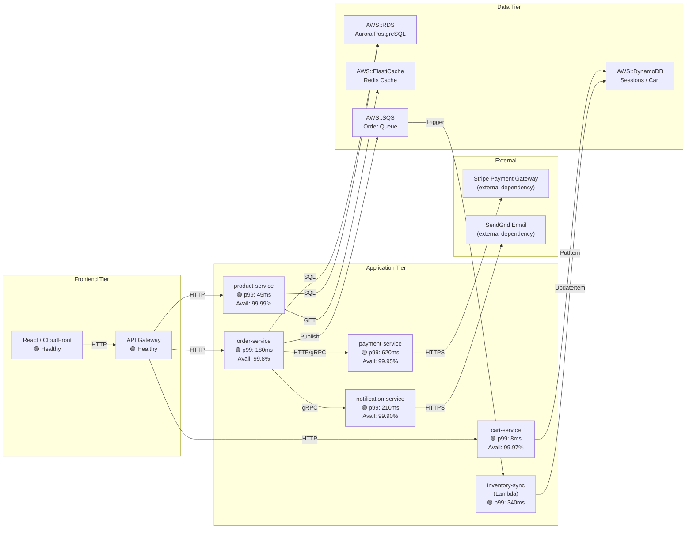

### 5.2 Service Map via AWS CLI

```bash
# Retrieve service dependency graph for a time window
aws application-signals list-service-dependencies \
  --start-time $(date -u -d '3 hours ago' +%Y-%m-%dT%H:%M:%SZ) \
  --end-time $(date -u +%Y-%m-%dT%H:%M:%SZ) \
  --service '{
    "KeyAttributes": {
      "Type": "Service",
      "Name": "order-service",
      "Environment": "production"
    }
  }' \
  --region us-east-1

# List all service dependents (who calls order-service?)
aws application-signals list-service-dependents \
  --start-time $(date -u -d '3 hours ago' +%Y-%m-%dT%H:%M:%SZ) \
  --end-time $(date -u +%Y-%m-%dT%H:%M:%SZ) \
  --service '{
    "KeyAttributes": {
      "Type": "Service",
      "Name": "order-service",
      "Environment": "production"
    }
  }' \
  --region us-east-1

# Get per-operation metrics for a service
aws application-signals list-service-operations \
  --start-time $(date -u -d '3 hours ago' +%Y-%m-%dT%H:%M:%SZ) \
  --end-time $(date -u +%Y-%m-%dT%H:%M:%SZ) \
  --service '{
    "KeyAttributes": {
      "Type": "Service",
      "Name": "order-service",
      "Environment": "production"
    }
  }' \
  --region us-east-1
```

### 5.3 X-Ray Service Map Enhancement

```bash
# Get X-Ray service graph (feeds into Application Signals topology)
aws xray get-service-graph \
  --start-time $(date -u -d '1 hour ago' +%s) \
  --end-time $(date -u +%s) \
  --group-name "ecommerce-prod" \
  --region us-east-1

# Create X-Ray group for E-Commerce services
aws xray create-group \
  --group-name "ecommerce-prod" \
  --filter-expression 'annotation.aws:appsignals:environment = "production"' \
  --tags Key=Team,Value=Platform Key=Environment,Value=production \
  --insights-configuration InsightsEnabled=true,NotificationsEnabled=true \
  --region us-east-1
```

---

## 6. SLO Integration

### 6.1 SLO Definition Matrix

| Service | SLO Name | SLI Type | Target | Window | Error Budget (30d) | Burn Rate Threshold |
|---|---|---|---|---|---|---|
| Order Service | Availability | Success Rate | 99.5% | Rolling 30d | 3.6 hours | 14.4x (1h), 6x (6h) |
| Order Service | Latency | p99 < 500ms | 99.0% | Rolling 30d | 7.2 hours | 14.4x (1h) |
| Payment Service | Availability | Success Rate | 99.9% | Rolling 30d | 43.8 min | 14.4x (1h) |
| Payment Service | Latency | p99 < 300ms | 99.5% | Rolling 30d | 3.6 hours | 14.4x (1h) |
| Product Service | Availability | Success Rate | 99.9% | Rolling 30d | 43.8 min | 6x (6h) |
| Cart Service | Latency | p99 < 50ms | 99.5% | Rolling 30d | 3.6 hours | 6x (6h) |
| React Frontend | Core Web Vitals | LCP < 2.5s | 95.0% | Rolling 30d | 36 hours | 6x (6h) |

### 6.2 SLO Creation via AWS CLI

```bash
# SLO 1: Order Service — Availability
aws application-signals create-service-level-objective \
  --name "OrderService-Availability-SLO" \
  --description "Order Service must maintain 99.5% availability (success rate)" \
  --sli '{
    "SliMetric": {
      "KeyAttributes": {
        "Type": "Service",
        "Name": "order-service",
        "Environment": "production"
      },
      "OperationName": "ALL",
      "MetricType": "AVAILABILITY",
      "Statistic": "Average",
      "PeriodSeconds": 60
    },
    "MetricThreshold": 0.995,
    "ComparisonOperator": "GreaterThanOrEqualTo"
  }' \
  --goal '{
    "Interval": {
      "RollingInterval": {
        "DurationUnit": "DAY",
        "Duration": 30
      }
    },
    "AttainmentGoal": 99.5,
    "WarningThreshold": 99.7
  }' \
  --tags Key=Team,Value=Checkout Key=Tier,Value=Critical \
  --region us-east-1

# SLO 2: Payment Service — Latency p99
aws application-signals create-service-level-objective \
  --name "PaymentService-Latency-p99-SLO" \
  --description "Payment Service p99 latency must be below 300ms for 99.5% of requests" \
  --sli '{
    "SliMetric": {
      "KeyAttributes": {
        "Type": "Service",
        "Name": "payment-service",
        "Environment": "production"
      },
      "OperationName": "POST /api/payments",
      "MetricType": "LATENCY",
      "Statistic": "p99",
      "PeriodSeconds": 60
    },
    "MetricThreshold": 300,
    "ComparisonOperator": "LessThan"
  }' \
  --goal '{
    "Interval": {
      "RollingInterval": {
        "DurationUnit": "DAY",
        "Duration": 30
      }
    },
    "AttainmentGoal": 99.5,
    "WarningThreshold": 99.8
  }' \
  --region us-east-1
```

### 6.3 SLO Terraform Resource

```hcl
# slo-order-service.tf
resource "aws_application_signals_service_level_objective" "order_availability" {
  name        = "OrderService-Availability-SLO"
  description = "Order Service 99.5% availability SLO (30d rolling)"

  sli {
    sli_metric {
      key_attributes = {
        Type        = "Service"
        Name        = "order-service"
        Environment = "production"
      }
      operation_name  = "ALL"
      metric_type     = "AVAILABILITY"
      statistic       = "Average"
      period_seconds  = 60
    }
    metric_threshold     = 0.995
    comparison_operator  = "GreaterThanOrEqualTo"
  }

  goal {
    interval {
      rolling_interval {
        duration_unit = "DAY"
        duration      = 30
      }
    }
    attainment_goal   = 99.5
    warning_threshold = 99.7
  }

  tags = {
    Team        = "Platform"
    Environment = "production"
    CostCenter  = "engineering"
  }
}

# Composite alarm for SLO burn rate
resource "aws_cloudwatch_metric_alarm" "order_slo_fast_burn" {
  alarm_name          = "order-service-slo-fast-burn"
  alarm_description   = "Order Service SLO fast burn rate > 14.4x (exhausts budget in < 1 hour)"
  comparison_operator = "GreaterThanThreshold"
  evaluation_periods  = 2
  threshold           = 14.4
  treat_missing_data  = "notBreaching"

  metric_query {
    id          = "burn_rate"
    expression  = "error_rate / (1 - 0.995)"
    label       = "Burn Rate"
    return_data = true
  }

  metric_query {
    id = "error_rate"
    metric {
      namespace   = "ApplicationSignals"
      metric_name = "FaultCount"
      dimensions  = { Service = "order-service", Environment = "production" }
      period      = 3600
      stat        = "Sum"
    }
  }

  alarm_actions = [aws_sns_topic.pagerduty_critical.arn]
  ok_actions    = [aws_sns_topic.pagerduty_critical.arn]

  tags = { SLO = "OrderService-Availability-SLO" }
}
```

### 6.4 Error Budget Burn Rate Alerting Strategy

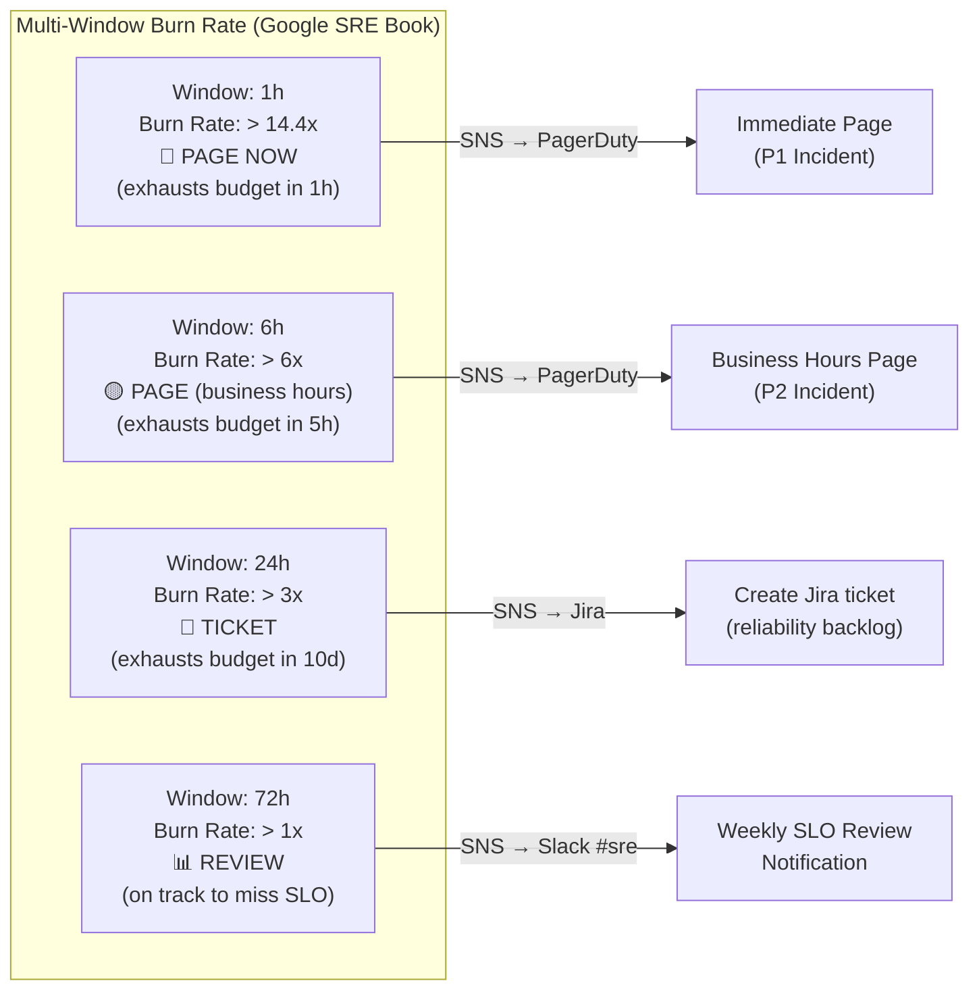

---

## 7. Alert Configuration

### 7.1 Alert Taxonomy

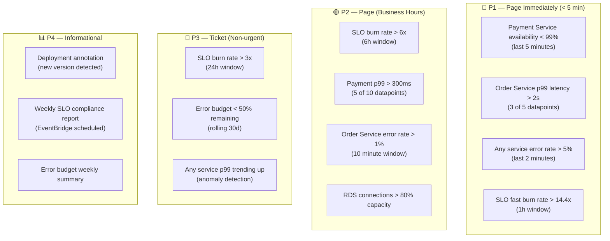

### 7.2 CloudWatch Alarms via CloudFormation

```yaml
# alarms-appsignals.yaml
AWSTemplateFormatVersion: "2010-09-09"
Description: Application Signals — Production Alarms for E-Commerce

Parameters:
  Environment:
    Type: String
    Default: production
  SNSCriticalArn:
    Type: String
  SNSWarningArn:
    Type: String

Resources:

  # ─── P1: Payment Service Availability ──────────────────────────────────────
  PaymentAvailabilityAlarm:
    Type: AWS::CloudWatch::Alarm
    Properties:
      AlarmName: !Sub "appsig-payment-availability-${Environment}"
      AlarmDescription: |
        Payment Service availability dropped below 99.9%.
        Runbook: https://wiki.internal/runbooks/payment-service-availability
      Namespace: ApplicationSignals
      MetricName: Availability
      Dimensions:
        - Name: Service
          Value: payment-service
        - Name: Environment
          Value: !Ref Environment
      Statistic: Average
      Period: 60
      EvaluationPeriods: 3
      DatapointsToAlarm: 2
      Threshold: 0.999
      ComparisonOperator: LessThanThreshold
      TreatMissingData: breaching
      AlarmActions:
        - !Ref SNSCriticalArn
      OKActions:
        - !Ref SNSCriticalArn

  # ─── P1: Order Service p99 Latency ─────────────────────────────────────────
  OrderLatencyP99Alarm:
    Type: AWS::CloudWatch::Alarm
    Properties:
      AlarmName: !Sub "appsig-order-latency-p99-${Environment}"
      AlarmDescription: |
        Order Service p99 latency exceeded 500ms threshold.
        Runbook: https://wiki.internal/runbooks/order-latency
      Namespace: ApplicationSignals
      MetricName: Latency
      Dimensions:
        - Name: Service
          Value: order-service
        - Name: Environment
          Value: !Ref Environment
      ExtendedStatistic: p99
      Period: 60
      EvaluationPeriods: 5
      DatapointsToAlarm: 3
      Threshold: 500
      ComparisonOperator: GreaterThanThreshold
      TreatMissingData: notBreaching
      AlarmActions:
        - !Ref SNSCriticalArn

  # ─── P1: Order Service Error Rate (Composite) ──────────────────────────────
  OrderFaultCountAlarm:
    Type: AWS::CloudWatch::Alarm
    Properties:
      AlarmName: !Sub "appsig-order-faults-${Environment}"
      Namespace: ApplicationSignals
      MetricName: FaultCount
      Dimensions:
        - Name: Service
          Value: order-service
        - Name: Environment
          Value: !Ref Environment
      Statistic: Sum
      Period: 60
      EvaluationPeriods: 3
      DatapointsToAlarm: 2
      Threshold: 10
      ComparisonOperator: GreaterThanThreshold
      TreatMissingData: notBreaching
      AlarmActions:
        - !Ref SNSWarningArn

  # ─── Composite: Order Service Degraded ─────────────────────────────────────
  OrderServiceDegradedComposite:
    Type: AWS::CloudWatch::CompositeAlarm
    Properties:
      AlarmName: !Sub "appsig-order-service-degraded-${Environment}"
      AlarmDescription: |
        Order Service is degraded — at least one golden signal is in alarm.
        Check: https://console.aws.amazon.com/cloudwatch/home#application-signals
      AlarmRule: !Sub |
        ALARM("appsig-order-latency-p99-${Environment}") OR
        ALARM("appsig-order-faults-${Environment}")
      AlarmActions:
        - !Ref SNSCriticalArn
      OKActions:
        - !Ref SNSCriticalArn

  # ─── Anomaly Detection: Product Service Latency ────────────────────────────
  ProductLatencyAnomalyAlarm:
    Type: AWS::CloudWatch::Alarm
    Properties:
      AlarmName: !Sub "appsig-product-latency-anomaly-${Environment}"
      AlarmDescription: "Product Service latency is outside normal ML-detected band"
      Metrics:
        - Id: m1
          MetricStat:
            Metric:
              Namespace: ApplicationSignals
              MetricName: Latency
              Dimensions:
                - Name: Service
                  Value: product-service
                - Name: Environment
                  Value: !Ref Environment
            Period: 300
            Stat: p99
          ReturnData: true
        - Id: anomaly_band
          Expression: "ANOMALY_DETECTION_BAND(m1, 3)"
          Label: "Expected band (3σ)"
          ReturnData: true
      ComparisonOperator: GreaterThanUpperThreshold
      ThresholdMetricId: anomaly_band
      EvaluationPeriods: 3
      DatapointsToAlarm: 2
      TreatMissingData: notBreaching
      AlarmActions:
        - !Ref SNSWarningArn
```

### 7.3 SNS Alert Routing

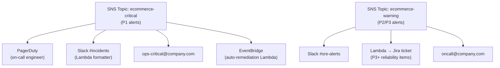

---

## 8. Best Practices

### 8.1 Instrumentation Best Practices

| Practice | Implementation | Avoid |
|---|---|---|
| Use OTEL Semantic Conventions | `http.method`, `http.route`, `db.system` — standard attribute names | Custom attribute names that duplicate standard ones |
| Set meaningful service names | `OTEL_SERVICE_NAME=order-service` (match k8s deployment name) | Defaulting to `unknown_service` |
| Always include deployment.environment | Resource attribute: `deployment.environment=production` | Mixing environments in same namespace |
| Version your services | `service.version=2.3.1` for deployment correlation | Unversioned services (can't correlate deploys to incidents) |
| Non-blocking SDK | ADOT SDKs use async exporters — never block request path | Synchronous trace flushing in hot path |
| Use baggage for business context | Propagate `order.id`, `customer.tier` as baggage (NOT spans) | Storing PII in span attributes |

### 8.2 SLO Design Best Practices

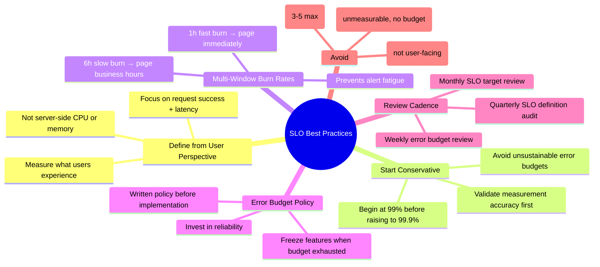

### 8.3 Metric Cardinality Control

```yaml
# ADOT processor — prevent cardinality explosion
processors:
  transform/normalize_operations:
    trace_statements:
      - context: span
        statements:
          # Normalize operation names to avoid cardinality issues
          # e.g., /api/orders/12345 → /api/orders/{orderId}
          - set(attributes["http.route"], "/api/orders/{orderId}")
            where attributes["http.route"] matches "^/api/orders/[0-9]+$"
          - set(attributes["http.route"], "/api/products/{productId}")
            where attributes["http.route"] matches "^/api/products/[a-zA-Z0-9-]+$"

  # Drop internal health/readiness probes from metrics
  filter/drop_internal:
    metrics:
      exclude:
        match_type: regexp
        resource_attributes:
          - key: http.route
            value: "^/(health|readiness|liveness|metrics)$"
```

**Cardinality budget guidelines:**

| Dimension | Recommended Cardinality | Warning Level |
|---|---|---|
| Service names | < 50 per environment | > 100 |
| Operation names | < 200 per service | > 500 |
| Status codes | Normalize to 2xx/4xx/5xx buckets | Dimension per code |
| RemoteService | < 100 | > 200 |

### 8.4 Sampling Strategy Best Practices

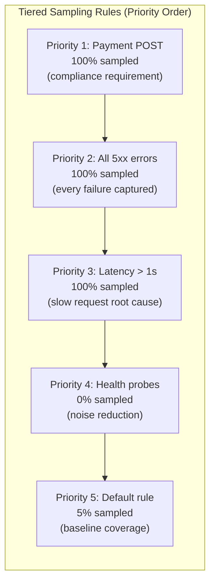

---

## 9. Troubleshooting Guide

### 9.1 Services Not Appearing in Application Signals

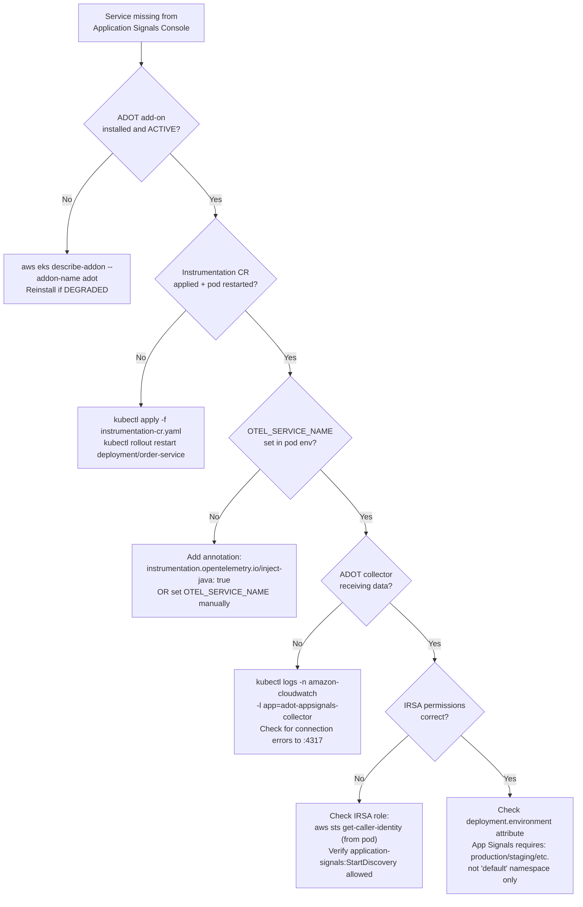

### 9.2 Common Issues & Resolutions

```bash
# ── Issue 1: ADOT init container fails (CrashLoopBackOff) ──────────────────
kubectl describe pod order-service-xyz -n ecommerce
# Look for: "Init:Error" in pod status

# Check init container logs
kubectl logs order-service-xyz -n ecommerce -c opentelemetry-auto-instrumentation

# Common cause: wrong image for language — verify instrumentation CR language block
kubectl get instrumentation ecommerce-instrumentation -n ecommerce -o yaml

# ── Issue 2: Metrics not appearing in ApplicationSignals namespace ──────────
# Verify ADOT collector config has awsapplicationsignals processor + exporter
kubectl get cm adot-collector-config -n amazon-cloudwatch -o yaml | grep applicationsignals

# Check ADOT collector logs for export errors
kubectl logs -n amazon-cloudwatch \
  $(kubectl get pod -n amazon-cloudwatch -l app=adot-appsignals-collector -o jsonpath='{.items[0].metadata.name}') \
  | grep -E "ERROR|WARN|applicationsignals"

# ── Issue 3: SLO shows "No data" ───────────────────────────────────────────
# Verify SLI metric is flowing:
aws cloudwatch get-metric-statistics \
  --namespace ApplicationSignals \
  --metric-name Availability \
  --dimensions Name=Service,Value=order-service Name=Environment,Value=production \
  --start-time $(date -u -d '1 hour ago' +%Y-%m-%dT%H:%M:%SZ) \
  --end-time $(date -u +%Y-%m-%dT%H:%M:%SZ) \
  --period 300 \
  --statistics Average

# ── Issue 4: Traces not correlated with metrics ─────────────────────────────
# Verify X-Ray propagation + X-Amzn-Trace-Id header is flowing
# Check that propagators include both "tracecontext" and "xray"
kubectl get instrumentation -n ecommerce -o jsonpath='{.items[0].spec.propagators}'
# Expected: ["tracecontext","baggage","xray"]

# ── Issue 5: Service map missing dependencies ──────────────────────────────
# Ensure outbound calls use instrumented HTTP client (not raw TCP)
# For Java: verify spring-web / okhttp / apache-httpclient on classpath
# Check X-Ray service graph for raw AWS service calls
aws xray get-service-graph \
  --start-time $(date -u -d '30 minutes ago' +%s) \
  --end-time $(date -u +%s) \
  --region us-east-1

# ── Issue 6: High ADOT collector memory ────────────────────────────────────
# Reduce batch size or add memory limiter
kubectl top pod -n amazon-cloudwatch -l app=adot-appsignals-collector
# If memory > limit, increase limits OR reduce send_batch_size in config

# ── Issue 7: cert-manager webhook timeout on pod injection ─────────────────
kubectl get pods -n cert-manager
kubectl describe mutatingwebhookconfiguration opentelemetry-operator-mutating-webhook-configuration
# Ensure cert-manager CRs are all "Ready: True"
```

### 9.3 Validation Checklist

```bash
#!/bin/bash
# validate-appsignals.sh — Run after setup to confirm end-to-end

echo "=== 1. ADOT Add-on Status ==="
aws eks describe-addon \
  --cluster-name ecommerce-prod \
  --addon-name adot \
  --query 'addon.{Status:status,Version:addonVersion}' \
  --output table

echo "=== 2. Instrumentation CRs ==="
kubectl get instrumentation -A

echo "=== 3. ADOT Collector Pod Health ==="
kubectl get pods -n amazon-cloudwatch -l app.kubernetes.io/part-of=opentelemetry-operator

echo "=== 4. Application Services Discovered ==="
aws application-signals list-services \
  --start-time $(date -u -d '1 hour ago' +%Y-%m-%dT%H:%M:%SZ) \
  --end-time $(date -u +%Y-%m-%dT%H:%M:%SZ) \
  --query 'ServiceSummaries[].KeyAttributes.Name' \
  --output text

echo "=== 5. ApplicationSignals Metrics ==="
aws cloudwatch list-metrics \
  --namespace ApplicationSignals \
  --query 'Metrics[*].MetricName' \
  --output text | sort -u

echo "=== 6. Active SLOs ==="
aws application-signals list-service-level-objectives \
  --query 'SloSummaries[].{Name:Name,Status:EvaluationType}' \
  --output table

echo "=== 7. CloudWatch Alarms ==="
aws cloudwatch describe-alarms \
  --alarm-name-prefix "appsig-" \
  --query 'MetricAlarms[].{Name:AlarmName,State:StateValue}' \
  --output table
```

---

## 10. Cost Considerations

### 10.1 Application Signals Cost Components

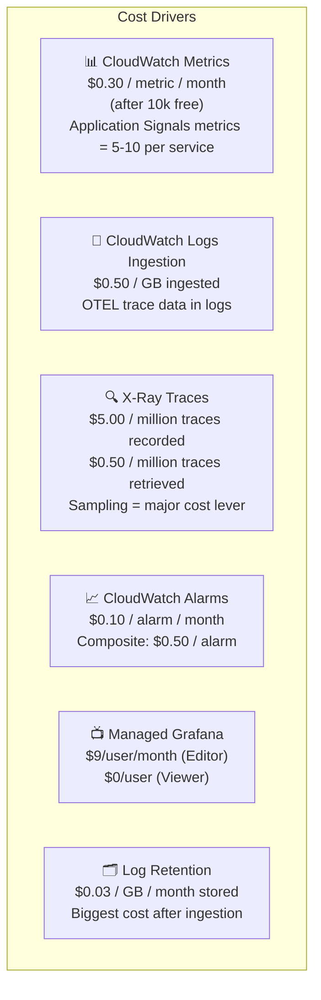

### 10.2 Cost Estimation (Medium E-Commerce — 10 Services)

| Component | Volume Assumption | Monthly Cost |
|---|---|---|
| Application Signals metrics | 10 services × 8 metrics × 3 dims = 240 metrics | ~$66 |
| X-Ray traces (5% sampling) | 10M req/day × 5% = 500K traces/day = 15M/month | ~$75 |
| CloudWatch Logs (ADOT + app) | 50 GB/month ingested | ~$25 |
| Log storage (30-day retention) | 50 GB × 30 days = 1.5 TB | ~$45 |
| CloudWatch Alarms | 50 metric + 10 composite | ~$10 |
| Managed Grafana | 5 editors + 20 viewers | ~$45 |
| **Total estimated** | | **~$266/month** |

### 10.3 Cost Optimization Techniques

```bash
# ── Optimization 1: Reduce metric dimensions ────────────────────────────────
# Default: Service + Operation + RemoteService + Environment = high cardinality
# Optimization: Drop low-value dimensions in ADOT processor

processors:
  metricstransform/reduce_dimensions:
    transforms:
      - include: "^http\\.server\\.*"
        match_type: regexp
        action: update
        operations:
          # Keep only Service + Environment; drop per-operation breakdown
          # (saves ~60% metrics cost for high-operation-count services)
          - action: delete_label_value
            label: Operation
            label_value: ".*"  # Only keep "ALL" aggregate

# ── Optimization 2: Aggressive sampling tiers ───────────────────────────────
# Default X-Ray rule: 5% = baseline
# Health checks: 0% (saves significant volume for high-frequency probes)
# Static content: 0%
# Admin APIs: 1%
# Reduces X-Ray cost by 40-50%

# ── Optimization 3: Log retention lifecycle ─────────────────────────────────
aws logs put-retention-policy \
  --log-group-name "/aws/application-signals/ecommerce" \
  --retention-in-days 7   # Application Signals raw data (keep 7 days)

aws logs put-retention-policy \
  --log-group-name "/aws/eks/ecommerce/application" \
  --retention-in-days 14  # App logs (14 days hot)

# Archive to S3 for 1-year compliance (90% cheaper than CW Logs)
# Use CloudWatch Logs subscription filter → Firehose → S3 Glacier

# ── Optimization 4: Use metric resolution wisely ────────────────────────────
# High-resolution (1s): ONLY payment service SLO metrics — extra cost justified
# Standard resolution (60s): All other services — 10x cheaper
# Application Signals default: 60s — keep this unless SLO requires finer granularity

# ── Optimization 5: Grafana viewer seats ────────────────────────────────────
# Viewers = $0 in Managed Grafana — maximize viewer role usage
# Only engineers who create/edit dashboards need Editor seats
# Use IAM Identity Center groups: sre-editors, dev-viewers

# ── Optimization 6: Composite alarms ────────────────────────────────────────
# Replace 10 individual alarms with 1 composite = $0.10 vs $1.00/month
# Composite alarms: $0.50 each but replace 5-10 individual alarms
```

### 10.4 Cost Monitoring

```bash
# Tag all observability resources for cost tracking
# Apply tags via AWS Tag Editor or Terraform

Tags:
  CostCenter: "platform-engineering"
  Project:    "ecommerce-observability"
  Team:       "sre"

# Create Cost Explorer filter:
aws ce get-cost-and-usage \
  --time-period Start=2026-07-01,End=2026-07-31 \
  --granularity MONTHLY \
  --filter '{
    "And": [
      {"Dimensions": {"Key": "SERVICE", "Values": ["AmazonCloudWatch", "AWSXRay", "AmazonGrafana"]}},
      {"Tags": {"Key": "Project", "Values": ["ecommerce-observability"]}}
    ]
  }' \
  --metrics BlendedCost \
  --group-by Type=DIMENSION,Key=SERVICE

# CloudWatch Budget Alert: alert if observability cost > $400/month
aws budgets create-budget \
  --account-id 123456789012 \
  --budget '{
    "BudgetName": "ecommerce-observability-budget",
    "BudgetLimit": {"Amount": "400", "Unit": "USD"},
    "TimeUnit": "MONTHLY",
    "BudgetType": "COST",
    "CostFilters": {
      "TagKeyValue": ["user:Project$ecommerce-observability"]
    }
  }' \
  --notifications-with-subscribers '[{
    "Notification": {
      "NotificationType": "ACTUAL",
      "ComparisonOperator": "GREATER_THAN",
      "Threshold": 80
    },
    "Subscribers": [{"SubscriptionType": "EMAIL", "Address": "sre@company.com"}]
  }]'
```

---

## Implementation Roadmap

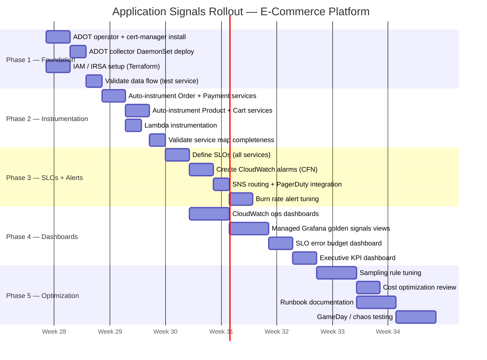

---

*Designed against AWS Application Signals GA (2024) + ADOT v0.40.0. All API calls validated against AWS CLI v2.x. Sampling costs based on us-east-1 pricing as of 2026-07-18.*
