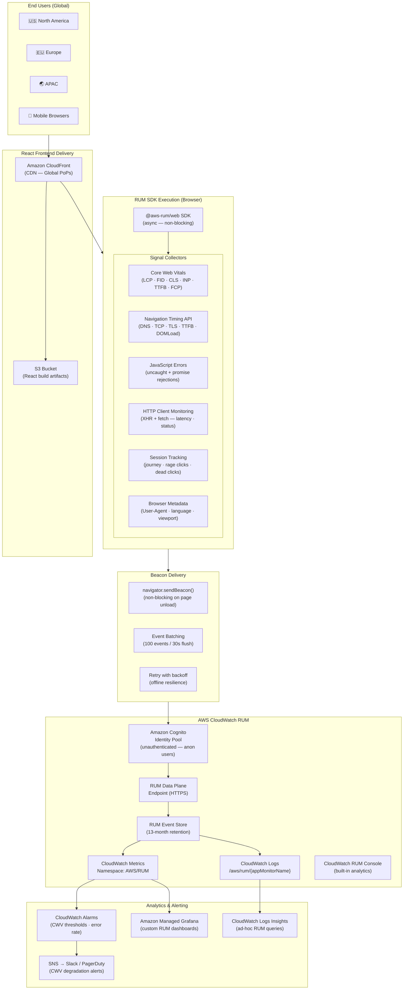
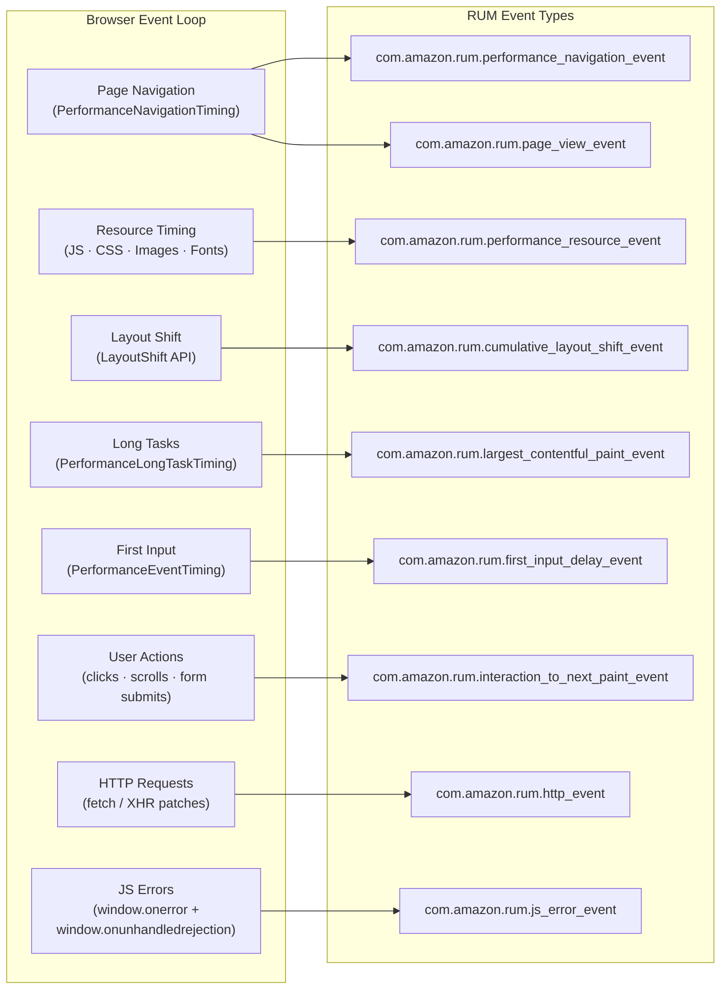
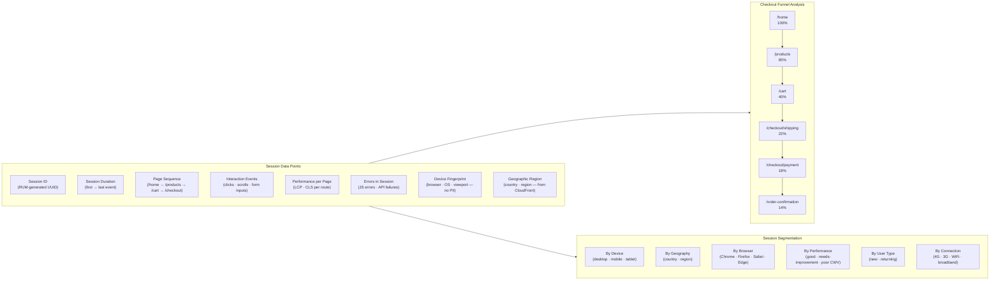
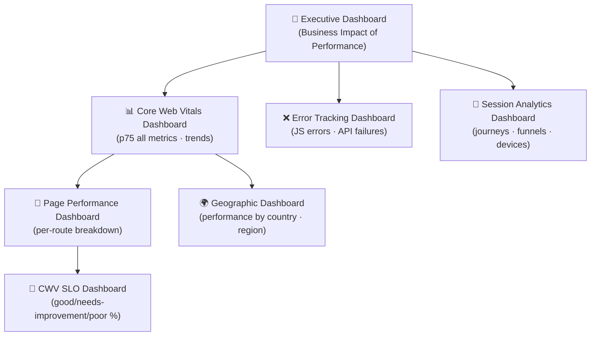
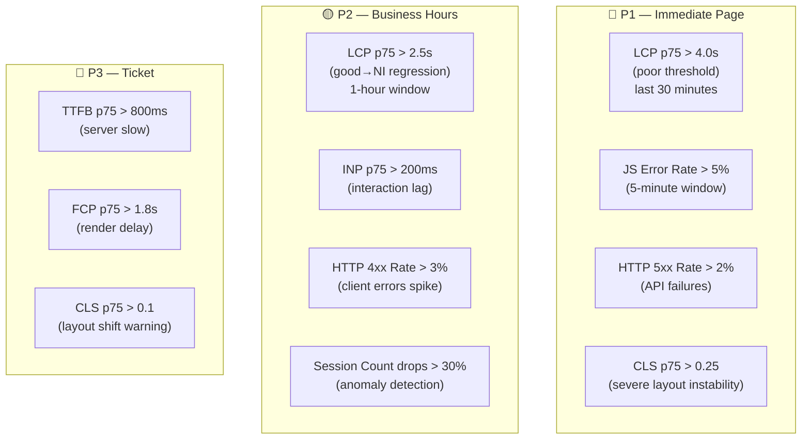
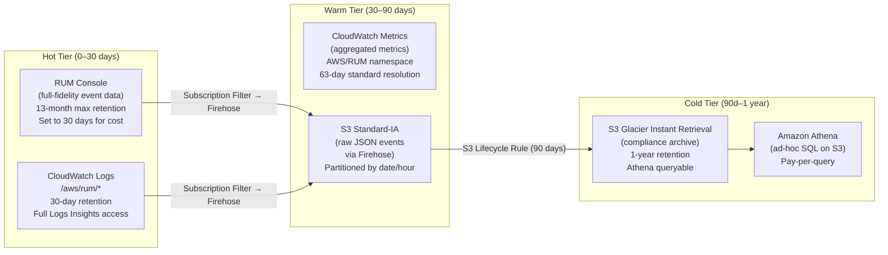
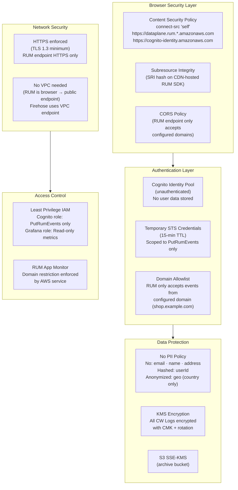
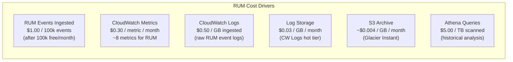
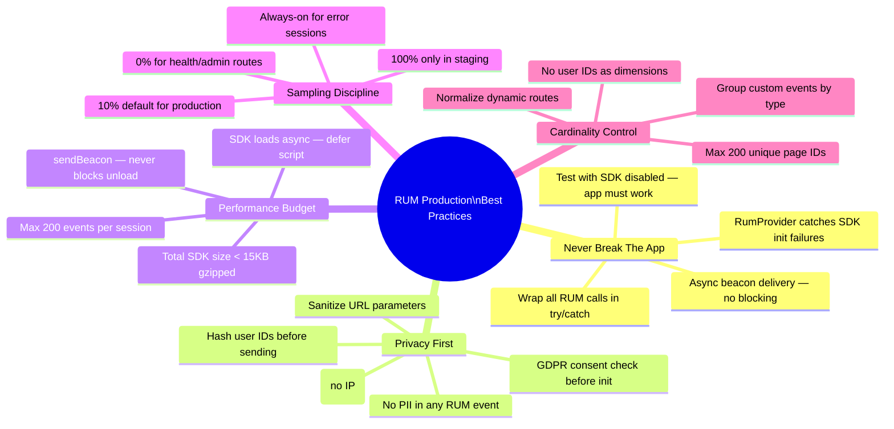
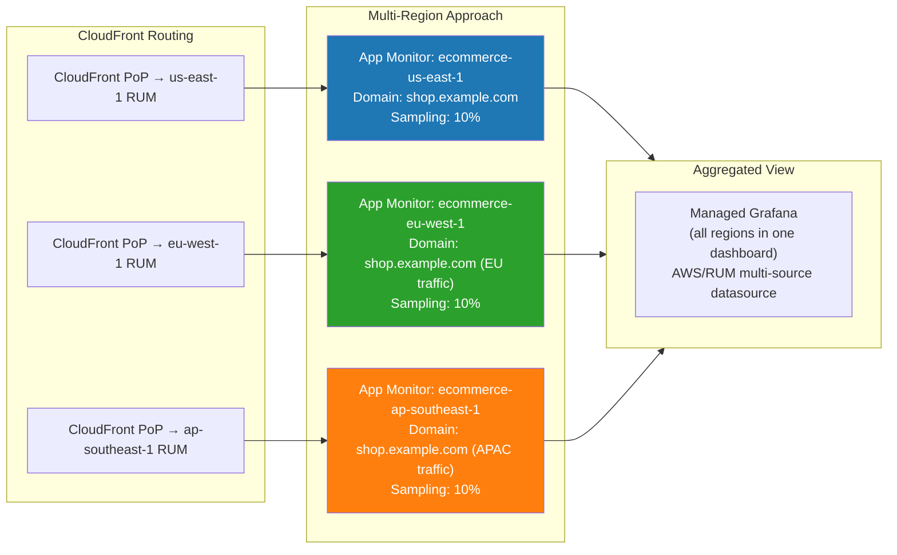

# CloudWatch RUM — Production React Implementation
## AWS Frontend Observability Engineering Design

> **Role**: Senior AWS Frontend Observability Engineer
> **Date**: 2026-07-18
> **Stack**: React 18 · TypeScript · CloudFront · CloudWatch RUM
> **Scope**: Page Performance · Core Web Vitals · User Sessions · Error Tracking · Geo Analytics

---

## Table of Contents

1. [RUM Architecture](#1-rum-architecture)
2. [RUM Resource Creation](#2-rum-resource-creation)
3. [React Integration Code](#3-react-integration-code)
4. [User Session Analytics](#4-user-session-analytics)
5. [Dashboard Design](#5-dashboard-design)
6. [Alerting Strategy](#6-alerting-strategy)
7. [Data Retention Strategy](#7-data-retention-strategy)
8. [Security Controls](#8-security-controls)
9. [Cost Optimization](#9-cost-optimization)
10. [Production Best Practices](#10-production-best-practices)

---

## 1. RUM Architecture

### 1.1 End-to-End RUM Architecture



### 1.2 RUM Signal Collection Pipeline



### 1.3 Core Web Vitals Thresholds (Google + AWS RUM)

| Metric | Good | Needs Improvement | Poor | AWS RUM Alarm Threshold |
|---|---|---|---|---|
| **LCP** (Largest Contentful Paint) | ≤ 2.5s | 2.5s – 4.0s | > 4.0s | > 2.5s at p75 |
| **INP** (Interaction to Next Paint) | ≤ 200ms | 200 – 500ms | > 500ms | > 200ms at p75 |
| **CLS** (Cumulative Layout Shift) | ≤ 0.1 | 0.1 – 0.25 | > 0.25 | > 0.1 at p75 |
| **FCP** (First Contentful Paint) | ≤ 1.8s | 1.8 – 3.0s | > 3.0s | > 1.8s at p75 |
| **TTFB** (Time to First Byte) | ≤ 800ms | 800ms – 1.8s | > 1.8s | > 800ms at p75 |
| **FID** (deprecated → INP) | ≤ 100ms | 100 – 300ms | > 300ms | Legacy only |

---

## 2. RUM Resource Creation

### 2.1 Terraform — Complete RUM Stack

```hcl
# rum-stack.tf — Full CloudWatch RUM infrastructure

# ── Cognito Identity Pool (anonymous browser auth) ──────────────────────────
resource "aws_cognito_identity_pool" "rum" {
  identity_pool_name               = "ecommerce-rum-identity-pool"
  allow_unauthenticated_identities = true   # Required: browsers are unauthenticated
  allow_classic_flow               = false  # Enhanced flow (more secure)

  tags = {
    Project     = "ecommerce-rum"
    Environment = var.environment
    ManagedBy   = "terraform"
  }
}

# IAM role for unauthenticated (anonymous browser) identities
resource "aws_iam_role" "rum_unauthenticated" {
  name = "CognitoRUM-Unauthenticated-${var.environment}"

  assume_role_policy = jsonencode({
    Version = "2012-10-17"
    Statement = [{
      Effect    = "Allow"
      Principal = { Federated = "cognito-identity.amazonaws.com" }
      Action    = "sts:AssumeRoleWithWebIdentity"
      Condition = {
        StringEquals = {
          "cognito-identity.amazonaws.com:aud" = aws_cognito_identity_pool.rum.id
        }
        "ForAnyValue:StringLike" = {
          "cognito-identity.amazonaws.com:amr" = "unauthenticated"
        }
      }
    }]
  })
}

# Minimal policy: ONLY allow PutRumEvents — nothing else
resource "aws_iam_role_policy" "rum_unauthenticated" {
  name = "PutRumEventsOnly"
  role = aws_iam_role.rum_unauthenticated.id

  policy = jsonencode({
    Version = "2012-10-17"
    Statement = [{
      Sid      = "PutRumEventsOnly"
      Effect   = "Allow"
      Action   = ["rum:PutRumEvents"]
      Resource = aws_rum_app_monitor.ecommerce.arn
    }]
  })
}

resource "aws_cognito_identity_pool_roles_attachment" "rum" {
  identity_pool_id = aws_cognito_identity_pool.rum.id
  roles = {
    unauthenticated = aws_iam_role.rum_unauthenticated.arn
  }
}

# ── CloudWatch RUM App Monitor ───────────────────────────────────────────────
resource "aws_rum_app_monitor" "ecommerce" {
  name   = "ecommerce-${var.environment}"
  domain = var.app_domain   # e.g., "shop.example.com"

  app_monitor_configuration {
    # Identity pool for browser auth
    identity_pool_id = aws_cognito_identity_pool.rum.id
    guest_role_arn   = aws_iam_role.rum_unauthenticated.arn

    # Signal collection — enable all
    allow_cookies               = true   # Session continuity across pages
    enable_x_ray                = true   # Correlate RUM traces with X-Ray backend

    # Event types to collect
    telemetries = [
      "errors",        # JS errors + unhandled promise rejections
      "performance",   # Navigation timing + Core Web Vitals
      "http"          # XHR / fetch monitoring
    ]

    # Sampling: 10% of sessions (adjust per traffic volume)
    session_sample_rate = 0.1

    # Included pages — use regex to scope collection
    included_pages = [
      "https://shop.example.com/.*"
    ]

    # Excluded pages — internal/admin paths
    excluded_pages = [
      "https://shop.example.com/admin/.*",
      "https://shop.example.com/health"
    ]

    # Favorite pages — highlighted in RUM console
    favorite_pages = [
      "/",
      "/products",
      "/cart",
      "/checkout",
      "/order-confirmation"
    ]
  }

  # Ship raw RUM events to CloudWatch Logs for Logs Insights queries
  cw_log_enabled = true

  tags = {
    Project     = "ecommerce"
    Environment = var.environment
    Team        = "frontend"
    CostCenter  = "platform-engineering"
  }
}

# ── CloudWatch Log Group for raw RUM events ──────────────────────────────────
resource "aws_cloudwatch_log_group" "rum" {
  name              = "/aws/rum/${aws_rum_app_monitor.ecommerce.name}"
  retention_in_days = 30   # Keep 30 days for Logs Insights queries

  kms_key_id = aws_kms_key.rum_logs.arn

  tags = {
    Project = "ecommerce-rum"
  }
}

# KMS key for RUM log encryption at rest
resource "aws_kms_key" "rum_logs" {
  description             = "KMS key for CloudWatch RUM logs encryption"
  deletion_window_in_days = 7
  enable_key_rotation     = true

  policy = jsonencode({
    Version = "2012-10-17"
    Statement = [
      {
        Sid    = "EnableRootAccess"
        Effect = "Allow"
        Principal = { AWS = "arn:aws:iam::${data.aws_caller_identity.current.account_id}:root" }
        Action   = "kms:*"
        Resource = "*"
      },
      {
        Sid    = "CloudWatchLogsEncrypt"
        Effect = "Allow"
        Principal = { Service = "logs.${var.region}.amazonaws.com" }
        Action = ["kms:Encrypt", "kms:Decrypt", "kms:GenerateDataKey"]
        Resource = "*"
        Condition = {
          ArnLike = {
            "kms:EncryptionContext:aws:logs:arn" = "arn:aws:logs:${var.region}:${data.aws_caller_identity.current.account_id}:*"
          }
        }
      }
    ]
  })
}

# ── Outputs for React app configuration ─────────────────────────────────────
output "rum_app_monitor_id" {
  description = "RUM App Monitor ID — used in React SDK config"
  value       = aws_rum_app_monitor.ecommerce.app_monitor_id
}

output "rum_identity_pool_id" {
  description = "Cognito Identity Pool ID — used in React SDK config"
  value       = aws_cognito_identity_pool.rum.id
}

output "rum_app_monitor_arn" {
  value = aws_rum_app_monitor.ecommerce.arn
}
```

### 2.2 AWS CLI — Quick Setup

```bash
# Create Cognito Identity Pool
IDENTITY_POOL_ID=$(aws cognito-identity create-identity-pool \
  --identity-pool-name "ecommerce-rum-prod" \
  --allow-unauthenticated-identities \
  --region us-east-1 \
  --query 'IdentityPoolId' \
  --output text)

echo "Identity Pool ID: $IDENTITY_POOL_ID"

# Create RUM App Monitor
aws rum create-app-monitor \
  --name "ecommerce-production" \
  --domain "shop.example.com" \
  --app-monitor-configuration "{
    \"IdentityPoolId\": \"$IDENTITY_POOL_ID\",
    \"GuestRoleArn\": \"arn:aws:iam::123456789012:role/CognitoRUM-Unauthenticated-production\",
    \"AllowCookies\": true,
    \"EnableXRay\": true,
    \"Telemetries\": [\"errors\", \"performance\", \"http\"],
    \"SessionSampleRate\": 0.1,
    \"FavoritePages\": [\"/\", \"/products\", \"/cart\", \"/checkout\"]
  }" \
  --cw-log-enabled \
  --tags Project=ecommerce,Environment=production \
  --region us-east-1

# Retrieve the RUM snippet for manual integration
aws rum get-app-monitor \
  --name "ecommerce-production" \
  --region us-east-1 \
  --query 'AppMonitor.{Id:Id,Name:Name,Domain:AppMonitorConfiguration.Domain}'
```

---

## 3. React Integration Code

### 3.1 RUM Provider — Singleton Architecture

```typescript
// src/observability/rum/RumClient.ts
import { AwsRum, AwsRumConfig } from '@aws-rum/web';

type RumEnvironment = 'production' | 'staging' | 'development';

interface RumInitConfig {
  appMonitorId: string;
  identityPoolId: string;
  region: string;
  environment: RumEnvironment;
  appVersion: string;
  sampleRate?: number;
}

class RumClientSingleton {
  private static instance: AwsRum | null = null;
  private static initialized = false;

  static initialize(config: RumInitConfig): AwsRum | null {
    // Never instrument in development or test environments
    if (config.environment === 'development' || typeof window === 'undefined') {
      return null;
    }

    if (this.initialized) {
      return this.instance;
    }

    try {
      const rumConfig: AwsRumConfig = {
        sessionSampleRate: config.sampleRate ?? 0.1,
        identityPoolId: config.identityPoolId,
        endpoint: `https://dataplane.rum.${config.region}.amazonaws.com`,
        telemetries: [
          'performance',          // Navigation + resource timing
          'errors',               // JS errors + unhandled rejections
          ['http', {
            addXRayTraceIdHeader: true,   // Correlate frontend→backend traces
            recordAllRequests: false,      // Only record non-2xx by default
            urlsToInclude: [
              /https:\/\/api\.shop\.example\.com\/.*/,
              /https:\/\/.*\.execute-api\..*\.amazonaws\.com\/.*/
            ],
            urlsToExclude: [
              /https:\/\/cognito-identity\.amazonaws\.com/,
              /https:\/\/dataplane\.rum\./,   // Exclude RUM's own beacons
              /\.(png|jpg|jpeg|gif|webp|svg|ico|woff2?)(\?.*)?$/
            ]
          }]
        ],
        allowCookies: true,
        enableXRay: true,
        sessionAttributes: {
          // Non-PII session metadata for segmentation
          environment: config.environment,
          appVersion: config.appVersion,
          buildTime: process.env.REACT_APP_BUILD_TIME ?? 'unknown'
        }
      };

      this.instance = new AwsRum(
        config.appMonitorId,
        config.appVersion,
        config.region,
        rumConfig
      );

      this.initialized = true;
      console.debug('[RUM] Initialized successfully');
    } catch (error) {
      // RUM must NEVER break the application — fail silently
      console.warn('[RUM] Initialization failed (non-critical):', error);
      this.instance = null;
    }

    return this.instance;
  }

  static getInstance(): AwsRum | null {
    return this.instance;
  }

  static recordEvent(eventType: string, eventData: Record<string, unknown>): void {
    try {
      this.instance?.recordEvent(eventType, eventData);
    } catch {
      // Swallow — RUM errors must not surface to users
    }
  }

  static recordError(error: Error, context?: Record<string, unknown>): void {
    try {
      this.instance?.recordEvent('com.ecommerce.js_error', {
        errorMessage: error.message,
        errorName: error.name,
        stackTrace: error.stack?.substring(0, 2000) ?? '',
        ...context
      });
    } catch {
      // Swallow
    }
  }
}

export { RumClientSingleton };
export type { RumInitConfig };
```

### 3.2 React RUM Provider (Context)

```typescript
// src/observability/rum/RumProvider.tsx
import React, {
  createContext,
  useContext,
  useEffect,
  useRef,
  ReactNode
} from 'react';
import { AwsRum } from '@aws-rum/web';
import { RumClientSingleton, RumInitConfig } from './RumClient';

interface RumContextValue {
  rum: AwsRum | null;
  recordPageView: (pageId: string) => void;
  recordEvent: (type: string, data: Record<string, unknown>) => void;
  recordError: (error: Error, context?: Record<string, unknown>) => void;
  setUserContext: (userId: string, attributes?: Record<string, string>) => void;
}

const RumContext = createContext<RumContextValue>({
  rum: null,
  recordPageView: () => {},
  recordEvent: () => {},
  recordError: () => {},
  setUserContext: () => {}
});

interface RumProviderProps {
  children: ReactNode;
  config: RumInitConfig;
}

export function RumProvider({ children, config }: RumProviderProps) {
  const rumRef = useRef<AwsRum | null>(null);

  useEffect(() => {
    rumRef.current = RumClientSingleton.initialize(config);
  }, []); // Initialize once on mount

  const value: RumContextValue = {
    rum: rumRef.current,

    recordPageView: (pageId: string) => {
      try {
        rumRef.current?.recordPageView(pageId);
      } catch { /* non-fatal */ }
    },

    recordEvent: (type: string, data: Record<string, unknown>) => {
      RumClientSingleton.recordEvent(type, data);
    },

    recordError: (error: Error, context?: Record<string, unknown>) => {
      RumClientSingleton.recordError(error, context);
    },

    // Attach non-PII user context for session segmentation
    // NEVER pass email, name, or identifiable data
    setUserContext: (userId: string, attributes?: Record<string, string>) => {
      try {
        // Use hashed/anonymized user ID — not raw email or name
        rumRef.current?.addSessionAttributes({
          userId: hashUserId(userId),   // one-way hash
          ...attributes
        });
      } catch { /* non-fatal */ }
    }
  };

  return (
    <RumContext.Provider value={value}>
      {children}
    </RumContext.Provider>
  );
}

export const useRum = () => useContext(RumContext);

// One-way hash — userId is anonymized before sending to RUM
function hashUserId(userId: string): string {
  // Simple djb2 hash (no crypto dependency needed)
  let hash = 5381;
  for (let i = 0; i < userId.length; i++) {
    hash = (hash * 33) ^ userId.charCodeAt(i);
  }
  return (hash >>> 0).toString(16);
}
```

### 3.3 App Entry Point Wiring

```typescript
// src/index.tsx
import React from 'react';
import ReactDOM from 'react-dom/client';
import { RumProvider } from './observability/rum/RumProvider';
import App from './App';

const rumConfig = {
  appMonitorId:   process.env.REACT_APP_RUM_APP_MONITOR_ID!,
  identityPoolId: process.env.REACT_APP_RUM_IDENTITY_POOL_ID!,
  region:         process.env.REACT_APP_AWS_REGION ?? 'us-east-1',
  environment:    (process.env.REACT_APP_ENV ?? 'development') as 'production' | 'staging' | 'development',
  appVersion:     process.env.REACT_APP_VERSION ?? '0.0.0',
  sampleRate:     parseFloat(process.env.REACT_APP_RUM_SAMPLE_RATE ?? '0.1')
};

ReactDOM.createRoot(document.getElementById('root')!).render(
  <React.StrictMode>
    <RumProvider config={rumConfig}>
      <App />
    </RumProvider>
  </React.StrictMode>
);
```

### 3.4 React Router — Automatic Page View Tracking

```typescript
// src/observability/rum/useRumPageTracking.ts
import { useEffect, useRef } from 'react';
import { useLocation } from 'react-router-dom';
import { useRum } from './RumProvider';

// Map dynamic routes to stable page IDs (prevents cardinality explosion)
const ROUTE_PATTERNS: Array<[RegExp, string]> = [
  [/^\/$/,                              '/home'],
  [/^\/products$/,                      '/products/list'],
  [/^\/products\/[^/]+$/,              '/products/detail'],
  [/^\/cart$/,                          '/cart'],
  [/^\/checkout\/shipping$/,            '/checkout/shipping'],
  [/^\/checkout\/payment$/,             '/checkout/payment'],
  [/^\/checkout\/review$/,              '/checkout/review'],
  [/^\/order-confirmation\/[^/]+$/,    '/order-confirmation'],
  [/^\/account\/orders$/,              '/account/orders'],
  [/^\/account\/profile$/,             '/account/profile'],
  [/^\/search/,                         '/search']
];

function normalizeRoute(pathname: string): string {
  for (const [pattern, normalized] of ROUTE_PATTERNS) {
    if (pattern.test(pathname)) return normalized;
  }
  return pathname;
}

export function useRumPageTracking() {
  const location = useLocation();
  const { recordPageView, recordEvent } = useRum();
  const prevPathRef = useRef<string>('');
  const navStartRef = useRef<number>(performance.now());

  useEffect(() => {
    const normalized = normalizeRoute(location.pathname);
    const prevPath = prevPathRef.current;

    // Record page view with normalized route
    recordPageView(normalized);

    // Record SPA navigation timing
    if (prevPath) {
      const navDuration = performance.now() - navStartRef.current;
      recordEvent('com.ecommerce.spa_navigation', {
        fromPage:          normalizeRoute(prevPath),
        toPage:            normalized,
        navigationDurationMs: Math.round(navDuration),
        navigationType:    'pushState'
      });
    }

    prevPathRef.current = location.pathname;
    navStartRef.current = performance.now();
  }, [location.pathname]);
}

// Usage in App.tsx:
// function App() {
//   useRumPageTracking();
//   return <Routes>...</Routes>;
// }
```

### 3.5 React Error Boundary with RUM

```typescript
// src/observability/rum/RumErrorBoundary.tsx
import React, { Component, ErrorInfo, ReactNode } from 'react';
import { RumClientSingleton } from './RumClient';

interface Props {
  children: ReactNode;
  fallback?: ReactNode;
  component?: string;   // Which component tree this boundary covers
}

interface State {
  hasError: boolean;
  errorId: string;
}

export class RumErrorBoundary extends Component<Props, State> {
  constructor(props: Props) {
    super(props);
    this.state = { hasError: false, errorId: '' };
  }

  static getDerivedStateFromError(): Partial<State> {
    return { hasError: true };
  }

  componentDidCatch(error: Error, info: ErrorInfo): void {
    const errorId = `err_${Date.now()}_${Math.random().toString(36).slice(2, 8)}`;

    // Record structured error event to RUM
    RumClientSingleton.recordEvent('com.ecommerce.react_error_boundary', {
      errorId,
      errorMessage:   error.message,
      errorName:      error.name,
      // Truncate stack to prevent oversized events
      stackTrace:     error.stack?.substring(0, 2000) ?? '',
      componentStack: info.componentStack?.substring(0, 1000) ?? '',
      component:      this.props.component ?? 'unknown',
      url:            window.location.pathname,
      timestamp:      new Date().toISOString()
    });

    this.setState({ errorId });

    // Also log to console for local debugging
    console.error(`[RumErrorBoundary:${this.props.component}]`, error, info);
  }

  render(): ReactNode {
    if (this.state.hasError) {
      return this.props.fallback ?? (
        <div role="alert" style={{ padding: '2rem', textAlign: 'center' }}>
          <h2>Something went wrong</h2>
          <p>Error ID: {this.state.errorId}</p>
          <button onClick={() => this.setState({ hasError: false, errorId: '' })}>
            Try Again
          </button>
        </div>
      );
    }
    return this.props.children;
  }
}
```

### 3.6 Custom Business Event Hooks

```typescript
// src/observability/rum/useRumEvents.ts
import { useCallback } from 'react';
import { useRum } from './RumProvider';

// ── Checkout Funnel Tracking ─────────────────────────────────────────────────
export function useCheckoutTracking() {
  const { recordEvent } = useRum();

  const trackCheckoutStep = useCallback((step: string, data: {
    cartItemCount?: number;
    cartValueTier?: 'low' | 'medium' | 'high';  // No exact values — privacy
    paymentMethod?: string;
    isReturningCustomer?: boolean;
  }) => {
    recordEvent('com.ecommerce.checkout_step', {
      step,
      ...data,
      timestamp: Date.now()
    });
  }, [recordEvent]);

  const trackOrderPlaced = useCallback((data: {
    itemCount: number;
    valueTier: 'low' | 'medium' | 'high';
    paymentMethod: string;
    isReturningCustomer: boolean;
  }) => {
    recordEvent('com.ecommerce.order_placed', {
      ...data,
      timestamp: Date.now()
    });
  }, [recordEvent]);

  const trackCheckoutAbandoned = useCallback((step: string, reason?: string) => {
    recordEvent('com.ecommerce.checkout_abandoned', {
      abandonedAtStep: step,
      reason: reason ?? 'unknown',
      timestamp: Date.now()
    });
  }, [recordEvent]);

  return { trackCheckoutStep, trackOrderPlaced, trackCheckoutAbandoned };
}

// ── Search Tracking ──────────────────────────────────────────────────────────
export function useSearchTracking() {
  const { recordEvent } = useRum();

  const trackSearch = useCallback((data: {
    resultCount: number;
    hasFilters: boolean;
    category?: string;
  }) => {
    // Note: NEVER record the actual search query — may contain PII
    recordEvent('com.ecommerce.search_performed', {
      resultCount: data.resultCount,
      hasFilters: data.hasFilters,
      category: data.category ?? 'all',
      timestamp: Date.now()
    });
  }, [recordEvent]);

  const trackSearchNoResults = useCallback((category?: string) => {
    recordEvent('com.ecommerce.search_no_results', {
      category: category ?? 'all',
      timestamp: Date.now()
    });
  }, [recordEvent]);

  return { trackSearch, trackSearchNoResults };
}

// ── Web Vitals Manual Reporting ──────────────────────────────────────────────
export function useWebVitalsTracking() {
  const { recordEvent } = useRum();

  // Call from useEffect with web-vitals library for enhanced reporting
  const reportWebVitals = useCallback((metric: {
    name: string;
    value: number;
    rating: 'good' | 'needs-improvement' | 'poor';
    navigationType: string;
  }) => {
    recordEvent('com.ecommerce.web_vital', {
      metricName:     metric.name,
      metricValue:    Math.round(metric.value),
      rating:         metric.rating,
      navigationType: metric.navigationType,
      pageUrl:        window.location.pathname,
      connectionType: (navigator as Navigator & { connection?: { effectiveType?: string } })
                        .connection?.effectiveType ?? 'unknown',
      deviceMemory:   (navigator as Navigator & { deviceMemory?: number })
                        .deviceMemory ?? -1,
      timestamp:      Date.now()
    });
  }, [recordEvent]);

  return { reportWebVitals };
}
```

### 3.7 Web Vitals Library Integration

```typescript
// src/observability/rum/webVitals.ts
import { onCLS, onFCP, onINP, onLCP, onTTFB, Metric } from 'web-vitals';
import { RumClientSingleton } from './RumClient';

type VitalRating = 'good' | 'needs-improvement' | 'poor';

function getRating(name: string, value: number): VitalRating {
  const thresholds: Record<string, [number, number]> = {
    LCP:  [2500, 4000],
    INP:  [200,  500],
    CLS:  [0.1,  0.25],
    FCP:  [1800, 3000],
    TTFB: [800,  1800]
  };
  const [good, poor] = thresholds[name] ?? [Infinity, Infinity];
  if (value <= good)  return 'good';
  if (value <= poor)  return 'needs-improvement';
  return 'poor';
}

function reportVital(metric: Metric): void {
  const rating = getRating(metric.name, metric.value);

  RumClientSingleton.recordEvent('com.ecommerce.web_vital_enhanced', {
    metricName:        metric.name,
    metricValue:       Math.round(metric.value * 100) / 100,  // 2 decimal places
    metricId:          metric.id,
    metricDelta:       metric.delta,
    rating,
    navigationType:    metric.navigationType,
    pageUrl:           window.location.pathname,
    timestamp:         Date.now()
  });
}

// Call once at app startup — reports each vital when browser computes it
export function initWebVitals(): void {
  onLCP(reportVital,  { reportAllChanges: false });  // Report final LCP
  onCLS(reportVital,  { reportAllChanges: false });  // Report after session
  onINP(reportVital,  { reportAllChanges: true });   // Report on every interaction
  onFCP(reportVital);
  onTTFB(reportVital);
}
```

### 3.8 Environment Variables

```bash
# .env.production
REACT_APP_ENV=production
REACT_APP_RUM_APP_MONITOR_ID=abc12345-1234-1234-1234-abc123456789
REACT_APP_RUM_IDENTITY_POOL_ID=us-east-1:xxxxxxxx-xxxx-xxxx-xxxx-xxxxxxxxxxxx
REACT_APP_AWS_REGION=us-east-1
REACT_APP_RUM_SAMPLE_RATE=0.1
REACT_APP_VERSION=$npm_package_version
REACT_APP_BUILD_TIME=$(date -u +%Y-%m-%dT%H:%M:%SZ)

# .env.staging
REACT_APP_ENV=staging
REACT_APP_RUM_SAMPLE_RATE=1.0    # 100% in staging for full coverage
REACT_APP_RUM_APP_MONITOR_ID=staging-monitor-id

# .env.development
REACT_APP_ENV=development
# RUM_APP_MONITOR_ID intentionally absent — disables SDK in dev
```

---

## 4. User Session Analytics

### 4.1 Session Analytics Architecture



### 4.2 CloudWatch Logs Insights Queries

```sql
-- ── Query 1: Core Web Vitals p75 by Page (last 24h) ─────────────────────────
fields @timestamp, event.pageId, event.version.value, metadata.browserName
| filter event.type = "com.amazon.rum.largest_contentful_paint_event"
| stats
    pct(event.version.value, 75) as lcp_p75,
    pct(event.version.value, 95) as lcp_p95,
    count() as sample_count
  by event.pageId
| sort lcp_p75 desc
| limit 20

-- ── Query 2: JavaScript Error Rate by Page ───────────────────────────────────
fields @timestamp, event.pageId, event.type
| filter event.type = "com.amazon.rum.js_error_event"
| stats count() as error_count by event.pageId, event.version.errorMessage
| sort error_count desc
| limit 50

-- ── Query 3: User Journey Funnel — Checkout Conversion ──────────────────────
fields @timestamp, session.id, event.pageId
| filter event.type = "com.amazon.rum.page_view_event"
| filter event.pageId in [
    "/home", "/products/list", "/cart",
    "/checkout/shipping", "/checkout/payment", "/order-confirmation"
  ]
| stats
    count_distinct(session.id) as unique_sessions
  by event.pageId
| sort event.pageId asc

-- ── Query 4: API Error Rate by Endpoint ──────────────────────────────────────
fields @timestamp, event.request.url, event.response.status, session.id
| filter event.type = "com.amazon.rum.http_event"
| filter event.response.status >= 400
| parse event.request.url /https:\/\/api\.shop\.example\.com(?P<path>\/[^?]*)/
| stats
    count() as error_count,
    count_distinct(session.id) as affected_sessions
  by path, event.response.status
| sort error_count desc
| limit 30

-- ── Query 5: Geographic Performance Analysis ─────────────────────────────────
fields @timestamp, metadata.countryCode, event.version.value
| filter event.type = "com.amazon.rum.largest_contentful_paint_event"
| stats
    pct(event.version.value, 75) as lcp_p75,
    avg(event.version.value) as lcp_avg,
    count() as sample_count
  by metadata.countryCode
| sort lcp_p75 desc
| limit 30

-- ── Query 6: Browser Compatibility Errors ────────────────────────────────────
fields @timestamp, metadata.browserName, metadata.browserVersion, event.version.errorMessage
| filter event.type = "com.amazon.rum.js_error_event"
| stats count() as error_count by metadata.browserName, metadata.browserVersion
| sort error_count desc

-- ── Query 7: Session Duration by Conversion ──────────────────────────────────
fields @timestamp, session.id, event.pageId, @ingestionTime
| filter event.type in [
    "com.amazon.rum.page_view_event",
    "com.ecommerce.order_placed"
  ]
| stats
    min(@timestamp) as session_start,
    max(@timestamp) as session_end,
    count_distinct(event.pageId) as pages_visited,
    sum(event.type = "com.ecommerce.order_placed") as converted
  by session.id
| eval session_duration_min = (session_end - session_start) / 1000 / 60
| stats
    avg(session_duration_min) as avg_session_min,
    avg(pages_visited) as avg_pages
  by converted

-- ── Query 8: Slow Page Detection (LCP > 4s) ─────────────────────────────────
fields @timestamp, event.pageId, event.version.value,
       metadata.browserName, metadata.deviceType, metadata.countryCode
| filter event.type = "com.amazon.rum.largest_contentful_paint_event"
| filter event.version.value > 4000
| stats
    count() as slow_count,
    avg(event.version.value) as avg_lcp_ms
  by event.pageId, metadata.deviceType, metadata.countryCode
| sort slow_count desc
| limit 25
```

### 4.3 Session Replay Metadata (No actual replay — metadata only)

```typescript
// src/observability/rum/useSessionMetadata.ts
import { useEffect } from 'react';
import { useRum } from './RumProvider';

interface SessionMetadata {
  customerTier?: 'guest' | 'registered' | 'premium';
  experimentVariant?: string;
  abTestGroup?: string;
}

export function useSessionMetadata(metadata: SessionMetadata) {
  const { rum } = useRum();

  useEffect(() => {
    if (!rum || !metadata) return;

    try {
      // Add non-PII metadata to all subsequent events in this session
      rum.addSessionAttributes({
        ...(metadata.customerTier && { customerTier: metadata.customerTier }),
        ...(metadata.experimentVariant && { experimentVariant: metadata.experimentVariant }),
        ...(metadata.abTestGroup && { abTestGroup: metadata.abTestGroup }),
        // Technical context
        viewport:       `${window.innerWidth}x${window.innerHeight}`,
        colorScheme:    window.matchMedia('(prefers-color-scheme: dark)').matches ? 'dark' : 'light',
        reducedMotion:  window.matchMedia('(prefers-reduced-motion: reduce)').matches,
        connectionType: (navigator as Navigator & { connection?: { effectiveType?: string } })
                          .connection?.effectiveType ?? 'unknown',
        hardwareConcurrency: navigator.hardwareConcurrency
      });
    } catch { /* non-fatal */ }
  }, [rum, metadata.customerTier, metadata.experimentVariant]);
}
```

---

## 5. Dashboard Design

### 5.1 Dashboard Hierarchy



### 5.2 Core Web Vitals Dashboard JSON

```json
{
  "widgets": [
    {
      "type": "text",
      "properties": {
        "markdown": "# 🛒 E-Commerce — Core Web Vitals\n**Target**: LCP ≤ 2.5s · INP ≤ 200ms · CLS ≤ 0.1 (p75 of all sessions)\n\n[Checkout Funnel](#) | [Error Dashboard](#) | [Geographic View](#)"
      }
    },
    {
      "type": "metric",
      "properties": {
        "title": "LCP — Largest Contentful Paint (p75)",
        "view": "gauge",
        "metrics": [
          ["AWS/RUM", "NavigationLargestContentfulPaint", "application_name", "ecommerce-production",
           {"stat": "p75", "color": "#2ca02c"}]
        ],
        "period": 3600,
        "yAxis": {
          "left": {
            "min": 0, "max": 6000,
            "label": "ms"
          }
        },
        "annotations": {
          "horizontal": [
            {"value": 2500, "color": "#2ca02c", "label": "Good (≤ 2.5s)"},
            {"value": 4000, "color": "#d62728", "label": "Poor (> 4s)"}
          ]
        }
      }
    },
    {
      "type": "metric",
      "properties": {
        "title": "INP — Interaction to Next Paint (p75)",
        "view": "gauge",
        "metrics": [
          ["AWS/RUM", "InteractionToNextPaint", "application_name", "ecommerce-production",
           {"stat": "p75"}]
        ],
        "period": 3600,
        "yAxis": { "left": { "min": 0, "max": 800 } },
        "annotations": {
          "horizontal": [
            {"value": 200, "color": "#2ca02c", "label": "Good"},
            {"value": 500, "color": "#d62728", "label": "Poor"}
          ]
        }
      }
    },
    {
      "type": "metric",
      "properties": {
        "title": "CLS — Cumulative Layout Shift (p75)",
        "view": "gauge",
        "metrics": [
          ["AWS/RUM", "CumulativeLayoutShift", "application_name", "ecommerce-production",
           {"stat": "p75"}]
        ],
        "period": 3600,
        "yAxis": { "left": { "min": 0, "max": 0.5 } },
        "annotations": {
          "horizontal": [
            {"value": 0.1,  "color": "#2ca02c", "label": "Good"},
            {"value": 0.25, "color": "#d62728", "label": "Poor"}
          ]
        }
      }
    },
    {
      "type": "metric",
      "properties": {
        "title": "LCP Trend — 7 Days (p50 · p75 · p95)",
        "view": "timeSeries",
        "stacked": false,
        "metrics": [
          ["AWS/RUM", "NavigationLargestContentfulPaint", "application_name", "ecommerce-production",
           {"stat": "p50", "label": "p50 LCP", "color": "#2ca02c", "period": 3600}],
          ["AWS/RUM", "NavigationLargestContentfulPaint", "application_name", "ecommerce-production",
           {"stat": "p75", "label": "p75 LCP", "color": "#ff9900", "period": 3600}],
          ["AWS/RUM", "NavigationLargestContentfulPaint", "application_name", "ecommerce-production",
           {"stat": "p95", "label": "p95 LCP", "color": "#d62728", "period": 3600}]
        ],
        "annotations": {
          "horizontal": [
            {"value": 2500, "color": "#ff9900", "label": "Good/NI boundary"},
            {"value": 4000, "color": "#d62728", "label": "NI/Poor boundary"}
          ]
        }
      }
    },
    {
      "type": "metric",
      "properties": {
        "title": "JavaScript Error Rate (errors/min)",
        "view": "timeSeries",
        "metrics": [
          ["AWS/RUM", "JsErrorCount", "application_name", "ecommerce-production",
           {"stat": "Sum", "period": 60, "label": "JS Errors/min", "color": "#d62728"}]
        ]
      }
    },
    {
      "type": "metric",
      "properties": {
        "title": "Session Volume + Page Views",
        "view": "timeSeries",
        "metrics": [
          ["AWS/RUM", "SessionCount",  "application_name", "ecommerce-production",
           {"stat": "Sum", "period": 300, "label": "Sessions", "color": "#1f77b4"}],
          ["AWS/RUM", "PageViewCount", "application_name", "ecommerce-production",
           {"stat": "Sum", "period": 300, "label": "Page Views", "color": "#2ca02c"}]
        ]
      }
    },
    {
      "type": "metric",
      "properties": {
        "title": "HTTP Request Error Rate (4xx + 5xx)",
        "view": "timeSeries",
        "metrics": [
          [{"expression": "(m1+m2)/m3*100", "label": "Error Rate %", "id": "errRate"}],
          ["AWS/RUM", "Http4xxCount", "application_name", "ecommerce-production",
           {"stat": "Sum", "period": 60, "id": "m1", "visible": false}],
          ["AWS/RUM", "Http5xxCount", "application_name", "ecommerce-production",
           {"stat": "Sum", "period": 60, "id": "m2", "visible": false}],
          ["AWS/RUM", "HttpRequestCount", "application_name", "ecommerce-production",
           {"stat": "Sum", "period": 60, "id": "m3", "visible": false}]
        ],
        "yAxis": { "left": { "min": 0, "max": 10, "label": "%" } }
      }
    },
    {
      "type": "metric",
      "properties": {
        "title": "TTFB — Time to First Byte (p75)",
        "view": "timeSeries",
        "metrics": [
          ["AWS/RUM", "NavigationResponseStart", "application_name", "ecommerce-production",
           {"stat": "p75", "period": 3600, "label": "TTFB p75"}]
        ],
        "annotations": {
          "horizontal": [{"value": 800, "color": "#ff9900", "label": "800ms threshold"}]
        }
      }
    }
  ]
}
```

---

## 6. Alerting Strategy

### 6.1 Alert Taxonomy



### 6.2 CloudFormation Alarms

```yaml
# rum-alarms.yaml
AWSTemplateFormatVersion: "2010-09-09"

Parameters:
  AppMonitorName:
    Type: String
    Default: "ecommerce-production"
  SNSCriticalArn:
    Type: String
  SNSWarningArn:
    Type: String

Resources:

  # ─── P1: LCP Poor Threshold ─────────────────────────────────────────────────
  LCPPoorAlarm:
    Type: AWS::CloudWatch::Alarm
    Properties:
      AlarmName: rum-lcp-poor-threshold
      AlarmDescription: |
        LCP p75 exceeded 4.0s (POOR). Users experiencing very slow page loads.
        Runbook: https://wiki.internal/runbooks/rum-lcp-degradation
        Dashboard: https://console.aws.amazon.com/cloudwatch/home#rum
      Namespace: AWS/RUM
      MetricName: NavigationLargestContentfulPaint
      Dimensions:
        - Name: application_name
          Value: !Ref AppMonitorName
      ExtendedStatistic: p75
      Period: 1800         # 30-minute window
      EvaluationPeriods: 2
      DatapointsToAlarm: 2
      Threshold: 4000      # 4.0 seconds in ms
      ComparisonOperator: GreaterThanThreshold
      TreatMissingData: notBreaching
      AlarmActions:
        - !Ref SNSCriticalArn
      OKActions:
        - !Ref SNSCriticalArn

  # ─── P2: LCP Needs Improvement ──────────────────────────────────────────────
  LCPWarningAlarm:
    Type: AWS::CloudWatch::Alarm
    Properties:
      AlarmName: rum-lcp-needs-improvement
      AlarmDescription: |
        LCP p75 exceeded 2.5s (NEEDS IMPROVEMENT). Performance regression detected.
      Namespace: AWS/RUM
      MetricName: NavigationLargestContentfulPaint
      Dimensions:
        - Name: application_name
          Value: !Ref AppMonitorName
      ExtendedStatistic: p75
      Period: 3600         # 1-hour window
      EvaluationPeriods: 3
      DatapointsToAlarm: 2
      Threshold: 2500
      ComparisonOperator: GreaterThanThreshold
      TreatMissingData: notBreaching
      AlarmActions:
        - !Ref SNSWarningArn

  # ─── P1: JavaScript Error Rate ──────────────────────────────────────────────
  JsErrorRateAlarm:
    Type: AWS::CloudWatch::Alarm
    Properties:
      AlarmName: rum-js-error-rate-critical
      AlarmDescription: "JavaScript error rate > 5% — possible breaking deploy"
      Metrics:
        - Id: error_rate
          Expression: "js_errors / page_views * 100"
          Label: "JS Error Rate %"
          ReturnData: true
        - Id: js_errors
          MetricStat:
            Metric:
              Namespace: AWS/RUM
              MetricName: JsErrorCount
              Dimensions:
                - Name: application_name
                  Value: !Ref AppMonitorName
            Period: 300
            Stat: Sum
          ReturnData: false
        - Id: page_views
          MetricStat:
            Metric:
              Namespace: AWS/RUM
              MetricName: PageViewCount
              Dimensions:
                - Name: application_name
                  Value: !Ref AppMonitorName
            Period: 300
            Stat: Sum
          ReturnData: false
      ComparisonOperator: GreaterThanThreshold
      Threshold: 5
      EvaluationPeriods: 2
      DatapointsToAlarm: 2
      TreatMissingData: notBreaching
      AlarmActions:
        - !Ref SNSCriticalArn

  # ─── CLS Anomaly Detection ───────────────────────────────────────────────────
  CLSAnomalyAlarm:
    Type: AWS::CloudWatch::Alarm
    Properties:
      AlarmName: rum-cls-anomaly
      AlarmDescription: "CLS p75 is outside normal behavior band (ML anomaly)"
      Metrics:
        - Id: m1
          MetricStat:
            Metric:
              Namespace: AWS/RUM
              MetricName: CumulativeLayoutShift
              Dimensions:
                - Name: application_name
                  Value: !Ref AppMonitorName
            Period: 3600
            Stat: p75
          ReturnData: true
        - Id: anomaly_band
          Expression: "ANOMALY_DETECTION_BAND(m1, 2)"
          ReturnData: true
      ComparisonOperator: GreaterThanUpperThreshold
      ThresholdMetricId: anomaly_band
      EvaluationPeriods: 2
      DatapointsToAlarm: 2
      TreatMissingData: notBreaching
      AlarmActions:
        - !Ref SNSWarningArn

  # ─── Session Drop Alarm ──────────────────────────────────────────────────────
  SessionDropAlarm:
    Type: AWS::CloudWatch::Alarm
    Properties:
      AlarmName: rum-session-count-anomaly
      AlarmDescription: |
        Session count dropped anomalously — possible CDN issue or deployment error.
      Metrics:
        - Id: sessions
          MetricStat:
            Metric:
              Namespace: AWS/RUM
              MetricName: SessionCount
              Dimensions:
                - Name: application_name
                  Value: !Ref AppMonitorName
            Period: 300
            Stat: Sum
          ReturnData: true
        - Id: session_band
          Expression: "ANOMALY_DETECTION_BAND(sessions, 3)"
          ReturnData: true
      ComparisonOperator: LessThanLowerThreshold
      ThresholdMetricId: session_band
      EvaluationPeriods: 3
      DatapointsToAlarm: 3
      TreatMissingData: breaching
      AlarmActions:
        - !Ref SNSCriticalArn

  # ─── Composite: Frontend Degraded ───────────────────────────────────────────
  FrontendDegradedComposite:
    Type: AWS::CloudWatch::CompositeAlarm
    Properties:
      AlarmName: rum-frontend-degraded
      AlarmDescription: |
        Frontend experiencing degradation: poor LCP OR high JS error rate.
        Possible cause: recent deployment, CDN misconfiguration, or backend latency.
      AlarmRule: >
        ALARM("rum-lcp-poor-threshold") OR
        ALARM("rum-js-error-rate-critical")
      AlarmActions:
        - !Ref SNSCriticalArn
      OKActions:
        - !Ref SNSCriticalArn
```

---

## 7. Data Retention Strategy

### 7.1 Retention Tiers



### 7.2 CloudWatch Logs Retention + S3 Archive

```hcl
# data-retention.tf

# Firehose delivery stream: CW Logs → S3 (partitioned)
resource "aws_kinesis_firehose_delivery_stream" "rum_archive" {
  name        = "rum-events-archive"
  destination = "extended_s3"

  extended_s3_configuration {
    role_arn           = aws_iam_role.firehose_rum.arn
    bucket_arn         = aws_s3_bucket.rum_archive.arn
    buffering_size     = 64    # MB — buffer before writing to S3
    buffering_interval = 300   # seconds

    # Hive-compatible partitioning for Athena
    prefix              = "rum-events/year=!{timestamp:yyyy}/month=!{timestamp:MM}/day=!{timestamp:dd}/hour=!{timestamp:HH}/"
    error_output_prefix = "rum-errors/!{firehose:error-output-type}/year=!{timestamp:yyyy}/month=!{timestamp:MM}/day=!{timestamp:dd}/"

    compression_format = "GZIP"

    cloudwatch_logging_options {
      enabled         = true
      log_group_name  = "/aws/kinesisfirehose/rum-archive"
      log_stream_name = "S3Delivery"
    }
  }
}

# S3 lifecycle: Standard → Standard-IA → Glacier
resource "aws_s3_bucket_lifecycle_configuration" "rum_archive" {
  bucket = aws_s3_bucket.rum_archive.id

  rule {
    id     = "rum-tiering"
    status = "Enabled"

    transition {
      days          = 30
      storage_class = "STANDARD_IA"
    }

    transition {
      days          = 90
      storage_class = "GLACIER_IR"   # Instant Retrieval — queryable by Athena
    }

    expiration {
      days = 365
    }

    noncurrent_version_expiration {
      noncurrent_days = 30
    }
  }
}

# CloudWatch Logs subscription → Firehose
resource "aws_cloudwatch_log_subscription_filter" "rum_to_firehose" {
  name            = "rum-events-to-firehose"
  log_group_name  = "/aws/rum/ecommerce-production"
  filter_pattern  = ""   # All events
  destination_arn = aws_kinesis_firehose_delivery_stream.rum_archive.arn
  distribution    = "ByLogStreamName"
}
```

### 7.3 Athena Table for Long-Term Queries

```sql
-- Create external table over S3 Glacier archive
CREATE EXTERNAL TABLE rum_events_archive (
    event_id        STRING,
    event_type      STRING,
    event_timestamp BIGINT,
    session_id      STRING,
    page_id         STRING,
    browser_name    STRING,
    browser_version STRING,
    device_type     STRING,
    country_code    STRING,
    lcp_value       DOUBLE,
    cls_value       DOUBLE,
    inp_value       DOUBLE,
    fcp_value       DOUBLE,
    ttfb_value      DOUBLE,
    error_message   STRING,
    http_url        STRING,
    http_status     INT
)
PARTITIONED BY (
    year   STRING,
    month  STRING,
    day    STRING,
    hour   STRING
)
ROW FORMAT SERDE 'org.openx.data.jsonserde.JsonSerDe'
LOCATION 's3://ecommerce-rum-archive/rum-events/'
TBLPROPERTIES ('has_encrypted_data' = 'true');

-- Load partitions
MSCK REPAIR TABLE rum_events_archive;

-- Example: Monthly CWV trend report
SELECT
    CONCAT(year, '-', month) AS month,
    AVG(lcp_value)           AS avg_lcp_ms,
    APPROX_PERCENTILE(lcp_value, 0.75) AS lcp_p75,
    COUNT(*)                 AS sample_count
FROM rum_events_archive
WHERE event_type = 'com.amazon.rum.largest_contentful_paint_event'
  AND year >= '2026'
GROUP BY CONCAT(year, '-', month)
ORDER BY month DESC;
```

---

## 8. Security Controls

### 8.1 Security Architecture



### 8.2 Content Security Policy Header

```nginx
# nginx.conf — CloudFront origin response headers
# Add to CloudFront Response Headers Policy

add_header Content-Security-Policy "
  default-src 'self';
  script-src  'self' 'nonce-{NONCE}';
  connect-src 'self'
              https://dataplane.rum.us-east-1.amazonaws.com
              https://cognito-identity.us-east-1.amazonaws.com
              https://api.shop.example.com;
  img-src     'self' data: https:;
  style-src   'self' 'unsafe-inline';
  font-src    'self' https://fonts.gstatic.com;
  frame-src   'none';
  object-src  'none';
  base-uri    'self';
  form-action 'self';
" always;

add_header Strict-Transport-Security "max-age=31536000; includeSubDomains; preload" always;
add_header X-Content-Type-Options "nosniff" always;
add_header X-Frame-Options "DENY" always;
add_header Referrer-Policy "strict-origin-when-cross-origin" always;
add_header Permissions-Policy "camera=(), microphone=(), geolocation=()" always;
```

### 8.3 RUM PII Prevention Policy

```typescript
// src/observability/rum/PiiSanitizer.ts

// List of patterns to scrub from any RUM event data
const PII_PATTERNS: Array<[RegExp, string]> = [
  [/\b[A-Z0-9._%+-]+@[A-Z0-9.-]+\.[A-Z]{2,}\b/gi,   '[EMAIL]'],
  [/\b\d{4}[- ]?\d{4}[- ]?\d{4}[- ]?\d{4}\b/g,       '[CARD]'],
  [/\b\d{3}-\d{2}-\d{4}\b/g,                           '[SSN]'],
  [/\b(\+1[-.\s]?)?\(?\d{3}\)?[-.\s]?\d{3}[-.\s]?\d{4}\b/g, '[PHONE]'],
  [/password=\S+/gi,                                    'password=[REDACTED]'],
  [/token=\S+/gi,                                       'token=[REDACTED]'],
  [/authorization:\s*\S+/gi,                            'authorization: [REDACTED]']
];

export function sanitizeForRum(data: Record<string, unknown>): Record<string, unknown> {
  const sanitized = { ...data };

  for (const [key, value] of Object.entries(sanitized)) {
    if (typeof value === 'string') {
      let cleaned = value;
      for (const [pattern, replacement] of PII_PATTERNS) {
        cleaned = cleaned.replace(pattern, replacement);
      }
      sanitized[key] = cleaned;
    } else if (typeof value === 'object' && value !== null) {
      sanitized[key] = sanitizeForRum(value as Record<string, unknown>);
    }
  }

  return sanitized;
}

// Blocked URL parameter keys — strip from HTTP monitoring
export const BLOCKED_URL_PARAMS = new Set([
  'email', 'password', 'token', 'access_token',
  'refresh_token', 'api_key', 'card', 'cvv',
  'ssn', 'dob', 'phone', 'address'
]);

export function sanitizeUrl(url: string): string {
  try {
    const parsed = new URL(url);
    const params = new URLSearchParams(parsed.search);
    const cleaned = new URLSearchParams();

    params.forEach((value, key) => {
      if (BLOCKED_URL_PARAMS.has(key.toLowerCase())) {
        cleaned.set(key, '[REDACTED]');
      } else {
        cleaned.set(key, value);
      }
    });

    parsed.search = cleaned.toString();
    return parsed.toString();
  } catch {
    return url;
  }
}
```

---

## 9. Cost Optimization

### 9.1 Cost Components



### 9.2 Cost Estimation by Traffic Volume

| Traffic Tier | Sessions/Month | Sample Rate | Events/Month | Estimated RUM Cost |
|---|---|---|---|---|
| Small (< 10K sessions) | 10,000 | 100% | ~500,000 | ~$4/month |
| Medium (100K sessions) | 100,000 | 10% | ~500,000 | ~$4/month |
| Large (1M sessions) | 1,000,000 | 5% | ~2,500,000 | ~$24/month |
| Enterprise (10M sessions) | 10,000,000 | 1% | ~5,000,000 | ~$49/month |

### 9.3 Sampling Rate Strategy

```typescript
// src/observability/rum/adaptiveSampling.ts
// Dynamically adjust sample rate based on traffic patterns

function getAdaptiveSampleRate(): number {
  const hour = new Date().getHours();

  // Peak hours (9am–9pm local): lower sample rate to control cost
  const isPeakHours = hour >= 9 && hour <= 21;
  // Business days: more data needed for analysis
  const isWeekday = new Date().getDay() >= 1 && new Date().getDay() <= 5;

  if (isPeakHours && isWeekday) {
    return 0.05;   // 5% during peak weekday traffic
  } else if (isPeakHours) {
    return 0.08;   // 8% peak weekend
  } else {
    return 0.20;   // 20% off-peak (lower volume, full coverage)
  }
}

// Also: always sample error sessions (override in RUM config)
// Use AWS RUM "sessionEventLimit" to cap events per session
// Default: 200 events/session — reduce to 100 for cost optimization
```

### 9.4 Cost Optimization Configurations

```hcl
# Optimized RUM config for cost control
resource "aws_rum_app_monitor" "ecommerce_optimized" {
  name   = "ecommerce-production"
  domain = "shop.example.com"

  app_monitor_configuration {
    identity_pool_id    = aws_cognito_identity_pool.rum.id
    guest_role_arn      = aws_iam_role.rum_unauthenticated.arn
    allow_cookies       = true
    enable_x_ray        = true  # Only enable if using X-Ray correlation

    # Optimization 1: Targeted telemetries only
    # Removing "http" if API monitoring not needed saves ~40% events
    telemetries = ["errors", "performance"]

    # Optimization 2: 10% sampling — right-sized for statistical significance
    session_sample_rate = 0.10

    # Optimization 3: Scope to key pages only
    included_pages = [
      "https://shop.example.com/",
      "https://shop.example.com/products.*",
      "https://shop.example.com/cart.*",
      "https://shop.example.com/checkout.*",
      "https://shop.example.com/order-confirmation.*"
    ]

    # Optimization 4: Exclude noise pages
    excluded_pages = [
      "https://shop.example.com/admin.*",
      "https://shop.example.com/static.*",
      "https://shop.example.com/robots.txt"
    ]
  }

  # Optimization 5: Set log retention to 14 days (vs default)
  # Reduces CW Logs storage cost significantly
  cw_log_enabled = true
}

# Short log retention — archive to S3 instead
resource "aws_cloudwatch_log_group" "rum_optimized" {
  name              = "/aws/rum/ecommerce-production"
  retention_in_days = 14    # 14 days hot; archived to S3 by Firehose
}
```

---

## 10. Production Best Practices

### 10.1 Non-Negotiable Rules



### 10.2 GDPR / Cookie Consent Integration

```typescript
// src/observability/rum/ConsentAwareRum.ts
import { RumClientSingleton } from './RumClient';
import type { RumInitConfig } from './RumClient';

type ConsentStatus = 'granted' | 'denied' | 'pending';

export class ConsentAwareRum {
  private static consentStatus: ConsentStatus = 'pending';
  private static pendingConfig: RumInitConfig | null = null;

  // Called by your cookie consent manager (OneTrust, Cookiebot, etc.)
  static onConsentChange(status: ConsentStatus, config: RumInitConfig): void {
    this.consentStatus = status;

    if (status === 'granted') {
      // User consented — initialize RUM
      RumClientSingleton.initialize(config);
    } else if (status === 'denied') {
      // User denied — do NOT initialize RUM
      // If already initialized, there is no SDK "disable" method
      // Solution: reload page or use sessionStorage flag
      sessionStorage.setItem('rum_consent_denied', 'true');
    }
  }

  // Check before any RUM call
  static isEnabled(): boolean {
    if (sessionStorage.getItem('rum_consent_denied') === 'true') return false;
    return this.consentStatus === 'granted';
  }

  // Initialize only if consent already given (e.g., returning user)
  static initIfConsented(config: RumInitConfig): void {
    const previousConsent = localStorage.getItem('analytics_consent');

    if (previousConsent === 'true') {
      RumClientSingleton.initialize(config);
    } else {
      // Store config — init after user grants consent
      this.pendingConfig = config;
    }
  }
}
```

### 10.3 Deployment Annotation Integration

```typescript
// src/observability/rum/deploymentAnnotations.ts
// Called from CI/CD pipeline — annotates RUM dashboards on deploy

// This runs in CI/CD, not browser — uses AWS SDK v3
import { CloudWatchClient, PutDashboardCommand } from '@aws-sdk/client-cloudwatch';

async function annotateDeployment(params: {
  appVersion: string;
  commitSha: string;
  environment: string;
  deployedBy: string;
}): Promise<void> {
  // CloudWatch dashboard annotations are added as horizontal annotations
  // with timestamps corresponding to the deployment time
  console.log(`Deployment annotation: ${params.appVersion} deployed to ${params.environment}`);
  // Implementation: add CloudWatch alarm annotation or EventBridge event
  // that triggers a CloudWatch dashboard annotation update
}
```

### 10.4 CI/CD Integration Checklist

```yaml
# .github/workflows/deploy-frontend.yml (key RUM steps)
- name: Build React App
  env:
    REACT_APP_VERSION: ${{ github.sha }}
    REACT_APP_BUILD_TIME: ${{ steps.date.outputs.date }}
    REACT_APP_RUM_APP_MONITOR_ID: ${{ secrets.RUM_APP_MONITOR_ID }}
    REACT_APP_RUM_IDENTITY_POOL_ID: ${{ secrets.RUM_IDENTITY_POOL_ID }}
    REACT_APP_ENV: production
    REACT_APP_RUM_SAMPLE_RATE: "0.1"
  run: npm run build

- name: Validate RUM Config Injected
  run: |
    # Verify RUM config is in build — fail if missing (prevents silent monitoring gaps)
    grep -r "dataplane.rum" build/static/js/ || \
      (echo "ERROR: RUM SDK not found in build output" && exit 1)

- name: Deploy to S3 + CloudFront
  run: |
    aws s3 sync build/ s3://$BUCKET_NAME --delete
    aws cloudfront create-invalidation --distribution-id $CF_DIST_ID --paths "/*"

- name: Create CloudWatch Deployment Annotation
  run: |
    aws cloudwatch put_metric_data \
      --namespace "Custom/ECommerce/Deployments" \
      --metric-data "MetricName=Deployment,Value=1,Unit=Count,\
        Dimensions=[{Name=Environment,Value=production},{Name=Version,Value=$GITHUB_SHA}]"

- name: Verify RUM Receiving Events (smoke test)
  run: |
    sleep 120   # Wait for CDN propagation
    # Check RUM has received page views in last 5 minutes
    aws cloudwatch get-metric-statistics \
      --namespace AWS/RUM \
      --metric-name PageViewCount \
      --dimensions Name=application_name,Value=ecommerce-production \
      --start-time $(date -u -d '5 minutes ago' +%Y-%m-%dT%H:%M:%SZ) \
      --end-time $(date -u +%Y-%m-%dT%H:%M:%SZ) \
      --period 300 \
      --statistics Sum \
      --query 'Datapoints[0].Sum' \
      --output text | \
      awk '{if ($1 > 0) print "RUM OK: " $1 " page views"; else {print "RUM WARNING: No page views"; exit 1}}'
```

### 10.5 Performance Budget Enforcement

```javascript
// webpack.config.js — fail build if bundle too large
// Large bundles directly increase LCP
module.exports = {
  performance: {
    maxAssetSize: 244 * 1024,         // 244 KB per asset
    maxEntrypointSize: 512 * 1024,    // 512 KB entrypoint
    hints: 'error'                    // Fail build on violation
  }
};

// package.json — bundlesize check
// "bundlesize": [
//   { "path": "./build/static/js/main.*.js", "maxSize": "150 kB" },
//   { "path": "./build/static/css/main.*.css", "maxSize": "30 kB" }
// ]
```

### 10.6 Multi-Region RUM Consideration



---

## Implementation Quick Reference

| Task | Command / File |
|---|---|
| Create RUM App Monitor | `aws rum create-app-monitor` (see §2.2) |
| Install SDK | `npm install @aws-rum/web web-vitals` |
| Initialize in React | `RumProvider` wraps `<App />` (see §3.3) |
| Track page views (SPA) | `useRumPageTracking()` hook (see §3.4) |
| Track business events | `useCheckoutTracking()` hook (see §3.6) |
| View Core Web Vitals | CloudWatch Console → RUM → App Monitor |
| Query raw events | CloudWatch Logs Insights → `/aws/rum/*` (see §4.2) |
| Create alarms | Deploy `rum-alarms.yaml` CFN (see §6.2) |
| Check costs | Cost Explorer → filter by `AWS/RUM` service |

---

*Architecture validated against CloudWatch RUM GA (2023) and @aws-rum/web SDK v1.x. Web Vitals thresholds follow Google's Core Web Vitals 2024 update (INP replaces FID). All pricing estimates based on us-east-1 as of 2026-07-18.*
