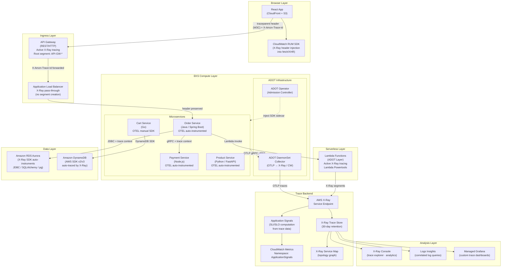
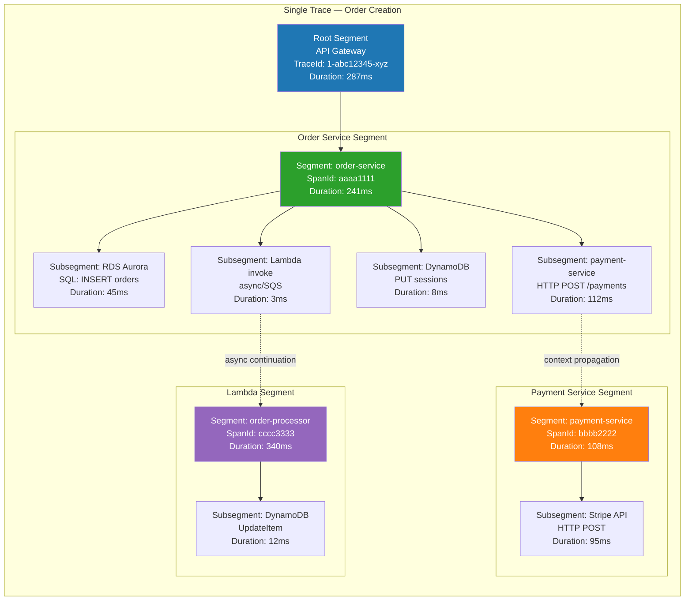
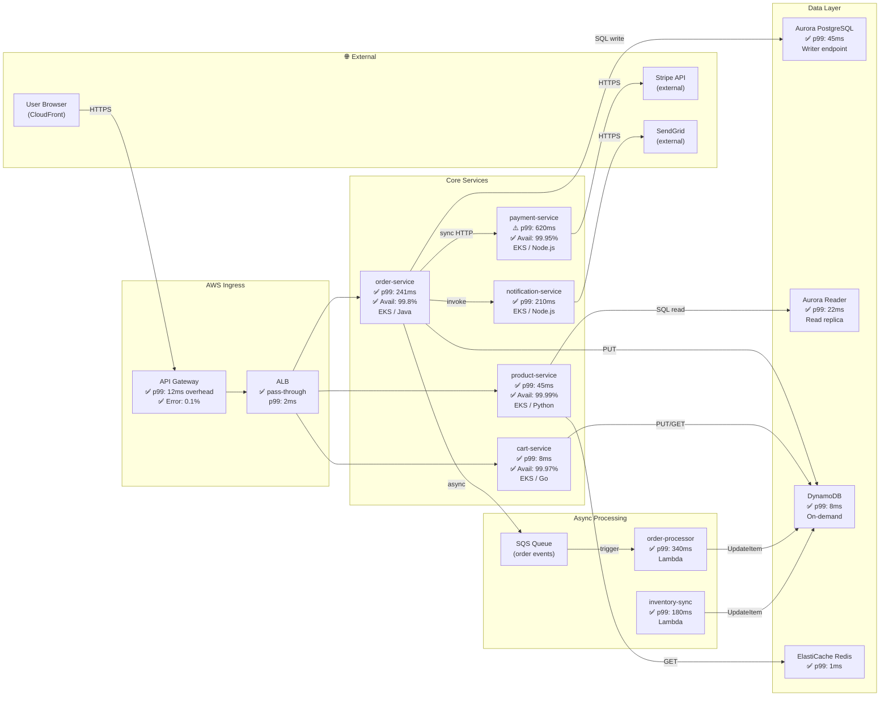
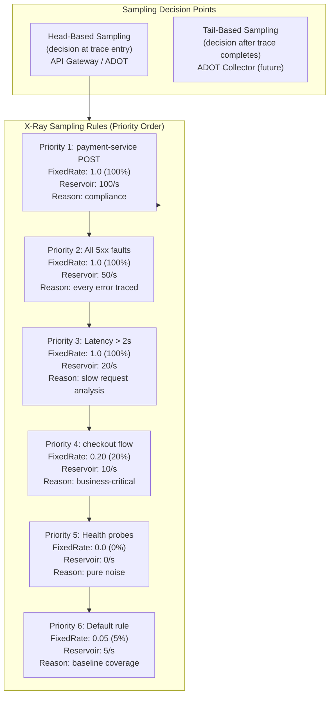
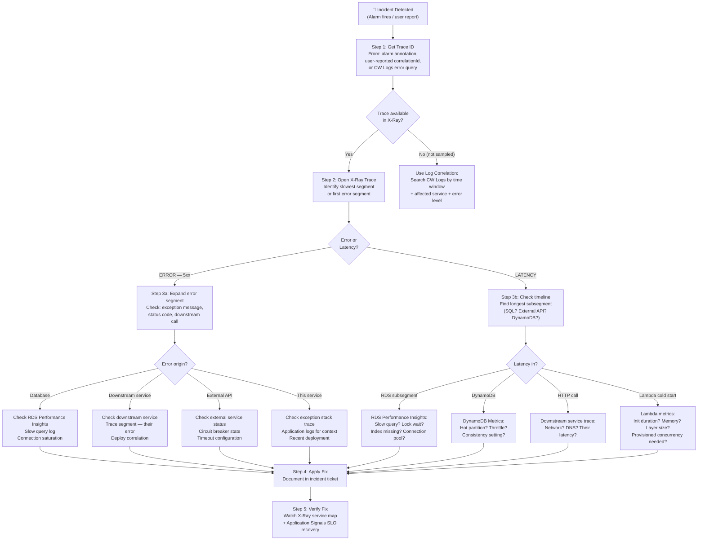
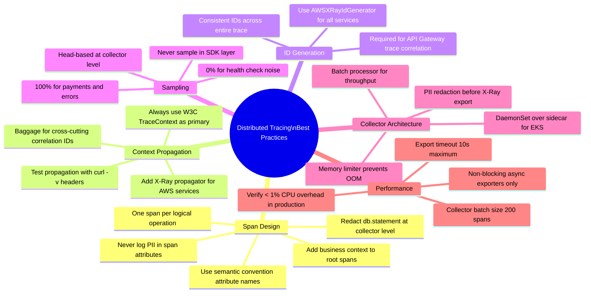

# End-to-End Distributed Tracing Architecture
## AWS X-Ray · OpenTelemetry · CloudWatch Application Signals

> **Role**: AWS Observability Architect
> **Date**: 2026-07-18
> **Trace Flow**: React → API Gateway → ALB → EKS → Lambda → RDS → DynamoDB
> **Standards**: W3C TraceContext · AWS X-Ray · OpenTelemetry Semantic Conventions 1.26

---

## Table of Contents

1. [Tracing Architecture](#1-tracing-architecture)
2. [Service Map Design](#2-service-map-design)
3. [Instrumentation Steps](#3-instrumentation-steps)
4. [OpenTelemetry Instrumentation](#4-opentelemetry-instrumentation)
5. [Correlation ID Strategy](#5-correlation-id-strategy)
6. [Trace Sampling Strategy](#6-trace-sampling-strategy)
7. [Root Cause Analysis Workflow](#7-root-cause-analysis-workflow)
8. [Troubleshooting Examples](#8-troubleshooting-examples)
9. [Dashboard Design](#9-dashboard-design)
10. [Best Practices](#10-best-practices)

---

## 1. Tracing Architecture

### 1.1 Full-Stack Distributed Trace Flow



### 1.2 Trace Segment Anatomy



### 1.3 Context Propagation Standards

| Layer | Propagation Header | Format | Standard |
|---|---|---|---|
| Browser → API Gateway | `X-Amzn-Trace-Id` + `traceparent` | X-Ray + W3C | Dual propagation |
| API Gateway → ALB | `X-Amzn-Trace-Id` | X-Ray native | AWS pass-through |
| ALB → EKS Service | `X-Amzn-Trace-Id` + `traceparent` | X-Ray + W3C | ADOT propagator |
| Service → Service (gRPC) | `traceparent` + `tracestate` | W3C TraceContext | OTEL standard |
| Service → Lambda (invoke) | `_X_AMZN_TRACE_ID` env var | X-Ray | AWS SDK auto |
| Service → DynamoDB/RDS | Automatic subsegment | AWS SDK | X-Ray SDK auto |
| Lambda → downstream | `X-Amzn-Trace-Id` | X-Ray | Lambda runtime |

---

## 2. Service Map Design

### 2.1 Annotated Service Map



### 2.2 X-Ray Group Configuration

```bash
# Create X-Ray groups for filtered service maps per team/environment

# Production — all services
aws xray create-group \
  --group-name "ecommerce-production" \
  --filter-expression 'annotation.Environment = "production"' \
  --insights-configuration InsightsEnabled=true,NotificationsEnabled=true \
  --tags Key=Environment,Value=production Key=Team,Value=platform \
  --region us-east-1

# Critical path — checkout flow only
aws xray create-group \
  --group-name "checkout-critical-path" \
  --filter-expression '
    (service("order-service") OR
     service("payment-service") OR
     service("cart-service")) AND
    annotation.Environment = "production"
  ' \
  --insights-configuration InsightsEnabled=true,NotificationsEnabled=true \
  --region us-east-1

# Error investigation — faults only
aws xray create-group \
  --group-name "production-faults" \
  --filter-expression 'fault = true AND annotation.Environment = "production"' \
  --insights-configuration InsightsEnabled=true,NotificationsEnabled=true \
  --region us-east-1

# Slow traces — latency investigation
aws xray create-group \
  --group-name "slow-traces" \
  --filter-expression 'responsetime > 1 AND annotation.Environment = "production"' \
  --region us-east-1

# Payment service — 100% visibility (compliance)
aws xray create-group \
  --group-name "payment-all-traces" \
  --filter-expression 'service("payment-service")' \
  --region us-east-1
```

---

## 3. Instrumentation Steps

### 3.1 Instrumentation Checklist by Layer

```mermaid
flowchart TD
    subgraph STEPS["Instrumentation Order (must follow sequence)"]
        S1["Step 1: Install ADOT Operator + cert-manager\n(EKS prerequisite)"]
        S2["Step 2: Deploy ADOT DaemonSet Collector\n(trace + metric gateway)"]
        S3["Step 3: Configure X-Ray sampling rules\n(before any service sends traces)"]
        S4["Step 4: Enable API Gateway active tracing\n(root segment source)"]
        S5["Step 5: Deploy Instrumentation CR\n(auto-inject OTEL SDK per language)"]
        S6["Step 6: Annotate EKS deployments\n(trigger SDK injection)"]
        S7["Step 7: Enable Lambda X-Ray + ADOT layer\n(serverless tracing)"]
        S8["Step 8: Verify end-to-end trace\n(smoke test with trace ID check)"]
        S9["Step 9: Configure Application Signals\n(SLI/SLO derivation from traces)"]
        S10["Step 10: Build dashboards + alerts\n(operationalize)"]
    end

    S1 --> S2 --> S3 --> S4 --> S5 --> S6 --> S7 --> S8 --> S9 --> S10
```



### 3.2 Step 1 — API Gateway Tracing

```bash
# Enable active X-Ray tracing on REST API
aws apigateway update-stage \
  --rest-api-id abc123def456 \
  --stage-name production \
  --patch-operations \
    op=replace,path=/tracingEnabled,value=true \
    op=replace,path=/accessLogSettings/destinationArn,value=arn:aws:logs:us-east-1:123456789012:log-group:/aws/apigateway/ecommerce \
    op=replace,path=/accessLogSettings/format,value='{"requestId":"$context.requestId","traceId":"$context.xrayTraceId","sourceIp":"$context.identity.sourceIp","requestTime":"$context.requestTime","httpMethod":"$context.httpMethod","routeKey":"$context.routeKey","status":"$context.status","responseLength":"$context.responseLength","integrationLatency":"$context.integrationLatency"}' \
  --region us-east-1

# For HTTP API (v2)
aws apigatewayv2 update-stage \
  --api-id abc123def456 \
  --stage-name '$default' \
  --default-route-settings '{"DetailedMetricsEnabled":true}' \
  --region us-east-1

# Verify tracing enabled
aws apigateway get-stage \
  --rest-api-id abc123def456 \
  --stage-name production \
  --query 'tracingEnabled'
```

### 3.3 Step 2 — ALB Tracing Configuration

```hcl
# terraform — ALB with X-Ray pass-through (no native segment; header forwarded)
resource "aws_lb" "ecommerce" {
  name               = "ecommerce-prod-alb"
  internal           = false
  load_balancer_type = "application"
  subnets            = var.public_subnet_ids
  security_groups    = [aws_security_group.alb.id]

  # ALB does not create X-Ray segments — it passes the header downstream
  # Enable access logs for ALB-level tracing correlation
  access_logs {
    bucket  = aws_s3_bucket.alb_logs.id
    prefix  = "alb-access-logs"
    enabled = true
  }
}

# ALB access log format includes X-Amzn-Trace-Id for correlation
# Access log field: traceability_id = X-Amzn-Trace-Id header value
```

### 3.4 Step 3 — ADOT Collector with Full Tracing Pipeline

```yaml
# adot-collector-tracing.yaml
apiVersion: opentelemetry.io/v1alpha1
kind: OpenTelemetryCollector
metadata:
  name: adot-tracing
  namespace: amazon-cloudwatch
spec:
  mode: daemonset
  serviceAccount: adot-collector-sa
  image: public.ecr.aws/aws-observability/aws-otel-collector:v0.40.0

  config: |
    extensions:
      health_check:
        endpoint: 0.0.0.0:13133
      zpages:
        endpoint: 0.0.0.0:55679   # Debug spans via browser

    receivers:
      otlp:
        protocols:
          grpc:
            endpoint: 0.0.0.0:4317
            max_recv_msg_size_mib: 4
          http:
            endpoint: 0.0.0.0:4318
            cors:
              allowed_origins: ["*"]

    processors:
      # Memory safety — prevent OOM
      memory_limiter:
        limit_mib: 512
        spike_limit_mib: 128
        check_interval: 5s

      # Enrich spans with K8s/EC2 resource metadata
      resourcedetection:
        detectors: [env, eks, ec2]
        timeout: 10s
        override: false
        eks:
          resource_attributes:
            k8s.cluster.name: { enabled: true }
        ec2:
          resource_attributes:
            host.id:           { enabled: true }
            host.name:         { enabled: true }
            cloud.region:      { enabled: true }
            cloud.availability_zone: { enabled: true }

      # Required: enrich for Application Signals SLI computation
      awsapplicationsignals:

      # Security: strip PII from spans before export
      attributes/redact_pii:
        actions:
          - key: http.request.header.authorization
            action: delete
          - key: http.request.header.cookie
            action: delete
          - key: user.email
            action: delete
          - key: enduser.id
            action: hash
          - key: db.statement
            action: update
            value: "[REDACTED - use db.operation + db.name instead]"

      # Normalize operation names to prevent cardinality explosion
      transform/normalize_routes:
        trace_statements:
          - context: span
            statements:
              # /api/orders/12345 → /api/orders/{orderId}
              - replace_pattern(attributes["http.target"], "^(/api/orders)/[0-9]+", "$$1/{orderId}")
              - replace_pattern(attributes["http.target"], "^(/api/products)/[a-zA-Z0-9-]+", "$$1/{productId}")
              - replace_pattern(attributes["http.target"], "^(/api/users)/[a-zA-Z0-9-]+", "$$1/{userId}")

      # Drop health check noise
      filter/drop_health:
        spans:
          exclude:
            match_type: regexp
            attributes:
              - key: http.target
                value: "^/(health|readiness|liveness|metrics|favicon\\.ico)$"

      # Batch for efficient export
      batch:
        timeout: 1s
        send_batch_size: 200
        send_batch_max_size: 500

    exporters:
      # Primary: X-Ray for trace storage + service map
      awsxray:
        region: us-east-1
        index_all_attributes: true    # Makes all OTEL attrs searchable in X-Ray
        no_verify_ssl: false
        endpoint: ""                  # Use VPC endpoint if configured

      # Application Signals for SLO computation
      awsapplicationsignals:
        region: us-east-1

      # Debug exporter — disable in production, enable for troubleshooting
      # logging:
      #   verbosity: detailed

    service:
      extensions: [health_check, zpages]
      pipelines:
        traces:
          receivers:  [otlp]
          processors:
            - memory_limiter
            - resourcedetection
            - attributes/redact_pii
            - transform/normalize_routes
            - filter/drop_health
            - awsapplicationsignals
            - batch
          exporters:  [awsxray, awsapplicationsignals]

  resources:
    requests:
      cpu: "200m"
      memory: "256Mi"
    limits:
      cpu: "500m"
      memory: "512Mi"

  volumeMounts:
    - name: rootfs
      mountPath: /hostfs
      readOnly: true
  volumes:
    - name: rootfs
      hostPath:
        path: /
```

---

## 4. OpenTelemetry Instrumentation

### 4.1 Java — Spring Boot (Order Service)

```java
// build.gradle — OTEL dependencies for Spring Boot
dependencies {
    // BOM manages all OTEL versions consistently
    implementation platform("io.opentelemetry.instrumentation:opentelemetry-instrumentation-bom:2.6.0")

    // Core SDK (auto-configured by Spring Boot starter)
    implementation "io.opentelemetry.instrumentation:opentelemetry-spring-boot-starter"

    // AWS resource detector (EKS cluster name, node, pod)
    implementation "io.opentelemetry.contrib:opentelemetry-aws-resources:1.37.0-alpha"

    // AWS X-Ray propagator + ID generator
    implementation "io.opentelemetry:opentelemetry-extension-aws:1.39.0"
}
```

```yaml
# src/main/resources/application.yml — OTEL configuration
management:
  tracing:
    sampling:
      probability: 1.0   # 100% at app level; sampling handled by X-Ray rules

otel:
  service:
    name: order-service
  resource:
    attributes:
      deployment.environment: ${DEPLOYMENT_ENVIRONMENT:production}
      service.version:        ${SERVICE_VERSION:unknown}
      aws.region:             ${AWS_REGION:us-east-1}

  traces:
    exporter: otlp
  exporter:
    otlp:
      endpoint: http://adot-tracing-collector.amazon-cloudwatch.svc.cluster.local:4317
      protocol: grpc
      timeout: 10s

  propagators: tracecontext,baggage,xray   # W3C + AWS X-Ray
  
  # X-Ray ID generator — produces X-Ray-compatible trace IDs
  # Required for trace correlation with API Gateway X-Ray segments
  id-generator: xray
```

```java
// OrderController.java — custom span attributes + events
import io.opentelemetry.api.trace.Span;
import io.opentelemetry.api.trace.Tracer;
import io.opentelemetry.api.trace.StatusCode;
import io.opentelemetry.api.baggage.Baggage;
import io.opentelemetry.context.Context;
import io.opentelemetry.instrumentation.annotations.WithSpan;
import io.opentelemetry.instrumentation.annotations.SpanAttribute;

@RestController
@RequiredArgsConstructor
public class OrderController {

    private final Tracer tracer;
    private final OrderService orderService;

    @PostMapping("/api/orders")
    public ResponseEntity<OrderResponse> createOrder(
            @RequestBody CreateOrderRequest request,
            @RequestHeader(value = "X-Customer-Tier", required = false) String customerTier) {

        Span currentSpan = Span.current();

        // Add business context as span attributes (non-PII only)
        currentSpan.setAttribute("order.item_count",        request.getItemCount());
        currentSpan.setAttribute("order.value_tier",        getValueTier(request.getTotalAmount()));
        currentSpan.setAttribute("customer.tier",           customerTier != null ? customerTier : "standard");
        currentSpan.setAttribute("order.payment_method",   request.getPaymentMethod());

        // Add X-Ray annotations (searchable in X-Ray console)
        currentSpan.setAttribute("aws.xray.annotations.customer_tier", customerTier);
        currentSpan.setAttribute("aws.xray.annotations.order_value_tier", getValueTier(request.getTotalAmount()));

        // Add span event for business milestone
        currentSpan.addEvent("order.validation.started");

        try {
            OrderResponse response = orderService.createOrder(request);

            // Success attributes
            currentSpan.setAttribute("order.id",            response.getOrderId());
            currentSpan.setAttribute("order.status",        "created");
            currentSpan.addEvent("order.created",
                io.opentelemetry.api.common.Attributes.of(
                    io.opentelemetry.api.common.AttributeKey.stringKey("order.id"),
                    response.getOrderId()
                )
            );

            return ResponseEntity.status(201).body(response);

        } catch (PaymentDeclinedException e) {
            currentSpan.setStatus(StatusCode.ERROR, "Payment declined");
            currentSpan.recordException(e);
            currentSpan.setAttribute("order.failure_reason", "payment_declined");
            throw e;
        } catch (InsufficientInventoryException e) {
            currentSpan.setStatus(StatusCode.ERROR, "Insufficient inventory");
            currentSpan.recordException(e);
            currentSpan.setAttribute("order.failure_reason", "insufficient_inventory");
            throw e;
        }
    }

    // Create child span for critical business operations
    @WithSpan("order-service.validate-inventory")
    private void validateInventory(
            @SpanAttribute("product.count") int productCount,
            @SpanAttribute("warehouse.region") String region) {
        // Span automatically created and closed by @WithSpan
    }

    private String getValueTier(BigDecimal amount) {
        if (amount.compareTo(new BigDecimal("100")) < 0)  return "low";
        if (amount.compareTo(new BigDecimal("500")) < 0)  return "medium";
        return "high";
    }
}
```

### 4.2 Node.js — Payment Service

```typescript
// instrumentation.ts — MUST be loaded FIRST (before any imports)
// Start with: node --require ./instrumentation.js server.js

import { NodeSDK } from '@opentelemetry/sdk-node';
import { OTLPTraceExporter } from '@opentelemetry/exporter-trace-otlp-grpc';
import { Resource } from '@opentelemetry/resources';
import {
  SEMRESATTRS_SERVICE_NAME,
  SEMRESATTRS_SERVICE_VERSION,
  SEMRESATTRS_DEPLOYMENT_ENVIRONMENT
} from '@opentelemetry/semantic-conventions';
import { AWSXRayIdGenerator }     from '@opentelemetry/id-generator-aws-xray';
import { AWSXRayPropagator }       from '@opentelemetry/propagator-aws-xray';
import { W3CTraceContextPropagator } from '@opentelemetry/core';
import { CompositePropagator }     from '@opentelemetry/core';
import { AwsInstrumentation }      from '@opentelemetry/instrumentation-aws-sdk';
import { HttpInstrumentation }     from '@opentelemetry/instrumentation-http';
import { ExpressInstrumentation }  from '@opentelemetry/instrumentation-express';
import { PgInstrumentation }       from '@opentelemetry/instrumentation-pg';

const sdk = new NodeSDK({
  resource: new Resource({
    [SEMRESATTRS_SERVICE_NAME]:        'payment-service',
    [SEMRESATTRS_SERVICE_VERSION]:     process.env.SERVICE_VERSION ?? '0.0.0',
    [SEMRESATTRS_DEPLOYMENT_ENVIRONMENT]: process.env.DEPLOYMENT_ENVIRONMENT ?? 'production',
    'aws.region':                      process.env.AWS_REGION ?? 'us-east-1'
  }),

  // X-Ray-compatible trace ID generator (required for API Gateway correlation)
  idGenerator: new AWSXRayIdGenerator(),

  // Dual propagation: W3C TraceContext + AWS X-Ray
  textMapPropagator: new CompositePropagator({
    propagators: [
      new W3CTraceContextPropagator(),
      new AWSXRayPropagator()
    ]
  }),

  traceExporter: new OTLPTraceExporter({
    url: process.env.OTEL_EXPORTER_OTLP_ENDPOINT
      ?? 'http://adot-tracing-collector.amazon-cloudwatch.svc.cluster.local:4317'
  }),

  instrumentations: [
    new HttpInstrumentation({
      // Exclude health checks from tracing
      ignoreIncomingRequestHook: (req) =>
        ['/health', '/readiness', '/metrics'].includes(req.url ?? ''),
      // Add custom attributes to HTTP spans
      requestHook: (span, req) => {
        span.setAttribute('http.client_id', req.headers['x-client-id'] as string ?? 'unknown');
      }
    }),
    new ExpressInstrumentation({
      // Normalize route params to avoid high cardinality
      requestHook: (span, info) => {
        if (info.layerType === 'router') {
          span.updateName(`${info.request.method} ${info.route}`);
        }
      }
    }),
    new AwsInstrumentation({
      suppressInternalInstrumentation: true,
      preRequestHook: (span, request) => {
        // Add DynamoDB table name as searchable attribute
        if (request.serviceName === 'DynamoDB') {
          span.setAttribute('db.dynamodb.table_name',
            (request.commandInput as Record<string, string>)?.TableName ?? 'unknown');
        }
      }
    }),
    new PgInstrumentation({
      enhancedDatabaseReporting: false,  // NEVER log SQL statements (may contain PII)
      dbStatementSerializer: (_operation, _query) => '[REDACTED]'
    })
  ]
});

sdk.start();
console.log('[OTEL] SDK started — payment-service');

// Graceful shutdown
process.on('SIGTERM', () => {
  sdk.shutdown()
    .then(() => console.log('[OTEL] SDK shut down gracefully'))
    .catch(console.error)
    .finally(() => process.exit(0));
});
```

```typescript
// payment-service/src/handlers/PaymentHandler.ts
import { trace, SpanStatusCode, SpanKind } from '@opentelemetry/api';
import { SemanticAttributes } from '@opentelemetry/semantic-conventions';

const tracer = trace.getTracer('payment-service', process.env.SERVICE_VERSION);

export class PaymentHandler {

  async processPayment(request: PaymentRequest): Promise<PaymentResult> {
    // Create manual child span for payment provider call
    return tracer.startActiveSpan(
      'payment.process',
      {
        kind: SpanKind.CLIENT,
        attributes: {
          'payment.method':       request.paymentMethod,
          'payment.currency':     request.currency,
          'payment.value_tier':   this.getValueTier(request.amount),
          // NEVER add: amount, card number, CVV
          [SemanticAttributes.RPC_SERVICE]: 'payment-provider',
          [SemanticAttributes.RPC_METHOD]:  'charge'
        }
      },
      async (span) => {
        try {
          const result = await this.stripeClient.charge({
            amount:   request.amount,
            currency: request.currency,
            source:   request.tokenizedCard   // tokenized — safe to log token prefix
          });

          span.setAttribute('payment.result',      'success');
          span.setAttribute('payment.provider_id', result.id);
          span.setStatus({ code: SpanStatusCode.OK });

          return { success: true, transactionId: result.id };

        } catch (error) {
          span.setStatus({
            code: SpanStatusCode.ERROR,
            message: (error as Error).message
          });
          span.recordException(error as Error, {
            'payment.failure_code': (error as StripeError).code ?? 'unknown'
          });
          throw error;
        } finally {
          span.end();
        }
      }
    );
  }

  private getValueTier(amount: number): string {
    if (amount < 10000)  return 'low';     // < $100
    if (amount < 50000)  return 'medium';  // $100–$500
    return 'high';
  }
}
```

### 4.3 Python — Product Service (FastAPI)

```python
# instrumentation.py — loaded via PYTHONPATH (OTEL auto-instrumentation)
import os
from opentelemetry import trace
from opentelemetry.sdk.trace import TracerProvider
from opentelemetry.sdk.trace.export import BatchSpanProcessor
from opentelemetry.exporter.otlp.proto.grpc.trace_exporter import OTLPSpanExporter
from opentelemetry.sdk.resources import Resource, SERVICE_NAME, SERVICE_VERSION
from opentelemetry.propagators.aws.xray import AwsXRayPropagator
from opentelemetry.propagate import set_global_textmap, composite
from opentelemetry.propagators.b3 import B3MultiFormat
from opentelemetry.trace.propagation.tracecontext import TraceContextTextMapPropagator
from opentelemetry.instrumentation.fastapi import FastAPIInstrumentation
from opentelemetry.instrumentation.sqlalchemy import SQLAlchemyInstrumentation
from opentelemetry.instrumentation.redis import RedisInstrumentation
from opentelemetry.instrumentation.boto3sqs import Boto3SQSInstrumentation
from opentelemetry.sdk.extension.aws.trace import AwsXRayIdGenerator

def configure_tracing() -> trace.Tracer:
    resource = Resource.create({
        SERVICE_NAME:                      "product-service",
        SERVICE_VERSION:                   os.getenv("SERVICE_VERSION", "0.0.0"),
        "deployment.environment":           os.getenv("DEPLOYMENT_ENVIRONMENT", "production"),
        "aws.region":                       os.getenv("AWS_REGION", "us-east-1"),
        "k8s.namespace.name":               os.getenv("K8S_NAMESPACE", "ecommerce"),
    })

    provider = TracerProvider(
        resource=resource,
        id_generator=AwsXRayIdGenerator()  # X-Ray compatible trace IDs
    )

    otlp_exporter = OTLPSpanExporter(
        endpoint=os.getenv(
            "OTEL_EXPORTER_OTLP_ENDPOINT",
            "http://adot-tracing-collector.amazon-cloudwatch.svc.cluster.local:4317"
        ),
        insecure=True  # Within cluster — TLS handled by service mesh if present
    )

    provider.add_span_processor(BatchSpanProcessor(
        otlp_exporter,
        max_export_batch_size=200,
        export_timeout_millis=10000,
        schedule_delay_millis=1000
    ))

    trace.set_tracer_provider(provider)

    # Dual propagation: W3C + X-Ray
    set_global_textmap(composite.CompositePropagator(propagators=[
        TraceContextTextMapPropagator(),
        AwsXRayPropagator()
    ]))

    return trace.get_tracer("product-service", os.getenv("SERVICE_VERSION", "0.0.0"))


# Auto-instrument FastAPI, SQLAlchemy, Redis
def setup_auto_instrumentation(app):
    FastAPIInstrumentation().instrument_app(
        app,
        excluded_urls="/health,/readiness,/metrics",
        server_request_hook=_server_request_hook
    )
    SQLAlchemyInstrumentation().instrument(
        enable_commenter=True,
        commenter_options={"db_framework": True},
        # Never capture SQL text — may contain parameters
        capture_parameters=False
    )
    RedisInstrumentation().instrument()


def _server_request_hook(span, scope):
    """Enrich FastAPI spans with custom attributes."""
    if span and span.is_recording():
        headers = dict(scope.get("headers", []))
        span.set_attribute("http.client_id",
            headers.get(b"x-client-id", b"unknown").decode("utf-8", errors="replace"))
```

```python
# product_service/routers/products.py
from opentelemetry import trace, baggage
from opentelemetry.trace import StatusCode
from opentelemetry.semconv.trace import SpanAttributes

tracer = trace.get_tracer("product-service.products")

@router.get("/api/products/{product_id}")
async def get_product(
    product_id: str,
    request: Request,
    db: AsyncSession = Depends(get_db),
    cache: Redis = Depends(get_cache)
):
    span = trace.get_current_span()

    # Non-PII business attributes
    span.set_attribute("product.id",       product_id)
    span.set_attribute("product.category", "unknown")  # updated after DB fetch

    # Child span for cache check
    with tracer.start_as_current_span("product.cache.get") as cache_span:
        cache_span.set_attribute("db.system", "redis")
        cache_span.set_attribute("db.operation", "GET")
        cached = await cache.get(f"product:{product_id}")
        cache_span.set_attribute("cache.hit", cached is not None)

    if cached:
        span.set_attribute("product.cache_hit", True)
        return ProductResponse.parse_raw(cached)

    # Cache miss — fetch from database
    span.set_attribute("product.cache_hit", False)

    with tracer.start_as_current_span("product.db.fetch") as db_span:
        db_span.set_attribute(SpanAttributes.DB_SYSTEM, "postgresql")
        db_span.set_attribute(SpanAttributes.DB_NAME,   "ecommerce")
        db_span.set_attribute(SpanAttributes.DB_OPERATION, "SELECT")
        db_span.set_attribute("db.table", "products")
        # Do NOT log db.statement — may contain parameters

        result = await db.execute(
            select(Product).where(Product.id == product_id)
        )
        product = result.scalar_one_or_none()

        if not product:
            db_span.set_status(StatusCode.ERROR, "Product not found")
            raise HTTPException(status_code=404, detail="Product not found")

    # Enrich parent span after successful fetch
    span.set_attribute("product.category", product.category)
    span.set_attribute("product.in_stock",  product.stock_count > 0)

    return ProductResponse.from_orm(product)
```

### 4.4 Go — Cart Service

```go
// pkg/tracing/setup.go
package tracing

import (
    "context"
    "os"

    "go.opentelemetry.io/otel"
    "go.opentelemetry.io/otel/attribute"
    "go.opentelemetry.io/otel/exporters/otlp/otlptrace/otlptracegrpc"
    "go.opentelemetry.io/otel/propagation"
    "go.opentelemetry.io/otel/sdk/resource"
    sdktrace "go.opentelemetry.io/otel/sdk/trace"
    semconv "go.opentelemetry.io/otel/semconv/v1.26.0"
    xrayprop "go.opentelemetry.io/contrib/propagators/aws/xray"
    xrayidgen "go.opentelemetry.io/contrib/ids/aws/xray"
)

func InitTracer(ctx context.Context) (*sdktrace.TracerProvider, error) {
    endpoint := os.Getenv("OTEL_EXPORTER_OTLP_ENDPOINT")
    if endpoint == "" {
        endpoint = "adot-tracing-collector.amazon-cloudwatch.svc.cluster.local:4317"
    }

    exporter, err := otlptracegrpc.New(ctx,
        otlptracegrpc.WithEndpoint(endpoint),
        otlptracegrpc.WithInsecure(), // TLS via service mesh
    )
    if err != nil {
        return nil, err
    }

    res, err := resource.New(ctx,
        resource.WithAttributes(
            semconv.ServiceName("cart-service"),
            semconv.ServiceVersion(os.Getenv("SERVICE_VERSION")),
            semconv.DeploymentEnvironment(os.Getenv("DEPLOYMENT_ENVIRONMENT")),
            attribute.String("aws.region", os.Getenv("AWS_REGION")),
        ),
        resource.WithFromEnv(),
        resource.WithProcess(),
    )
    if err != nil {
        return nil, err
    }

    tp := sdktrace.NewTracerProvider(
        sdktrace.WithBatcher(exporter,
            sdktrace.WithMaxExportBatchSize(200),
            sdktrace.WithBatchTimeout(1000),
        ),
        sdktrace.WithResource(res),
        // X-Ray compatible ID generator
        sdktrace.WithIDGenerator(xrayidgen.NewIDGenerator()),
        // Always send spans (sampling via X-Ray rules)
        sdktrace.WithSampler(sdktrace.AlwaysSample()),
    )

    otel.SetTracerProvider(tp)

    // W3C TraceContext + AWS X-Ray propagation
    otel.SetTextMapPropagator(propagation.NewCompositeTextMapPropagator(
        propagation.TraceContext{},
        propagation.Baggage{},
        xrayprop.Propagator{},
    ))

    return tp, nil
}
```

```go
// internal/handlers/cart_handler.go
package handlers

import (
    "context"
    "go.opentelemetry.io/otel"
    "go.opentelemetry.io/otel/attribute"
    "go.opentelemetry.io/otel/codes"
    semconv "go.opentelemetry.io/otel/semconv/v1.26.0"
)

var tracer = otel.Tracer("cart-service.handlers")

func (h *CartHandler) AddItem(ctx context.Context, req *AddItemRequest) (*CartResponse, error) {
    ctx, span := tracer.Start(ctx, "cart.add-item",
        trace.WithAttributes(
            attribute.Int("cart.item_count", req.Quantity),
            attribute.String("product.id",   req.ProductID),
            semconv.HTTPMethod("POST"),
        ),
    )
    defer span.End()

    // DynamoDB operation span
    ctx, dbSpan := tracer.Start(ctx, "dynamodb.put-item",
        trace.WithSpanKind(trace.SpanKindClient),
        trace.WithAttributes(
            semconv.DBSystem("dynamodb"),
            semconv.DBOperation("PutItem"),
            attribute.String("db.dynamodb.table_name", "ecommerce-cart"),
        ),
    )

    err := h.cartStore.PutItem(ctx, req)
    if err != nil {
        dbSpan.SetStatus(codes.Error, err.Error())
        dbSpan.RecordError(err)
        dbSpan.End()
        span.SetStatus(codes.Error, "Failed to add item to cart")
        return nil, err
    }
    dbSpan.SetStatus(codes.Ok, "")
    dbSpan.End()

    span.SetAttributes(
        attribute.Bool("cart.item_added", true),
        attribute.Int("cart.total_items", req.TotalAfterAdd),
    )

    return &CartResponse{Success: true}, nil
}
```

### 4.5 Lambda — Order Processor (Python with Powertools)

```python
# lambda/order_processor/handler.py
import boto3
import os
from aws_lambda_powertools import Logger, Tracer
from aws_lambda_powertools.tracing import aiohttp_trace_config
from aws_lambda_powertools.utilities.typing import LambdaContext
from aws_lambda_powertools.utilities.data_classes import SQSEvent, event_source

# Powertools auto-configures OTEL SDK + X-Ray integration
logger  = Logger(service="order-processor")
tracer  = Tracer(service="order-processor")   # Uses OTEL SDK under the hood

dynamodb = boto3.resource("dynamodb")
table    = dynamodb.Table(os.environ["ORDERS_TABLE"])


@tracer.capture_lambda_handler(capture_response=False)  # Don't capture response (may contain PII)
@logger.inject_lambda_context(correlation_id_path="Records[0].messageId")
@event_source(data_class=SQSEvent)
def handler(event: SQSEvent, context: LambdaContext):
    for record in event.records:
        process_order_record(record)
    return {"statusCode": 200, "processedCount": len(list(event.records))}


@tracer.capture_method(capture_response=False)
def process_order_record(record):
    order_data = record.json_body

    # Add non-PII metadata as X-Ray annotations (searchable)
    tracer.put_annotation(key="orderId",    value=order_data["orderId"])
    tracer.put_annotation(key="orderTier",  value=get_value_tier(order_data["totalAmount"]))

    # Add metadata (not searchable but in trace detail)
    tracer.put_metadata(
        key="orderContext",
        value={
            "itemCount":    order_data.get("itemCount"),
            "paymentMethod": order_data.get("paymentMethod"),
            "valueTier":    get_value_tier(order_data["totalAmount"])
        },
        namespace="order-processor"
    )

    update_order_status(order_data["orderId"], "PROCESSING")
    sync_inventory(order_data["items"])
    update_order_status(order_data["orderId"], "COMPLETED")


@tracer.capture_method
def update_order_status(order_id: str, status: str):
    """Subsegment automatically created by @capture_method decorator."""
    table.update_item(
        Key={"orderId": order_id},
        UpdateExpression="SET #status = :status, updatedAt = :ts",
        ExpressionAttributeNames={"#status": "status"},
        ExpressionAttributeValues={
            ":status": status,
            ":ts": int(__import__("time").time() * 1000)
        }
    )


def get_value_tier(amount: float) -> str:
    if amount < 100:   return "low"
    if amount < 500:   return "medium"
    return "high"
```

---

## 5. Correlation ID Strategy

### 5.1 Correlation ID Flow

```mermaid
sequenceDiagram
    participant Browser
    participant APIGW as API Gateway
    participant OrderSvc as Order Service
    participant PaymentSvc as Payment Service
    participant Lambda
    participant CWLogs as CloudWatch Logs

    Browser->>APIGW: POST /api/orders\nX-Request-Id: req-uuid-7f3a\ntraceparent: 00-{traceId}-{spanId}-01

    Note over APIGW: X-Ray creates root segment\nTraceId: 1-abc12345-xyz\nMaps traceparent → X-Amzn-Trace-Id

    APIGW->>OrderSvc: X-Amzn-Trace-Id: Root=1-abc12345-xyz;Parent=aaaa;Sampled=1\ntraceparent: 00-abc12345xyz-aaaa1111-01\nX-Request-Id: req-uuid-7f3a\nX-Correlation-Id: req-uuid-7f3a (gateway adds)

    Note over OrderSvc: Logger adds to all log lines:\n{traceId, spanId, correlationId}

    OrderSvc->>PaymentSvc: traceparent: 00-abc12345xyz-bbbb2222-01\nX-Correlation-Id: req-uuid-7f3a

    OrderSvc->>Lambda: X-Amzn-Trace-Id: Root=1-abc12345-xyz;Parent=cccc;Sampled=1\n(Lambda runtime reads from env: _X_AMZN_TRACE_ID)

    OrderSvc-->>CWLogs: {"traceId":"1-abc12345-xyz","spanId":"aaaa1111",\n"correlationId":"req-uuid-7f3a","level":"INFO",\n"message":"Order created","orderId":"ord_123"}

    PaymentSvc-->>CWLogs: {"traceId":"1-abc12345-xyz","spanId":"bbbb2222",\n"correlationId":"req-uuid-7f3a","level":"INFO",\n"message":"Payment processed"}

    Lambda-->>CWLogs: {"traceId":"1-abc12345-xyz","spanId":"cccc3333",\n"correlationId":"req-uuid-7f3a","level":"INFO",\n"message":"Order processed"}

    Note over CWLogs: Single Logs Insights query:\nfilter traceId = "1-abc12345-xyz"\nReturns ALL logs across ALL services
```

### 5.2 Correlation ID Middleware (Node.js)

```typescript
// middleware/correlationId.ts
import { Request, Response, NextFunction } from 'express';
import { trace, context, propagation } from '@opentelemetry/api';
import { randomUUID } from 'crypto';

declare global {
  namespace Express {
    interface Request {
      correlationId: string;
      traceId: string;
      spanId: string;
    }
  }
}

export function correlationIdMiddleware(
  req: Request, res: Response, next: NextFunction
): void {

  // 1. Extract or generate correlation ID
  const correlationId =
    req.headers['x-correlation-id'] as string ??
    req.headers['x-request-id']    as string ??
    randomUUID();

  req.correlationId = correlationId;

  // 2. Extract trace/span IDs from active OTEL span
  const span = trace.getActiveSpan();
  const spanContext = span?.spanContext();

  req.traceId = spanContext?.traceId ?? 'no-trace';
  req.spanId  = spanContext?.spanId  ?? 'no-span';

  // 3. Add correlation ID to current span as attribute + baggage
  if (span?.isRecording()) {
    span.setAttribute('correlation.id', correlationId);
    span.setAttribute('http.request.id', correlationId);
  }

  // Propagate correlation ID in baggage (flows to all downstream services)
  const bag = propagation.getBaggage(context.active())
    ?? propagation.createBaggage();
  const newBag = bag.setEntry('correlation.id', { value: correlationId });
  const ctx = propagation.setBaggage(context.active(), newBag);
  context.with(ctx, () => {});  // Set baggage in current context

  // 4. Echo correlation ID in response header
  res.setHeader('X-Correlation-Id', correlationId);
  res.setHeader('X-Trace-Id', req.traceId);

  next();
}
```

### 5.3 Structured Logger with Trace Correlation

```typescript
// lib/logger.ts — Logger that auto-injects trace context into every log line
import winston from 'winston';
import { trace, context } from '@opentelemetry/api';

function getTraceContext() {
  const span = trace.getActiveSpan();
  const ctx  = span?.spanContext();
  return ctx
    ? { traceId: ctx.traceId, spanId: ctx.spanId, traceFlags: ctx.traceFlags }
    : { traceId: 'no-trace', spanId: 'no-span', traceFlags: 0 };
}

export const logger = winston.createLogger({
  level: process.env.LOG_LEVEL ?? 'info',
  format: winston.format.combine(
    winston.format.timestamp(),
    winston.format.errors({ stack: true }),
    winston.format((info) => {
      // Auto-inject trace context into every log message
      return { ...info, ...getTraceContext() };
    })(),
    winston.format.json()
  ),
  defaultMeta: {
    service:     process.env.OTEL_SERVICE_NAME ?? 'unknown',
    environment: process.env.DEPLOYMENT_ENVIRONMENT ?? 'production',
    version:     process.env.SERVICE_VERSION ?? '0.0.0'
  },
  transports: [new winston.transports.Console()]
});

// Usage in handlers:
// logger.info('Payment processed', { paymentMethod: 'card', valueTier: 'high' });
// Output: {"level":"info","traceId":"abc123...","spanId":"def456...","service":"payment-service","message":"Payment processed","paymentMethod":"card"}
```

### 5.4 CloudWatch Logs Insights — Cross-Service Correlation

```sql
-- Find ALL log lines across ALL services for a single trace
fields @timestamp, service, level, message, spanId, correlationId
| filter traceId = "1-abc12345-xyz98765432109876543210"
| sort @timestamp asc
| limit 200

-- Find trace ID from correlation ID (when user reports an issue)
fields @timestamp, traceId, service, level, message
| filter correlationId = "req-uuid-7f3a-b2c1-d3e4-f5a6"
| sort @timestamp asc
| limit 50

-- Reconstruct request timeline across services
fields @timestamp, service, spanId, message, durationMs
| filter traceId = "1-abc12345-xyz98765432109876543210"
| sort @timestamp asc
| display @timestamp, service, message, durationMs
```

---

## 6. Trace Sampling Strategy

### 6.1 Sampling Architecture



### 6.2 X-Ray Sampling Rules Configuration

```json
{
  "SamplingRules": [
    {
      "RuleName": "PaymentService-AllTraces",
      "Priority": 1,
      "Description": "100% sampling for payment service — compliance requirement",
      "Host": "*",
      "HTTPMethod": "POST",
      "URLPath": "/api/payments*",
      "ServiceName": "payment-service",
      "ServiceType": "AWS::EKS::Pod",
      "ResourceARN": "*",
      "FixedRate": 1.0,
      "ReservoirSize": 100,
      "Attributes": {}
    },
    {
      "RuleName": "AllFaultTraces",
      "Priority": 2,
      "Description": "100% sampling for all 5xx fault responses",
      "Host": "*",
      "HTTPMethod": "*",
      "URLPath": "*",
      "ServiceName": "*",
      "ServiceType": "*",
      "ResourceARN": "*",
      "FixedRate": 1.0,
      "ReservoirSize": 50,
      "Attributes": {
        "http.status_code": "5??"
      }
    },
    {
      "RuleName": "CheckoutFlow-HighSampling",
      "Priority": 4,
      "Description": "20% sampling for checkout-related endpoints",
      "Host": "*",
      "HTTPMethod": "*",
      "URLPath": "/api/orders*",
      "ServiceName": "order-service",
      "ServiceType": "AWS::EKS::Pod",
      "ResourceARN": "*",
      "FixedRate": 0.20,
      "ReservoirSize": 10,
      "Attributes": {}
    },
    {
      "RuleName": "HealthChecksSuppressed",
      "Priority": 5,
      "Description": "No sampling for health check endpoints",
      "Host": "*",
      "HTTPMethod": "GET",
      "URLPath": "/health*",
      "ServiceName": "*",
      "ServiceType": "*",
      "ResourceARN": "*",
      "FixedRate": 0.0,
      "ReservoirSize": 0,
      "Attributes": {}
    },
    {
      "RuleName": "LambdaFunctions",
      "Priority": 7,
      "Description": "10% sampling for Lambda functions",
      "Host": "*",
      "HTTPMethod": "*",
      "URLPath": "*",
      "ServiceName": "*",
      "ServiceType": "AWS::Lambda::Function",
      "ResourceARN": "*",
      "FixedRate": 0.10,
      "ReservoirSize": 5,
      "Attributes": {}
    },
    {
      "RuleName": "Default",
      "Priority": 10000,
      "Description": "Default 5% sampling across all other services",
      "Host": "*",
      "HTTPMethod": "*",
      "URLPath": "*",
      "ServiceName": "*",
      "ServiceType": "*",
      "ResourceARN": "*",
      "FixedRate": 0.05,
      "ReservoirSize": 5,
      "Attributes": {}
    }
  ]
}
```

```bash
# Apply sampling rules via CLI
aws xray create-sampling-rule \
  --sampling-rule file://sampling-rules.json \
  --region us-east-1

# List active sampling rules
aws xray get-sampling-rules \
  --region us-east-1 \
  --query 'SamplingRuleRecords[*].SamplingRule.{Name:RuleName,Priority:Priority,Rate:FixedRate,Reservoir:ReservoirSize}' \
  --output table

# Get sampling statistics (verify rules are matching)
aws xray get-sampling-statistic-summaries \
  --region us-east-1 \
  --query 'SamplingStatisticSummaries[*].{Rule:RuleName,Sampled:SampledCount,Borrowed:BorrowCount,Requests:RequestCount}'
```

### 6.3 Sampling Cost vs Coverage Matrix

| Rule | Sample Rate | Cost Impact | Coverage |
|---|---|---|---|
| Payment POST | 100% | High (justified by compliance) | Every transaction |
| 5xx Faults | 100% | Low (faults are rare, < 1%) | All failures for RCA |
| Latency > 2s | 100% | Low (slow requests < 0.5%) | Full slow request visibility |
| Checkout flow | 20% | Medium | Statistical significance on funnel |
| Lambda | 10% | Low | Representative async behavior |
| Default | 5% | Low | Baseline coverage, 95% cost saving |

---

## 7. Root Cause Analysis Workflow

### 7.1 RCA Decision Tree



### 7.2 X-Ray Analytics Queries for RCA

```bash
# ── Find all failing traces for a service in last hour ──────────────────────
aws xray get-trace-summaries \
  --start-time $(date -u -d '1 hour ago' +%s) \
  --end-time $(date -u +%s) \
  --filter-expression 'service("order-service") AND fault = true' \
  --region us-east-1 \
  --query 'TraceSummaries[*].{
    TraceId:Id,
    Duration:Duration,
    Fault:HasFault,
    Error:HasError,
    Annotations:Annotations
  }'

# ── Find slow traces (> 2 seconds) ──────────────────────────────────────────
aws xray get-trace-summaries \
  --start-time $(date -u -d '30 minutes ago' +%s) \
  --end-time $(date -u +%s) \
  --filter-expression 'responsetime > 2 AND service("order-service")' \
  --sampling false \
  --region us-east-1

# ── Get full trace detail for RCA ────────────────────────────────────────────
aws xray batch-get-traces \
  --trace-ids "1-abc12345-xyz98765432109876543210" \
  --region us-east-1 \
  --query 'Traces[0].Segments[*].Document' \
  --output text | python3 -m json.tool

# ── X-Ray Analytics: latency distribution by service + operation ─────────────
aws xray get-time-series-service-statistics \
  --start-time $(date -u -d '1 hour ago' +%s) \
  --end-time $(date -u +%s) \
  --group-name "ecommerce-production" \
  --period 60 \
  --region us-east-1

# ── Find traces with specific annotation (e.g., high-value orders failing) ───
aws xray get-trace-summaries \
  --start-time $(date -u -d '1 hour ago' +%s) \
  --end-time $(date -u +%s) \
  --filter-expression 'annotation.order_value_tier = "high" AND fault = true' \
  --region us-east-1
```

---

## 8. Troubleshooting Examples

### 8.1 Scenario 1 — Payment Service Latency Spike

**Symptom**: p99 latency alarm fires on `payment-service` — 620ms vs normal 180ms

```bash
# Step 1: Find slow traces via X-Ray
aws xray get-trace-summaries \
  --start-time $(date -u -d '30 minutes ago' +%s) \
  --end-time $(date -u +%s) \
  --filter-expression 'service("payment-service") AND responsetime > 0.5' \
  --region us-east-1 \
  --query 'TraceSummaries[0:5].{Id:Id,Duration:Duration}'

# Step 2: Get a representative slow trace
TRACE_ID="1-abc12345-xyz98765432109876543210"
aws xray batch-get-traces --trace-ids "$TRACE_ID" --region us-east-1

# Analysis from trace (pseudocode — what to look for):
# Segment: payment-service          → 618ms
#   Subsegment: Stripe API call     → 602ms  ← CULPRIT
#   Subsegment: DynamoDB PutItem    → 8ms    ← normal
#   Subsegment: RDS read            → 6ms    ← normal

# Step 3: Correlate with CloudWatch Logs
cat <<'EOF'
# CloudWatch Logs Insights query:
fields @timestamp, message, durationMs, externalApiUrl, httpStatusCode
| filter service = "payment-service"
| filter traceId = "1-abc12345-xyz98765432109876543210"
| sort @timestamp asc
EOF

# Step 4: Check Stripe API status and payment-service timeout config
# Root cause: Stripe experiencing elevated latency (check status.stripe.com)
# Fix: Increase timeout from 500ms → 2s OR implement circuit breaker

# Step 5: Verify fix — watch p99 come down in Application Signals
aws cloudwatch get-metric-statistics \
  --namespace ApplicationSignals \
  --metric-name Latency \
  --dimensions Name=Service,Value=payment-service Name=Environment,Value=production \
  --start-time $(date -u -d '10 minutes ago' +%Y-%m-%dT%H:%M:%SZ) \
  --end-time $(date -u +%Y-%m-%dT%H:%M:%SZ) \
  --period 60 --extended-statistics p99 --region us-east-1
```

### 8.2 Scenario 2 — Broken Trace Propagation (Missing Segments)

**Symptom**: X-Ray service map shows `order-service` → `Unknown` instead of `payment-service`

```bash
# Diagnosis: missing context propagation

# Step 1: Check what headers order-service sends
# Look for span attribute: http.request.header.traceparent
aws xray get-trace-summaries \
  --start-time $(date -u -d '1 hour ago' +%s) \
  --end-time $(date -u +%s) \
  --filter-expression 'service("order-service") AND http.url CONTAINS "/api/payments"' \
  --region us-east-1

# Step 2: Check ADOT Instrumentation CR propagators
kubectl get instrumentation -n ecommerce ecommerce-instrumentation \
  -o jsonpath='{.spec.propagators}'
# Expected: ["tracecontext","baggage","xray"]
# Problem: missing "xray" propagator → API Gateway can't correlate

# Step 3: Check HTTP client in order-service is instrumented
# Java: verify spring-web / okhttp is on classpath
# Node.js: verify @opentelemetry/instrumentation-http is registered
kubectl exec -n ecommerce deploy/order-service -- \
  env | grep OTEL

# Common fixes:
# Fix 1: Add xray to propagators list in Instrumentation CR
kubectl patch instrumentation ecommerce-instrumentation -n ecommerce \
  --type='json' \
  -p='[{"op":"replace","path":"/spec/propagators","value":["tracecontext","baggage","xray","b3"]}]'

# Fix 2: Restart pods to pick up new instrumentation
kubectl rollout restart deployment/order-service -n ecommerce

# Fix 3: Verify ADOT collector receiving spans
kubectl logs -n amazon-cloudwatch \
  $(kubectl get pod -n amazon-cloudwatch -l app=adot-tracing -o jsonpath='{.items[0].metadata.name}') \
  | grep -E "order-service|payment-service" | tail -20
```

### 8.3 Scenario 3 — Lambda Cold Start Trace Gap

**Symptom**: Trace shows 1.8s gap between `order-service` invocation and Lambda processing start

```bash
# Step 1: Identify Lambda initialization duration
aws xray get-trace-summaries \
  --start-time $(date -u -d '30 minutes ago' +%s) \
  --end-time $(date -u +%s) \
  --filter-expression 'service("order-processor") AND annotation.initializationType = "init"' \
  --region us-east-1

# Step 2: Check Lambda metrics for cold start frequency
aws cloudwatch get-metric-statistics \
  --namespace AWS/Lambda \
  --metric-name InitDuration \
  --dimensions Name=FunctionName,Value=order-processor \
  --start-time $(date -u -d '1 hour ago' +%Y-%m-%dT%H:%M:%SZ) \
  --end-time $(date -u +%Y-%m-%dT%H:%M:%SZ) \
  --period 300 \
  --statistics SampleCount Average Maximum

# Step 3: Cold start trace segment breakdown
# Typical cold start trace from X-Ray:
# Lambda init:           1,840ms ← cold start
#   Layer loading:         400ms (ADOT layer + Powertools)
#   Runtime init:          300ms (Python interpreter)
#   Module imports:        800ms (boto3, dependencies)
#   Handler first exec:    340ms
# Handler exec (warm):     60ms  ← subsequent calls

# Fixes:
# Fix 1: Enable Provisioned Concurrency (eliminates cold starts)
aws lambda put-provisioned-concurrency-config \
  --function-name order-processor \
  --qualifier production \
  --provisioned-concurrent-executions 2

# Fix 2: Reduce ADOT layer size — use component-specific layer
# Full layer: ~45MB  |  Python-only layer: ~12MB
aws lambda update-function-configuration \
  --function-name order-processor \
  --layers "arn:aws:lambda:us-east-1:901920570463:layer:aws-otel-python-amd64-ver-1-25-0:1"

# Fix 3: Lambda Snap Start (Java only — eliminates init for Java 11+)
aws lambda update-function-configuration \
  --function-name order-processor-java \
  --snap-start ApplyOn=PublishedVersions
```

### 8.4 Scenario 4 — Traces Not Appearing (ADOT Collector Issue)

```bash
# Systematic ADOT collector diagnosis

# Step 1: Verify collector is running
kubectl get pods -n amazon-cloudwatch -l app=adot-tracing
# Expected: Running, 1/1 Ready on each node

# Step 2: Check collector logs for export errors
kubectl logs -n amazon-cloudwatch \
  $(kubectl get pod -n amazon-cloudwatch -l app=adot-tracing \
    -o jsonpath='{.items[0].metadata.name}') \
  --since=10m | grep -E "ERROR|WARN|Failed|retry"

# Common errors:
# "failed to export spans: rpc error: code = Unauthenticated"
#   → IRSA permissions missing: check aws sts get-caller-identity from collector pod
#
# "connection refused 4317"
#   → Service endpoint wrong in OTLP exporter config
#
# "memory limit exceeded"
#   → Increase memory limits or reduce batch size

# Step 3: Check IRSA auth from collector pod
kubectl exec -n amazon-cloudwatch \
  $(kubectl get pod -n amazon-cloudwatch -l app=adot-tracing \
    -o jsonpath='{.items[0].metadata.name}') \
  -- aws sts get-caller-identity

# Step 4: Verify app pods are sending to collector
kubectl exec -n ecommerce deploy/order-service \
  -- env | grep OTEL_EXPORTER_OTLP_ENDPOINT
# Should point to: adot-tracing-collector.amazon-cloudwatch.svc.cluster.local:4317

# Step 5: Test OTLP connectivity from app pod
kubectl exec -n ecommerce deploy/order-service \
  -- nc -zv adot-tracing-collector.amazon-cloudwatch.svc.cluster.local 4317

# Step 6: Use zpages debug endpoint (if enabled in collector)
kubectl port-forward -n amazon-cloudwatch \
  $(kubectl get pod -n amazon-cloudwatch -l app=adot-tracing \
    -o jsonpath='{.items[0].metadata.name}') \
  55679:55679
# Open: http://localhost:55679/debug/tracez — shows recent spans received
```

---

## 9. Dashboard Design

### 9.1 Distributed Tracing Dashboard JSON

```json
{
  "widgets": [
    {
      "type": "text",
      "properties": {
        "markdown": "# 🔍 Distributed Tracing — E-Commerce\n**Trace Coverage**: API Gateway → EKS → Lambda → RDS/DynamoDB\n\n> 🔴 Red = Fault (5xx) · 🟡 Yellow = Error (4xx/throttle) · 🟢 Green = OK"
      }
    },
    {
      "type": "metric",
      "properties": {
        "title": "Trace Volume — Sampled Traces/min",
        "view": "timeSeries",
        "metrics": [
          ["AWS/XRay", "TracesPostedCount", {"stat": "Sum", "period": 60, "label": "Traces Recorded/min"}]
        ]
      }
    },
    {
      "type": "metric",
      "properties": {
        "title": "Service-Level Fault Rate (5xx) — All Services",
        "view": "timeSeries",
        "metrics": [
          ["AWS/XRay", "FaultRate", "ServiceName", "order-service",   {"stat": "Average", "label": "Order Fault %",   "period": 60}],
          ["AWS/XRay", "FaultRate", "ServiceName", "payment-service", {"stat": "Average", "label": "Payment Fault %", "period": 60}],
          ["AWS/XRay", "FaultRate", "ServiceName", "product-service", {"stat": "Average", "label": "Product Fault %", "period": 60}],
          ["AWS/XRay", "FaultRate", "ServiceName", "cart-service",    {"stat": "Average", "label": "Cart Fault %",    "period": 60}]
        ],
        "annotations": {
          "horizontal": [{"value": 0.01, "color": "#d62728", "label": "1% fault threshold"}]
        }
      }
    },
    {
      "type": "metric",
      "properties": {
        "title": "End-to-End Latency — API Gateway (p50 · p95 · p99)",
        "view": "timeSeries",
        "metrics": [
          ["AWS/ApiGateway", "Latency", "ApiName", "ecommerce-api", "Stage", "production", {"stat": "p50", "label": "p50", "period": 60}],
          ["AWS/ApiGateway", "Latency", "ApiName", "ecommerce-api", "Stage", "production", {"stat": "p95", "label": "p95", "period": 60}],
          ["AWS/ApiGateway", "Latency", "ApiName", "ecommerce-api", "Stage", "production", {"stat": "p99", "label": "p99", "period": 60}]
        ]
      }
    },
    {
      "type": "metric",
      "properties": {
        "title": "Downstream Latency — RDS + DynamoDB (p99)",
        "view": "timeSeries",
        "metrics": [
          ["ApplicationSignals", "Latency", "Service", "order-service",  "RemoteService", "AWS::RDS",      "Environment", "production", {"stat": "p99", "label": "→ RDS p99",      "period": 60}],
          ["ApplicationSignals", "Latency", "Service", "cart-service",   "RemoteService", "AWS::DynamoDB", "Environment", "production", {"stat": "p99", "label": "→ DynamoDB p99", "period": 60}],
          ["ApplicationSignals", "Latency", "Service", "order-service",  "RemoteService", "payment-service", "Environment", "production", {"stat": "p99", "label": "→ Payment p99",  "period": 60}]
        ]
      }
    },
    {
      "type": "metric",
      "properties": {
        "title": "Lambda Cold Start Frequency",
        "view": "timeSeries",
        "metrics": [
          ["AWS/Lambda", "InitDuration", "FunctionName", "order-processor",  {"stat": "SampleCount", "period": 300, "label": "order-processor cold starts"}],
          ["AWS/Lambda", "InitDuration", "FunctionName", "inventory-sync",   {"stat": "SampleCount", "period": 300, "label": "inventory-sync cold starts"}]
        ]
      }
    },
    {
      "type": "metric",
      "properties": {
        "title": "X-Ray Throttle Rate (sampling rule hits)",
        "view": "timeSeries",
        "metrics": [
          ["AWS/XRay", "ThrottleCount", {"stat": "Sum", "period": 60, "label": "Throttled traces"}]
        ]
      }
    }
  ]
}
```

### 9.2 Trace Analytics — Service Map Dashboard

```json
{
  "widgets": [
    {
      "type": "metric",
      "properties": {
        "title": "Service Connection Health (per dependency pair)",
        "view": "timeSeries",
        "metrics": [
          ["ApplicationSignals", "FaultCount", "Service", "order-service",   "RemoteService", "payment-service", "Environment", "production", {"stat": "Sum", "period": 60, "label": "Order→Payment faults"}],
          ["ApplicationSignals", "FaultCount", "Service", "payment-service", "RemoteService", "AWS::RDS",        "Environment", "production", {"stat": "Sum", "period": 60, "label": "Payment→RDS faults"}],
          ["ApplicationSignals", "FaultCount", "Service", "cart-service",    "RemoteService", "AWS::DynamoDB",   "Environment", "production", {"stat": "Sum", "period": 60, "label": "Cart→DDB faults"}]
        ]
      }
    },
    {
      "type": "metric",
      "properties": {
        "title": "Application Signals — Availability per Service",
        "view": "singleValue",
        "sparkline": true,
        "metrics": [
          ["ApplicationSignals", "Availability", "Service", "order-service",   "Environment", "production", {"stat": "Average", "period": 3600, "label": "Order Service"}],
          ["ApplicationSignals", "Availability", "Service", "payment-service", "Environment", "production", {"stat": "Average", "period": 3600, "label": "Payment Service"}],
          ["ApplicationSignals", "Availability", "Service", "product-service", "Environment", "production", {"stat": "Average", "period": 3600, "label": "Product Service"}],
          ["ApplicationSignals", "Availability", "Service", "cart-service",    "Environment", "production", {"stat": "Average", "period": 3600, "label": "Cart Service"}]
        ]
      }
    }
  ]
}
```

---

## 10. Best Practices

### 10.1 Instrumentation Best Practices



### 10.2 OTEL Semantic Convention Compliance

```typescript
// semantic-conventions-guide.ts
// ALWAYS use OTEL semantic convention attribute names — never invent your own

import { SemanticAttributes, DbSystemValues } from '@opentelemetry/semantic-conventions';

// ✅ Correct: standard attribute names → searchable in X-Ray + interoperable
span.setAttribute(SemanticAttributes.HTTP_METHOD,        'POST');
span.setAttribute(SemanticAttributes.HTTP_ROUTE,         '/api/orders/{orderId}');
span.setAttribute(SemanticAttributes.HTTP_STATUS_CODE,   201);
span.setAttribute(SemanticAttributes.DB_SYSTEM,          DbSystemValues.POSTGRESQL);
span.setAttribute(SemanticAttributes.DB_OPERATION,       'INSERT');
span.setAttribute(SemanticAttributes.DB_NAME,            'ecommerce');
span.setAttribute(SemanticAttributes.RPC_SERVICE,        'payment-provider');
span.setAttribute(SemanticAttributes.MESSAGING_SYSTEM,   'aws_sqs');
span.setAttribute(SemanticAttributes.CLOUD_REGION,       'us-east-1');

// ❌ Wrong: custom names that break interoperability
span.setAttribute('my.http.verb',      'POST');    // non-standard
span.setAttribute('sql.query',         query);     // PII risk + non-standard
span.setAttribute('database.host',     host);      // non-standard (use net.peer.name)

// ✅ Custom business attributes — use reverse-domain namespace
span.setAttribute('ecommerce.order.value_tier',   'high');   // business context
span.setAttribute('ecommerce.customer.tier',       'premium');
span.setAttribute('ecommerce.payment.method',      'card');
```

### 10.3 Trace Context Validation Script

```bash
#!/bin/bash
# validate-tracing.sh — Verify end-to-end trace propagation is working

SERVICE_URL="${1:-https://api.shop.example.com}"
echo "=== Validating Distributed Tracing ==="

# Send request and capture trace ID from response header
RESPONSE=$(curl -s -D - \
  -X POST "$SERVICE_URL/api/orders" \
  -H "Content-Type: application/json" \
  -H "X-Correlation-Id: test-corr-$(date +%s)" \
  -d '{"items":[{"id":"prod-123","qty":1}]}' \
  2>/dev/null)

TRACE_ID=$(echo "$RESPONSE" | grep -i 'x-amzn-trace-id' | awk '{print $2}' | tr -d '\r')
echo "Trace ID received: $TRACE_ID"

if [ -z "$TRACE_ID" ]; then
  echo "❌ No X-Amzn-Trace-Id in response — API Gateway tracing may be disabled"
  exit 1
fi

# Extract just the root trace ID
ROOT_ID=$(echo "$TRACE_ID" | grep -oP 'Root=\K[^;]+')
echo "Root Trace ID: $ROOT_ID"

# Wait for trace to propagate to X-Ray (typically 5-15 seconds)
echo "Waiting 15s for trace propagation..."
sleep 15

# Check trace exists in X-Ray
TRACE_FOUND=$(aws xray batch-get-traces \
  --trace-ids "$ROOT_ID" \
  --region us-east-1 \
  --query 'length(Traces)' \
  --output text)

if [ "$TRACE_FOUND" -gt 0 ]; then
  echo "✅ Trace found in X-Ray"
else
  echo "❌ Trace NOT found in X-Ray — check ADOT collector and sampling rules"
  exit 1
fi

# Count segments in trace (should be > 1 for distributed trace)
SEGMENT_COUNT=$(aws xray batch-get-traces \
  --trace-ids "$ROOT_ID" \
  --region us-east-1 \
  --query 'length(Traces[0].Segments)' \
  --output text)

echo "Segments in trace: $SEGMENT_COUNT"
if [ "$SEGMENT_COUNT" -lt 2 ]; then
  echo "⚠️  Only 1 segment — context propagation may not be working downstream"
else
  echo "✅ Multi-segment trace confirmed — distributed tracing working"
fi

# List services in trace
echo "=== Services in trace ==="
aws xray batch-get-traces \
  --trace-ids "$ROOT_ID" \
  --region us-east-1 \
  --query 'Traces[0].Segments[*].Document' \
  --output text | \
  python3 -c "
import sys, json
for line in sys.stdin:
    try:
        doc = json.loads(line)
        print(f\"  Service: {doc.get('name', 'unknown')} | Duration: {doc.get('end_time',0)-doc.get('start_time',0):.3f}s | Fault: {doc.get('fault',False)}\")
    except: pass
"
```

### 10.4 Span Attribute Budget

| Category | Max Attributes | Max Value Length | Example |
|---|---|---|---|
| HTTP semantics | 10 | 256 chars | `http.method`, `http.route` |
| DB semantics | 5 | 64 chars | `db.system`, `db.operation` |
| Business context | 10 | 128 chars | `ecommerce.order.value_tier` |
| Error context | 5 | 1,024 chars | `exception.message` |
| Infrastructure | 8 | 64 chars | `cloud.region`, `k8s.pod.name` |
| **Total** | **< 38** | — | Keep spans lightweight |

### 10.5 Deployment Annotation Integration

```bash
# CI/CD pipeline — annotate deployments for trace correlation
# Allows correlation of latency regressions to specific deploys

# Called from GitHub Actions / CodePipeline on every deploy
annotate_deployment() {
  local SERVICE_NAME=$1
  local VERSION=$2

  # Add annotation to CloudWatch dashboard
  ANNOTATION_TIME=$(date -u +%s)

  aws cloudwatch put_metric_data \
    --namespace "Custom/ECommerce/Deployments" \
    --metric-data "
      MetricName=DeploymentEvent,
      Value=1,
      Unit=Count,
      Timestamp=$(date -u +%Y-%m-%dT%H:%M:%SZ),
      Dimensions=[
        {Name=Service,Value=$SERVICE_NAME},
        {Name=Version,Value=$VERSION},
        {Name=Environment,Value=production}
      ]
    " \
    --region us-east-1

  echo "Deployment annotated: $SERVICE_NAME @ $VERSION"
}

# Usage:
annotate_deployment "order-service" "2.3.1-abc1234"
```

---

## Quick Reference — Trace Attribute Cheat Sheet

| Use Case | Attribute Key | Example Value |
|---|---|---|
| Find all traces for service | `service("order-service")` | X-Ray filter expression |
| Find fault traces | `fault = true` | X-Ray filter |
| Find slow traces | `responsetime > 2` | X-Ray filter (seconds) |
| Find by annotation | `annotation.orderId = "ord_123"` | X-Ray filter |
| Find by HTTP status | `http.status = 500` | X-Ray filter |
| Cross-service correlation | `traceId = "1-abc-xyz"` | CW Logs Insights |
| Business event filter | `annotation.order_value_tier = "high"` | X-Ray filter |
| Lambda cold starts | `annotation.initializationType = "init"` | X-Ray filter |

---

*Architecture based on OpenTelemetry Semantic Conventions 1.26, AWS X-Ray SDK 2.x, ADOT Collector v0.40.0, and AWS Lambda Powertools v2.x. All sampling costs based on us-east-1 pricing as of 2026-07-18.*
