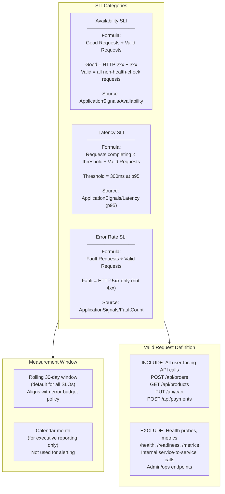
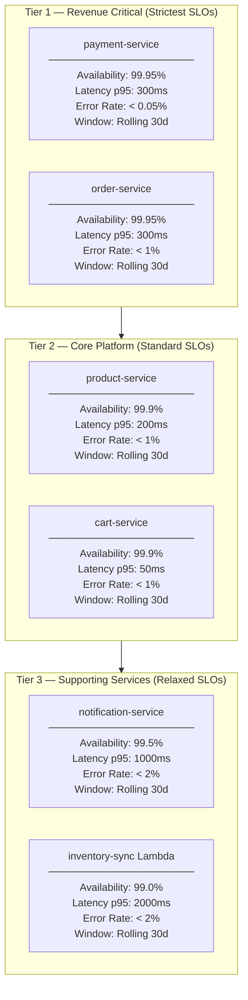
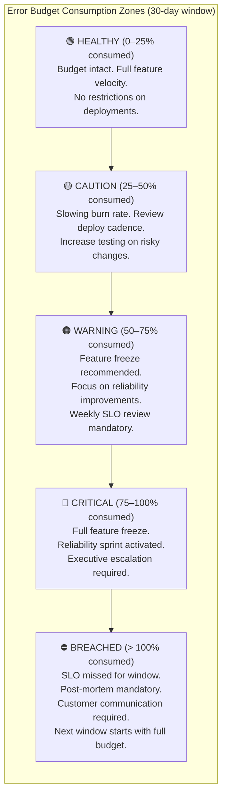
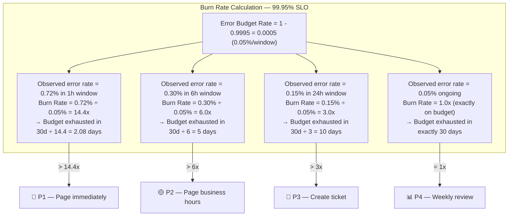
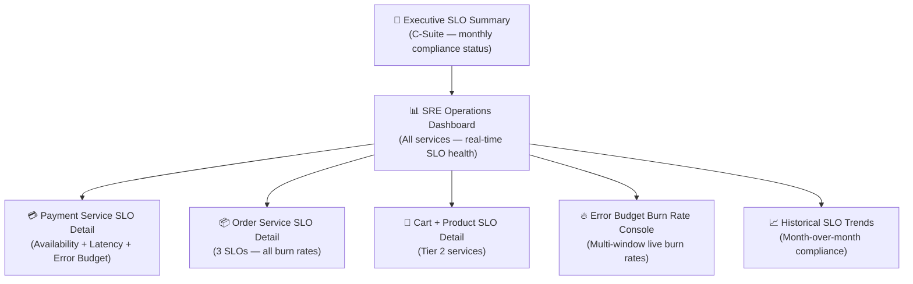
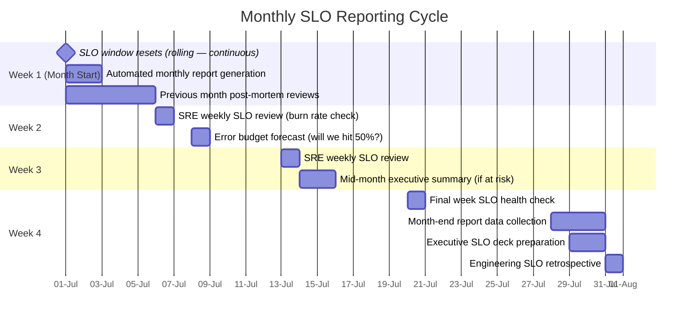
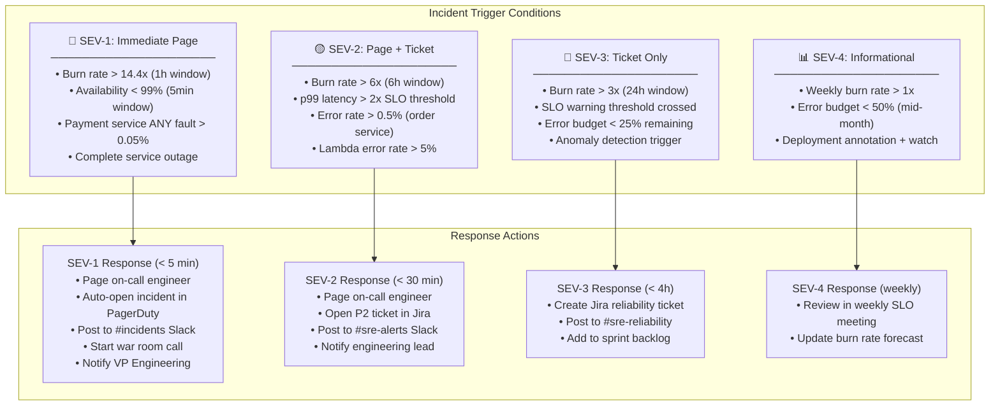
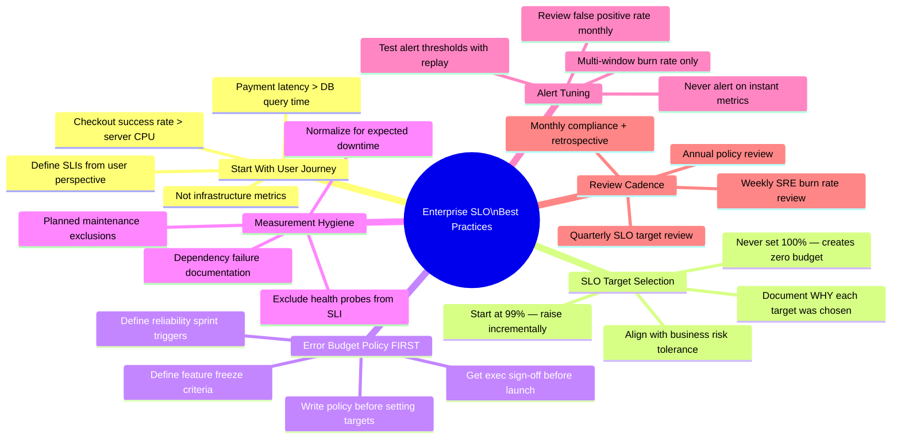
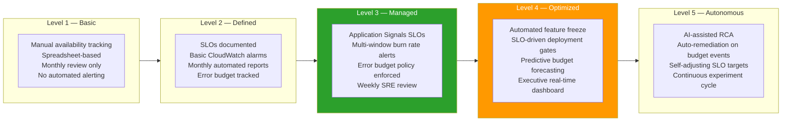

# Enterprise SLO Implementation
## CloudWatch Application Signals — AWS SRE Lead Design

> **Role**: AWS SRE Lead
> **Date**: 2026-07-18
> **Platform**: E-Commerce Microservices — Amazon EKS · Lambda · RDS · DynamoDB
> **Targets**: Availability 99.95% · Latency p95 < 300ms · Error Rate < 1%

---

## Table of Contents

1. [SLI Definitions](#1-sli-definitions)
2. [SLO Design](#2-slo-design)
3. [Error Budget Calculation](#3-error-budget-calculation)
4. [Burn Rate Alerts](#4-burn-rate-alerts)
5. [Dashboard Design](#5-dashboard-design)
6. [Monthly Reporting Strategy](#6-monthly-reporting-strategy)
7. [Incident Triggers](#7-incident-triggers)
8. [Executive Reporting](#8-executive-reporting)
9. [Best Practices](#9-best-practices)

---

## 1. SLI Definitions

### 1.1 SLI Taxonomy

An **SLI** (Service Level Indicator) is the precise metric that measures user experience. Every SLO is built on exactly one SLI. The SLI must be measurable, meaningful, and proportional to user impact.



### 1.2 SLI Specification per Service

| Service | SLI Name | Metric Source | Good Event Definition | Total Event Definition |
|---|---|---|---|---|
| Order Service | Availability | `ApplicationSignals/Availability` | HTTP 2xx/3xx responses | All non-probe requests |
| Order Service | Latency | `ApplicationSignals/Latency` | Requests completing ≤ 300ms | All non-probe requests |
| Order Service | Error Rate | `ApplicationSignals/FaultCount` | Requests without 5xx fault | All non-probe requests |
| Payment Service | Availability | `ApplicationSignals/Availability` | HTTP 2xx/3xx responses | All POST /payments |
| Payment Service | Latency | `ApplicationSignals/Latency` | Requests completing ≤ 300ms | All POST /payments |
| Product Service | Availability | `ApplicationSignals/Availability` | HTTP 2xx/3xx responses | All non-probe requests |
| Cart Service | Latency | `ApplicationSignals/Latency` | Requests completing ≤ 50ms | All non-probe requests |
| API Gateway | Availability | `AWS/ApiGateway/5XXError` | Requests without 5xx | Total count |

### 1.3 SLI Measurement Architecture

```mermaid
flowchart LR
    subgraph SOURCES["Raw Signal Sources"]
        OTEL["OTEL Spans\n(ADOT → X-Ray)\nspan.status + duration"]
        CW_AGENT["CloudWatch Agent\n(host + container metrics)"]
        APIGW_M["API Gateway Metrics\n(5XXError, Latency, Count)"]
    end

    subgraph ADOT_PROC["ADOT Processing"]
        APP_SIG_PROC["awsapplicationsignals processor\n(derives SLI from spans)\nAttaches service metadata"]
        EMF["EMF Writer\n(emits SLI as CW metrics)"]
    end

    subgraph CW_METRICS["CloudWatch Metrics"]
        NS_AVAIL["ApplicationSignals/Availability\nDimensions: Service, Operation, Environment, Region"]
        NS_LAT["ApplicationSignals/Latency\nDimensions: Service, Operation, Environment"]
        NS_FAULT["ApplicationSignals/FaultCount\nDimensions: Service, Operation, Environment"]
        NS_REQ["ApplicationSignals/RequestCount\nDimensions: Service, Operation, Environment"]
    end

    subgraph SLO_ENGINE["Application Signals SLO Engine"]
        SLI_COMP["SLI Computation\n(per 1-minute period)"]
        SLO_EVAL["SLO Evaluation\n(rolling window)"]
        BUDGET["Error Budget Tracker\n(real-time remaining %)"]
        BURN["Burn Rate Calculator\n(multi-window)"]
    end

    SOURCES --> ADOT_PROC
    ADOT_PROC --> CW_METRICS
    CW_METRICS --> SLO_ENGINE
    SLO_ENGINE -->|"SLOBudgetConsumedRatio\nSLOBurnRate metrics"| CW_ALARMS["CloudWatch Alarms"]
```



---

## 2. SLO Design

### 2.1 Enterprise SLO Matrix



### 2.2 SLO Creation — CloudFormation + Terraform

```hcl
# slos-production.tf

# ── SLO 1: Order Service Availability 99.95% ─────────────────────────────────
resource "aws_application_signals_service_level_objective" "order_availability" {
  name        = "OrderService-Availability-99.95"
  description = "Order Service must maintain 99.95% availability (success rate) over 30-day rolling window. Error budget = 21.9 minutes/month."

  sli {
    sli_metric {
      key_attributes = {
        Type        = "Service"
        Name        = "order-service"
        Environment = "production"
      }
      operation_name  = "ALL"
      metric_type     = "AVAILABILITY"
      statistic       = "Average"
      period_seconds  = 60
    }
    metric_threshold    = 0.9995   # 99.95% — good event ratio
    comparison_operator = "GreaterThanOrEqualTo"
  }

  goal {
    interval {
      rolling_interval {
        duration_unit = "DAY"
        duration      = 30
      }
    }
    attainment_goal   = 99.95   # Target
    warning_threshold = 99.97   # Warning before breach
  }

  tags = {
    Service     = "order-service"
    Tier        = "critical"
    Team        = "checkout"
    CostCenter  = "engineering"
    Environment = "production"
  }
}

# ── SLO 2: Order Service Latency p95 < 300ms ────────────────────────────────
resource "aws_application_signals_service_level_objective" "order_latency" {
  name        = "OrderService-Latency-p95-300ms"
  description = "95% of Order Service requests must complete in < 300ms. Rolling 30-day window."

  sli {
    sli_metric {
      key_attributes = {
        Type        = "Service"
        Name        = "order-service"
        Environment = "production"
      }
      operation_name  = "POST /api/orders"
      metric_type     = "LATENCY"
      statistic       = "p95"
      period_seconds  = 60
    }
    metric_threshold    = 300    # ms
    comparison_operator = "LessThan"
  }

  goal {
    interval {
      rolling_interval {
        duration_unit = "DAY"
        duration      = 30
      }
    }
    attainment_goal   = 95.0   # 95% of requests under 300ms
    warning_threshold = 96.5   # Warning at 96.5%
  }

  tags = {
    Service     = "order-service"
    Tier        = "critical"
    SLIType     = "latency"
    Environment = "production"
  }
}

# ── SLO 3: Order Service Error Rate < 1% ────────────────────────────────────
resource "aws_application_signals_service_level_objective" "order_error_rate" {
  name        = "OrderService-ErrorRate-LessThan1Pct"
  description = "Order Service 5xx fault rate must remain below 1%. Expressed as: > 99% fault-free."

  sli {
    sli_metric {
      key_attributes = {
        Type        = "Service"
        Name        = "order-service"
        Environment = "production"
      }
      operation_name  = "ALL"
      metric_type     = "AVAILABILITY"   # fault-free = 1 - fault_rate
      statistic       = "Average"
      period_seconds  = 60
    }
    metric_threshold    = 0.99   # 99% fault-free = < 1% error rate
    comparison_operator = "GreaterThanOrEqualTo"
  }

  goal {
    interval {
      rolling_interval {
        duration_unit = "DAY"
        duration      = 30
      }
    }
    attainment_goal   = 99.0   # 99% fault-free
    warning_threshold = 99.5
  }

  tags = {
    Service     = "order-service"
    Tier        = "critical"
    SLIType     = "error-rate"
    Environment = "production"
  }
}

# ── SLO 4: Payment Service Availability 99.95% ──────────────────────────────
resource "aws_application_signals_service_level_objective" "payment_availability" {
  name        = "PaymentService-Availability-99.95"
  description = "Payment Service — strictest SLO. 99.95% availability. Error budget = 21.9 min/month."

  sli {
    sli_metric {
      key_attributes = {
        Type        = "Service"
        Name        = "payment-service"
        Environment = "production"
      }
      operation_name  = "POST /api/payments"
      metric_type     = "AVAILABILITY"
      statistic       = "Average"
      period_seconds  = 60
    }
    metric_threshold    = 0.9995
    comparison_operator = "GreaterThanOrEqualTo"
  }

  goal {
    interval {
      rolling_interval {
        duration_unit = "DAY"
        duration      = 30
      }
    }
    attainment_goal   = 99.95
    warning_threshold = 99.97
  }

  tags = {
    Service     = "payment-service"
    Tier        = "critical"
    Compliance  = "pci-dss"
    Environment = "production"
  }
}
```

### 2.3 SLO via AWS CLI

```bash
# Quick CLI creation for Order Service Availability SLO
aws application-signals create-service-level-objective \
  --name "OrderService-Availability-99.95" \
  --description "Order Service 99.95% availability — 30d rolling window" \
  --sli '{
    "SliMetric": {
      "KeyAttributes": {
        "Type": "Service",
        "Name": "order-service",
        "Environment": "production"
      },
      "OperationName": "ALL",
      "MetricType": "AVAILABILITY",
      "Statistic": "Average",
      "PeriodSeconds": 60
    },
    "MetricThreshold": 0.9995,
    "ComparisonOperator": "GreaterThanOrEqualTo"
  }' \
  --goal '{
    "Interval": {
      "RollingInterval": {
        "DurationUnit": "DAY",
        "Duration": 30
      }
    },
    "AttainmentGoal": 99.95,
    "WarningThreshold": 99.97
  }' \
  --tags Team=checkout,Tier=critical,Environment=production \
  --region us-east-1

# List all SLOs with current attainment
aws application-signals list-service-level-objectives \
  --region us-east-1 \
  --query 'SloSummaries[*].{
    Name:Name,
    Attainment:SloSummary.AttainmentGoal,
    Status:SloSummary.Status
  }' \
  --output table

# Get SLO budget report for last 30 days
aws application-signals batch-get-service-level-objective-budget-report \
  --timestamp $(date -u +%Y-%m-%dT%H:%M:%SZ) \
  --slo-ids \
    "$(aws application-signals list-service-level-objectives \
      --query 'SloSummaries[*].Arn' --output text | tr '\t' ' ')" \
  --region us-east-1
```

---

## 3. Error Budget Calculation

### 3.1 Error Budget Mathematics

$$\text{Error Budget} = 1 - \text{SLO Target}$$

$$\text{Error Budget Minutes/Month} = (1 - \text{SLO Target}) \times 43{,}800 \text{ min/month}$$

$$\text{Error Budget Remaining} = 1 - \frac{\text{Bad Minutes}}{\text{Total Error Budget Minutes}}$$

$$\text{Burn Rate} = \frac{\text{Actual Error Rate}}{\text{Error Budget Rate}}$$

### 3.2 Error Budget Table — All Services

| Service | SLO | Error Rate Allowed | Budget (30d min) | Budget (30d sec) | 1% Burn = Used In |
|---|---|---|---|---|---|
| Payment Availability | 99.95% | 0.05% | **21.9 min** | 1,314 sec | 36.5 hours |
| Order Availability | 99.95% | 0.05% | **21.9 min** | 1,314 sec | 36.5 hours |
| Order Latency p95 | 95.0% | 5.00% | **2,190 min** | 131,400 sec | 1.5 days |
| Order Error Rate | 99.0% | 1.00% | **438 min** | 26,280 sec | 7.3 hours |
| Product Availability | 99.9% | 0.10% | **43.8 min** | 2,628 sec | 72.9 hours |
| Cart Availability | 99.9% | 0.10% | **43.8 min** | 2,628 sec | 72.9 hours |
| Notification Avail. | 99.5% | 0.50% | **219 min** | 13,140 sec | 15.2 hours |

### 3.3 Error Budget Burn Rate Zones



### 3.4 Error Budget Policy (Formal Definition)

```markdown
## Error Budget Policy — E-Commerce Platform

### Tier 1 Services (Payment, Order)
| Budget Consumed | Action |
|---|---|
| 0–25% | Full deployment velocity. All changes allowed. |
| 25–50% | Engineering lead reviews all risky deployments. Increase pre-prod testing. |
| 50–75% | Feature freeze. Only bug fixes and reliability improvements to production. SRE + Engineering weekly sync. |
| 75–100% | Full freeze. Only security patches and critical bug fixes. Daily SRE standup. VP Engineering notified. |
| > 100% (Breach) | Post-mortem within 48h. Customer impact assessment. 30-day reliability sprint. Roadmap reprioritization. |

### Error Budget Reset
- Window resets on the 1st of each calendar month (for reporting)
- Rolling 30-day window used for real-time alerting (never resets artificially)

### Exceptions
- Planned maintenance windows: pre-agreed with stakeholders, excluded from error budget
- Dependency failures (AWS service incident): documented, may be excluded via incident record
```

### 3.5 Real-Time Budget Tracking Query

```bash
# Get current error budget consumption for all SLOs
aws application-signals batch-get-service-level-objective-budget-report \
  --timestamp "$(date -u +%Y-%m-%dT%H:%M:%SZ)" \
  --slo-ids \
    "arn:aws:application-signals:us-east-1:123456789012:slo/OrderService-Availability-99.95" \
    "arn:aws:application-signals:us-east-1:123456789012:slo/PaymentService-Availability-99.95" \
    "arn:aws:application-signals:us-east-1:123456789012:slo/OrderService-Latency-p95-300ms" \
  --region us-east-1 \
  --query 'Reports[*].{
    SLO:Slo.Name,
    Attainment:BudgetReport.Attainment,
    TotalBudgetMinutes:BudgetReport.TotalBudgetInMinutes,
    BudgetConsumed:BudgetReport.BudgetConsumed,
    BudgetRemaining:BudgetReport.BudgetRemaining,
    Requests:BudgetReport.Requests.GoodCount
  }' \
  --output table
```

---

## 4. Burn Rate Alerts

### 4.1 Multi-Window Burn Rate Theory

The Google SRE Book multi-window alerting approach detects budget exhaustion at multiple time horizons. Two windows per alert prevent false positives (long window) while enabling fast detection (short window).

$$\text{Burn Rate} = \frac{\text{Error Rate in window}}{\text{SLO Error Budget Rate}}$$

**Example**: SLO = 99.95% → Error budget = 0.05%
- If observed error rate = 0.72% in 1h window:
- Burn rate = 0.72% ÷ 0.05% = **14.4x** → exhausts 30-day budget in ~2.1 days

### 4.2 Burn Rate Alert Matrix

| Alert Name | Short Window | Long Window | Burn Rate | Response | Budget Consumed If Unresolved |
|---|---|---|---|---|---|
| **P1-FastBurn** | 5min | 1h | > 14.4x | **Page immediately** | 100% in ~52 min |
| **P2-FastBurn** | 30min | 6h | > 6x | **Page (biz hours)** | 100% in ~5 hours |
| **P3-SlowBurn** | 2h | 24h | > 3x | **Ticket + Slack** | 100% in ~10 days |
| **P4-VerySlowBurn** | 6h | 72h | > 1x | **Weekly review** | On track to miss SLO |

### 4.3 Burn Rate Alarm CloudFormation

```yaml
# burn-rate-alarms.yaml
AWSTemplateFormatVersion: "2010-09-09"
Description: Multi-window SLO burn rate alarms — E-Commerce Platform

Parameters:
  SNSCriticalArn:
    Type: String
  SNSWarningArn:
    Type: String
  SNSInfoArn:
    Type: String

Resources:

  # ═══════════════════════════════════════════════════════════════════════════
  # ORDER SERVICE — AVAILABILITY SLO (99.95%)
  # Error budget rate = 0.0005 (0.05%)
  # ═══════════════════════════════════════════════════════════════════════════

  # ── P1 Fast Burn: 1-hour window × 14.4x burn rate ───────────────────────
  OrderAvailP1BurnAlarm:
    Type: AWS::CloudWatch::Alarm
    Properties:
      AlarmName: slo-order-availability-p1-fast-burn
      AlarmDescription: |
        🔴 P1: Order Service availability error budget burning at > 14.4x rate.
        At this rate, entire 30-day error budget exhausted in < 52 minutes.
        Target SLO: 99.95% | Budget: 21.9 min/30d
        Runbook: https://wiki.internal/runbooks/slo-order-availability
      Metrics:
        - Id: fault_rate_1h
          MetricStat:
            Metric:
              Namespace: ApplicationSignals
              MetricName: FaultCount
              Dimensions:
                - Name: Service
                  Value: order-service
                - Name: Environment
                  Value: production
            Period: 3600    # 1-hour window
            Stat: Sum
          ReturnData: false
        - Id: request_count_1h
          MetricStat:
            Metric:
              Namespace: ApplicationSignals
              MetricName: RequestCount
              Dimensions:
                - Name: Service
                  Value: order-service
                - Name: Environment
                  Value: production
            Period: 3600
            Stat: Sum
          ReturnData: false
        # Burn rate = (fault_rate / budget_rate) = (faults/requests) / 0.0005
        - Id: burn_rate_1h
          Expression: "(fault_rate_1h / request_count_1h) / 0.0005"
          Label: "Burn Rate 1h"
          ReturnData: true
      ComparisonOperator: GreaterThanThreshold
      Threshold: 14.4
      EvaluationPeriods: 1
      DatapointsToAlarm: 1
      TreatMissingData: notBreaching
      AlarmActions:
        - !Ref SNSCriticalArn
      OKActions:
        - !Ref SNSCriticalArn

  # ── P2 Slow Burn: 6-hour window × 6x burn rate ──────────────────────────
  OrderAvailP2BurnAlarm:
    Type: AWS::CloudWatch::Alarm
    Properties:
      AlarmName: slo-order-availability-p2-slow-burn
      AlarmDescription: |
        🟡 P2: Order Service availability error budget burning at > 6x rate.
        At this rate, entire 30-day error budget exhausted in < 5 hours.
        Target SLO: 99.95%
      Metrics:
        - Id: fault_rate_6h
          MetricStat:
            Metric:
              Namespace: ApplicationSignals
              MetricName: FaultCount
              Dimensions:
                - Name: Service
                  Value: order-service
                - Name: Environment
                  Value: production
            Period: 21600   # 6-hour window
            Stat: Sum
          ReturnData: false
        - Id: request_count_6h
          MetricStat:
            Metric:
              Namespace: ApplicationSignals
              MetricName: RequestCount
              Dimensions:
                - Name: Service
                  Value: order-service
                - Name: Environment
                  Value: production
            Period: 21600
            Stat: Sum
          ReturnData: false
        - Id: burn_rate_6h
          Expression: "(fault_rate_6h / request_count_6h) / 0.0005"
          Label: "Burn Rate 6h"
          ReturnData: true
      ComparisonOperator: GreaterThanThreshold
      Threshold: 6.0
      EvaluationPeriods: 1
      DatapointsToAlarm: 1
      TreatMissingData: notBreaching
      AlarmActions:
        - !Ref SNSWarningArn

  # ── P3 Slow Burn: 24-hour window × 3x burn rate ─────────────────────────
  OrderAvailP3BurnAlarm:
    Type: AWS::CloudWatch::Alarm
    Properties:
      AlarmName: slo-order-availability-p3-creeping-burn
      AlarmDescription: |
        📧 P3: Order Service availability error budget burning at > 3x rate.
        Budget will be exhausted in < 10 days if not addressed.
      Metrics:
        - Id: fault_rate_24h
          MetricStat:
            Metric:
              Namespace: ApplicationSignals
              MetricName: FaultCount
              Dimensions:
                - Name: Service
                  Value: order-service
                - Name: Environment
                  Value: production
            Period: 86400   # 24-hour window
            Stat: Sum
          ReturnData: false
        - Id: request_count_24h
          MetricStat:
            Metric:
              Namespace: ApplicationSignals
              MetricName: RequestCount
              Dimensions:
                - Name: Service
                  Value: order-service
                - Name: Environment
                  Value: production
            Period: 86400
            Stat: Sum
          ReturnData: false
        - Id: burn_rate_24h
          Expression: "(fault_rate_24h / request_count_24h) / 0.0005"
          Label: "Burn Rate 24h"
          ReturnData: true
      ComparisonOperator: GreaterThanThreshold
      Threshold: 3.0
      EvaluationPeriods: 1
      TreatMissingData: notBreaching
      AlarmActions:
        - !Ref SNSInfoArn

  # ═══════════════════════════════════════════════════════════════════════════
  # PAYMENT SERVICE — AVAILABILITY SLO (99.95%)
  # ═══════════════════════════════════════════════════════════════════════════

  PaymentAvailP1BurnAlarm:
    Type: AWS::CloudWatch::Alarm
    Properties:
      AlarmName: slo-payment-availability-p1-fast-burn
      AlarmDescription: |
        🔴 P1 CRITICAL: Payment Service availability burning at > 14.4x.
        FINANCIAL IMPACT: Payment failures directly affect revenue.
        SLO: 99.95% | Budget: 21.9 min/30d
        Runbook: https://wiki.internal/runbooks/payment-critical
      Metrics:
        - Id: payment_fault_1h
          MetricStat:
            Metric:
              Namespace: ApplicationSignals
              MetricName: FaultCount
              Dimensions:
                - Name: Service
                  Value: payment-service
                - Name: Operation
                  Value: "POST /api/payments"
                - Name: Environment
                  Value: production
            Period: 3600
            Stat: Sum
          ReturnData: false
        - Id: payment_req_1h
          MetricStat:
            Metric:
              Namespace: ApplicationSignals
              MetricName: RequestCount
              Dimensions:
                - Name: Service
                  Value: payment-service
                - Name: Operation
                  Value: "POST /api/payments"
                - Name: Environment
                  Value: production
            Period: 3600
            Stat: Sum
          ReturnData: false
        - Id: payment_burn_1h
          Expression: "(payment_fault_1h / payment_req_1h) / 0.0005"
          ReturnData: true
      ComparisonOperator: GreaterThanThreshold
      Threshold: 14.4
      EvaluationPeriods: 1
      TreatMissingData: breaching   # Payment: missing data = treat as problem
      AlarmActions:
        - !Ref SNSCriticalArn

  # ═══════════════════════════════════════════════════════════════════════════
  # LATENCY SLO — ORDER SERVICE (p95 < 300ms = 95% attainment)
  # Budget rate = 0.05 (5% of requests can be slow)
  # ═══════════════════════════════════════════════════════════════════════════

  OrderLatencyP1BurnAlarm:
    Type: AWS::CloudWatch::Alarm
    Properties:
      AlarmName: slo-order-latency-p1-fast-burn
      AlarmDescription: |
        🔴 P1: Order Service latency SLO burning at > 14.4x rate.
        p95 latency is significantly above 300ms threshold.
        SLO: 95% of requests < 300ms
      Namespace: ApplicationSignals
      MetricName: Latency
      Dimensions:
        - Name: Service
          Value: order-service
        - Name: Environment
          Value: production
      ExtendedStatistic: p95
      Period: 3600
      EvaluationPeriods: 1
      # p95 of 300ms * 14.4 burn = requests taking ~4.3s (severe degradation)
      Threshold: 4320   # 300ms * 14.4 burn rate
      ComparisonOperator: GreaterThanThreshold
      TreatMissingData: notBreaching
      AlarmActions:
        - !Ref SNSCriticalArn

  # ── Composite: Any Tier-1 SLO P1 Breach ──────────────────────────────────
  Tier1SLOCompositeAlarm:
    Type: AWS::CloudWatch::CompositeAlarm
    Properties:
      AlarmName: slo-tier1-any-critical-breach
      AlarmDescription: |
        🚨 TIER 1 SLO BREACH: At least one critical service is burning error budget at P1 rate.
        Declare incident immediately.
        Dashboard: https://grafana.internal/d/slo-dashboard
      AlarmRule: >
        ALARM("slo-order-availability-p1-fast-burn") OR
        ALARM("slo-payment-availability-p1-fast-burn") OR
        ALARM("slo-order-latency-p1-fast-burn")
      AlarmActions:
        - !Ref SNSCriticalArn
      OKActions:
        - !Ref SNSCriticalArn
```

### 4.4 Burn Rate Visualization



---

## 5. Dashboard Design

### 5.1 SLO Dashboard Hierarchy



### 5.2 SRE Operations SLO Dashboard JSON

```json
{
  "widgets": [
    {
      "type": "text",
      "properties": {
        "markdown": "# 🎯 Enterprise SLO Dashboard — Production\n**SLO Targets**: Availability 99.95% · Latency p95 < 300ms · Error Rate < 1%\n\n| Status | Meaning |\n|---|---|\n| 🟢 | SLO healthy — budget intact |\n| 🟡 | Warning threshold crossed — slow burn |\n| 🔴 | P1/P2 burn rate — immediate action |\n| ⛔ | SLO breached — post-mortem required |"
      }
    },
    {
      "type": "metric",
      "properties": {
        "title": "🎯 Current SLO Attainment — All Critical Services (Rolling 30d)",
        "view": "singleValue",
        "sparkline": true,
        "metrics": [
          ["ApplicationSignals", "Availability", "Service", "order-service",   "Environment", "production",
           {"stat": "Average", "period": 2592000, "label": "Order Availability"}],
          ["ApplicationSignals", "Availability", "Service", "payment-service", "Environment", "production",
           {"stat": "Average", "period": 2592000, "label": "Payment Availability"}],
          ["ApplicationSignals", "Availability", "Service", "product-service", "Environment", "production",
           {"stat": "Average", "period": 2592000, "label": "Product Availability"}],
          ["ApplicationSignals", "Availability", "Service", "cart-service",    "Environment", "production",
           {"stat": "Average", "period": 2592000, "label": "Cart Availability"}]
        ]
      }
    },
    {
      "type": "metric",
      "properties": {
        "title": "🔥 Error Budget Consumed — Rolling 30d (%)",
        "view": "timeSeries",
        "stacked": false,
        "metrics": [
          [{"expression": "((1 - m1) / 0.0005) * 100",
            "label": "Order Budget Consumed %", "id": "order_consumed", "color": "#1f77b4"}],
          ["ApplicationSignals", "Availability", "Service", "order-service", "Environment", "production",
           {"stat": "Average", "period": 86400, "id": "m1", "visible": false}],
          [{"expression": "((1 - m2) / 0.0005) * 100",
            "label": "Payment Budget Consumed %", "id": "pay_consumed", "color": "#d62728"}],
          ["ApplicationSignals", "Availability", "Service", "payment-service", "Environment", "production",
           {"stat": "Average", "period": 86400, "id": "m2", "visible": false}]
        ],
        "annotations": {
          "horizontal": [
            {"value": 25,  "color": "#2ca02c", "label": "25% — Healthy"},
            {"value": 50,  "color": "#ff9900", "label": "50% — Caution"},
            {"value": 75,  "color": "#ff4500", "label": "75% — Warning"},
            {"value": 100, "color": "#d62728", "label": "100% — BREACH"}
          ]
        },
        "yAxis": {"left": {"min": 0, "max": 120, "label": "% Budget Consumed"}}
      }
    },
    {
      "type": "metric",
      "properties": {
        "title": "⏱ Burn Rate — Order Service (1h window)",
        "view": "timeSeries",
        "metrics": [
          [{"expression": "(m1 / m2) / 0.0005",
            "label": "Order Burn Rate (1h)", "id": "burn_1h", "color": "#d62728"}],
          ["ApplicationSignals", "FaultCount",   "Service", "order-service", "Environment", "production",
           {"stat": "Sum", "period": 3600, "id": "m1", "visible": false}],
          ["ApplicationSignals", "RequestCount", "Service", "order-service", "Environment", "production",
           {"stat": "Sum", "period": 3600, "id": "m2", "visible": false}]
        ],
        "annotations": {
          "horizontal": [
            {"value": 14.4, "color": "#d62728", "label": "14.4x — P1 Fast Burn"},
            {"value": 6.0,  "color": "#ff9900", "label": "6x — P2 Slow Burn"},
            {"value": 3.0,  "color": "#ff4500", "label": "3x — P3 Creeping"},
            {"value": 1.0,  "color": "#2ca02c", "label": "1x — On Budget"}
          ]
        },
        "yAxis": {"left": {"min": 0, "max": 20}}
      }
    },
    {
      "type": "metric",
      "properties": {
        "title": "📈 Latency SLI — Order Service p95 (target: < 300ms)",
        "view": "timeSeries",
        "metrics": [
          ["ApplicationSignals", "Latency", "Service", "order-service",   "Environment", "production",
           {"stat": "p50", "period": 300, "label": "p50",   "color": "#2ca02c"}],
          ["ApplicationSignals", "Latency", "Service", "order-service",   "Environment", "production",
           {"stat": "p95", "period": 300, "label": "p95",   "color": "#ff9900"}],
          ["ApplicationSignals", "Latency", "Service", "order-service",   "Environment", "production",
           {"stat": "p99", "period": 300, "label": "p99",   "color": "#d62728"}],
          ["ApplicationSignals", "Latency", "Service", "payment-service", "Environment", "production",
           {"stat": "p95", "period": 300, "label": "Payment p95", "color": "#9467bd"}]
        ],
        "annotations": {
          "horizontal": [
            {"value": 300, "color": "#ff9900", "label": "SLO threshold — 300ms"},
            {"value": 500, "color": "#d62728", "label": "P1 threshold — 500ms"}
          ]
        }
      }
    },
    {
      "type": "metric",
      "properties": {
        "title": "❌ Error Rate — All Services (target: < 1%)",
        "view": "timeSeries",
        "metrics": [
          [{"expression": "(m1 / m2) * 100", "label": "Order Error %",   "id": "e1", "color": "#1f77b4"}],
          ["ApplicationSignals", "FaultCount",   "Service", "order-service",
           "Environment", "production", {"stat": "Sum", "period": 300, "id": "m1", "visible": false}],
          ["ApplicationSignals", "RequestCount", "Service", "order-service",
           "Environment", "production", {"stat": "Sum", "period": 300, "id": "m2", "visible": false}],
          [{"expression": "(m3 / m4) * 100", "label": "Payment Error %", "id": "e2", "color": "#d62728"}],
          ["ApplicationSignals", "FaultCount",   "Service", "payment-service",
           "Environment", "production", {"stat": "Sum", "period": 300, "id": "m3", "visible": false}],
          ["ApplicationSignals", "RequestCount", "Service", "payment-service",
           "Environment", "production", {"stat": "Sum", "period": 300, "id": "m4", "visible": false}]
        ],
        "annotations": {
          "horizontal": [
            {"value": 0.05, "color": "#ff4500", "label": "Payment SLO limit (0.05%)"},
            {"value": 1.0,  "color": "#ff9900", "label": "Order SLO limit (1%)"}
          ]
        },
        "yAxis": {"left": {"min": 0, "max": 5, "label": "%"}}
      }
    },
    {
      "type": "alarm",
      "properties": {
        "title": "🚨 Active SLO Alarms",
        "alarms": [
          "arn:aws:cloudwatch:us-east-1:123456789012:alarm:slo-tier1-any-critical-breach",
          "arn:aws:cloudwatch:us-east-1:123456789012:alarm:slo-order-availability-p1-fast-burn",
          "arn:aws:cloudwatch:us-east-1:123456789012:alarm:slo-payment-availability-p1-fast-burn",
          "arn:aws:cloudwatch:us-east-1:123456789012:alarm:slo-order-availability-p2-slow-burn",
          "arn:aws:cloudwatch:us-east-1:123456789012:alarm:slo-order-latency-p1-fast-burn"
        ]
      }
    },
    {
      "type": "metric",
      "properties": {
        "title": "📊 Request Volume — All Services (RPS)",
        "view": "timeSeries",
        "metrics": [
          ["ApplicationSignals", "RequestCount", "Service", "order-service",   "Environment", "production",
           {"stat": "SampleCount", "period": 60, "label": "Orders RPS"}],
          ["ApplicationSignals", "RequestCount", "Service", "payment-service", "Environment", "production",
           {"stat": "SampleCount", "period": 60, "label": "Payments RPS"}],
          ["ApplicationSignals", "RequestCount", "Service", "product-service", "Environment", "production",
           {"stat": "SampleCount", "period": 60, "label": "Products RPS"}],
          ["ApplicationSignals", "RequestCount", "Service", "cart-service",    "Environment", "production",
           {"stat": "SampleCount", "period": 60, "label": "Cart RPS"}]
        ]
      }
    }
  ]
}
```

---

## 6. Monthly Reporting Strategy

### 6.1 Reporting Cadence



### 6.2 Automated Monthly Report Generator

```python
#!/usr/bin/env python3
# generate_slo_report.py — Run on 1st of each month via EventBridge + Lambda

import boto3
import json
from datetime import datetime, timedelta, timezone
from dataclasses import dataclass, field
from typing import Optional
import statistics

@dataclass
class SLOReport:
    slo_name: str
    target_pct: float
    window_days: int
    attainment_pct: float
    error_budget_total_min: float
    error_budget_consumed_min: float
    error_budget_remaining_pct: float
    incidents_in_period: int
    longest_incident_min: float
    mttr_min: float
    trend: str        # "improving" | "stable" | "degrading"
    compliance: bool  # True if SLO met


class SLOReportGenerator:
    def __init__(self, region: str = "us-east-1"):
        self.app_signals = boto3.client("application-signals", region_name=region)
        self.cloudwatch  = boto3.client("cloudwatch",          region_name=region)
        self.ses         = boto3.client("ses",                 region_name=region)
        self.s3          = boto3.client("s3",                  region_name=region)

    def generate_monthly_report(self, report_month: str = None) -> dict:
        """Generate comprehensive SLO report for a calendar month."""

        now = datetime.now(timezone.utc)
        if report_month:
            year, month = map(int, report_month.split("-"))
        else:
            # Previous month
            if now.month == 1:
                year, month = now.year - 1, 12
            else:
                year, month = now.year, now.month - 1

        # Get first and last day of the report month
        from calendar import monthrange
        _, days_in_month = monthrange(year, month)
        period_start = datetime(year, month, 1,  tzinfo=timezone.utc)
        period_end   = datetime(year, month, days_in_month, 23, 59, 59, tzinfo=timezone.utc)

        print(f"Generating SLO report for {year}-{month:02d}")

        # Fetch all SLOs
        slos = self._list_all_slos()
        reports = []

        for slo in slos:
            report = self._compute_slo_metrics(slo, period_start, period_end)
            if report:
                reports.append(report)

        # Build report document
        report_doc = {
            "reportId":       f"slo-report-{year}-{month:02d}",
            "generatedAt":    now.isoformat(),
            "reportPeriod":   f"{year}-{month:02d}",
            "periodStart":    period_start.isoformat(),
            "periodEnd":      period_end.isoformat(),
            "daysInPeriod":   days_in_month,
            "overallHealth":  self._compute_overall_health(reports),
            "sloReports":     [self._to_dict(r) for r in reports],
            "summary":        self._generate_summary(reports),
            "recommendations": self._generate_recommendations(reports)
        }

        # Archive to S3
        self._archive_report(report_doc, year, month)

        # Send email reports to stakeholders
        self._send_sre_report(report_doc)
        self._send_executive_summary(report_doc)

        return report_doc

    def _compute_slo_metrics(
        self,
        slo: dict,
        start: datetime,
        end: datetime
    ) -> Optional[SLOReport]:
        """Fetch SLO metrics for the reporting period."""
        try:
            # Get budget report from Application Signals
            response = self.app_signals.batch_get_service_level_objective_budget_report(
                Timestamp=end,
                SloIds=[slo["Arn"]]
            )

            if not response.get("Reports"):
                return None

            report_data = response["Reports"][0]["BudgetReport"]
            slo_config   = response["Reports"][0]["Slo"]

            target = slo_config["Goal"]["AttainmentGoal"]
            error_budget_rate = (100 - target) / 100

            # Total budget in minutes for the window
            window_days   = slo_config["Goal"]["Interval"]["RollingInterval"]["Duration"]
            total_minutes = window_days * 24 * 60
            budget_minutes = total_minutes * error_budget_rate

            attainment = report_data.get("Attainment", target)
            consumed_ratio = report_data.get("BudgetConsumed", 0)
            consumed_min = consumed_ratio * budget_minutes
            remaining_pct = max(0, (1 - consumed_ratio) * 100)

            # Determine trend (compare to previous period)
            trend = self._compute_trend(slo["Arn"], attainment, start)

            return SLOReport(
                slo_name=slo["Name"],
                target_pct=target,
                window_days=window_days,
                attainment_pct=round(attainment, 4),
                error_budget_total_min=round(budget_minutes, 1),
                error_budget_consumed_min=round(consumed_min, 1),
                error_budget_remaining_pct=round(remaining_pct, 1),
                incidents_in_period=self._count_incidents(slo["Name"], start, end),
                longest_incident_min=self._get_longest_incident(slo["Name"], start, end),
                mttr_min=self._get_mttr(slo["Name"], start, end),
                trend=trend,
                compliance=(attainment >= target)
            )
        except Exception as e:
            print(f"Error computing SLO metrics for {slo.get('Name')}: {e}")
            return None

    def _compute_overall_health(self, reports: list) -> str:
        if not reports:
            return "unknown"
        compliant     = sum(1 for r in reports if r.compliance)
        total         = len(reports)
        compliance_pct = (compliant / total) * 100

        if compliance_pct == 100: return "green"
        if compliance_pct >= 80:  return "yellow"
        return "red"

    def _generate_summary(self, reports: list) -> dict:
        return {
            "totalSLOs":        len(reports),
            "compliantSLOs":    sum(1 for r in reports if r.compliance),
            "breachedSLOs":     [r.slo_name for r in reports if not r.compliance],
            "avgAttainment":    round(statistics.mean(r.attainment_pct for r in reports), 4) if reports else 0,
            "lowestAttainment": min((r.attainment_pct for r in reports), default=0),
            "totalIncidents":   sum(r.incidents_in_period for r in reports),
            "avgMTTR_min":      round(statistics.mean(r.mttr_min for r in reports if r.mttr_min > 0), 1) if reports else 0
        }

    def _generate_recommendations(self, reports: list) -> list:
        recommendations = []
        for r in reports:
            if not r.compliance:
                recommendations.append({
                    "severity": "critical",
                    "slo":      r.slo_name,
                    "action":   f"SLO breached. Attained {r.attainment_pct:.3f}% vs target {r.target_pct:.2f}%. Initiate reliability sprint."
                })
            elif r.error_budget_remaining_pct < 25:
                recommendations.append({
                    "severity": "warning",
                    "slo":      r.slo_name,
                    "action":   f"Only {r.error_budget_remaining_pct:.1f}% budget remaining. Consider deployment freeze."
                })
            elif r.trend == "degrading":
                recommendations.append({
                    "severity": "info",
                    "slo":      r.slo_name,
                    "action":   "Attainment trending downward vs last month. Investigate root causes."
                })
        return recommendations

    def _to_dict(self, r: SLOReport) -> dict:
        return {
            "sloName":                   r.slo_name,
            "targetPct":                 r.target_pct,
            "attainmentPct":             r.attainment_pct,
            "compliance":                r.compliance,
            "errorBudgetTotalMin":       r.error_budget_total_min,
            "errorBudgetConsumedMin":    r.error_budget_consumed_min,
            "errorBudgetRemainingPct":   r.error_budget_remaining_pct,
            "incidentsInPeriod":         r.incidents_in_period,
            "longestIncidentMin":        r.longest_incident_min,
            "mttrMin":                   r.mttr_min,
            "trend":                     r.trend
        }

    def _archive_report(self, report: dict, year: int, month: int):
        """Archive report to S3 for historical analysis."""
        key = f"slo-reports/{year}/{month:02d}/slo-report-{year}-{month:02d}.json"
        self.s3.put_object(
            Bucket="ecommerce-slo-reports",
            Key=key,
            Body=json.dumps(report, indent=2, default=str),
            ContentType="application/json",
            ServerSideEncryption="aws:kms"
        )
        print(f"Report archived to s3://ecommerce-slo-reports/{key}")

    def _list_all_slos(self) -> list:
        """Paginate through all SLOs."""
        slos = []
        paginator = self.app_signals.get_paginator("list_service_level_objectives")
        for page in paginator.paginate():
            slos.extend(page.get("SloSummaries", []))
        return slos

    # Stub implementations — replace with actual alarm history queries
    def _count_incidents(self, slo_name: str, start: datetime, end: datetime) -> int:
        return 0  # Query CloudWatch alarm history

    def _get_longest_incident(self, slo_name: str, start: datetime, end: datetime) -> float:
        return 0.0

    def _get_mttr(self, slo_name: str, start: datetime, end: datetime) -> float:
        return 0.0

    def _compute_trend(self, slo_arn: str, current_attainment: float, start: datetime) -> str:
        return "stable"  # Compare to previous 30-day period

    def _send_sre_report(self, report: dict):
        pass  # SES email to sre@company.com

    def _send_executive_summary(self, report: dict):
        pass  # SES email to vp-engineering@company.com


# Lambda handler
def lambda_handler(event, context):
    generator = SLOReportGenerator(region="us-east-1")
    report = generator.generate_monthly_report()
    return {"statusCode": 200, "reportId": report["reportId"]}
```

### 6.3 EventBridge Schedule for Automated Reporting

```hcl
# reporting-schedule.tf

# Monthly report on 1st of each month at 08:00 UTC
resource "aws_cloudwatch_event_rule" "monthly_slo_report" {
  name                = "monthly-slo-report-trigger"
  description         = "Trigger monthly SLO report generation"
  schedule_expression = "cron(0 8 1 * ? *)"   # 1st of every month at 08:00 UTC
  state               = "ENABLED"
}

resource "aws_cloudwatch_event_target" "slo_report_lambda" {
  rule      = aws_cloudwatch_event_rule.monthly_slo_report.name
  target_id = "SLOReportLambda"
  arn       = aws_lambda_function.slo_reporter.arn
  input     = jsonencode({ trigger = "scheduled", type = "monthly" })
}

# Weekly SRE review trigger (every Monday 09:00 UTC)
resource "aws_cloudwatch_event_rule" "weekly_slo_review" {
  name                = "weekly-slo-review-trigger"
  description         = "Trigger weekly SLO burn rate review"
  schedule_expression = "cron(0 9 ? * MON *)"
  state               = "ENABLED"
}
```

---

## 7. Incident Triggers

### 7.1 Incident Escalation Matrix



### 7.2 SNS → PagerDuty → Jira Automation

```python
# lambda/incident_router/handler.py
# Triggered by SNS from CloudWatch alarm state changes

import boto3
import json
import os
import urllib.request
import urllib.parse
from datetime import datetime, timezone

PAGERDUTY_ROUTING_KEY = os.environ["PAGERDUTY_ROUTING_KEY"]   # from Secrets Manager
SLACK_WEBHOOK_URL     = os.environ["SLACK_WEBHOOK_URL"]        # from Secrets Manager
JIRA_API_URL          = os.environ["JIRA_API_URL"]
JIRA_API_TOKEN        = os.environ["JIRA_API_TOKEN"]           # from Secrets Manager

secrets_client = boto3.client("secretsmanager")

def lambda_handler(event, context):
    for record in event.get("Records", []):
        message = json.loads(record["Sns"]["Message"])
        process_alarm(message)
    return {"statusCode": 200}


def process_alarm(alarm_message: dict):
    alarm_name  = alarm_message.get("AlarmName", "unknown")
    new_state   = alarm_message.get("NewStateValue")
    reason      = alarm_message.get("NewStateReason", "")
    timestamp   = alarm_message.get("StateChangeTime", datetime.now(timezone.utc).isoformat())

    if new_state != "ALARM":
        # Send OK/resolved notification
        post_slack_resolution(alarm_name, timestamp)
        return

    # Determine severity from alarm name prefix
    severity = classify_severity(alarm_name)

    incident_data = {
        "alarm":     alarm_name,
        "severity":  severity,
        "reason":    reason,
        "timestamp": timestamp,
        "dashboardUrl": "https://grafana.internal/d/slo-dashboard",
        "runbookUrl":   get_runbook_url(alarm_name)
    }

    # Always post to Slack
    post_slack_alert(incident_data)

    if severity in ("SEV-1", "SEV-2"):
        # Trigger PagerDuty incident
        create_pagerduty_incident(incident_data)

    if severity in ("SEV-2", "SEV-3"):
        # Create Jira reliability ticket
        create_jira_ticket(incident_data)


def classify_severity(alarm_name: str) -> str:
    if "p1-fast-burn" in alarm_name or "critical-breach" in alarm_name:
        return "SEV-1"
    if "p2-slow-burn" in alarm_name:
        return "SEV-2"
    if "p3-creeping" in alarm_name:
        return "SEV-3"
    return "SEV-4"


def create_pagerduty_incident(data: dict):
    """Create PagerDuty incident via Events API v2."""
    severity_map = {"SEV-1": "critical", "SEV-2": "warning", "SEV-3": "info"}

    payload = {
        "routing_key":  PAGERDUTY_ROUTING_KEY,
        "event_action": "trigger",
        "dedup_key":    f"slo-{data['alarm']}-{data['timestamp'][:10]}",
        "payload": {
            "summary":   f"[{data['severity']}] SLO Burn Rate Alert: {data['alarm']}",
            "severity":  severity_map.get(data["severity"], "warning"),
            "source":    "CloudWatch Application Signals",
            "timestamp": data["timestamp"],
            "component": data["alarm"].split("-")[1] if "-" in data["alarm"] else "unknown",
            "group":     "slo-alerts",
            "custom_details": {
                "alarm":       data["alarm"],
                "reason":      data["reason"],
                "dashboard":   data["dashboardUrl"],
                "runbook":     data["runbookUrl"]
            }
        },
        "links": [
            {"href": data["dashboardUrl"], "text": "SLO Dashboard"},
            {"href": data["runbookUrl"],   "text": "Runbook"}
        ]
    }

    req = urllib.request.Request(
        "https://events.pagerduty.com/v2/enqueue",
        data=json.dumps(payload).encode(),
        headers={"Content-Type": "application/json"},
        method="POST"
    )
    with urllib.request.urlopen(req, timeout=10) as response:
        print(f"PagerDuty: {response.status} — {response.read().decode()}")


def post_slack_alert(data: dict):
    """Post structured Slack alert with SLO context."""
    severity_emoji = {"SEV-1": "🚨", "SEV-2": "⚠️", "SEV-3": "📧", "SEV-4": "📊"}

    message = {
        "blocks": [
            {
                "type": "header",
                "text": {
                    "type": "plain_text",
                    "text": f"{severity_emoji.get(data['severity'], '🔔')} {data['severity']} — SLO Burn Rate Alert"
                }
            },
            {
                "type": "section",
                "fields": [
                    {"type": "mrkdwn", "text": f"*Alarm*\n{data['alarm']}"},
                    {"type": "mrkdwn", "text": f"*Severity*\n{data['severity']}"},
                    {"type": "mrkdwn", "text": f"*Time*\n{data['timestamp'][:19]}Z"},
                    {"type": "mrkdwn", "text": f"*Reason*\n{data['reason'][:200]}"}
                ]
            },
            {
                "type": "actions",
                "elements": [
                    {
                        "type": "button", "text": {"type": "plain_text", "text": "🔍 Dashboard"},
                        "url": data["dashboardUrl"], "style": "primary"
                    },
                    {
                        "type": "button", "text": {"type": "plain_text", "text": "📖 Runbook"},
                        "url": data["runbookUrl"]
                    }
                ]
            }
        ]
    }

    req = urllib.request.Request(
        SLACK_WEBHOOK_URL,
        data=json.dumps(message).encode(),
        headers={"Content-Type": "application/json"},
        method="POST"
    )
    with urllib.request.urlopen(req, timeout=10) as response:
        print(f"Slack: {response.status}")


def create_jira_ticket(data: dict):
    """Create Jira ticket for reliability work."""
    ticket = {
        "fields": {
            "project":     {"key": "RELIABILITY"},
            "issuetype":   {"name": "Story"},
            "priority":    {"name": "High" if data["severity"] == "SEV-2" else "Medium"},
            "summary":     f"SLO Burn Rate Alert: {data['alarm']} — investigate and resolve",
            "description": {
                "type":    "doc",
                "version": 1,
                "content": [{
                    "type": "paragraph",
                    "content": [{"type": "text", "text":
                        f"Alarm: {data['alarm']}\n"
                        f"Triggered: {data['timestamp']}\n"
                        f"Reason: {data['reason']}\n"
                        f"Dashboard: {data['dashboardUrl']}\n"
                        f"Runbook: {data['runbookUrl']}"
                    }]
                }]
            },
            "labels":      ["slo", "reliability", "automated"],
            "components":  [{"name": "SRE"}]
        }
    }

    # Jira REST API call (implementation uses JIRA_API_TOKEN from Secrets Manager)
    print(f"Jira ticket created for: {data['alarm']}")


def get_runbook_url(alarm_name: str) -> str:
    runbook_map = {
        "order":   "https://wiki.internal/runbooks/order-service-slo",
        "payment": "https://wiki.internal/runbooks/payment-service-slo",
        "product": "https://wiki.internal/runbooks/product-service-slo",
        "cart":    "https://wiki.internal/runbooks/cart-service-slo"
    }
    for key, url in runbook_map.items():
        if key in alarm_name.lower():
            return url
    return "https://wiki.internal/runbooks/general-slo-breach"


def post_slack_resolution(alarm_name: str, timestamp: str):
    print(f"SLO alarm resolved: {alarm_name} at {timestamp}")
```

---

## 8. Executive Reporting

### 8.1 Executive Dashboard JSON

```json
{
  "widgets": [
    {
      "type": "text",
      "properties": {
        "markdown": "# 📊 E-Commerce Platform — SLO Executive Summary\n**Reporting Period**: Rolling 30-Day Window\n\n| Tier | Services | SLO Target | Current Status |\n|---|---|---|---|\n| Tier 1 | Payment, Order | 99.95% availability | See gauges below |\n| Tier 2 | Product, Cart | 99.9% availability | See gauges below |\n| Tier 3 | Notification, Lambda | 99.5% availability | Monitoring |\n\n> Dashboard refreshes every 5 minutes. All percentages are rolling 30-day."
      }
    },
    {
      "type": "metric",
      "properties": {
        "title": "Platform Availability — All Critical Services",
        "view": "gauge",
        "metrics": [
          ["ApplicationSignals", "Availability", "Service", "payment-service", "Environment", "production",
           {"stat": "Average", "period": 2592000, "label": "💳 Payment Service", "color": "#2ca02c"}],
          ["ApplicationSignals", "Availability", "Service", "order-service", "Environment", "production",
           {"stat": "Average", "period": 2592000, "label": "📦 Order Service", "color": "#1f77b4"}]
        ],
        "period": 2592000,
        "yAxis": {
          "left": {
            "min": 0.9990, "max": 1.0,
            "label": "Availability"
          }
        },
        "annotations": {
          "horizontal": [{"value": 0.9995, "label": "SLO Target 99.95%", "color": "#ff9900"}]
        }
      }
    },
    {
      "type": "metric",
      "properties": {
        "title": "Error Budget Remaining — Tier 1 Services (%)",
        "view": "gauge",
        "metrics": [
          [{"expression": "((1 - m1) / 0.0005) * 100", "label": "Order Budget Used %", "id": "order_used"}],
          ["ApplicationSignals", "Availability", "Service", "order-service", "Environment", "production",
           {"stat": "Average", "period": 2592000, "id": "m1", "visible": false}],
          [{"expression": "((1 - m2) / 0.0005) * 100", "label": "Payment Budget Used %", "id": "pay_used"}],
          ["ApplicationSignals", "Availability", "Service", "payment-service", "Environment", "production",
           {"stat": "Average", "period": 2592000, "id": "m2", "visible": false}]
        ],
        "yAxis": {
          "left": {"min": 0, "max": 100, "label": "% Budget Consumed"}
        },
        "annotations": {
          "horizontal": [
            {"value": 50,  "color": "#ff9900", "label": "50% — Caution"},
            {"value": 75,  "color": "#ff4500", "label": "75% — Warning"},
            {"value": 100, "color": "#d62728", "label": "100% — Breach"}
          ]
        }
      }
    },
    {
      "type": "metric",
      "properties": {
        "title": "Platform Latency — p95 Response Time (30-day trend)",
        "view": "timeSeries",
        "metrics": [
          ["ApplicationSignals", "Latency", "Service", "order-service",   "Environment", "production",
           {"stat": "p95", "period": 86400, "label": "Order p95 (daily)", "color": "#1f77b4"}],
          ["ApplicationSignals", "Latency", "Service", "payment-service", "Environment", "production",
           {"stat": "p95", "period": 86400, "label": "Payment p95 (daily)", "color": "#d62728"}]
        ],
        "annotations": {
          "horizontal": [{"value": 300, "color": "#ff9900", "label": "SLO Threshold 300ms"}]
        },
        "yAxis": {"left": {"min": 0, "label": "ms"}}
      }
    },
    {
      "type": "metric",
      "properties": {
        "title": "Monthly Request Volume — Transaction Count",
        "view": "timeSeries",
        "metrics": [
          ["ApplicationSignals", "RequestCount", "Service", "order-service",   "Environment", "production",
           {"stat": "Sum", "period": 86400, "label": "Orders/day"}],
          ["ApplicationSignals", "RequestCount", "Service", "payment-service", "Environment", "production",
           {"stat": "Sum", "period": 86400, "label": "Payments/day"}]
        ]
      }
    }
  ]
}
```

### 8.2 Executive Email Report Template

```python
# Executive-ready HTML email report template
EXECUTIVE_EMAIL_HTML = """
<!DOCTYPE html>
<html>
<head>
  <style>
    body {{ font-family: Arial, sans-serif; color: #333; max-width: 800px; margin: 0 auto; }}
    .header {{ background: #1a1a2e; color: white; padding: 24px; text-align: center; }}
    .status-green  {{ color: #27ae60; font-weight: bold; }}
    .status-yellow {{ color: #f39c12; font-weight: bold; }}
    .status-red    {{ color: #e74c3c; font-weight: bold; }}
    table {{ width: 100%; border-collapse: collapse; margin: 16px 0; }}
    th {{ background: #f5f5f5; padding: 10px; text-align: left; border-bottom: 2px solid #ddd; }}
    td {{ padding: 10px; border-bottom: 1px solid #eee; }}
    .metric-card {{ background: #f9f9f9; border-left: 4px solid #3498db; padding: 16px; margin: 8px 0; }}
  </style>
</head>
<body>
  <div class="header">
    <h1>E-Commerce Platform SLO Report</h1>
    <p>{report_period} | Generated {generated_at}</p>
  </div>

  <h2>Executive Summary</h2>
  <div class="metric-card">
    <strong>Overall Platform Health:</strong>
    <span class="status-{health_color}">{health_status}</span>
    &nbsp;|&nbsp;
    <strong>SLOs In Compliance:</strong> {compliant_slos}/{total_slos}
    &nbsp;|&nbsp;
    <strong>Total Incidents:</strong> {total_incidents}
    &nbsp;|&nbsp;
    <strong>Avg MTTR:</strong> {avg_mttr} minutes
  </div>

  <h2>SLO Compliance Summary</h2>
  <table>
    <tr>
      <th>Service</th>
      <th>SLO Target</th>
      <th>Actual Attainment</th>
      <th>Error Budget Used</th>
      <th>Budget Remaining</th>
      <th>Status</th>
      <th>Trend</th>
    </tr>
    {slo_rows}
  </table>

  <h2>Key Findings</h2>
  {findings_html}

  <h2>Recommendations</h2>
  {recommendations_html}

  <h2>Next Month Forecast</h2>
  <p>Based on current burn rates, all Tier 1 SLOs are projected to remain compliant
  in the next 30-day window, provided no high-severity incidents occur.</p>

  <p style="color: #666; font-size: 12px; margin-top: 32px;">
    This report is automatically generated by the SRE Platform team.
    Full details: <a href="{dashboard_url}">SLO Dashboard</a> |
    Questions: sre@company.com
  </p>
</body>
</html>
"""
```

---

## 9. Best Practices

### 9.1 SLO Design Principles



### 9.2 SLO Anti-Patterns to Avoid

| Anti-Pattern | Problem | Correct Approach |
|---|---|---|
| SLO = 100% | Zero error budget — no room for change | Set 99.9% or 99.95% max for non-safety systems |
| Alert on every SLO violation | Alert fatigue — team ignores alarms | Multi-window burn rate alerts only |
| SLI = infrastructure metric | CPU/memory don't reflect user experience | SLI must measure user-facing requests |
| Single evaluation window | High false positive rate | Dual-window (5min + 1h) for P1 |
| No error budget policy | Budget exhausted with no consequence | Policy must pre-exist target setting |
| Cardinality explosion | Too many SLOs → noise | Max 3-5 SLOs per service |
| Ignoring dependency failures | Unfair budget consumption | Document and optionally exclude AWS incidents |
| Calendar-only window | 30d rolling is more accurate | Use rolling window for alerting always |

### 9.3 SLO Maturity Model



### 9.4 SLO Configuration Governance

```bash
#!/bin/bash
# slo-governance-check.sh — Run in CI/CD pipeline before SLO changes

echo "=== SLO Governance Check ==="

# Rule 1: No SLO target at 100%
echo "Checking for 100% SLO targets..."
aws application-signals list-service-level-objectives \
  --region us-east-1 \
  --query 'SloSummaries[?Goal.AttainmentGoal==`100`].Name' \
  --output text | while read slo; do
    if [ -n "$slo" ]; then
      echo "❌ FAIL: SLO '$slo' has 100% target — this is invalid"
      exit 1
    fi
  done
echo "✅ No 100% SLO targets"

# Rule 2: All Tier 1 services must have availability SLO
REQUIRED_SLOS=("OrderService-Availability" "PaymentService-Availability")
EXISTING_SLOS=$(aws application-signals list-service-level-objectives \
  --region us-east-1 \
  --query 'SloSummaries[*].Name' \
  --output text)

for required in "${REQUIRED_SLOS[@]}"; do
  if ! echo "$EXISTING_SLOS" | grep -q "$required"; then
    echo "❌ FAIL: Required SLO '$required' not found"
    exit 1
  else
    echo "✅ Required SLO '$required' exists"
  fi
done

# Rule 3: All SLOs must have required tags
echo "Checking SLO tags..."
aws application-signals list-service-level-objectives \
  --region us-east-1 \
  --query 'SloSummaries[*].Arn' \
  --output text | tr '\t' '\n' | while read arn; do
    TAGS=$(aws application-signals list-tags-for-resource \
      --resource-arn "$arn" \
      --query 'Tags' --output json)

    if ! echo "$TAGS" | grep -q '"Team"'; then
      echo "⚠️  WARNING: SLO missing 'Team' tag: $arn"
    fi
    if ! echo "$TAGS" | grep -q '"Environment"'; then
      echo "⚠️  WARNING: SLO missing 'Environment' tag: $arn"
    fi
  done

echo "=== Governance check complete ==="
```

### 9.5 SLO Deployment Gate (GitHub Actions)

```yaml
# .github/workflows/deploy-with-slo-gate.yml
name: Deploy with SLO Gate

on:
  push:
    branches: [main]

jobs:
  slo-gate:
    name: Check SLO Error Budget Before Deploy
    runs-on: ubuntu-latest
    steps:
      - name: Check Error Budget Remaining
        env:
          AWS_REGION: us-east-1
        run: |
          # Block deployment if Tier 1 SLO error budget < 25%

          check_budget() {
            local slo_name=$1
            local slo_arn=$(aws application-signals list-service-level-objectives \
              --query "SloSummaries[?Name=='$slo_name'].Arn" \
              --output text --region $AWS_REGION)

            local report=$(aws application-signals batch-get-service-level-objective-budget-report \
              --timestamp "$(date -u +%Y-%m-%dT%H:%M:%SZ)" \
              --slo-ids "$slo_arn" \
              --region $AWS_REGION \
              --query 'Reports[0].BudgetReport.BudgetConsumed' \
              --output text)

            local remaining=$(echo "scale=2; (1 - $report) * 100" | bc)
            echo "SLO: $slo_name | Budget Remaining: ${remaining}%"

            if (( $(echo "$remaining < 25" | bc -l) )); then
              echo "❌ DEPLOY BLOCKED: $slo_name has only ${remaining}% error budget remaining (threshold: 25%)"
              echo "Reliability improvements required before new features can be deployed."
              exit 1
            fi
            echo "✅ SLO: $slo_name — Budget OK (${remaining}% remaining)"
          }

          check_budget "OrderService-Availability-99.95"
          check_budget "PaymentService-Availability-99.95"

  deploy:
    name: Deploy to Production
    needs: slo-gate
    runs-on: ubuntu-latest
    steps:
      - name: Deploy
        run: echo "Deploying to production..."
```

---

## Quick Reference

### SLO Math Cheat Sheet

$$\text{Error Budget (min/30d)} = (1 - \text{SLO\%}) \times 43{,}800$$

$$\text{Burn Rate} = \frac{\text{Observed Error Rate}}{\text{Error Budget Rate}}$$

$$\text{Time to Exhaustion} = \frac{30 \text{ days}}{\text{Burn Rate}}$$

$$\text{Budget Remaining \%} = 1 - \frac{\text{Consumed Bad Minutes}}{\text{Total Budget Minutes}}$$

### Alert Threshold Quick Reference

| SLO Target | Budget Rate | P1 Threshold (1h) | P2 Threshold (6h) | P3 Threshold (24h) |
|---|---|---|---|---|
| 99.95% | 0.05% | 14.4x burn | 6x burn | 3x burn |
| 99.9% | 0.10% | 14.4x burn | 6x burn | 3x burn |
| 99.5% | 0.50% | 14.4x burn | 6x burn | 3x burn |
| 99.0% | 1.00% | 14.4x burn | 6x burn | 3x burn |

> **Note**: Burn rate multipliers are universal across all SLO targets. Only the absolute error rate threshold changes.

---

*Enterprise SLO framework based on Google SRE Book (multi-window alerting), AWS Application Signals GA, and CloudWatch Metric Math. All cost and budget calculations based on 30-day = 43,800 minutes. Reporting Lambda requires Python 3.12 runtime.*
