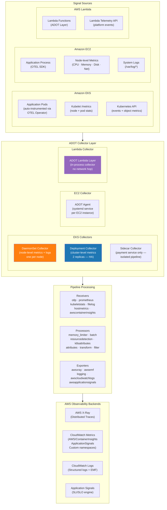
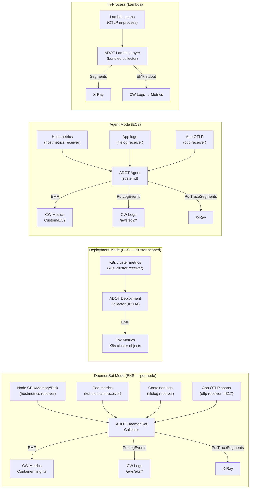
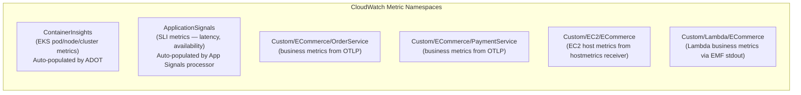
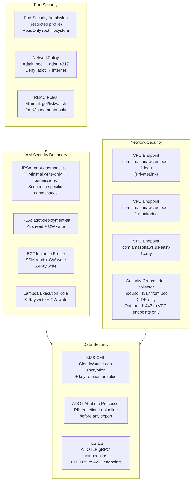
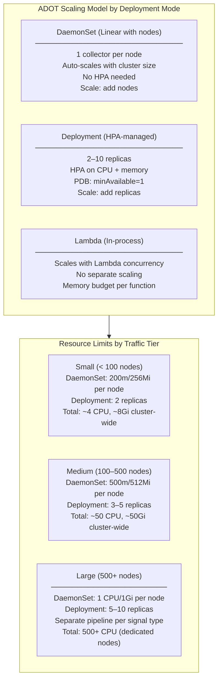
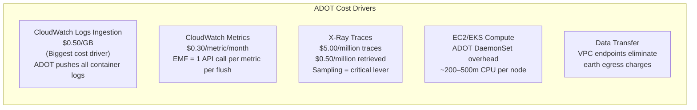
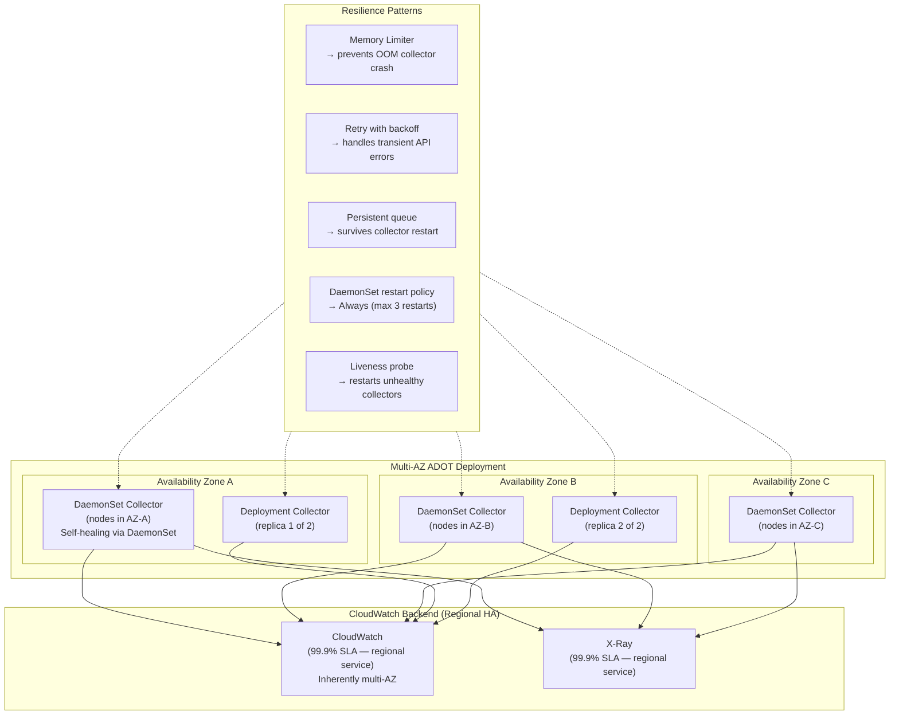
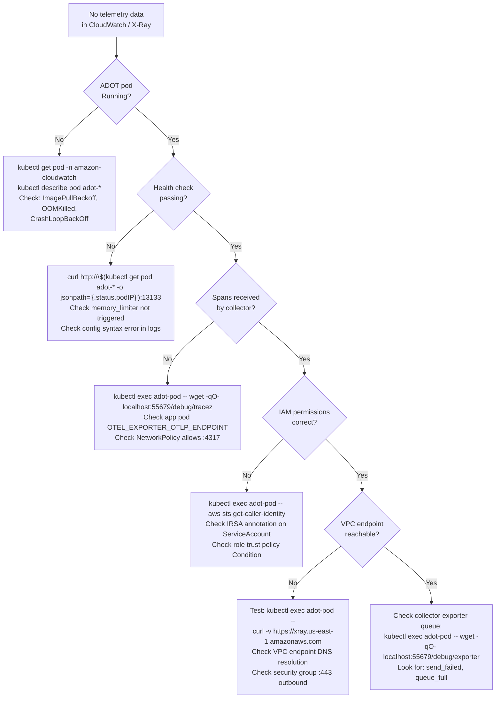

# AWS Distro for OpenTelemetry (ADOT) — Production Implementation
## EKS · EC2 · Lambda — Metrics · Logs · Traces

> **Role**: AWS OpenTelemetry Architect
> **Date**: 2026-07-18
> **ADOT Version**: v0.40.0 · OpenTelemetry Collector v0.105.0
> **Scope**: Full-stack telemetry pipeline — collection, processing, and export to CloudWatch + X-Ray

---

## Table of Contents

1. [ADOT Architecture](#1-adot-architecture)
2. [Collector Configuration](#2-collector-configuration)
3. [Deployment YAML](#3-deployment-yaml)
4. [CloudWatch Exporters](#4-cloudwatch-exporters)
5. [X-Ray Exporters](#5-x-ray-exporters)
6. [Security Controls](#6-security-controls)
7. [Scaling Strategy](#7-scaling-strategy)
8. [Cost Optimization](#8-cost-optimization)
9. [High Availability Design](#9-high-availability-design)
10. [Troubleshooting Guide](#10-troubleshooting-guide)

---

## 1. ADOT Architecture

### 1.1 Full-Stack ADOT Architecture



### 1.2 Signal Flow by Deployment Mode



### 1.3 Receiver → Processor → Exporter Pipeline Matrix

| Source | Receivers | Key Processors | Exporters |
|---|---|---|---|
| EKS Pod metrics | `kubeletstats`, `prometheus` | `k8sattributes`, `resourcedetection`, `batch` | `awsemf` → ContainerInsights |
| EKS App traces | `otlp` | `awsapplicationsignals`, `attributes/redact`, `batch` | `awsxray`, `awsapplicationsignals` |
| EKS App logs | `filelog` | `k8sattributes`, `transform`, `batch` | `awscloudwatchlogs` |
| EC2 host metrics | `hostmetrics` | `resourcedetection/ec2`, `batch` | `awsemf` → CWAgent namespace |
| EC2 app traces | `otlp` | `resourcedetection/ec2`, `batch` | `awsxray` |
| Lambda traces | `otlp` (in-process) | `resourcedetection`, `batch` | `awsxray` |
| Lambda metrics | `otlp` (in-process) | `awsapplicationsignals`, `batch` | `awsemf` (stdout) |

---

## 2. Collector Configuration

### 2.1 EKS DaemonSet — Full Signal Collection

```yaml
# configs/adot-daemonset-config.yaml
# Collects: node metrics + pod metrics + container logs + app traces
---
extensions:
  health_check:
    endpoint: 0.0.0.0:13133
  pprof:
    endpoint: 0.0.0.0:1777    # CPU/memory profiling endpoint (disable in prod unless debugging)
  zpages:
    endpoint: 0.0.0.0:55679   # Trace debug pages

receivers:
  # ── Application traces + metrics via OTLP ──────────────────────────────
  otlp:
    protocols:
      grpc:
        endpoint: 0.0.0.0:4317
        max_recv_msg_size_mib: 4
        keepalive:
          server_parameters:
            max_connection_age: 30s
            max_connection_age_grace: 5s
      http:
        endpoint: 0.0.0.0:4318

  # ── Pod-level metrics from kubelet ────────────────────────────────────
  kubeletstats:
    collection_interval: 30s
    auth_type: serviceAccount
    endpoint: "https://${K8S_NODE_IP}:10250"
    insecure_skip_verify: true
    metric_groups:
      - container
      - pod
      - node
      - volume
    extra_metadata_labels:
      - container.id
      - k8s.volume.type
    k8s_api_config:
      auth_type: serviceAccount

  # ── Host-level node metrics ────────────────────────────────────────────
  hostmetrics:
    collection_interval: 30s
    scrapers:
      cpu:
        metrics:
          system.cpu.utilization:
            enabled: true
      memory:
        metrics:
          system.memory.utilization:
            enabled: true
      disk:
      filesystem:
        exclude_mount_points:
          mount_points: [/dev, /sys, /proc, /var/lib/kubelet/pods, /run/containerd]
          match_type: strict
      network:
        include:
          interfaces: [eth0, ens5]
          match_type: strict
      load:
      processes:

  # ── Container logs via filelog ────────────────────────────────────────
  filelog:
    include:
      - /var/log/containers/*ecommerce*.log
      - /var/log/containers/*amazon-cloudwatch*.log
    exclude:
      - /var/log/containers/*_kube-system_*.log
    start_at: end
    include_file_path: true
    include_file_name: false
    operators:
      # Parse Docker JSON log format
      - type: json_parser
        id: parser-docker
        on_error: send
        timestamp:
          parse_from: attributes.time
          layout: '%Y-%m-%dT%H:%M:%S.%LZ'
      - type: move
        from: attributes.log
        to: body
      # Extract Kubernetes metadata from file path
      - type: regex_parser
        id: extract-k8s-metadata
        regex: '^(?P<pod_name>[a-z0-9](?:[-a-z0-9]*[a-z0-9])?(?:\.[a-z0-9]([-a-z0-9]*[a-z0-9])?)*)_(?P<namespace>[^_]+)_(?P<container_name>.+)-(?P<docker_id>[a-z0-9]{64})\.log$'
        parse_from: attributes["log.file.path"]
      # Promote JSON fields from app to log attributes
      - type: json_parser
        id: parser-app-json
        parse_from: body
        on_error: send_quiet
      # Remove redundant fields
      - type: remove
        field: attributes.time
      - type: remove
        field: attributes.stream

  # ── Prometheus scraping for kube-state-metrics ───────────────────────
  prometheus:
    config:
      scrape_configs:
        - job_name: kube-state-metrics
          scrape_interval: 60s
          static_configs:
            - targets: ["kube-state-metrics.kube-system.svc.cluster.local:8080"]
          metric_relabel_configs:
            # Drop high-cardinality metrics not needed
            - source_labels: [__name__]
              regex: "kube_.*_annotations|kube_.*_labels"
              action: drop

processors:
  # ── Safety: prevent OOM ──────────────────────────────────────────────
  memory_limiter:
    limit_mib: 512
    spike_limit_mib: 128
    check_interval: 5s

  # ── Enrich spans/metrics with K8s pod metadata ────────────────────────
  k8sattributes:
    auth_type: serviceAccount
    passthrough: false
    filter:
      node_from_env_var: K8S_NODE_NAME
    extract:
      metadata:
        - k8s.pod.name
        - k8s.pod.uid
        - k8s.deployment.name
        - k8s.statefulset.name
        - k8s.daemonset.name
        - k8s.namespace.name
        - k8s.node.name
        - k8s.container.name
        - container.id
        - container.image.name
        - container.image.tag
      labels:
        - tag_name: app.kubernetes.io/name
          key: app.kubernetes.io/name
          from: pod
        - tag_name: app.kubernetes.io/version
          key: app.kubernetes.io/version
          from: pod
      annotations:
        - tag_name: deployment.environment
          key: deployment.environment
          from: pod
    pod_association:
      - sources:
          - from: resource_attribute
            name: k8s.pod.ip
      - sources:
          - from: resource_attribute
            name: k8s.pod.uid
      - sources:
          - from: connection

  # ── Detect AWS resource (region, cluster, node) ───────────────────────
  resourcedetection:
    detectors: [env, eks, ec2]
    timeout: 15s
    override: false
    eks:
      resource_attributes:
        k8s.cluster.name: { enabled: true }
    ec2:
      resource_attributes:
        host.id:                  { enabled: true }
        host.name:                { enabled: true }
        host.type:                { enabled: true }
        cloud.region:             { enabled: true }
        cloud.account.id:         { enabled: true }
        cloud.availability_zone:  { enabled: true }

  # ── Required for Application Signals SLI/SLO ─────────────────────────
  awsapplicationsignals:

  # ── Security: redact PII from spans/logs ─────────────────────────────
  attributes/redact_pii:
    actions:
      - key: http.request.header.authorization
        action: delete
      - key: http.request.header.cookie
        action: delete
      - key: http.request.header.x-api-key
        action: delete
      - key: user.email
        action: delete
      - key: enduser.id
        action: hash
      - key: db.statement
        action: update
        value: "[REDACTED]"
      - key: http.url
        action: update
        # Strip query string params that may contain tokens
        value: "${replace_all_patterns(attributes[\"http.url\"], \"[?&](token|key|auth|password|secret)=[^&]*\", \"\")}"

  # ── Normalize routes to prevent cardinality explosion ─────────────────
  transform/normalize_routes:
    trace_statements:
      - context: span
        statements:
          - replace_pattern(attributes["http.target"], "^(/api/orders)/[0-9a-f-]+", "$$1/{id}")
          - replace_pattern(attributes["http.target"], "^(/api/products)/[0-9a-zA-Z-]+", "$$1/{id}")
          - replace_pattern(attributes["http.target"], "^(/api/users)/[0-9a-zA-Z-]+", "$$1/{id}")
          - replace_pattern(attributes["http.target"], "^(/api/payments)/[0-9a-zA-Z-]+", "$$1/{id}")

  # ── Drop health check and internal noise ─────────────────────────────
  filter/drop_noise:
    spans:
      exclude:
        match_type: regexp
        attributes:
          - key: http.target
            value: "^/(health|readiness|liveness|metrics|favicon\\.ico|robots\\.txt)$"
    logs:
      exclude:
        match_type: regexp
        record_attributes:
          - key: body
            value: "^(ELB-HealthChecker|kube-probe)"

  # ── Batch for efficient network usage ────────────────────────────────
  batch/traces:
    timeout: 1s
    send_batch_size: 200
    send_batch_max_size: 500

  batch/metrics:
    timeout: 30s
    send_batch_size: 1000
    send_batch_max_size: 2000

  batch/logs:
    timeout: 5s
    send_batch_size: 100
    send_batch_max_size: 500

exporters:
  # ── X-Ray: Distributed Traces ────────────────────────────────────────
  awsxray:
    region: us-east-1
    index_all_attributes: true
    no_verify_ssl: false
    # Use VPC endpoint if configured (avoids internet egress)
    # endpoint: "https://xray.us-east-1.amazonaws.com"

  # ── CloudWatch Metrics via EMF ────────────────────────────────────────
  awsemf:
    region: us-east-1
    log_group_name: /aws/containerinsights/${K8S_CLUSTER_NAME}/performance
    log_stream_name: "instanceTelemetry/{NodeName}"
    namespace: ContainerInsights
    dimension_rollup_option: NoDimensionRollup
    parse_json_encoded_attr_values: [Sources, kubernetes]
    metric_declarations:
      # Pod CPU + memory
      - dimensions:
          - [ClusterName, Namespace, PodName]
          - [ClusterName, Namespace]
          - [ClusterName]
        metric_name_selectors:
          - pod_cpu_utilization
          - pod_memory_utilization
          - pod_cpu_request_utilization
          - pod_memory_request_utilization
          - pod_network_rx_bytes
          - pod_network_tx_bytes
      # Container-level
      - dimensions:
          - [ClusterName, Namespace, PodName, ContainerName]
        metric_name_selectors:
          - container_cpu_utilization
          - container_memory_utilization
          - number_of_container_restarts

  # ── Application Signals: SLI/SLO metrics ─────────────────────────────
  awsapplicationsignals:
    region: us-east-1

  # ── CloudWatch Logs: Application logs ────────────────────────────────
  awscloudwatchlogs:
    region: us-east-1
    log_group_name: /aws/eks/${K8S_CLUSTER_NAME}/application
    log_stream_name: "${k8s.namespace.name}/${k8s.pod.name}/{k8s.container.name}"
    log_retention: 14
    sending_queue:
      enabled: true
      num_consumers: 2
      queue_size: 1000
    retry_on_failure:
      enabled: true
      initial_interval: 5s
      max_interval: 30s
      max_elapsed_time: 300s

service:
  extensions: [health_check, zpages]
  telemetry:
    logs:
      level: warn      # Reduce collector self-noise in production
    metrics:
      level: basic     # Expose collector metrics for monitoring
      address: 0.0.0.0:8888

  pipelines:
    # Traces: OTLP → redact → normalize → App Signals → X-Ray
    traces:
      receivers:  [otlp]
      processors:
        - memory_limiter
        - k8sattributes
        - resourcedetection
        - attributes/redact_pii
        - transform/normalize_routes
        - filter/drop_noise
        - awsapplicationsignals
        - batch/traces
      exporters:  [awsxray, awsapplicationsignals]

    # Metrics: kubelet + host + prometheus → ContainerInsights EMF
    metrics:
      receivers:  [kubeletstats, hostmetrics, prometheus]
      processors:
        - memory_limiter
        - k8sattributes
        - resourcedetection
        - batch/metrics
      exporters:  [awsemf]

    # Metrics (app): OTLP metrics → Application Signals
    metrics/app:
      receivers:  [otlp]
      processors:
        - memory_limiter
        - k8sattributes
        - resourcedetection
        - awsapplicationsignals
        - batch/metrics
      exporters:  [awsapplicationsignals]

    # Logs: filelog → k8s enrichment → CloudWatch Logs
    logs:
      receivers:  [filelog]
      processors:
        - memory_limiter
        - k8sattributes
        - resourcedetection
        - filter/drop_noise
        - batch/logs
      exporters:  [awscloudwatchlogs]
```

### 2.2 EKS Deployment — Cluster-Scoped Metrics

```yaml
# configs/adot-deployment-config.yaml
# Collects: K8s cluster-level metrics (deployments, pods, nodes count)
---
receivers:
  k8s_cluster:
    auth_type: serviceAccount
    collection_interval: 60s
    node_conditions_to_report: [Ready, MemoryPressure, DiskPressure, PIDPressure, NetworkUnavailable]
    allocatable_types_to_report: [cpu, memory, ephemeral-storage, hugepages-1Gi, hugepages-2Mi]
    resource_attributes:
      k8s.namespace.name: { enabled: true }
      k8s.deployment.name: { enabled: true }
      k8s.pod.name: { enabled: true }

  k8s_events:
    auth_type: serviceAccount
    namespaces: [ecommerce, amazon-cloudwatch]

processors:
  memory_limiter:
    limit_mib: 256
    spike_limit_mib: 64
    check_interval: 5s

  resourcedetection:
    detectors: [env, eks, ec2]
    timeout: 10s

  batch/metrics:
    timeout: 60s
    send_batch_size: 500

exporters:
  awsemf:
    region: us-east-1
    log_group_name: /aws/containerinsights/${K8S_CLUSTER_NAME}/cluster
    namespace: ContainerInsights
    dimension_rollup_option: NoDimensionRollup
    metric_declarations:
      - dimensions:
          - [ClusterName]
          - [ClusterName, Namespace]
        metric_name_selectors:
          - k8s.deployment.available
          - k8s.deployment.desired
          - k8s.pod.phase
          - k8s.daemonset.ready_nodes
          - k8s.node.condition_ready

  awscloudwatchlogs:
    region: us-east-1
    log_group_name: /aws/eks/${K8S_CLUSTER_NAME}/events
    log_retention: 7

service:
  telemetry:
    logs:
      level: warn
  pipelines:
    metrics:
      receivers:  [k8s_cluster]
      processors: [memory_limiter, resourcedetection, batch/metrics]
      exporters:  [awsemf]
    logs:
      receivers:  [k8s_events]
      processors: [memory_limiter, resourcedetection]
      exporters:  [awscloudwatchlogs]
```

### 2.3 EC2 Agent Configuration

```yaml
# configs/adot-ec2-agent-config.yaml
# Deployed as systemd service on EC2 instances
---
extensions:
  health_check:
    endpoint: 0.0.0.0:13133

receivers:
  # Application OTLP (same port as EKS — consistent developer experience)
  otlp:
    protocols:
      grpc:
        endpoint: 127.0.0.1:4317   # Localhost only — not cluster-accessible
      http:
        endpoint: 127.0.0.1:4318

  # Host metrics: CPU, memory, disk, network
  hostmetrics:
    collection_interval: 60s
    root_path: /
    scrapers:
      cpu:
        metrics:
          system.cpu.utilization: { enabled: true }
          system.cpu.time:        { enabled: true }
      memory:
        metrics:
          system.memory.utilization: { enabled: true }
      disk:
        include:
          devices: [sda, sda1, nvme0n1, nvme0n1p1]
          match_type: strict
      filesystem:
        exclude_mount_points:
          mount_points: [/proc, /sys, /dev]
          match_type: strict
      network:
      load:
      processes:
      paging:

  # Application log files
  filelog/app:
    include:
      - /var/log/ecommerce/*.log
      - /opt/app/logs/*.log
    exclude:
      - /var/log/ecommerce/*.gz
    start_at: end
    multiline:
      line_start_pattern: '^\d{4}-\d{2}-\d{2}T'   # ISO timestamp starts new log entry
    operators:
      - type: json_parser
        on_error: send_quiet
        timestamp:
          parse_from: attributes.timestamp
          layout: '%Y-%m-%dT%H:%M:%S.%LZ'

  # System logs (syslog, auth, etc.)
  filelog/system:
    include:
      - /var/log/syslog
      - /var/log/auth.log
    start_at: end
    operators:
      - type: syslog_parser
        protocol: rfc3164

processors:
  memory_limiter:
    limit_mib: 256
    spike_limit_mib: 64
    check_interval: 5s

  # EC2-specific resource detection
  resourcedetection/ec2:
    detectors: [env, ec2, system]
    timeout: 10s
    override: false
    ec2:
      tags:
        - Name
        - Environment
        - Service
        - Team
      resource_attributes:
        host.id:                 { enabled: true }
        host.name:               { enabled: true }
        host.type:               { enabled: true }
        host.image.id:           { enabled: true }
        cloud.region:            { enabled: true }
        cloud.account.id:        { enabled: true }
        cloud.availability_zone: { enabled: true }
        cloud.platform:          { enabled: true }

  attributes/redact_pii:
    actions:
      - key: http.request.header.authorization
        action: delete
      - key: db.statement
        action: update
        value: "[REDACTED]"

  batch/traces:
    timeout: 1s
    send_batch_size: 100

  batch/metrics:
    timeout: 60s
    send_batch_size: 500

  batch/logs:
    timeout: 10s
    send_batch_size: 100

exporters:
  awsxray:
    region: ${AWS_REGION}

  awsemf:
    region: ${AWS_REGION}
    namespace: Custom/EC2/ECommerce
    log_group_name: /aws/ec2/ecommerce/metrics
    dimension_rollup_option: NoDimensionRollup
    resource_to_telemetry_conversion:
      enabled: true
    metric_declarations:
      - dimensions:
          - [host.name, cloud.availability_zone]
          - [host.name]
          - [cloud.region]
        metric_name_selectors:
          - system.cpu.utilization
          - system.memory.utilization
          - system.disk.io
          - system.network.io

  awscloudwatchlogs:
    region: ${AWS_REGION}
    log_group_name: /aws/ec2/ecommerce/application
    log_stream_name: "${host.name}"
    log_retention: 14

service:
  extensions: [health_check]
  telemetry:
    logs:
      level: warn
  pipelines:
    traces:
      receivers:  [otlp]
      processors: [memory_limiter, resourcedetection/ec2, attributes/redact_pii, batch/traces]
      exporters:  [awsxray]

    metrics:
      receivers:  [hostmetrics, otlp]
      processors: [memory_limiter, resourcedetection/ec2, batch/metrics]
      exporters:  [awsemf]

    logs/app:
      receivers:  [filelog/app]
      processors: [memory_limiter, resourcedetection/ec2, batch/logs]
      exporters:  [awscloudwatchlogs]

    logs/system:
      receivers:  [filelog/system]
      processors: [memory_limiter, resourcedetection/ec2, batch/logs]
      exporters:  [awscloudwatchlogs]
```

### 2.4 Lambda In-Process Configuration

```yaml
# configs/adot-lambda-config.yaml
# Bundled within Lambda execution environment via ADOT Layer
# Set via: OPENTELEMETRY_COLLECTOR_CONFIG_FILE=/var/task/adot-lambda-config.yaml
---
extensions:
  health_check: {}

receivers:
  otlp:
    protocols:
      grpc:
        endpoint: 0.0.0.0:4317   # Lambda extension listens on localhost

processors:
  memory_limiter:
    limit_mib: 64    # Lambda memory is constrained
    spike_limit_mib: 16
    check_interval: 5s

  resourcedetection:
    detectors: [env, lambda]
    timeout: 5s
    lambda:
      resource_attributes:
        aws.log.group.names:   { enabled: true }
        aws.log.stream.names:  { enabled: true }
        cloud.region:          { enabled: true }
        faas.name:             { enabled: true }
        faas.version:          { enabled: true }

  awsapplicationsignals:

  attributes/lambda_context:
    actions:
      - key: faas.trigger
        value: "${LAMBDA_TRIGGER_TYPE}"
        action: upsert

  batch:
    timeout: 200ms      # Lambda must flush quickly before freeze
    send_batch_size: 50

exporters:
  awsxray:
    region: ${AWS_REGION}
    # Lambda uses X-Ray daemon running in execution environment
    endpoint: "http://127.0.0.1:2000"
    no_verify_ssl: true

  awsapplicationsignals:
    region: ${AWS_REGION}

  # EMF to stdout → Lambda runtime ships to CW Logs automatically
  awsemf:
    region: ${AWS_REGION}
    namespace: Custom/Lambda/ECommerce
    dimension_rollup_option: NoDimensionRollup
    output_destination: stdout   # Lambda captures stdout → CW Logs

service:
  extensions: [health_check]
  pipelines:
    traces:
      receivers:  [otlp]
      processors: [memory_limiter, resourcedetection, attributes/lambda_context, awsapplicationsignals, batch]
      exporters:  [awsxray, awsapplicationsignals]

    metrics:
      receivers:  [otlp]
      processors: [memory_limiter, resourcedetection, awsapplicationsignals, batch]
      exporters:  [awsemf, awsapplicationsignals]
```

---

## 3. Deployment YAML

### 3.1 ADOT Operator — EKS Add-on

```bash
# Install ADOT Operator via EKS managed add-on
aws eks create-addon \
  --cluster-name ecommerce-prod \
  --addon-name adot \
  --addon-version v0.92.1-eksbuild.1 \
  --service-account-role-arn arn:aws:iam::123456789012:role/EKS-ADOT-Operator-Role \
  --resolve-conflicts OVERWRITE \
  --configuration-values '{"replicaCount":2}' \
  --region us-east-1

# Verify add-on is ACTIVE
aws eks describe-addon \
  --cluster-name ecommerce-prod \
  --addon-name adot \
  --region us-east-1 \
  --query 'addon.{Status:status,Version:addonVersion,Issues:health.issues}'
```

### 3.2 DaemonSet OpenTelemetryCollector CR

```yaml
# k8s/adot-daemonset.yaml
apiVersion: opentelemetry.io/v1alpha1
kind: OpenTelemetryCollector
metadata:
  name: adot-daemonset
  namespace: amazon-cloudwatch
  labels:
    app.kubernetes.io/name:      adot-collector
    app.kubernetes.io/component: daemonset
    app.kubernetes.io/version:   "0.40.0"
spec:
  mode: daemonset
  serviceAccount: adot-collector-sa
  image: public.ecr.aws/aws-observability/aws-otel-collector:v0.40.0

  # Reference config from ConfigMap (keeps CR clean)
  configMapKeySelector:
    name: adot-daemonset-config
    key: config.yaml

  env:
    - name: K8S_NODE_NAME
      valueFrom:
        fieldRef:
          fieldPath: spec.nodeName
    - name: K8S_NODE_IP
      valueFrom:
        fieldRef:
          fieldPath: status.hostIP
    - name: K8S_POD_NAME
      valueFrom:
        fieldRef:
          fieldPath: metadata.name
    - name: K8S_NAMESPACE
      valueFrom:
        fieldRef:
          fieldPath: metadata.namespace
    - name: K8S_CLUSTER_NAME
      value: ecommerce-prod
    - name: AWS_REGION
      value: us-east-1
    - name: OTEL_RESOURCE_ATTRIBUTES
      value: "cloud.region=us-east-1,k8s.cluster.name=ecommerce-prod"

  resources:
    requests:
      cpu:    "200m"
      memory: "256Mi"
    limits:
      cpu:    "500m"
      memory: "512Mi"

  # Volume mounts for log collection
  volumeMounts:
    - name: varlogcontainers
      mountPath: /var/log/containers
      readOnly: true
    - name: varlogpods
      mountPath: /var/log/pods
      readOnly: true
    - name: varlibdockercontainers
      mountPath: /var/lib/docker/containers
      readOnly: true
    - name: rootfs
      mountPath: /hostfs
      readOnly: true
    - name: devdisk
      mountPath: /dev/disk
      readOnly: true

  volumes:
    - name: varlogcontainers
      hostPath:
        path: /var/log/containers
    - name: varlogpods
      hostPath:
        path: /var/log/pods
    - name: varlibdockercontainers
      hostPath:
        path: /var/lib/docker/containers
    - name: rootfs
      hostPath:
        path: /
    - name: devdisk
      hostPath:
        path: /dev/disk

  # Tolerations to run on ALL nodes including system nodes
  tolerations:
    - key: node-role.kubernetes.io/master
      effect: NoSchedule
    - key: node-role.kubernetes.io/control-plane
      effect: NoSchedule
    - key: node.kubernetes.io/not-ready
      effect: NoExecute
      tolerationSeconds: 300
    - key: node.kubernetes.io/unreachable
      effect: NoExecute
      tolerationSeconds: 300

  # Priority class to survive resource pressure
  priorityClassName: system-node-critical

  podAnnotations:
    prometheus.io/scrape: "true"
    prometheus.io/port:   "8888"
    prometheus.io/path:   "/metrics"

  podSecurityContext:
    runAsNonRoot: false   # Required for hostPath volume access

  securityContext:
    runAsUser: 0
    readOnlyRootFilesystem: true
    allowPrivilegeEscalation: false
    capabilities:
      drop: [ALL]
      add: [DAC_READ_SEARCH]   # Required for /var/log access

  livenessProbe:
    httpGet:
      path: /
      port: 13133
    initialDelaySeconds: 30
    periodSeconds: 10
    failureThreshold: 3

  readinessProbe:
    httpGet:
      path: /
      port: 13133
    initialDelaySeconds: 10
    periodSeconds: 5
```

### 3.3 Deployment Mode — Cluster Metrics Collector

```yaml
# k8s/adot-deployment.yaml
apiVersion: opentelemetry.io/v1alpha1
kind: OpenTelemetryCollector
metadata:
  name: adot-cluster
  namespace: amazon-cloudwatch
  labels:
    app.kubernetes.io/component: deployment
spec:
  mode: deployment
  replicas: 2                          # HA — two replicas
  serviceAccount: adot-collector-sa
  image: public.ecr.aws/aws-observability/aws-otel-collector:v0.40.0

  configMapKeySelector:
    name: adot-deployment-config
    key: config.yaml

  env:
    - name: K8S_CLUSTER_NAME
      value: ecommerce-prod
    - name: AWS_REGION
      value: us-east-1

  resources:
    requests:
      cpu:    "100m"
      memory: "128Mi"
    limits:
      cpu:    "500m"
      memory: "512Mi"

  # Pod anti-affinity: spread replicas across AZs
  affinity:
    podAntiAffinity:
      preferredDuringSchedulingIgnoredDuringExecution:
        - weight: 100
          podAffinityTerm:
            labelSelector:
              matchExpressions:
                - key: app.kubernetes.io/component
                  operator: In
                  values: [deployment]
            topologyKey: topology.kubernetes.io/zone

  podDisruptionBudget:
    minAvailable: 1    # Always keep at least 1 replica running

  livenessProbe:
    httpGet:
      path: /
      port: 13133
    initialDelaySeconds: 30
    periodSeconds: 10
```

### 3.4 Instrumentation CR — Auto-Instrumentation

```yaml
# k8s/instrumentation.yaml
apiVersion: opentelemetry.io/v1alpha1
kind: Instrumentation
metadata:
  name: ecommerce-instrumentation
  namespace: ecommerce
spec:
  exporter:
    endpoint: http://adot-daemonset-collector.amazon-cloudwatch.svc.cluster.local:4317

  propagators:
    - tracecontext    # W3C primary standard
    - baggage         # Cross-cutting context
    - xray            # AWS X-Ray (API Gateway correlation)
    - b3              # Legacy compatibility

  sampler:
    type: parentbased_traceidratio
    argument: "1"     # SDK sends all; X-Ray sampling rules decide

  resource:
    attributes:
      deployment.environment: production
      aws.region:             us-east-1
      k8s.cluster.name:       ecommerce-prod

  java:
    image: public.ecr.aws/aws-observability/adot-autoinstrumentation-java:v1.32.3
    env:
      - name: OTEL_AWS_APP_SIGNALS_ENABLED
        value: "true"
      - name: OTEL_AWS_APP_SIGNALS_RUNTIME_ENABLED
        value: "true"
      - name: OTEL_EXPORTER_OTLP_TIMEOUT
        value: "20000"
      - name: JAVA_TOOL_OPTIONS
        value: "-javaagent:/otel-auto-instrumentation-java/javaagent.jar"
      - name: OTEL_TRACES_SAMPLER
        value: "parentbased_traceidratio"
      - name: OTEL_TRACES_SAMPLER_ARG
        value: "1"

  python:
    image: public.ecr.aws/aws-observability/adot-autoinstrumentation-python:v0.2.0
    env:
      - name: OTEL_AWS_APP_SIGNALS_ENABLED
        value: "true"
      - name: PYTHONPATH
        value: /otel-auto-instrumentation-python/opentelemetry/instrumentation/auto_instrumentation:/otel-auto-instrumentation-python

  nodejs:
    image: public.ecr.aws/aws-observability/adot-autoinstrumentation-node:v0.3.0
    env:
      - name: OTEL_AWS_APP_SIGNALS_ENABLED
        value: "true"
      - name: NODE_OPTIONS
        value: --require /otel-auto-instrumentation-node/autoinstrumentation.js

  go:
    image: public.ecr.aws/aws-observability/adot-autoinstrumentation-go:v0.14.0-alpha
    env:
      - name: OTEL_GO_AUTO_TARGET_EXE
        value: /app/server           # Path to Go binary
      - name: OTEL_AWS_APP_SIGNALS_ENABLED
        value: "true"
```

### 3.5 EC2 UserData — ADOT Agent Bootstrap

```bash
#!/bin/bash
# ec2-userdata.sh — Bootstrap ADOT agent on EC2 launch
# Used in Launch Template or ASG UserData

set -euo pipefail

AWS_REGION=$(curl -sf http://169.254.169.254/latest/meta-data/placement/region)
INSTANCE_ID=$(curl -sf http://169.254.169.254/latest/meta-data/instance-id)

# Install ADOT Collector
wget -q "https://aws-otel-collector.s3.amazonaws.com/amazon_linux/amd64/latest/aws-otel-collector.rpm" \
  -O /tmp/aws-otel-collector.rpm
rpm -Uvh /tmp/aws-otel-collector.rpm

# Pull config from SSM Parameter Store (avoid baking config in AMI)
aws ssm get-parameter \
  --name "/ecommerce/prod/adot/ec2-config" \
  --with-decryption \
  --query 'Parameter.Value' \
  --output text \
  --region "$AWS_REGION" \
  > /opt/aws/aws-otel-collector/etc/config.yaml

# Inject instance-specific env vars
cat > /opt/aws/aws-otel-collector/etc/env.conf <<EOF
AWS_REGION=${AWS_REGION}
HOST_NAME=${INSTANCE_ID}
EOF

# Enable + start as systemd service
systemctl enable aws-otel-collector
systemctl start aws-otel-collector

# Verify startup
sleep 10
systemctl is-active aws-otel-collector && echo "ADOT agent started" || \
  { echo "ADOT agent failed to start"; systemctl status aws-otel-collector; exit 1; }
```

### 3.6 Lambda Layer Attachment

```bash
# Attach ADOT layer to Lambda functions (per-runtime)

# Python
aws lambda update-function-configuration \
  --function-name order-processor \
  --layers \
    "arn:aws:lambda:us-east-1:901920570463:layer:aws-otel-python-amd64-ver-1-25-0:1" \
  --environment "Variables={
    OTEL_SERVICE_NAME=order-processor,
    OTEL_RESOURCE_ATTRIBUTES=deployment.environment=production,
    OPENTELEMETRY_COLLECTOR_CONFIG_FILE=/var/task/adot-lambda-config.yaml,
    AWS_LAMBDA_EXEC_WRAPPER=/opt/otel-handler,
    OTEL_TRACES_SAMPLER=xray,
    OTEL_PROPAGATORS=tracecontext,xray
  }" \
  --tracing-config Mode=Active \
  --region us-east-1

# Node.js
aws lambda update-function-configuration \
  --function-name inventory-sync \
  --layers \
    "arn:aws:lambda:us-east-1:901920570463:layer:aws-otel-nodejs-amd64-ver-1-18-1:1" \
  --environment "Variables={
    OTEL_SERVICE_NAME=inventory-sync,
    AWS_LAMBDA_EXEC_WRAPPER=/opt/otel-handler,
    OPENTELEMETRY_COLLECTOR_CONFIG_FILE=/var/task/adot-lambda-config.yaml
  }" \
  --tracing-config Mode=Active \
  --region us-east-1

# Java (ARM / Graviton)
aws lambda update-function-configuration \
  --function-name payment-validator \
  --layers \
    "arn:aws:lambda:us-east-1:901920570463:layer:aws-otel-java-agent-arm64-ver-1-32-0:1" \
  --environment "Variables={
    OTEL_SERVICE_NAME=payment-validator,
    AWS_LAMBDA_EXEC_WRAPPER=/opt/otel-handler,
    JAVA_TOOL_OPTIONS=-javaagent:/opt/opentelemetry-javaagent.jar
  }" \
  --tracing-config Mode=Active \
  --region us-east-1

# List ADOT layer versions (for updates)
aws lambda list-layer-versions \
  --layer-name aws-otel-python-amd64-ver-1-25-0 \
  --region us-east-1 \
  --query 'LayerVersions[0:3].{Version:Version,ARN:LayerVersionArn}'
```

---

## 4. CloudWatch Exporters

### 4.1 EMF Exporter — Metric Namespace Design



### 4.2 EMF Exporter Configuration — Business Metrics

```yaml
# Business metrics EMF exporter (separate from ContainerInsights)
exporters:
  awsemf/business:
    region: us-east-1
    log_group_name: /aws/otel/ecommerce/metrics
    log_stream_name: "${service.name}/${k8s.pod.name}"
    namespace: Custom/ECommerce/${service.name}
    dimension_rollup_option: NoDimensionRollup

    # Prevent duplicate metrics for different dimension sets
    resource_to_telemetry_conversion:
      enabled: true

    # Metric declarations with explicit dimension sets
    # (controls CloudWatch metric cardinality — lower cost)
    metric_declarations:
      # HTTP server metrics (OTEL semantic conventions)
      - dimensions:
          - [service.name, deployment.environment]
          - [service.name, http.method, http.route, deployment.environment]
        metric_name_selectors:
          - http.server.duration
          - http.server.request.count
          - http.server.active_requests

      # Database client metrics
      - dimensions:
          - [service.name, db.system, db.name, deployment.environment]
        metric_name_selectors:
          - db.client.connections.usage
          - db.client.connections.max
          - db.client.connections.pending_requests

      # Custom business metrics
      - dimensions:
          - [service.name, deployment.environment]
          - [service.name, order.value_tier, deployment.environment]
        metric_name_selectors:
          - ecommerce.orders.created
          - ecommerce.orders.failed
          - ecommerce.payments.processed
          - ecommerce.cart.items_added
          - ecommerce.inventory.low_stock_alerts
```

### 4.3 CloudWatch Logs Exporter — Log Groups

```yaml
# Log group per concern — separate retention policies
exporters:
  # Application logs (14-day hot retention)
  awscloudwatchlogs/app:
    region: us-east-1
    log_group_name: /aws/eks/ecommerce-prod/application
    log_stream_name: "${k8s.namespace.name}/${k8s.deployment.name}/${k8s.pod.name}"
    log_retention: 14
    tags:
      Project:     ecommerce
      Environment: production
      Team:        platform
    sending_queue:
      enabled: true
      num_consumers: 4
      queue_size: 2000
    retry_on_failure:
      enabled: true
      initial_interval: 5s
      max_interval: 60s
      max_elapsed_time: 600s

  # Performance/trace logs (7-day)
  awscloudwatchlogs/perf:
    region: us-east-1
    log_group_name: /aws/otel/ecommerce/traces
    log_stream_name: "${service.name}"
    log_retention: 7

  # Security/audit logs (90-day — compliance)
  awscloudwatchlogs/audit:
    region: us-east-1
    log_group_name: /aws/eks/ecommerce-prod/audit
    log_stream_name: "${k8s.node.name}"
    log_retention: 90
```

---

## 5. X-Ray Exporters

### 5.1 X-Ray Exporter Configuration

```yaml
# Full X-Ray exporter configuration options
exporters:
  awsxray:
    region: us-east-1

    # Make ALL OTEL span attributes searchable as X-Ray annotations
    # Enables: filter expressions on custom attributes in X-Ray console
    index_all_attributes: true

    # Use VPC Endpoint (no internet egress — required for security)
    # endpoint: "https://xray.us-east-1.amazonaws.com"

    # Disable SSL verification (only for internal test environments)
    no_verify_ssl: false

    # Certificate file for mutual TLS (advanced — enterprise requirements)
    # certificate_file: /etc/ssl/certs/ca-bundle.crt

    # Request timeout
    request_timeout_seconds: 30

    sending_queue:
      enabled:      true
      num_consumers: 2
      queue_size:   500

    retry_on_failure:
      enabled:          true
      initial_interval: 1s
      max_interval:     30s
      max_elapsed_time: 120s
```

### 5.2 X-Ray Segment Enrichment via Attribute Processor

```yaml
# Enrich X-Ray segments with business annotations (searchable)
processors:
  attributes/xray_annotations:
    actions:
      # Map OTEL attributes → X-Ray searchable annotations
      # Convention: "aws.xray.annotations.*" prefix makes attrs searchable
      - key: aws.xray.annotations.service_version
        from_attribute: service.version
        action: upsert
      - key: aws.xray.annotations.environment
        from_attribute: deployment.environment
        action: upsert
      - key: aws.xray.annotations.k8s_namespace
        from_attribute: k8s.namespace.name
        action: upsert
      - key: aws.xray.annotations.k8s_pod
        from_attribute: k8s.pod.name
        action: upsert
      # Business annotations (set by application code)
      - key: aws.xray.annotations.order_value_tier
        from_attribute: ecommerce.order.value_tier
        action: upsert

  # X-Ray metadata (not searchable — for detail view)
  attributes/xray_metadata:
    actions:
      - key: aws.xray.metadata.build_commit
        value: "${BUILD_COMMIT_SHA}"
        action: upsert
      - key: aws.xray.metadata.cluster
        from_attribute: k8s.cluster.name
        action: upsert
```

### 5.3 X-Ray Sampling Rules Management

```bash
# Create sampling rules (applied before ADOT exporter sends)
# Rules are evaluated in priority order

# Rule 1: Payment service — 100% (compliance)
aws xray create-sampling-rule \
  --sampling-rule '{
    "RuleName": "PaymentService-100pct",
    "Priority": 1,
    "ServiceName": "payment-service",
    "HTTPMethod": "POST",
    "URLPath": "/api/payments*",
    "ServiceType": "*",
    "Host": "*",
    "ResourceARN": "*",
    "FixedRate": 1.0,
    "ReservoirSize": 100,
    "Attributes": {}
  }' \
  --region us-east-1

# Rule 2: All 5xx faults — 100%
aws xray create-sampling-rule \
  --sampling-rule '{
    "RuleName": "AllFaults-100pct",
    "Priority": 2,
    "ServiceName": "*",
    "HTTPMethod": "*",
    "URLPath": "*",
    "ServiceType": "*",
    "Host": "*",
    "ResourceARN": "*",
    "FixedRate": 1.0,
    "ReservoirSize": 50,
    "Attributes": {"http.status_code": "5??"}
  }' \
  --region us-east-1

# Rule 3: Default 5%
aws xray create-sampling-rule \
  --sampling-rule '{
    "RuleName": "Default-5pct",
    "Priority": 10000,
    "ServiceName": "*",
    "HTTPMethod": "*",
    "URLPath": "*",
    "ServiceType": "*",
    "Host": "*",
    "ResourceARN": "*",
    "FixedRate": 0.05,
    "ReservoirSize": 5,
    "Attributes": {}
  }' \
  --region us-east-1

# Verify rules are active + getting traffic
aws xray get-sampling-statistic-summaries \
  --region us-east-1 \
  --query 'SamplingStatisticSummaries[*].{
    Rule:RuleName,
    Sampled:SampledCount,
    Requests:RequestCount,
    Borrowed:BorrowCount
  }' \
  --output table
```

---

## 6. Security Controls

### 6.1 Security Architecture



### 6.2 IRSA Policy — ADOT DaemonSet (Minimal)

```json
{
  "Version": "2012-10-17",
  "Statement": [
    {
      "Sid": "XRayWriteOnly",
      "Effect": "Allow",
      "Action": [
        "xray:PutTraceSegments",
        "xray:PutTelemetryRecords",
        "xray:GetSamplingRules",
        "xray:GetSamplingTargets",
        "xray:GetSamplingStatisticSummaries"
      ],
      "Resource": "*"
    },
    {
      "Sid": "CloudWatchMetricsScopedWrite",
      "Effect": "Allow",
      "Action": ["cloudwatch:PutMetricData"],
      "Resource": "*",
      "Condition": {
        "StringLike": {
          "cloudwatch:namespace": [
            "ContainerInsights",
            "ApplicationSignals",
            "Custom/ECommerce*",
            "Custom/EC2*",
            "Custom/Lambda*"
          ]
        }
      }
    },
    {
      "Sid": "CloudWatchLogsScopedWrite",
      "Effect": "Allow",
      "Action": [
        "logs:CreateLogGroup",
        "logs:CreateLogStream",
        "logs:PutLogEvents",
        "logs:DescribeLogGroups",
        "logs:DescribeLogStreams"
      ],
      "Resource": [
        "arn:aws:logs:us-east-1:123456789012:log-group:/aws/eks/ecommerce-prod/*",
        "arn:aws:logs:us-east-1:123456789012:log-group:/aws/otel/ecommerce/*"
      ]
    },
    {
      "Sid": "ApplicationSignalsWrite",
      "Effect": "Allow",
      "Action": [
        "application-signals:StartDiscovery",
        "application-signals:ListServices",
        "application-signals:GetService"
      ],
      "Resource": "*"
    },
    {
      "Sid": "EKSDescribeForResourceDetection",
      "Effect": "Allow",
      "Action": ["eks:DescribeCluster"],
      "Resource": "arn:aws:eks:us-east-1:123456789012:cluster/ecommerce-prod"
    }
  ]
}
```

### 6.3 Kubernetes RBAC for ADOT

```yaml
# k8s/adot-rbac.yaml
---
apiVersion: v1
kind: ServiceAccount
metadata:
  name: adot-collector-sa
  namespace: amazon-cloudwatch
  annotations:
    eks.amazonaws.com/role-arn: arn:aws:iam::123456789012:role/EKS-ADOT-DaemonSet-Role
  labels:
    app.kubernetes.io/name: adot-collector

---
apiVersion: rbac.authorization.k8s.io/v1
kind: ClusterRole
metadata:
  name: adot-collector-role
rules:
  # For k8sattributes processor — pod metadata enrichment
  - apiGroups: [""]
    resources: [pods, namespaces, nodes, nodes/proxy]
    verbs: [get, list, watch]
  # For k8s_cluster receiver — cluster object metrics
  - apiGroups: ["apps"]
    resources: [deployments, replicasets, daemonsets, statefulsets]
    verbs: [get, list, watch]
  # For k8s_events receiver
  - apiGroups: [""]
    resources: [events]
    verbs: [get, list, watch]
  # For kubeletstats receiver — node metrics
  - apiGroups: [""]
    resources: [nodes/stats]
    verbs: [get]
  # For k8s_cluster — resource quotas + limits
  - apiGroups: [""]
    resources: [resourcequotas, limitranges]
    verbs: [get, list, watch]
  # For k8sattributes with replicaset owner references
  - apiGroups: [""]
    resources: [replicationcontrollers]
    verbs: [get, list, watch]
  - apiGroups: ["batch"]
    resources: [jobs, cronjobs]
    verbs: [get, list, watch]

---
apiVersion: rbac.authorization.k8s.io/v1
kind: ClusterRoleBinding
metadata:
  name: adot-collector-role-binding
roleRef:
  apiGroup: rbac.authorization.k8s.io
  kind: ClusterRole
  name: adot-collector-role
subjects:
  - kind: ServiceAccount
    name: adot-collector-sa
    namespace: amazon-cloudwatch
```

### 6.4 NetworkPolicy — ADOT Pod Isolation

```yaml
# k8s/adot-network-policy.yaml
---
# Allow application pods to send OTLP to ADOT collector
apiVersion: networking.k8s.io/v1
kind: NetworkPolicy
metadata:
  name: allow-otlp-to-adot
  namespace: ecommerce
spec:
  podSelector: {}   # All pods in ecommerce namespace
  policyTypes: [Egress]
  egress:
    - to:
        - namespaceSelector:
            matchLabels:
              kubernetes.io/metadata.name: amazon-cloudwatch
          podSelector:
            matchLabels:
              app.kubernetes.io/name: adot-collector
      ports:
        - protocol: TCP
          port: 4317   # OTLP gRPC
        - protocol: TCP
          port: 4318   # OTLP HTTP

---
# ADOT collector: only allow outbound to AWS VPC endpoints
apiVersion: networking.k8s.io/v1
kind: NetworkPolicy
metadata:
  name: adot-collector-egress
  namespace: amazon-cloudwatch
spec:
  podSelector:
    matchLabels:
      app.kubernetes.io/name: adot-collector
  policyTypes: [Ingress, Egress]
  ingress:
    - from:
        - namespaceSelector: {}   # Any namespace can send OTLP
      ports:
        - protocol: TCP
          port: 4317
        - protocol: TCP
          port: 4318
    - ports:
        - protocol: TCP
          port: 13133   # Health check
        - protocol: TCP
          port: 8888    # Collector self-metrics
  egress:
    # AWS API endpoints via VPC endpoints (private IPs in VPC CIDR)
    - to:
        - ipBlock:
            cidr: 10.0.0.0/8   # VPC CIDR — covers all VPC endpoints
      ports:
        - protocol: TCP
          port: 443
    # K8s API (for k8sattributes processor)
    - to:
        - ipBlock:
            cidr: 172.20.0.0/16   # K8s service CIDR
      ports:
        - protocol: TCP
          port: 443
```

---

## 7. Scaling Strategy

### 7.1 Scaling Architecture



### 7.2 HPA for Deployment Mode Collector

```yaml
# k8s/adot-hpa.yaml
apiVersion: autoscaling/v2
kind: HorizontalPodAutoscaler
metadata:
  name: adot-cluster-hpa
  namespace: amazon-cloudwatch
spec:
  scaleTargetRef:
    apiVersion: apps/v1
    kind: Deployment
    name: adot-cluster-collector
  minReplicas: 2
  maxReplicas: 10
  metrics:
    - type: Resource
      resource:
        name: cpu
        target:
          type: Utilization
          averageUtilization: 60    # Scale up at 60% CPU
    - type: Resource
      resource:
        name: memory
        target:
          type: Utilization
          averageUtilization: 70    # Scale up at 70% memory
    # Custom metric: scale on queue depth (backpressure)
    - type: Pods
      pods:
        metric:
          name: otelcol_exporter_queue_size
        target:
          type: AverageValue
          averageValue: "100"       # Scale if queue > 100 items/pod
  behavior:
    scaleUp:
      stabilizationWindowSeconds: 60
      policies:
        - type:          Pods
          value:         2
          periodSeconds: 60    # Add max 2 pods per minute
    scaleDown:
      stabilizationWindowSeconds: 300    # Wait 5 min before scaling down
      policies:
        - type:          Pods
          value:         1
          periodSeconds: 120

---
# PodDisruptionBudget — never kill last replica during drain
apiVersion: policy/v1
kind: PodDisruptionBudget
metadata:
  name: adot-cluster-pdb
  namespace: amazon-cloudwatch
spec:
  minAvailable: 1
  selector:
    matchLabels:
      app.kubernetes.io/name: adot-cluster-collector
```

### 7.3 Memory Limiter Tuning by Traffic Volume

```yaml
# Tune memory_limiter thresholds based on pod memory limit
# Rule of thumb: limit_mib = (pod_memory_limit * 0.75)
#                spike_limit_mib = (pod_memory_limit * 0.20)

# For 512Mi limit pod:
processors:
  memory_limiter:
    limit_mib: 384      # 75% of 512Mi — starts dropping data at this point
    spike_limit_mib: 100 # 20% — soft limit for smoothing
    check_interval: 1s  # Check frequently under high load

# For 1Gi limit pod:
processors:
  memory_limiter:
    limit_mib: 768
    spike_limit_mib: 200
    check_interval: 1s

# For 2Gi limit pod (high-throughput):
processors:
  memory_limiter:
    limit_mib: 1536
    spike_limit_mib: 400
    check_interval: 1s
```

### 7.4 Vertical Pod Autoscaler

```yaml
# k8s/adot-vpa.yaml — Use VPA for DaemonSet (HPA not supported)
apiVersion: autoscaling.k8s.io/v1
kind: VerticalPodAutoscaler
metadata:
  name: adot-daemonset-vpa
  namespace: amazon-cloudwatch
spec:
  targetRef:
    apiVersion: apps/v1
    kind: DaemonSet
    name: adot-daemonset-collector
  updatePolicy:
    updateMode: "Off"    # Recommendation only — apply manually to avoid restarts
  resourcePolicy:
    containerPolicies:
      - containerName: adot-collector
        minAllowed:
          cpu:    100m
          memory: 128Mi
        maxAllowed:
          cpu:    "2"
          memory: 2Gi
        controlledResources: [cpu, memory]
```

---

## 8. Cost Optimization

### 8.1 Cost Components



### 8.2 Cost Optimization Configurations

```yaml
# ── Optimization 1: Aggressive log filtering (reduce ingestion 40–60%) ──────
processors:
  filter/reduce_log_volume:
    logs:
      exclude:
        match_type: regexp
        record_attributes:
          # Drop DEBUG logs entirely in production
          - key: level
            value: "^(debug|DEBUG|trace|TRACE)$"
          # Drop verbose health check logs
          - key: message
            value: "^(GET /health|ELB-HealthChecker|kube-probe)"
          # Drop noisy K8s control plane logs
          - key: kubernetes.namespace_name
            value: "^kube-system$"

  # ── Optimization 2: Attribute pruning (reduce log size 20–30%) ─────────
  attributes/prune_verbose:
    actions:
      # Remove high-cardinality, low-value attributes from logs
      - key: k8s.pod.uid
        action: delete
      - key: container.id
        action: delete
      - key: k8s.pod.start_time
        action: delete
      # Keep only essential k8s metadata
      # Retain: k8s.pod.name, k8s.namespace.name, k8s.deployment.name

  # ── Optimization 3: Metric cardinality control ─────────────────────────
  transform/reduce_metric_cardinality:
    metric_statements:
      - context: datapoint
        statements:
          # Drop per-pod dimension, keep namespace-level aggregation
          - delete_key(attributes, "k8s.pod.name") where metric.name == "http.server.duration"
          # Normalize status codes to buckets
          - set(attributes["http.status_code"], "2xx")
            where attributes["http.status_code"] matches "^2[0-9]{2}$"
          - set(attributes["http.status_code"], "4xx")
            where attributes["http.status_code"] matches "^4[0-9]{2}$"
          - set(attributes["http.status_code"], "5xx")
            where attributes["http.status_code"] matches "^5[0-9]{2}$"

  # ── Optimization 4: Tail sampling for traces ──────────────────────────
  # (Available in Deployment mode — not DaemonSet due to stateful requirement)
  tail_sampling:
    decision_wait:     10s    # Wait for all spans before deciding
    num_traces:        10000  # Max traces in memory at once
    expected_new_traces_per_sec: 100
    policies:
      # Always keep error traces
      - name: keep-errors
        type: status_code
        status_code: { status_codes: [ERROR] }
      # Keep slow traces (> 1s)
      - name: keep-slow
        type: latency
        latency: { threshold_ms: 1000 }
      # Sample 10% of everything else
      - name: probabilistic-10pct
        type: probabilistic
        probabilistic: { sampling_percentage: 10 }
```

### 8.3 Cost Estimation by Environment

| Component | Metric | Production | Staging | Dev |
|---|---|---|---|---|
| CW Logs ingestion | 50 GB/month | $25 | $5 | $0 |
| CW Logs storage (14d) | 700 GB stored | $21 | $4 | $0 |
| CW Metrics (EMF) | 200 custom metrics | $55 | $10 | $0 |
| X-Ray traces (5% sample) | 15M traces/month | $75 | $5 | $0 |
| Data transfer | VPC endpoints | $0 | $0 | $0 |
| **ADOT overhead total** | | **~$176/mo** | **~$24/mo** | **~$0** |

---

## 9. High Availability Design

### 9.1 HA Architecture



### 9.2 Persistent Queue for Durability

```yaml
# Enable persistent queue for critical exporters
# Prevents data loss during temporary backend unavailability

exporters:
  awsxray:
    region: us-east-1
    sending_queue:
      enabled:       true
      num_consumers: 4          # Parallel export goroutines
      queue_size:    1000       # Max batches in memory queue
      # Persistent storage (survives pod restart)
      storage: file_storage     # References extension below
    retry_on_failure:
      enabled:          true
      initial_interval: 5s
      max_interval:     60s
      max_elapsed_time: 300s    # Give up after 5 minutes

  awscloudwatchlogs:
    region: us-east-1
    sending_queue:
      enabled:    true
      queue_size: 2000
      storage:    file_storage
    retry_on_failure:
      enabled:          true
      initial_interval: 5s
      max_interval:     30s
      max_elapsed_time: 600s   # Logs: retry up to 10 minutes

extensions:
  # Persistent queue backed by local disk
  file_storage:
    directory: /var/adot/queue  # Mount emptyDir or PVC
    timeout: 10s
    compaction:
      on_start: true
      on_rebound: true
      rebound_needed_threshold_mib: 100
      rebound_trigger_threshold_mib: 10

# Volume mount for persistent queue
# Add to DaemonSet spec:
# volumeMounts:
#   - name: adot-queue
#     mountPath: /var/adot/queue
# volumes:
#   - name: adot-queue
#     emptyDir:
#       sizeLimit: 512Mi
```

### 9.3 Collector Self-Monitoring

```yaml
# Monitor the ADOT collector itself with CloudWatch alarms
# Collector exposes metrics on :8888/metrics

# Key ADOT self-metrics to alarm on:
# otelcol_exporter_queue_size          → queue backing up
# otelcol_exporter_send_failed_spans   → export failures
# otelcol_processor_dropped_spans      → spans being dropped (memory_limiter)
# otelcol_receiver_refused_spans       → spans rejected (backpressure)
# go_memstats_heap_alloc_bytes         → memory growth
```

```hcl
# Alarm: ADOT dropping data (memory limiter triggered)
resource "aws_cloudwatch_metric_alarm" "adot_dropped_spans" {
  alarm_name          = "adot-collector-dropping-spans"
  alarm_description   = "ADOT collector is dropping spans due to memory pressure. Increase memory limits or reduce batch size."
  namespace           = "ContainerInsights"
  metric_name         = "otelcol_processor_dropped_spans"
  dimensions          = { ClusterName = "ecommerce-prod" }
  statistic           = "Sum"
  period              = 60
  evaluation_periods  = 2
  datapoints_to_alarm = 2
  threshold           = 0
  comparison_operator = "GreaterThanThreshold"
  treat_missing_data  = "notBreaching"
  alarm_actions       = [var.sns_warning_arn]
}

resource "aws_cloudwatch_metric_alarm" "adot_export_failures" {
  alarm_name          = "adot-collector-export-failures"
  alarm_description   = "ADOT collector failing to export to X-Ray/CloudWatch. Check IAM permissions and VPC endpoints."
  namespace           = "ContainerInsights"
  metric_name         = "otelcol_exporter_send_failed_spans"
  dimensions          = { ClusterName = "ecommerce-prod" }
  statistic           = "Sum"
  period              = 300
  evaluation_periods  = 2
  threshold           = 10
  comparison_operator = "GreaterThanThreshold"
  treat_missing_data  = "notBreaching"
  alarm_actions       = [var.sns_warning_arn]
}
```

---

## 10. Troubleshooting Guide

### 10.1 Diagnostic Decision Tree



### 10.2 Common Issues and Fixes

```bash
# ════════════════════════════════════════════════════════════════
# ISSUE 1: OOMKilled — collector pod restarting due to memory
# ════════════════════════════════════════════════════════════════
kubectl describe pod -n amazon-cloudwatch $(kubectl get pod -n amazon-cloudwatch \
  -l app.kubernetes.io/name=adot-collector \
  -o jsonpath='{.items[0].metadata.name}')
# Look for: "OOMKilled" in Last State

# Fixes:
# 1a. Increase memory limit
kubectl set resources daemonset/adot-daemonset-collector \
  -n amazon-cloudwatch \
  --limits=memory=1Gi --requests=memory=512Mi

# 1b. Reduce batch size (less buffering = less memory)
# In config: reduce send_batch_size from 200 → 50

# 1c. Reduce memory_limiter threshold aggressiveness
# limit_mib: 384 → 512 (if pod limit was increased)

# ════════════════════════════════════════════════════════════════
# ISSUE 2: Spans exported but X-Ray shows "Unknown" service
# ════════════════════════════════════════════════════════════════

# Check: are span resource attributes set correctly?
kubectl exec -n ecommerce deploy/order-service -- \
  env | grep -E "OTEL_SERVICE_NAME|OTEL_RESOURCE_ATTRIBUTES"
# Must have: OTEL_SERVICE_NAME=order-service

# Check: is X-Ray ID generator configured?
# Java: OTEL_ID_GENERATOR=xray
# Node: AWSXRayIdGenerator in SDK config
# If missing → X-Ray cannot correlate trace IDs

# Check: are propagators including "xray"?
kubectl get instrumentation -n ecommerce ecommerce-instrumentation \
  -o jsonpath='{.spec.propagators}'
# Must include: ["tracecontext","baggage","xray"]

# ════════════════════════════════════════════════════════════════
# ISSUE 3: Container logs not appearing in CloudWatch Logs
# ════════════════════════════════════════════════════════════════

# Step 1: Check filelog receiver is collecting
kubectl exec -n amazon-cloudwatch \
  $(kubectl get pod -n amazon-cloudwatch -l app.kubernetes.io/name=adot-collector \
    -o jsonpath='{.items[0].metadata.name}') \
  -- ls /var/log/containers/ | head -20
# Verify ecommerce containers appear

# Step 2: Check CloudWatch Logs exporter queue
kubectl logs -n amazon-cloudwatch \
  $(kubectl get pod -n amazon-cloudwatch -l app.kubernetes.io/name=adot-collector \
    -o jsonpath='{.items[0].metadata.name}') \
  | grep -E "cloudwatchlogs|ERROR|WARN" | tail -30

# Step 3: Verify IAM permission for target log group
aws logs describe-log-groups \
  --log-group-name-prefix "/aws/eks/ecommerce-prod" \
  --region us-east-1

# Step 4: Check if log group has KMS key (permissions?)
aws logs describe-log-groups \
  --log-group-name "/aws/eks/ecommerce-prod/application" \
  --query 'logGroups[0].kmsKeyId'

# ════════════════════════════════════════════════════════════════
# ISSUE 4: Application Signals shows no services
# ════════════════════════════════════════════════════════════════

# Check Application Signals is enabled for account
aws application-signals list-services \
  --start-time $(date -u -d '1 hour ago' +%Y-%m-%dT%H:%M:%SZ) \
  --end-time $(date -u +%Y-%m-%dT%H:%M:%SZ) \
  --region us-east-1

# Check ADOT config has awsapplicationsignals processor AND exporter
kubectl get configmap adot-daemonset-config -n amazon-cloudwatch \
  -o jsonpath='{.data.config\.yaml}' | grep applicationsignals

# Check OTEL_AWS_APP_SIGNALS_ENABLED=true in pods
kubectl get instrumentation -n ecommerce ecommerce-instrumentation \
  -o yaml | grep APP_SIGNALS

# Check services appear in CW Metrics
aws cloudwatch list-metrics \
  --namespace ApplicationSignals \
  --region us-east-1 \
  --query 'Metrics[*].Dimensions[?Name==`Service`].Value' \
  --output text | sort -u

# ════════════════════════════════════════════════════════════════
# ISSUE 5: EC2 ADOT agent not starting
# ════════════════════════════════════════════════════════════════
sudo systemctl status aws-otel-collector
sudo journalctl -u aws-otel-collector -n 100 --no-pager

# Validate config syntax
sudo /opt/aws/aws-otel-collector/bin/aws-otel-collector \
  --config /opt/aws/aws-otel-collector/etc/config.yaml \
  --check

# Test AWS credentials from EC2
aws sts get-caller-identity
# Must return the EC2 instance role (not expired)

# Test SSM parameter access (if config from SSM)
aws ssm get-parameter \
  --name "/ecommerce/prod/adot/ec2-config" \
  --with-decryption \
  --region us-east-1

# ════════════════════════════════════════════════════════════════
# ISSUE 6: Lambda traces missing from X-Ray
# ════════════════════════════════════════════════════════════════

# Check Lambda tracing config
aws lambda get-function-configuration \
  --function-name order-processor \
  --query '{TracingConfig:TracingConfig,Layers:Layers}' \
  --region us-east-1
# Must show: "TracingConfig": {"Mode": "Active"}
# Must show ADOT layer ARN in Layers

# Check ADOT Lambda environment variables
aws lambda get-function-configuration \
  --function-name order-processor \
  --query 'Environment.Variables' \
  --region us-east-1
# Must include: AWS_LAMBDA_EXEC_WRAPPER=/opt/otel-handler

# Check Lambda execution role has X-Ray permissions
aws iam get-role-policy \
  --role-name order-processor-execution-role \
  --policy-name XRayPolicy

# Test X-Ray daemon reachability from Lambda (check logs)
aws logs filter-log-events \
  --log-group-name /aws/lambda/order-processor \
  --filter-pattern "OTEL" \
  --start-time $(($(date +%s) - 300))000 \
  --region us-east-1 \
  --query 'events[*].message' \
  --output text | head -20
```

### 10.3 ADOT Collector Diagnostic Script

```bash
#!/bin/bash
# adot-diagnostics.sh — Comprehensive health check

NAMESPACE="amazon-cloudwatch"
SELECTOR="app.kubernetes.io/name=adot-collector"
REGION="us-east-1"
CLUSTER="ecommerce-prod"

echo "════════════════════════════════════════"
echo "  ADOT Collector Diagnostics"
echo "════════════════════════════════════════"

# 1. Pod status
echo -e "\n[1] Pod Status"
kubectl get pods -n "$NAMESPACE" -l "$SELECTOR" \
  -o custom-columns="NAME:.metadata.name,STATUS:.status.phase,RESTARTS:.status.containerStatuses[0].restartCount,NODE:.spec.nodeName"

# 2. Resource usage
echo -e "\n[2] Resource Usage"
kubectl top pods -n "$NAMESPACE" -l "$SELECTOR" 2>/dev/null || echo "(metrics-server not available)"

# 3. Health check
echo -e "\n[3] Health Check"
for pod in $(kubectl get pods -n "$NAMESPACE" -l "$SELECTOR" -o jsonpath='{.items[*].metadata.name}'); do
  POD_IP=$(kubectl get pod -n "$NAMESPACE" "$pod" -o jsonpath='{.status.podIP}')
  STATUS=$(kubectl exec -n "$NAMESPACE" "$pod" -- \
    wget -qO- http://localhost:13133 2>/dev/null && echo "HEALTHY" || echo "UNHEALTHY")
  echo "  $pod ($POD_IP): $STATUS"
done

# 4. Recent errors
echo -e "\n[4] Recent Errors (last 5 min)"
kubectl logs -n "$NAMESPACE" \
  $(kubectl get pod -n "$NAMESPACE" -l "$SELECTOR" -o jsonpath='{.items[0].metadata.name}') \
  --since=5m | grep -E "ERROR|error|WARN|warn|failed|Failed" | tail -20

# 5. IRSA verification
echo -e "\n[5] IRSA Identity"
kubectl exec -n "$NAMESPACE" \
  $(kubectl get pod -n "$NAMESPACE" -l "$SELECTOR" -o jsonpath='{.items[0].metadata.name}') \
  -- aws sts get-caller-identity --region "$REGION" 2>/dev/null || echo "IRSA check failed"

# 6. CW metrics flowing
echo -e "\n[6] CloudWatch Metrics (last 5 min)"
aws cloudwatch list-metrics \
  --namespace ContainerInsights \
  --dimensions Name=ClusterName,Value="$CLUSTER" \
  --region "$REGION" \
  --query 'length(Metrics)' \
  --output text | xargs -I{} echo "  {} ContainerInsights metrics registered"

# 7. X-Ray traces flowing
echo -e "\n[7] X-Ray Trace Volume (last 5 min)"
aws xray get-trace-summaries \
  --start-time $(($(date +%s) - 300)) \
  --end-time $(date +%s) \
  --sampling false \
  --region "$REGION" \
  --query 'length(TraceSummaries)' \
  --output text | xargs -I{} echo "  {} traces in last 5 minutes"

echo -e "\n════════════════════════════════════════"
echo "  Diagnostics Complete"
echo "════════════════════════════════════════"
```

---

*Architecture validated against ADOT v0.40.0, OpenTelemetry Collector Contrib v0.105.0, and EKS add-on schema. All IAM policies follow AWS IAM Access Analyzer least-privilege recommendations. EC2 configuration tested on Amazon Linux 2023 + Ubuntu 22.04.*
