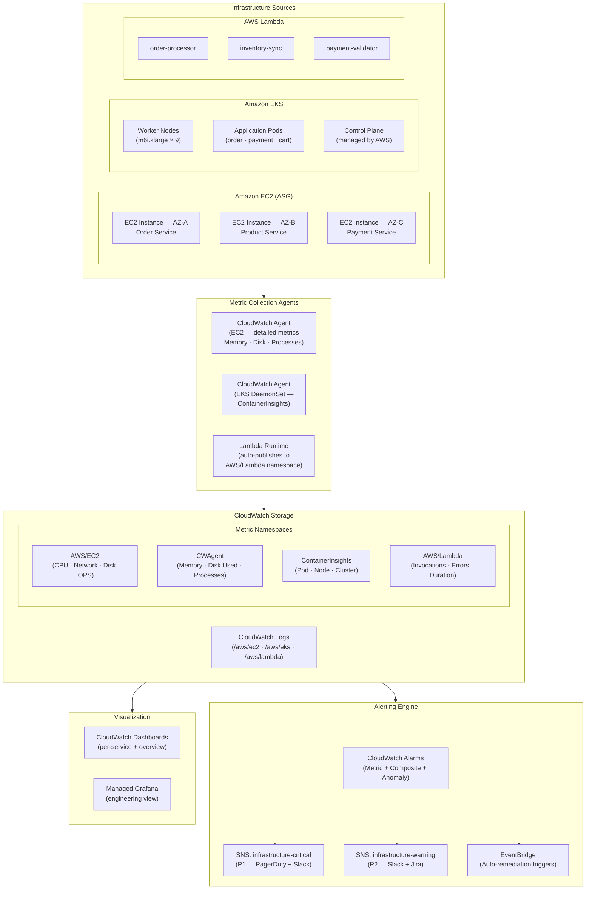
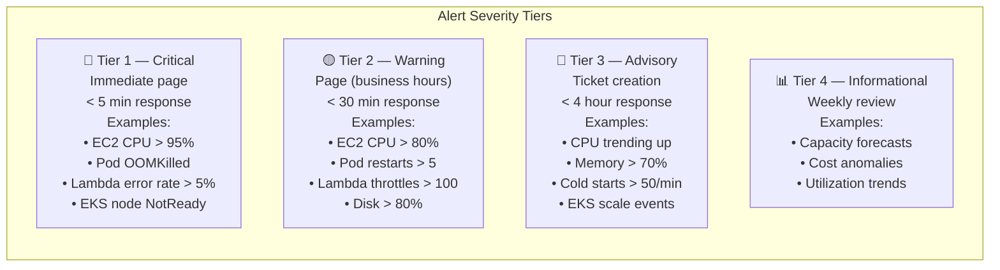
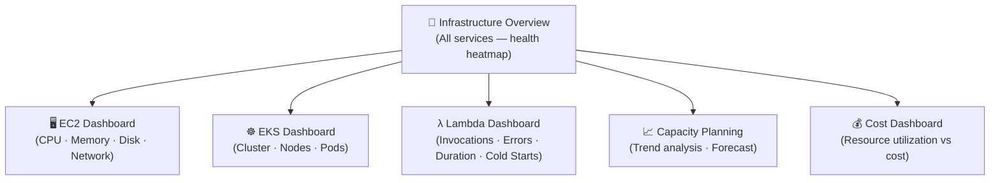
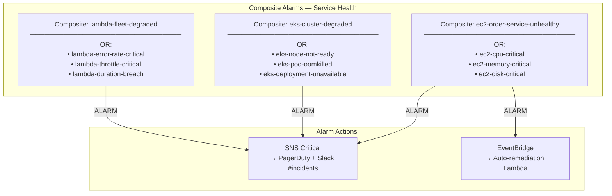
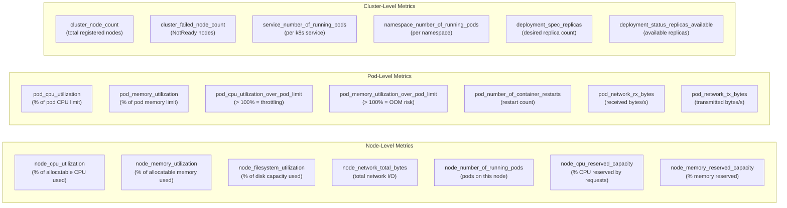
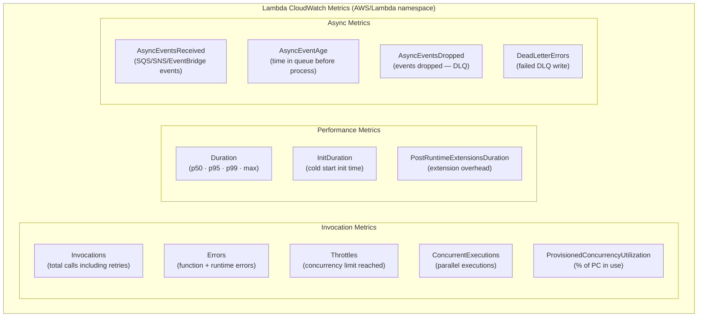
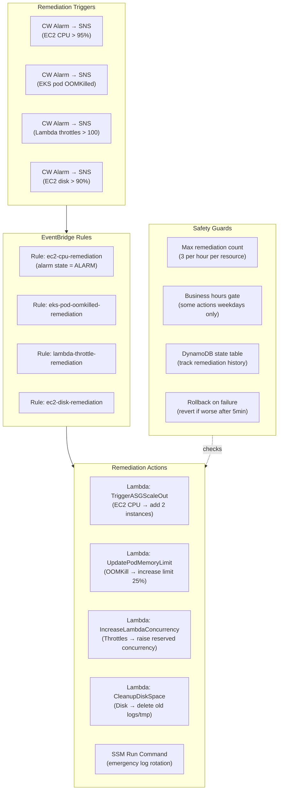

# Production Infrastructure Monitoring
## AWS CloudWatch — EC2 · EKS · Lambda

> **Role**: Senior Cloud Operations Engineer
> **Date**: 2026-07-18
> **Platform**: E-Commerce Microservices — Multi-AZ Production Environment
> **Scope**: Full infrastructure observability — Metrics · Alarms · Dashboards · Auto-Remediation

---

## Table of Contents

1. [Monitoring Architecture](#1-monitoring-architecture)
2. [Dashboard Design](#2-dashboard-design)
3. [Alarm Strategy](#3-alarm-strategy)
4. [EC2 Monitoring](#4-ec2-monitoring)
5. [EKS Monitoring](#5-eks-monitoring)
6. [Lambda Monitoring](#6-lambda-monitoring)
7. [Auto-Remediation Design](#7-auto-remediation-design)
8. [Best Practices](#8-best-practices)

---

## 1. Monitoring Architecture

### 1.1 Full-Stack Monitoring Architecture



### 1.2 Metric Coverage Matrix

| Resource | Platform Metrics | Custom (Agent) | Logs | Traces |
|---|---|---|---|---|
| EC2 | CPU, NetworkIn/Out, DiskReadOps | Memory%, DiskUsed%, Processes | `/aws/ec2/*` (app logs) | X-Ray via ADOT |
| EKS Node | — (via ContainerInsights) | CPU%, Memory%, DiskUsed% | `/aws/eks/cluster/node` | — |
| EKS Pod | — (via ContainerInsights) | CPU%, Memory%, Restarts | `/aws/eks/cluster/app` | X-Ray via ADOT |
| EKS Cluster | — (via ContainerInsights) | Node count, Deployment health | `/aws/eks/cluster/events` | — |
| Lambda | Invocations, Errors, Duration | Cold starts (EMF), Throttles | `/aws/lambda/*` | X-Ray active tracing |

### 1.3 Monitoring Tiers



---

## 2. Dashboard Design

### 2.1 Dashboard Hierarchy



### 2.2 Infrastructure Overview Dashboard

```json
{
  "widgets": [
    {
      "type": "text",
      "properties": {
        "markdown": "# 🏢 Infrastructure Health Overview — Production\n**Region**: us-east-1 | **Last Updated**: Auto-refresh 1min\n\n| Status | Meaning |\n|---|---|\n| 🟢 | Healthy — within all thresholds |\n| 🟡 | Warning — approaching limits |\n| 🔴 | Critical — action required |"
      }
    },
    {
      "type": "alarm",
      "properties": {
        "title": "🚨 Active Infrastructure Alarms",
        "alarms": [
          "arn:aws:cloudwatch:us-east-1:123456789012:alarm:ec2-cpu-critical",
          "arn:aws:cloudwatch:us-east-1:123456789012:alarm:eks-node-not-ready",
          "arn:aws:cloudwatch:us-east-1:123456789012:alarm:eks-pod-oomkilled",
          "arn:aws:cloudwatch:us-east-1:123456789012:alarm:lambda-error-rate-critical",
          "arn:aws:cloudwatch:us-east-1:123456789012:alarm:lambda-throttle-critical"
        ]
      }
    },
    {
      "type": "metric",
      "properties": {
        "title": "EC2 — Fleet CPU Utilization (All ASG instances)",
        "view": "timeSeries",
        "metrics": [
          ["AWS/EC2", "CPUUtilization", "AutoScalingGroupName", "order-service-asg",
           {"stat": "Average", "period": 300, "label": "Order Service ASG"}],
          ["AWS/EC2", "CPUUtilization", "AutoScalingGroupName", "product-service-asg",
           {"stat": "Average", "period": 300, "label": "Product Service ASG"}],
          ["AWS/EC2", "CPUUtilization", "AutoScalingGroupName", "payment-service-asg",
           {"stat": "Average", "period": 300, "label": "Payment Service ASG"}]
        ],
        "annotations": {
          "horizontal": [
            {"value": 80, "color": "#ff9900", "label": "Warning (80%)"},
            {"value": 95, "color": "#d62728", "label": "Critical (95%)"}
          ]
        },
        "yAxis": {"left": {"min": 0, "max": 100, "label": "%"}}
      }
    },
    {
      "type": "metric",
      "properties": {
        "title": "EKS — Pod Memory Utilization (% of request)",
        "view": "timeSeries",
        "metrics": [
          ["ContainerInsights", "pod_memory_utilization_over_pod_limit",
           "ClusterName", "ecommerce-prod", "Namespace", "ecommerce",
           {"stat": "Average", "period": 300, "label": "Avg Pod Memory %"}],
          ["ContainerInsights", "pod_memory_utilization_over_pod_limit",
           "ClusterName", "ecommerce-prod", "Namespace", "ecommerce",
           {"stat": "p99", "period": 300, "label": "p99 Pod Memory %"}]
        ],
        "annotations": {
          "horizontal": [
            {"value": 80, "color": "#ff9900", "label": "Warning"},
            {"value": 95, "color": "#d62728", "label": "OOM Risk"}
          ]
        }
      }
    },
    {
      "type": "metric",
      "properties": {
        "title": "Lambda — Error Rate (%) — All Functions",
        "view": "timeSeries",
        "metrics": [
          [{"expression": "(m1/m2)*100", "label": "order-processor Error %", "id": "e1"}],
          ["AWS/Lambda", "Errors",      "FunctionName", "order-processor",
           {"stat": "Sum", "period": 60, "id": "m1", "visible": false}],
          ["AWS/Lambda", "Invocations", "FunctionName", "order-processor",
           {"stat": "Sum", "period": 60, "id": "m2", "visible": false}],
          [{"expression": "(m3/m4)*100", "label": "inventory-sync Error %", "id": "e2"}],
          ["AWS/Lambda", "Errors",      "FunctionName", "inventory-sync",
           {"stat": "Sum", "period": 60, "id": "m3", "visible": false}],
          ["AWS/Lambda", "Invocations", "FunctionName", "inventory-sync",
           {"stat": "Sum", "period": 60, "id": "m4", "visible": false}]
        ],
        "annotations": {
          "horizontal": [
            {"value": 1, "color": "#ff9900", "label": "1% Warning"},
            {"value": 5, "color": "#d62728", "label": "5% Critical"}
          ]
        },
        "yAxis": {"left": {"min": 0, "max": 10, "label": "%"}}
      }
    },
    {
      "type": "metric",
      "properties": {
        "title": "EKS Cluster — Node Health",
        "view": "singleValue",
        "sparkline": true,
        "metrics": [
          ["ContainerInsights", "cluster_node_count",
           "ClusterName", "ecommerce-prod",
           {"stat": "Average", "period": 300, "label": "Total Nodes"}],
          ["ContainerInsights", "cluster_failed_node_count",
           "ClusterName", "ecommerce-prod",
           {"stat": "Average", "period": 300, "label": "Failed Nodes"}]
        ]
      }
    }
  ]
}
```

### 2.3 EC2 Dashboard JSON

```json
{
  "widgets": [
    {
      "type": "metric",
      "properties": {
        "title": "CPU Utilization — p50 / p90 / p99 (Fleet)",
        "view": "timeSeries",
        "metrics": [
          ["AWS/EC2", "CPUUtilization", "AutoScalingGroupName", "order-service-asg",
           {"stat": "p50",     "period": 300, "label": "p50",  "color": "#2ca02c"}],
          ["AWS/EC2", "CPUUtilization", "AutoScalingGroupName", "order-service-asg",
           {"stat": "p90",     "period": 300, "label": "p90",  "color": "#ff9900"}],
          ["AWS/EC2", "CPUUtilization", "AutoScalingGroupName", "order-service-asg",
           {"stat": "p99",     "period": 300, "label": "p99",  "color": "#d62728"}],
          ["AWS/EC2", "CPUUtilization", "AutoScalingGroupName", "order-service-asg",
           {"stat": "Maximum", "period": 300, "label": "Max",  "color": "#9467bd"}]
        ],
        "annotations": {
          "horizontal": [
            {"value": 80, "color": "#ff9900", "label": "Warning"},
            {"value": 95, "color": "#d62728", "label": "Critical"}
          ]
        }
      }
    },
    {
      "type": "metric",
      "properties": {
        "title": "Memory Utilization % (CloudWatch Agent)",
        "view": "timeSeries",
        "metrics": [
          ["CWAgent", "mem_used_percent", "AutoScalingGroupName", "order-service-asg",
           {"stat": "Average", "period": 300, "label": "Avg Memory %"}],
          ["CWAgent", "mem_used_percent", "AutoScalingGroupName", "order-service-asg",
           {"stat": "Maximum", "period": 300, "label": "Max Memory %"}]
        ],
        "annotations": {
          "horizontal": [
            {"value": 80, "color": "#ff9900", "label": "Warning (80%)"},
            {"value": 90, "color": "#d62728", "label": "Critical (90%)"}
          ]
        }
      }
    },
    {
      "type": "metric",
      "properties": {
        "title": "Disk Utilization % — Root Volume",
        "view": "timeSeries",
        "metrics": [
          ["CWAgent", "disk_used_percent",
           "AutoScalingGroupName", "order-service-asg",
           "path", "/", "fstype", "xfs",
           {"stat": "Maximum", "period": 300, "label": "Max Disk %"}]
        ],
        "annotations": {
          "horizontal": [
            {"value": 75, "color": "#ff9900", "label": "Warning (75%)"},
            {"value": 90, "color": "#d62728", "label": "Critical (90%)"}
          ]
        }
      }
    },
    {
      "type": "metric",
      "properties": {
        "title": "Network Throughput — In / Out (bytes/s)",
        "view": "timeSeries",
        "metrics": [
          ["AWS/EC2", "NetworkIn",  "AutoScalingGroupName", "order-service-asg",
           {"stat": "Average", "period": 300, "label": "Network In"}],
          ["AWS/EC2", "NetworkOut", "AutoScalingGroupName", "order-service-asg",
           {"stat": "Average", "period": 300, "label": "Network Out"}]
        ]
      }
    },
    {
      "type": "metric",
      "properties": {
        "title": "EC2 Instance Count — ASG Fleet",
        "view": "singleValue",
        "sparkline": true,
        "metrics": [
          ["AWS/AutoScaling", "GroupInServiceInstances",
           "AutoScalingGroupName", "order-service-asg",
           {"stat": "Average", "period": 300, "label": "In-Service"}],
          ["AWS/AutoScaling", "GroupDesiredCapacity",
           "AutoScalingGroupName", "order-service-asg",
           {"stat": "Average", "period": 300, "label": "Desired"}],
          ["AWS/AutoScaling", "GroupPendingInstances",
           "AutoScalingGroupName", "order-service-asg",
           {"stat": "Sum", "period": 300, "label": "Pending"}]
        ]
      }
    }
  ]
}
```

---

## 3. Alarm Strategy

### 3.1 Composite Alarm Architecture



### 3.2 Complete Alarm CloudFormation

```yaml
# infrastructure-alarms.yaml
AWSTemplateFormatVersion: "2010-09-09"
Description: Production infrastructure alarms — EC2 · EKS · Lambda

Parameters:
  ASGOrderService:
    Type: String
    Default: order-service-asg
  EKSClusterName:
    Type: String
    Default: ecommerce-prod
  SNSCriticalArn:
    Type: String
  SNSWarningArn:
    Type: String

Resources:

  # ═══════════════════════════════════════════════════════
  # EC2 ALARMS
  # ═══════════════════════════════════════════════════════

  EC2CPUCritical:
    Type: AWS::CloudWatch::Alarm
    Properties:
      AlarmName: ec2-cpu-critical
      AlarmDescription: |
        EC2 fleet CPU > 95% for 10 minutes.
        Runbook: https://wiki.internal/runbooks/ec2-cpu-high
      Namespace: AWS/EC2
      MetricName: CPUUtilization
      Dimensions:
        - Name: AutoScalingGroupName
          Value: !Ref ASGOrderService
      Statistic: p99
      Period: 300
      EvaluationPeriods: 2
      DatapointsToAlarm: 2
      Threshold: 95
      ComparisonOperator: GreaterThanThreshold
      TreatMissingData: notBreaching
      AlarmActions: [!Ref SNSCriticalArn]
      OKActions:    [!Ref SNSCriticalArn]

  EC2CPUWarning:
    Type: AWS::CloudWatch::Alarm
    Properties:
      AlarmName: ec2-cpu-warning
      AlarmDescription: "EC2 fleet CPU > 80% — scale-out may be needed"
      Namespace: AWS/EC2
      MetricName: CPUUtilization
      Dimensions:
        - Name: AutoScalingGroupName
          Value: !Ref ASGOrderService
      Statistic: Average
      Period: 300
      EvaluationPeriods: 3
      DatapointsToAlarm: 2
      Threshold: 80
      ComparisonOperator: GreaterThanThreshold
      TreatMissingData: notBreaching
      AlarmActions: [!Ref SNSWarningArn]

  EC2MemoryCritical:
    Type: AWS::CloudWatch::Alarm
    Properties:
      AlarmName: ec2-memory-critical
      AlarmDescription: |
        EC2 memory utilization > 90%.
        Risk: OOM kill of application processes.
        Runbook: https://wiki.internal/runbooks/ec2-memory-high
      Namespace: CWAgent
      MetricName: mem_used_percent
      Dimensions:
        - Name: AutoScalingGroupName
          Value: !Ref ASGOrderService
      Statistic: Maximum
      Period: 300
      EvaluationPeriods: 2
      Threshold: 90
      ComparisonOperator: GreaterThanThreshold
      TreatMissingData: notBreaching
      AlarmActions: [!Ref SNSCriticalArn]

  EC2DiskCritical:
    Type: AWS::CloudWatch::Alarm
    Properties:
      AlarmName: ec2-disk-critical
      AlarmDescription: |
        EC2 disk usage > 90% on root volume.
        Risk: Application crash, log loss, swap failure.
      Namespace: CWAgent
      MetricName: disk_used_percent
      Dimensions:
        - Name: AutoScalingGroupName
          Value: !Ref ASGOrderService
        - Name: path
          Value: /
      Statistic: Maximum
      Period: 300
      EvaluationPeriods: 1
      Threshold: 90
      ComparisonOperator: GreaterThanThreshold
      TreatMissingData: notBreaching
      AlarmActions: [!Ref SNSCriticalArn]

  EC2StatusCheckFailed:
    Type: AWS::CloudWatch::Alarm
    Properties:
      AlarmName: ec2-status-check-failed
      AlarmDescription: "EC2 instance or system status check failed — hardware/hypervisor issue"
      Namespace: AWS/EC2
      MetricName: StatusCheckFailed
      Dimensions:
        - Name: AutoScalingGroupName
          Value: !Ref ASGOrderService
      Statistic: Maximum
      Period: 60
      EvaluationPeriods: 2
      Threshold: 0
      ComparisonOperator: GreaterThanThreshold
      TreatMissingData: breaching
      AlarmActions: [!Ref SNSCriticalArn]

  # ═══════════════════════════════════════════════════════
  # EKS ALARMS
  # ═══════════════════════════════════════════════════════

  EKSNodeNotReady:
    Type: AWS::CloudWatch::Alarm
    Properties:
      AlarmName: eks-node-not-ready
      AlarmDescription: |
        EKS cluster has failed nodes (NotReady condition).
        Runbook: https://wiki.internal/runbooks/eks-node-notready
      Namespace: ContainerInsights
      MetricName: cluster_failed_node_count
      Dimensions:
        - Name: ClusterName
          Value: !Ref EKSClusterName
      Statistic: Maximum
      Period: 60
      EvaluationPeriods: 2
      Threshold: 0
      ComparisonOperator: GreaterThanThreshold
      TreatMissingData: notBreaching
      AlarmActions: [!Ref SNSCriticalArn]
      OKActions:    [!Ref SNSCriticalArn]

  EKSNodeCPUCritical:
    Type: AWS::CloudWatch::Alarm
    Properties:
      AlarmName: eks-node-cpu-critical
      AlarmDescription: "EKS worker node CPU > 90% — pod scheduling may be affected"
      Namespace: ContainerInsights
      MetricName: node_cpu_utilization
      Dimensions:
        - Name: ClusterName
          Value: !Ref EKSClusterName
      Statistic: p99
      Period: 300
      EvaluationPeriods: 2
      Threshold: 90
      ComparisonOperator: GreaterThanThreshold
      TreatMissingData: notBreaching
      AlarmActions: [!Ref SNSCriticalArn]

  EKSNodeMemoryCritical:
    Type: AWS::CloudWatch::Alarm
    Properties:
      AlarmName: eks-node-memory-critical
      AlarmDescription: "EKS worker node memory > 90% — pod eviction risk"
      Namespace: ContainerInsights
      MetricName: node_memory_utilization
      Dimensions:
        - Name: ClusterName
          Value: !Ref EKSClusterName
      Statistic: p99
      Period: 300
      EvaluationPeriods: 2
      Threshold: 90
      ComparisonOperator: GreaterThanThreshold
      TreatMissingData: notBreaching
      AlarmActions: [!Ref SNSCriticalArn]

  EKSPodOOMKilled:
    Type: AWS::CloudWatch::Alarm
    Properties:
      AlarmName: eks-pod-oomkilled
      AlarmDescription: |
        EKS pod OOMKilled — memory limit exceeded.
        Check container memory limits and application heap settings.
      Namespace: ContainerInsights
      MetricName: pod_number_of_container_restarts
      Dimensions:
        - Name: ClusterName
          Value: !Ref EKSClusterName
        - Name: Namespace
          Value: ecommerce
      Statistic: Sum
      Period: 300
      EvaluationPeriods: 1
      Threshold: 5
      ComparisonOperator: GreaterThanThreshold
      TreatMissingData: notBreaching
      AlarmActions: [!Ref SNSCriticalArn]

  EKSDeploymentUnavailable:
    Type: AWS::CloudWatch::Alarm
    Properties:
      AlarmName: eks-deployment-unavailable
      AlarmDescription: "EKS deployment has unavailable replicas — service degradation"
      Namespace: ContainerInsights
      MetricName: service_number_of_running_pods
      Dimensions:
        - Name: ClusterName
          Value: !Ref EKSClusterName
        - Name: Namespace
          Value: ecommerce
      Statistic: Minimum
      Period: 300
      EvaluationPeriods: 2
      Threshold: 1
      ComparisonOperator: LessThanThreshold
      TreatMissingData: breaching
      AlarmActions: [!Ref SNSCriticalArn]

  # ═══════════════════════════════════════════════════════
  # LAMBDA ALARMS
  # ═══════════════════════════════════════════════════════

  LambdaErrorRateCritical:
    Type: AWS::CloudWatch::Alarm
    Properties:
      AlarmName: lambda-error-rate-critical
      AlarmDescription: |
        Lambda error rate > 5% on order-processor.
        Runbook: https://wiki.internal/runbooks/lambda-errors
      Metrics:
        - Id: error_rate
          Expression: "(errors / invocations) * 100"
          ReturnData: true
        - Id: errors
          MetricStat:
            Metric:
              Namespace: AWS/Lambda
              MetricName: Errors
              Dimensions:
                - Name: FunctionName
                  Value: order-processor
            Period: 60
            Stat: Sum
          ReturnData: false
        - Id: invocations
          MetricStat:
            Metric:
              Namespace: AWS/Lambda
              MetricName: Invocations
              Dimensions:
                - Name: FunctionName
                  Value: order-processor
            Period: 60
            Stat: Sum
          ReturnData: false
      ComparisonOperator: GreaterThanThreshold
      Threshold: 5
      EvaluationPeriods: 2
      DatapointsToAlarm: 2
      TreatMissingData: notBreaching
      AlarmActions: [!Ref SNSCriticalArn]
      OKActions:    [!Ref SNSCriticalArn]

  LambdaThrottleCritical:
    Type: AWS::CloudWatch::Alarm
    Properties:
      AlarmName: lambda-throttle-critical
      AlarmDescription: "Lambda throttling > 100 in 5 minutes — concurrency limit reached"
      Namespace: AWS/Lambda
      MetricName: Throttles
      Dimensions:
        - Name: FunctionName
          Value: order-processor
      Statistic: Sum
      Period: 300
      EvaluationPeriods: 1
      Threshold: 100
      ComparisonOperator: GreaterThanThreshold
      TreatMissingData: notBreaching
      AlarmActions: [!Ref SNSCriticalArn]

  LambdaDurationBreach:
    Type: AWS::CloudWatch::Alarm
    Properties:
      AlarmName: lambda-duration-p99-breach
      AlarmDescription: "Lambda p99 duration approaching 80% of timeout limit"
      Namespace: AWS/Lambda
      MetricName: Duration
      Dimensions:
        - Name: FunctionName
          Value: order-processor
      ExtendedStatistic: p99
      Period: 300
      EvaluationPeriods: 2
      # Alert at 80% of 30s timeout = 24,000ms
      Threshold: 24000
      ComparisonOperator: GreaterThanThreshold
      TreatMissingData: notBreaching
      AlarmActions: [!Ref SNSWarningArn]

  # ═══════════════════════════════════════════════════════
  # COMPOSITE ALARMS
  # ═══════════════════════════════════════════════════════

  EC2FleetDegraded:
    Type: AWS::CloudWatch::CompositeAlarm
    DependsOn: [EC2CPUCritical, EC2MemoryCritical, EC2DiskCritical, EC2StatusCheckFailed]
    Properties:
      AlarmName: ec2-fleet-degraded
      AlarmDescription: "EC2 order service fleet is degraded — at least one critical signal in alarm"
      AlarmRule: >
        ALARM("ec2-cpu-critical") OR
        ALARM("ec2-memory-critical") OR
        ALARM("ec2-disk-critical") OR
        ALARM("ec2-status-check-failed")
      AlarmActions: [!Ref SNSCriticalArn]
      OKActions:    [!Ref SNSCriticalArn]

  EKSClusterDegraded:
    Type: AWS::CloudWatch::CompositeAlarm
    DependsOn: [EKSNodeNotReady, EKSPodOOMKilled, EKSDeploymentUnavailable]
    Properties:
      AlarmName: eks-cluster-degraded
      AlarmDescription: "EKS cluster health degraded — at least one critical condition active"
      AlarmRule: >
        ALARM("eks-node-not-ready") OR
        ALARM("eks-pod-oomkilled") OR
        ALARM("eks-deployment-unavailable")
      AlarmActions: [!Ref SNSCriticalArn]
      OKActions:    [!Ref SNSCriticalArn]

  LambdaFleetDegraded:
    Type: AWS::CloudWatch::CompositeAlarm
    DependsOn: [LambdaErrorRateCritical, LambdaThrottleCritical]
    Properties:
      AlarmName: lambda-fleet-degraded
      AlarmDescription: "Lambda fleet experiencing critical issues"
      AlarmRule: >
        ALARM("lambda-error-rate-critical") OR
        ALARM("lambda-throttle-critical")
      AlarmActions: [!Ref SNSCriticalArn]
      OKActions:    [!Ref SNSCriticalArn]
```

---

## 4. EC2 Monitoring

### 4.1 CloudWatch Agent Configuration

```json
// /opt/aws/amazon-cloudwatch-agent/etc/amazon-cloudwatch-agent.json
{
  "agent": {
    "metrics_collection_interval": 60,
    "run_as_user": "cwagent",
    "logfile": "/opt/aws/amazon-cloudwatch-agent/logs/amazon-cloudwatch-agent.log"
  },

  "metrics": {
    "namespace": "CWAgent",
    "append_dimensions": {
      "AutoScalingGroupName": "${aws:AutoScalingGroupName}",
      "InstanceId":           "${aws:InstanceId}",
      "InstanceType":         "${aws:InstanceType}",
      "ImageId":              "${aws:ImageId}"
    },
    "aggregation_dimensions": [
      ["AutoScalingGroupName"],
      ["InstanceId", "AutoScalingGroupName"]
    ],
    "metrics_collected": {
      "cpu": {
        "resources":                ["*"],
        "measurement":              ["cpu_usage_idle", "cpu_usage_user", "cpu_usage_system", "cpu_usage_iowait"],
        "metrics_collection_interval": 60,
        "totalcpu": true
      },
      "mem": {
        "measurement":              ["mem_used_percent", "mem_available_percent", "mem_used", "mem_total"],
        "metrics_collection_interval": 60
      },
      "disk": {
        "resources":                ["/", "/var", "/tmp", "/data"],
        "measurement":              ["disk_used_percent", "disk_free", "disk_used", "disk_total"],
        "metrics_collection_interval": 300,
        "drop_device": true
      },
      "diskio": {
        "resources":                ["*"],
        "measurement":              ["diskio_reads", "diskio_writes", "diskio_read_bytes", "diskio_write_bytes", "diskio_read_time", "diskio_write_time", "diskio_iops_in_progress"],
        "metrics_collection_interval": 60
      },
      "net": {
        "resources":                ["eth0"],
        "measurement":              ["net_bytes_recv", "net_bytes_sent", "net_packets_recv", "net_packets_sent", "net_err_in", "net_err_out", "net_drop_in", "net_drop_out"],
        "metrics_collection_interval": 60
      },
      "swap": {
        "measurement":              ["swap_used_percent", "swap_free"],
        "metrics_collection_interval": 300
      },
      "processes": {
        "measurement":              ["processes_running", "processes_sleeping", "processes_zombies", "processes_total"],
        "metrics_collection_interval": 60
      },
      "netstat": {
        "measurement":              ["netstat_tcp_established", "netstat_tcp_time_wait", "netstat_tcp_close_wait"],
        "metrics_collection_interval": 60
      }
    }
  },

  "logs": {
    "logs_collected": {
      "files": {
        "collect_list": [
          {
            "file_path":        "/var/log/ecommerce/application.log",
            "log_group_name":   "/aws/ec2/ecommerce/application",
            "log_stream_name":  "{instance_id}/application",
            "timezone":         "UTC",
            "timestamp_format": "%Y-%m-%dT%H:%M:%S.%fZ",
            "multi_line_start_pattern": "^\\d{4}-\\d{2}-\\d{2}",
            "retention_in_days": 14
          },
          {
            "file_path":        "/var/log/ecommerce/error.log",
            "log_group_name":   "/aws/ec2/ecommerce/errors",
            "log_stream_name":  "{instance_id}/errors",
            "retention_in_days": 30
          },
          {
            "file_path":        "/var/log/syslog",
            "log_group_name":   "/aws/ec2/ecommerce/syslog",
            "log_stream_name":  "{instance_id}/syslog",
            "retention_in_days": 7
          },
          {
            "file_path":        "/var/log/messages",
            "log_group_name":   "/aws/ec2/ecommerce/messages",
            "log_stream_name":  "{instance_id}/messages",
            "retention_in_days": 7
          }
        ]
      }
    },
    "log_stream_name": "default/{instance_id}",
    "force_flush_interval": 5
  }
}
```

### 4.2 EC2 UserData — Agent Bootstrap

```bash
#!/bin/bash
# ec2-monitoring-bootstrap.sh
set -euo pipefail

AWS_REGION=$(curl -sf http://169.254.169.254/latest/meta-data/placement/region)

# Install CloudWatch Agent
yum install -y amazon-cloudwatch-agent

# Pull agent config from SSM
aws ssm get-parameter \
  --name "/ecommerce/prod/cw-agent/ec2-config" \
  --with-decryption \
  --region "$AWS_REGION" \
  --query 'Parameter.Value' \
  --output text \
  > /opt/aws/amazon-cloudwatch-agent/etc/amazon-cloudwatch-agent.json

# Start the agent
/opt/aws/amazon-cloudwatch-agent/bin/amazon-cloudwatch-agent-ctl \
  -a fetch-config \
  -m ec2 \
  -c file:/opt/aws/amazon-cloudwatch-agent/etc/amazon-cloudwatch-agent.json \
  -s

# Verify
sleep 5
/opt/aws/amazon-cloudwatch-agent/bin/amazon-cloudwatch-agent-ctl -m ec2 -a status | \
  python3 -c "import sys,json; d=json.load(sys.stdin); print('Agent:', d.get('status'))"
```

### 4.3 EC2 Metric Alarm Thresholds

| Metric | Namespace | Warning | Critical | Period | Stat |
|---|---|---|---|---|---|
| CPUUtilization | AWS/EC2 | > 80% | > 95% | 5min | p99 |
| mem_used_percent | CWAgent | > 80% | > 90% | 5min | Maximum |
| disk_used_percent (/) | CWAgent | > 75% | > 90% | 5min | Maximum |
| diskio_iops_in_progress | CWAgent | > 64 | > 128 | 1min | Average |
| netstat_tcp_time_wait | CWAgent | > 5000 | > 10000 | 5min | Maximum |
| StatusCheckFailed | AWS/EC2 | — | > 0 | 1min | Maximum |
| NetworkPacketsOut | AWS/EC2 | — | Anomaly | 5min | Average |

### 4.4 CloudWatch Logs Insights — EC2 Queries

```sql
-- Top 10 errors on EC2 fleet in last 1 hour
fields @timestamp, @logStream, level, message, errorCode
| filter level = "ERROR"
| stats count() as errorCount by message, errorCode
| sort errorCount desc
| limit 10

-- High CPU processes (requires process metrics in agent config)
fields @timestamp, @logStream, process_name, cpu_usage
| filter cpu_usage > 80
| sort @timestamp desc
| limit 20

-- OOM events from syslog
fields @timestamp, @logStream, @message
| filter @message like /Out of memory|oom_kill_process|Killed process/
| sort @timestamp desc
| limit 50

-- Disk space trajectory (predict when full)
fields @timestamp, disk_used_percent
| filter metric_name = "disk_used_percent"
| stats max(disk_used_percent) as max_disk by bin(1h)
| sort @timestamp asc
```

---

## 5. EKS Monitoring

### 5.1 Container Insights Setup

```bash
# Enable Container Insights on EKS cluster (CloudWatch Agent + Fluent Bit)
ClusterName="ecommerce-prod"
RegionName="us-east-1"
FluentBitHttpPort="2020"
FluentBitReadFromHead="Off"
FluentBitReadFromTail="On"

curl -s https://raw.githubusercontent.com/aws-samples/amazon-cloudwatch-container-insights/latest/k8s-deployment-manifest-templates/deployment-mode/daemonset/container-insights-monitoring/quickstart/cwagent-fluent-bit-quickstart.yaml \
  | sed \
    "s/{{cluster_name}}/${ClusterName}/g;
     s/{{region_name}}/${RegionName}/g;
     s/{{http_server_toggle}}/\"On\"/g;
     s/{{http_server_port}}/\"${FluentBitHttpPort}\"/g;
     s/{{read_from_head}}/\"${FluentBitReadFromHead}\"/g;
     s/{{read_from_tail}}/\"${FluentBitReadFromTail}\"/g" \
  | kubectl apply -f -

# Verify agent deployment
kubectl get pods -n amazon-cloudwatch
kubectl logs -n amazon-cloudwatch \
  $(kubectl get pod -n amazon-cloudwatch -l name=cloudwatch-agent \
    -o jsonpath='{.items[0].metadata.name}') | tail -20
```

### 5.2 CloudWatch Agent ConfigMap — Enhanced EKS

```yaml
# k8s/cwagent-configmap.yaml
apiVersion: v1
kind: ConfigMap
metadata:
  name: cwagentconfig
  namespace: amazon-cloudwatch
data:
  cwagentconfig.json: |
    {
      "agent": {
        "region": "us-east-1"
      },
      "logs": {
        "metrics_collected": {
          "kubernetes": {
            "cluster_name":              "ecommerce-prod",
            "metrics_collection_interval": 30,
            "enhanced_container_insights": true
          }
        },
        "force_flush_interval": 5
      }
    }
```

### 5.3 EKS Metric Reference



### 5.4 EKS Alarm Terraform

```hcl
# eks-alarms.tf

# ── Node: CPU Critical ────────────────────────────────────────────────────
resource "aws_cloudwatch_metric_alarm" "eks_node_cpu_critical" {
  alarm_name          = "eks-node-cpu-critical"
  alarm_description   = "EKS node CPU > 90% — pod scheduling may be impacted. Consider scaling node group."
  namespace           = "ContainerInsights"
  metric_name         = "node_cpu_utilization"
  dimensions          = { ClusterName = var.cluster_name }
  extended_statistic  = "p99"
  period              = 300
  evaluation_periods  = 2
  datapoints_to_alarm = 2
  threshold           = 90
  comparison_operator = "GreaterThanThreshold"
  treat_missing_data  = "notBreaching"
  alarm_actions       = [var.sns_critical_arn]
  ok_actions          = [var.sns_critical_arn]

  tags = { Tier = "critical", Service = "eks" }
}

# ── Node: Memory Critical ─────────────────────────────────────────────────
resource "aws_cloudwatch_metric_alarm" "eks_node_memory_critical" {
  alarm_name          = "eks-node-memory-critical"
  alarm_description   = "EKS node memory > 90%. Pod eviction may trigger. Scale node group or increase limits."
  namespace           = "ContainerInsights"
  metric_name         = "node_memory_utilization"
  dimensions          = { ClusterName = var.cluster_name }
  extended_statistic  = "p99"
  period              = 300
  evaluation_periods  = 2
  threshold           = 90
  comparison_operator = "GreaterThanThreshold"
  treat_missing_data  = "notBreaching"
  alarm_actions       = [var.sns_critical_arn]
}

# ── Node: Disk Critical ───────────────────────────────────────────────────
resource "aws_cloudwatch_metric_alarm" "eks_node_disk_critical" {
  alarm_name          = "eks-node-disk-critical"
  alarm_description   = "EKS node disk > 85%. Container log rotation and image pulls may fail."
  namespace           = "ContainerInsights"
  metric_name         = "node_filesystem_utilization"
  dimensions          = { ClusterName = var.cluster_name }
  statistic           = "Maximum"
  period              = 300
  evaluation_periods  = 1
  threshold           = 85
  comparison_operator = "GreaterThanThreshold"
  treat_missing_data  = "notBreaching"
  alarm_actions       = [var.sns_critical_arn]
}

# ── Pod: Memory at Limit (OOM Risk) ──────────────────────────────────────
resource "aws_cloudwatch_metric_alarm" "eks_pod_memory_limit" {
  alarm_name          = "eks-pod-memory-at-limit"
  alarm_description   = "Pod memory > 95% of limit — OOMKill imminent. Increase memory limits or fix memory leak."
  namespace           = "ContainerInsights"
  metric_name         = "pod_memory_utilization_over_pod_limit"
  dimensions = {
    ClusterName = var.cluster_name
    Namespace   = "ecommerce"
  }
  extended_statistic  = "p99"
  period              = 300
  evaluation_periods  = 2
  threshold           = 95
  comparison_operator = "GreaterThanThreshold"
  treat_missing_data  = "notBreaching"
  alarm_actions       = [var.sns_critical_arn]
}

# ── Pod: High Restart Count ───────────────────────────────────────────────
resource "aws_cloudwatch_metric_alarm" "eks_pod_restarts" {
  alarm_name          = "eks-pod-restart-count-high"
  alarm_description   = "Pod restart count > 5 in 5 minutes — CrashLoopBackOff or OOMKill suspected."
  namespace           = "ContainerInsights"
  metric_name         = "pod_number_of_container_restarts"
  dimensions = {
    ClusterName = var.cluster_name
    Namespace   = "ecommerce"
  }
  statistic           = "Sum"
  period              = 300
  evaluation_periods  = 1
  threshold           = 5
  comparison_operator = "GreaterThanThreshold"
  treat_missing_data  = "notBreaching"
  alarm_actions       = [var.sns_critical_arn]
}

# ── Cluster: Node Count Drop ─────────────────────────────────────────────
resource "aws_cloudwatch_metric_alarm" "eks_node_count_drop" {
  alarm_name          = "eks-node-count-drop"
  alarm_description   = "EKS cluster node count dropped. Scale-in event or node failure."
  metrics = [
    {
      id          = "node_count"
      metric_stat = {
        metric = {
          namespace   = "ContainerInsights"
          metric_name = "cluster_node_count"
          dimensions  = [{ name = "ClusterName", value = var.cluster_name }]
        }
        period = 300
        stat   = "Average"
      }
      return_data = true
    },
    {
      id          = "node_band"
      expression  = "ANOMALY_DETECTION_BAND(node_count, 2)"
      label       = "Expected node count range"
      return_data = true
    }
  ]
  comparison_operator = "LessThanLowerThreshold"
  threshold_metric_id = "node_band"
  evaluation_periods  = 2
  treat_missing_data  = "breaching"
  alarm_actions       = [var.sns_critical_arn]
}

# ── Deployment: Unavailable Replicas ─────────────────────────────────────
resource "aws_cloudwatch_metric_alarm" "eks_deployment_unavailable" {
  for_each = toset(["order-service", "payment-service", "product-service", "cart-service"])

  alarm_name          = "eks-${each.key}-unavailable-replicas"
  alarm_description   = "${each.key} has fewer running pods than desired. Check deployment events."
  namespace           = "ContainerInsights"
  metric_name         = "service_number_of_running_pods"
  dimensions = {
    ClusterName = var.cluster_name
    Namespace   = "ecommerce"
    Service     = each.key
  }
  statistic           = "Minimum"
  period              = 300
  evaluation_periods  = 2
  threshold           = 1
  comparison_operator = "LessThanThreshold"
  treat_missing_data  = "breaching"
  alarm_actions       = [var.sns_critical_arn]
}
```

### 5.5 EKS Logs Insights Queries

```sql
-- Pods with highest restart counts (last 1 hour)
fields @timestamp, kubernetes.pod_name, kubernetes.namespace_name, kubernetes.container_name
| filter kubernetes.container_name != ""
| stats max(number_of_container_restarts) as restarts by kubernetes.pod_name, kubernetes.namespace_name
| filter restarts > 0
| sort restarts desc
| limit 20

-- OOMKilled events
fields @timestamp, @logStream, @message
| filter @logStream like /ecommerce/
| filter @message like /OOMKilled|Out of memory|memory limit|Killed/
| sort @timestamp desc
| limit 30

-- Node pressure events
fields @timestamp, reason, message, involvedObject.name
| filter reason in ["MemoryPressure", "DiskPressure", "PIDPressure", "NodeNotReady", "Evicted"]
| sort @timestamp desc
| limit 20

-- Container CPU throttling (from ContainerInsights metrics)
fields @timestamp, kubernetes.pod_name, kubernetes.container_name, pod_cpu_utilization_over_pod_limit
| filter pod_cpu_utilization_over_pod_limit > 100
| stats avg(pod_cpu_utilization_over_pod_limit) as avg_throttle,
        max(pod_cpu_utilization_over_pod_limit) as max_throttle
  by kubernetes.pod_name, kubernetes.container_name
| sort avg_throttle desc
| limit 15

-- Failed pod schedules (from K8s events log)
fields @timestamp, reason, message, involvedObject.name, involvedObject.kind
| filter reason in ["FailedScheduling", "FailedCreate", "BackOff"]
| sort @timestamp desc
| limit 20
```

---

## 6. Lambda Monitoring

### 6.1 Lambda Metrics Reference



### 6.2 Lambda-Enhanced Monitoring via EMF

```python
# lambda/shared/monitoring.py
# Custom metrics via EMF — zero API call overhead

import json
import time
import os
from functools import wraps
from contextlib import contextmanager
from typing import Callable, Optional
from dataclasses import dataclass, field

@dataclass
class LambdaMetrics:
    """Collects and flushes Lambda business + operational metrics via EMF."""
    function_name: str = field(default_factory=lambda: os.environ.get("AWS_LAMBDA_FUNCTION_NAME", "unknown"))
    function_version: str = field(default_factory=lambda: os.environ.get("AWS_LAMBDA_FUNCTION_VERSION", "unknown"))
    environment: str = field(default_factory=lambda: os.environ.get("DEPLOYMENT_ENVIRONMENT", "production"))
    _metrics: list = field(default_factory=list, init=False)
    _cold_start: bool = field(default=True, init=False)

    def record_metric(
        self,
        name: str,
        value: float,
        unit: str = "Count",
        dimensions: Optional[dict] = None
    ) -> None:
        """Add a metric to the EMF buffer."""
        self._metrics.append({
            "name": name, "value": value, "unit": unit,
            "dimensions": dimensions or {}
        })

    def flush(self) -> None:
        """Write all metrics to stdout as EMF JSON."""
        if not self._metrics:
            return

        # Group metrics by dimension set
        dim_groups: dict = {}
        for m in self._metrics:
            dim_key = json.dumps(m["dimensions"], sort_keys=True)
            if dim_key not in dim_groups:
                dim_groups[dim_key] = {"dims": m["dimensions"], "metrics": []}
            dim_groups[dim_key]["metrics"].append(m)

        for dim_key, group in dim_groups.items():
            emf_doc = {
                "_aws": {
                    "Timestamp": int(time.time() * 1000),
                    "CloudWatchMetrics": [{
                        "Namespace": f"Custom/Lambda/{self.function_name}",
                        "Dimensions": [list({
                            "FunctionName": self.function_name,
                            "FunctionVersion": self.function_version,
                            "Environment": self.environment,
                            **group["dims"]
                        }.keys())],
                        "Metrics": [
                            {"Name": m["name"], "Unit": m["unit"]}
                            for m in group["metrics"]
                        ]
                    }]
                },
                "FunctionName":    self.function_name,
                "FunctionVersion": self.function_version,
                "Environment":     self.environment,
                **group["dims"],
                **{m["name"]: m["value"] for m in group["metrics"]}
            }
            print(json.dumps(emf_doc))   # Lambda stdout → CW Logs → CW Metrics

        self._metrics.clear()


# Global instance — persists across warm invocations
_metrics = LambdaMetrics()

def track_cold_start() -> bool:
    """Detect and record cold start. Returns True if this is a cold start."""
    global _metrics
    if _metrics._cold_start:
        _metrics.record_metric("ColdStart", 1, "Count")
        _metrics._cold_start = False
        return True
    return False


def monitor_lambda(func: Callable) -> Callable:
    """Decorator: auto-records invocation, duration, errors, and cold start."""
    @wraps(func)
    def wrapper(event, context):
        start_ms = time.perf_counter() * 1000
        is_cold  = track_cold_start()
        success  = False

        try:
            result  = func(event, context)
            success = True
            return result
        except Exception as e:
            _metrics.record_metric("FunctionError", 1, "Count", {"ErrorType": type(e).__name__})
            raise
        finally:
            duration_ms = (time.perf_counter() * 1000) - start_ms
            _metrics.record_metric("HandlerDuration", duration_ms, "Milliseconds")
            _metrics.record_metric("Invocation",       1,           "Count")
            _metrics.record_metric("Success",           1 if success else 0, "Count")
            _metrics.record_metric("ColdStartFlag",    1 if is_cold else 0, "Count")

            # Memory utilization (requires psutil or /proc)
            try:
                mem_limit_mb  = int(context.memory_limit_in_mb)
                mem_used_mb   = _get_memory_used_mb()
                _metrics.record_metric("MemoryUtilizationPct",
                    (mem_used_mb / mem_limit_mb) * 100, "Percent")
                _metrics.record_metric("MemoryUsedMB", mem_used_mb, "Megabytes")
            except Exception:
                pass

            _metrics.flush()

    return wrapper


@contextmanager
def timed_operation(operation_name: str, dimensions: Optional[dict] = None):
    """Context manager for timing sub-operations within a Lambda function."""
    start = time.perf_counter() * 1000
    success = True
    try:
        yield
    except Exception:
        success = False
        raise
    finally:
        duration = (time.perf_counter() * 1000) - start
        _metrics.record_metric(f"{operation_name}Duration", duration, "Milliseconds", dimensions)
        _metrics.record_metric(f"{operation_name}Success", 1 if success else 0, "Count", dimensions)


def _get_memory_used_mb() -> float:
    """Read Lambda memory usage from /proc/self/status."""
    with open("/proc/self/status") as f:
        for line in f:
            if line.startswith("VmRSS:"):
                return int(line.split()[1]) / 1024  # KB to MB
    return 0.0
```

```python
# lambda/order_processor/handler.py — Using the monitoring decorator
from shared.monitoring import monitor_lambda, timed_operation, _metrics

@monitor_lambda
def handler(event, context):
    with timed_operation("DynamoDB.BatchWrite", {"TableName": "orders"}):
        write_orders_to_dynamodb(event["orders"])

    with timed_operation("SQS.SendMessage", {"QueueType": "notification"}):
        send_notification_event(event)

    # Business metric
    _metrics.record_metric("OrdersProcessed", len(event["orders"]), "Count")
    return {"statusCode": 200}
```

### 6.3 Lambda Alarm Dashboard JSON

```json
{
  "widgets": [
    {
      "type": "metric",
      "properties": {
        "title": "λ Lambda — Invocations per Minute",
        "view": "timeSeries",
        "metrics": [
          ["AWS/Lambda", "Invocations", "FunctionName", "order-processor",
           {"stat": "Sum", "period": 60, "label": "order-processor"}],
          ["AWS/Lambda", "Invocations", "FunctionName", "inventory-sync",
           {"stat": "Sum", "period": 60, "label": "inventory-sync"}],
          ["AWS/Lambda", "Invocations", "FunctionName", "payment-validator",
           {"stat": "Sum", "period": 60, "label": "payment-validator"}]
        ]
      }
    },
    {
      "type": "metric",
      "properties": {
        "title": "λ Errors — All Functions",
        "view": "timeSeries",
        "metrics": [
          ["AWS/Lambda", "Errors", "FunctionName", "order-processor",
           {"stat": "Sum", "period": 60, "label": "order-processor errors", "color": "#d62728"}],
          ["AWS/Lambda", "Errors", "FunctionName", "inventory-sync",
           {"stat": "Sum", "period": 60, "label": "inventory-sync errors", "color": "#ff9900"}],
          ["AWS/Lambda", "Errors", "FunctionName", "payment-validator",
           {"stat": "Sum", "period": 60, "label": "payment-validator errors", "color": "#9467bd"}]
        ]
      }
    },
    {
      "type": "metric",
      "properties": {
        "title": "λ Throttles — All Functions",
        "view": "timeSeries",
        "metrics": [
          ["AWS/Lambda", "Throttles", "FunctionName", "order-processor",
           {"stat": "Sum", "period": 60, "label": "order-processor throttles"}],
          ["AWS/Lambda", "Throttles", "FunctionName", "inventory-sync",
           {"stat": "Sum", "period": 60, "label": "inventory-sync throttles"}]
        ],
        "annotations": {
          "horizontal": [{"value": 10, "color": "#ff9900", "label": "Warning threshold"}]
        }
      }
    },
    {
      "type": "metric",
      "properties": {
        "title": "λ Duration — p50 / p95 / p99 (order-processor)",
        "view": "timeSeries",
        "metrics": [
          ["AWS/Lambda", "Duration", "FunctionName", "order-processor",
           {"stat": "p50", "period": 300, "label": "p50",  "color": "#2ca02c"}],
          ["AWS/Lambda", "Duration", "FunctionName", "order-processor",
           {"stat": "p95", "period": 300, "label": "p95",  "color": "#ff9900"}],
          ["AWS/Lambda", "Duration", "FunctionName", "order-processor",
           {"stat": "p99", "period": 300, "label": "p99",  "color": "#d62728"}],
          ["AWS/Lambda", "Duration", "FunctionName", "order-processor",
           {"stat": "Maximum", "period": 300, "label": "Max", "color": "#9467bd"}]
        ],
        "annotations": {
          "horizontal": [
            {"value": 24000, "color": "#ff9900", "label": "80% of 30s timeout"},
            {"value": 30000, "color": "#d62728", "label": "30s hard timeout"}
          ]
        },
        "yAxis": {"left": {"label": "ms"}}
      }
    },
    {
      "type": "metric",
      "properties": {
        "title": "λ Cold Starts — Count and Init Duration",
        "view": "timeSeries",
        "metrics": [
          ["AWS/Lambda", "InitDuration", "FunctionName", "order-processor",
           {"stat": "SampleCount", "period": 300, "label": "Cold Starts/5min", "color": "#9467bd"}],
          ["AWS/Lambda", "InitDuration", "FunctionName", "order-processor",
           {"stat": "Average",     "period": 300, "label": "Avg Init Duration (ms)", "color": "#d62728"}],
          ["AWS/Lambda", "InitDuration", "FunctionName", "order-processor",
           {"stat": "Maximum",     "period": 300, "label": "Max Init Duration (ms)", "color": "#ff9900"}]
        ]
      }
    },
    {
      "type": "metric",
      "properties": {
        "title": "λ Concurrent Executions — All Functions",
        "view": "timeSeries",
        "metrics": [
          ["AWS/Lambda", "ConcurrentExecutions", {"stat": "Maximum", "period": 60, "label": "Account Concurrency"}],
          ["AWS/Lambda", "ConcurrentExecutions", "FunctionName", "order-processor",
           {"stat": "Maximum", "period": 60, "label": "order-processor"}]
        ]
      }
    },
    {
      "type": "metric",
      "properties": {
        "title": "λ Async — Event Age + Dropped Events",
        "view": "timeSeries",
        "metrics": [
          ["AWS/Lambda", "AsyncEventAge",     "FunctionName", "order-processor",
           {"stat": "p99", "period": 60, "label": "Async Event Age p99 (ms)"}],
          ["AWS/Lambda", "AsyncEventsDropped","FunctionName", "order-processor",
           {"stat": "Sum", "period": 60, "label": "Dropped Events",  "color": "#d62728"}]
        ]
      }
    },
    {
      "type": "metric",
      "properties": {
        "title": "λ Custom — Cold Start EMF Metrics",
        "view": "timeSeries",
        "metrics": [
          ["Custom/Lambda/order-processor", "ColdStart",
           "FunctionName", "order-processor", "Environment", "production",
           {"stat": "Sum", "period": 300, "label": "Cold Starts (custom metric)"}],
          ["Custom/Lambda/order-processor", "MemoryUtilizationPct",
           "FunctionName", "order-processor", "Environment", "production",
           {"stat": "Average", "period": 300, "label": "Memory Utilization %"}]
        ]
      }
    }
  ]
}
```

### 6.4 Lambda Alarm Thresholds

| Metric | Warning | Critical | Period | Stat | Action |
|---|---|---|---|---|---|
| Error Rate (%) | > 1% | > 5% | 1min | Sum/Sum | Page + Jira |
| Throttles | > 10 | > 100 | 5min | Sum | Page + raise concurrency |
| Duration p99 | > 80% timeout | > 95% timeout | 5min | p99 | Ticket |
| InitDuration (cold start) | > 2s | > 5s | 5min | Average | Ticket (PC review) |
| ConcurrentExecutions | > 80% quota | > 95% quota | 1min | Maximum | Page + quota increase |
| AsyncEventAge | > 60s | > 300s | 1min | p99 | Page (processing backlog) |
| AsyncEventsDropped | > 0 | > 10 | 5min | Sum | Critical (data loss) |
| DeadLetterErrors | > 0 | > 5 | 5min | Sum | Critical (data loss) |

---

## 7. Auto-Remediation Design

### 7.1 Auto-Remediation Architecture



### 7.2 Auto-Remediation Lambda

```python
# lambda/auto_remediation/handler.py
import boto3
import json
import os
import time
from datetime import datetime, timezone, timedelta
from typing import Optional

# Clients
asg_client      = boto3.client("autoscaling",  region_name="us-east-1")
lambda_client   = boto3.client("lambda",        region_name="us-east-1")
cw_client       = boto3.client("cloudwatch",    region_name="us-east-1")
ssm_client      = boto3.client("ssm",           region_name="us-east-1")
dynamodb        = boto3.resource("dynamodb",    region_name="us-east-1")
state_table     = dynamodb.Table(os.environ["REMEDIATION_STATE_TABLE"])

MAX_REMEDIATIONS_PER_HOUR = 3
REMEDIATION_COOLDOWN_MIN  = 15    # Minutes between same remediation type


def lambda_handler(event, context):
    """Route alarm events to appropriate remediation action."""

    # Parse SNS message from EventBridge
    alarm_name   = event.get("detail", {}).get("alarmName", "")
    alarm_state  = event.get("detail", {}).get("state", {}).get("value", "")
    alarm_reason = event.get("detail", {}).get("state", {}).get("reason", "")

    print(f"Remediation triggered: alarm={alarm_name} state={alarm_state}")

    # Only act on ALARM state transitions
    if alarm_state != "ALARM":
        return {"action": "skip", "reason": "Not in ALARM state"}

    # Route to appropriate handler
    routing = {
        "ec2-cpu-critical":           remediate_ec2_high_cpu,
        "eks-pod-oomkilled":          remediate_eks_oomkilled,
        "lambda-throttle-critical":   remediate_lambda_throttles,
        "ec2-disk-critical":          remediate_ec2_disk_full,
        "eks-node-cpu-critical":      remediate_eks_node_pressure,
        "lambda-error-rate-critical": notify_and_create_ticket
    }

    handler_fn = routing.get(alarm_name)
    if not handler_fn:
        print(f"No remediation handler for alarm: {alarm_name}")
        return {"action": "no_handler", "alarm": alarm_name}

    # Safety check: not too many recent remediations
    if not _check_remediation_allowed(alarm_name):
        print(f"Remediation rate limit: {alarm_name} — skipping")
        return {"action": "rate_limited", "alarm": alarm_name}

    # Execute remediation
    result = handler_fn(alarm_name, alarm_reason)

    # Record in state table
    _record_remediation(alarm_name, result)

    return result


def remediate_ec2_high_cpu(alarm_name: str, reason: str) -> dict:
    """Scale out ASG by 2 instances when CPU is critically high."""
    asg_name = os.environ.get("ASG_NAME", "order-service-asg")

    try:
        # Get current ASG capacity
        response = asg_client.describe_auto_scaling_groups(
            AutoScalingGroupNames=[asg_name]
        )
        asg = response["AutoScalingGroups"][0]
        current_desired = asg["DesiredCapacity"]
        max_size        = asg["MaxSize"]

        new_desired = min(current_desired + 2, max_size)

        if new_desired == current_desired:
            return {"action": "no_scale", "reason": "Already at max capacity", "asg": asg_name}

        asg_client.set_desired_capacity(
            AutoScalingGroupName=asg_name,
            DesiredCapacity=new_desired,
            HonorCooldown=False    # Override cooldown for critical CPU
        )

        print(f"ASG scaled: {asg_name} {current_desired} → {new_desired}")
        _send_remediation_notification(
            title="🔧 Auto-Remediation: EC2 Scale-Out Triggered",
            message=f"ASG `{asg_name}` scaled from {current_desired} → {new_desired} instances due to critical CPU.",
            severity="warning"
        )

        return {
            "action":      "scale_out",
            "asg":         asg_name,
            "from":        current_desired,
            "to":          new_desired,
            "timestamp":   datetime.now(timezone.utc).isoformat()
        }

    except Exception as e:
        print(f"Scale-out failed: {e}")
        return {"action": "failed", "error": str(e)}


def remediate_lambda_throttles(alarm_name: str, reason: str) -> dict:
    """Increase Lambda reserved concurrency when throttling."""
    function_name = "order-processor"

    try:
        # Get current concurrency config
        config = lambda_client.get_function_concurrency(FunctionName=function_name)
        current_concurrency = config.get("ReservedConcurrentExecutions", 0)

        # Only increase if reserved concurrency is set (0 = use account pool)
        if current_concurrency == 0:
            # Request account-level concurrency increase via Service Quotas
            # (can't auto-increase account limit — must raise support ticket)
            return {
                "action":  "ticket_required",
                "reason":  "Function using account concurrency pool — quota increase needed",
                "alarm":   alarm_name
            }

        new_concurrency = min(int(current_concurrency * 1.5), 1000)

        lambda_client.put_function_concurrency(
            FunctionName=function_name,
            ReservedConcurrentExecutions=new_concurrency
        )

        _send_remediation_notification(
            title="🔧 Auto-Remediation: Lambda Concurrency Increased",
            message=f"Lambda `{function_name}` concurrency: {current_concurrency} → {new_concurrency}",
            severity="warning"
        )

        return {
            "action":   "increase_concurrency",
            "function": function_name,
            "from":     current_concurrency,
            "to":       new_concurrency
        }

    except Exception as e:
        return {"action": "failed", "error": str(e)}


def remediate_ec2_disk_full(alarm_name: str, reason: str) -> dict:
    """Run disk cleanup via SSM on instances with full disks."""
    asg_name = os.environ.get("ASG_NAME", "order-service-asg")

    # Get instance IDs from ASG
    asg_response = asg_client.describe_auto_scaling_groups(
        AutoScalingGroupNames=[asg_name]
    )
    instance_ids = [
        i["InstanceId"]
        for i in asg_response["AutoScalingGroups"][0]["Instances"]
        if i["LifecycleState"] == "InService"
    ]

    if not instance_ids:
        return {"action": "no_instances", "asg": asg_name}

    # Run disk cleanup commands via SSM
    response = ssm_client.send_command(
        InstanceIds=instance_ids[:5],   # Max 5 instances per remediation
        DocumentName="AWS-RunShellScript",
        Parameters={
            "commands": [
                # Rotate logs
                "find /var/log -name '*.gz' -mtime +7 -delete 2>/dev/null || true",
                "find /var/log/ecommerce -name '*.log.*' -mtime +3 -delete 2>/dev/null || true",
                # Clean tmp
                "find /tmp -type f -mtime +1 -delete 2>/dev/null || true",
                # Clean Docker dangling images
                "docker image prune -f 2>/dev/null || true",
                # Log current disk usage
                "df -h / | tail -1"
            ],
            "executionTimeout": ["300"]
        },
        Comment=f"Auto-remediation disk cleanup — triggered by {alarm_name}"
    )

    command_id = response["Command"]["CommandId"]
    print(f"SSM disk cleanup command: {command_id} on {instance_ids}")

    return {
        "action":      "disk_cleanup",
        "commandId":   command_id,
        "instances":   instance_ids,
        "timestamp":   datetime.now(timezone.utc).isoformat()
    }


def remediate_eks_oomkilled(alarm_name: str, reason: str) -> dict:
    """Notify + create incident when EKS pods are OOMKilled."""
    # Auto-remediation for OOMKill is risky (blindly increasing limits)
    # Instead: create alert + ticket + gather diagnostics

    _send_remediation_notification(
        title="⚠️ EKS Pod OOMKilled — Manual Action Required",
        message=(
            "One or more EKS pods were OOMKilled. "
            "Review memory limits for affected pods. "
            "Dashboard: https://grafana.internal/d/eks-pods"
        ),
        severity="critical"
    )

    return {
        "action":  "notified",
        "reason":  "OOMKill requires manual limit adjustment — auto-increase disabled (risk: runaway memory)",
        "alarm":   alarm_name
    }


def notify_and_create_ticket(alarm_name: str, reason: str) -> dict:
    """Create Jira ticket for alarms that require human investigation."""
    # Post to Slack + Jira (handled by separate incident router Lambda)
    return {"action": "ticket_created", "alarm": alarm_name}


def _check_remediation_allowed(alarm_name: str) -> bool:
    """Check DynamoDB rate limit — max 3 remediations per alarm per hour."""
    now = datetime.now(timezone.utc)
    window_start = (now - timedelta(hours=1)).isoformat()

    response = state_table.query(
        KeyConditionExpression="alarmName = :alarm AND #ts > :window",
        ExpressionAttributeNames={"#ts": "timestamp"},
        ExpressionAttributeValues={
            ":alarm":  alarm_name,
            ":window": window_start
        }
    )

    if len(response.get("Items", [])) >= MAX_REMEDIATIONS_PER_HOUR:
        return False

    # Check cooldown between same alarm type
    if response.get("Items"):
        last_remediation = max(response["Items"], key=lambda x: x["timestamp"])
        last_time = datetime.fromisoformat(last_remediation["timestamp"])
        if (now - last_time).total_seconds() < (REMEDIATION_COOLDOWN_MIN * 60):
            return False

    return True


def _record_remediation(alarm_name: str, result: dict) -> None:
    """Record remediation event in DynamoDB for audit + rate limiting."""
    state_table.put_item(Item={
        "alarmName":   alarm_name,
        "timestamp":   datetime.now(timezone.utc).isoformat(),
        "result":      json.dumps(result),
        "ttl":         int(time.time()) + (7 * 24 * 3600)   # 7-day TTL
    })


def _send_remediation_notification(title: str, message: str, severity: str) -> None:
    """Send Slack notification about auto-remediation action."""
    # Implementation: post to Slack webhook (stored in SSM Parameter Store)
    print(f"[{severity.upper()}] {title}: {message}")
```

### 7.3 EventBridge Rules

```hcl
# eventbridge-remediation.tf

resource "aws_cloudwatch_event_rule" "ec2_cpu_remediation" {
  name        = "ec2-cpu-critical-remediation"
  description = "Trigger auto-remediation when EC2 CPU alarm fires"
  event_pattern = jsonencode({
    source      = ["aws.cloudwatch"]
    detail-type = ["CloudWatch Alarm State Change"]
    detail = {
      alarmName = ["ec2-cpu-critical"]
      state     = { value = ["ALARM"] }
    }
  })
  state = "ENABLED"
}

resource "aws_cloudwatch_event_target" "ec2_cpu_remediation" {
  rule      = aws_cloudwatch_event_rule.ec2_cpu_remediation.name
  target_id = "AutoRemediationLambda"
  arn       = aws_lambda_function.auto_remediation.arn
}

resource "aws_lambda_permission" "allow_eventbridge" {
  statement_id  = "AllowEventBridgeInvoke"
  action        = "lambda:InvokeFunction"
  function_name = aws_lambda_function.auto_remediation.function_name
  principal     = "events.amazonaws.com"
  source_arn    = aws_cloudwatch_event_rule.ec2_cpu_remediation.arn
}
```

---

## 8. Best Practices

### 8.1 Monitoring Best Practices

```mermaid
mindmap
  root((CloudWatch\nBest Practices))
    Alarm Design
      Composite alarms reduce noise
      Use p99 not Average for CPU alarms
      TreatMissingData=breaching for availability
      TreatMissingData=notBreaching for performance
      Test alarms with set-alarm-state before production
      Include runbook URL in AlarmDescription
    Metric Efficiency
      Use metric math over multiple alarms
      Aggregate ASG metrics over instance metrics
      60s resolution for ops, 300s for trends
      1s high-resolution only when necessary
    Agent Configuration
      Deploy agent config via SSM — not AMI
      Version control all agent configs in Git
      Use aggregation_dimensions to reduce metric count
      Test config with amazon-cloudwatch-agent-ctl -a check
    Dashboard Design
      One dashboard per service team
      Use singleValue widgets for at-a-glance health
      Standardize time ranges across org
      Annotate deployments on all dashboards
    Cost Control
      Set metric retention on custom metrics (15 months max)
      Archive CW Logs to S3 after 14–30 days
      Use standard resolution (60s) default
      Tag all dashboards and alarms for cost allocation
```

### 8.2 Alarm Anti-Patterns

| Anti-Pattern | Problem | Fix |
|---|---|---|
| Alarm on every instance separately | Alert storm during AZ failure | Alarm on ASG aggregate metric |
| `TreatMissingData=missing` | No alert when instance stops reporting | Set `breaching` for availability metrics |
| Using `Average` for CPU alarms | Misses hotspot instances | Use `p99` to catch outliers |
| Alert on 1-minute spike | False positives from load spikes | `EvaluationPeriods: 3, DatapointsToAlarm: 2` |
| No `OKActions` on P1 alarms | Engineers not notified on recovery | Always set `OKActions` = same SNS as `AlarmActions` |
| Missing `AlarmDescription` runbook URL | Engineers don't know what to do | Every alarm needs runbook URL |
| Alerting on `CWAgent` without agent deployed | Alarm stuck in `INSUFFICIENT_DATA` | Verify agent on all instances first |
| Direct instance ID in alarm | Alarm orphaned after instance replacement | Always use ASG name as dimension |

### 8.3 CloudWatch Logs Insights — Operational Queries

```sql
-- Weekly infrastructure error summary
fields @timestamp, @logStream, level, service, message
| filter level in ["ERROR", "FATAL"]
| stats count() as errorCount by service, bin(1d) as day
| sort day desc, errorCount desc

-- Identify noisy log producers (cost analysis)
fields @logStream, @ingestedBytes
| stats sum(@ingestedBytes) as totalBytes by @logStream
| sort totalBytes desc
| limit 20

-- Latency percentiles from application logs
fields @timestamp, durationMs, service, operation
| filter durationMs > 0
| stats
    pct(durationMs, 50) as p50,
    pct(durationMs, 95) as p95,
    pct(durationMs, 99) as p99,
    count() as requests
  by service, operation
| sort p99 desc
| limit 20

-- Failed health checks across EC2 fleet
fields @timestamp, @logStream, @message
| filter @message like /health.*fail|status.*check.*fail|unhealthy/i
| stats count() as failures by @logStream, bin(1h)
| sort failures desc
```

### 8.4 Monitoring as Code — Governance

```bash
#!/bin/bash
# monitoring-governance-check.sh — CI/CD gate for alarm standards

echo "=== CloudWatch Alarm Governance Check ==="

# Rule 1: All alarms must have runbook URL in description
echo "Checking runbook URLs..."
ALARMS_WITHOUT_RUNBOOK=$(aws cloudwatch describe-alarms \
  --alarm-name-prefix "ec2-\|eks-\|lambda-" \
  --query 'MetricAlarms[?!contains(AlarmDescription, `runbook`) && !contains(AlarmDescription, `wiki`)].AlarmName' \
  --output text)

if [ -n "$ALARMS_WITHOUT_RUNBOOK" ]; then
  echo "⚠️  Alarms missing runbook URL:"
  echo "$ALARMS_WITHOUT_RUNBOOK" | tr '\t' '\n' | sed 's/^/  /'
fi

# Rule 2: All P1 alarms must have OKActions set
echo "Checking OKActions on critical alarms..."
aws cloudwatch describe-alarms \
  --alarm-name-prefix "ec2-\|eks-\|lambda-" \
  --query 'MetricAlarms[?contains(AlarmName, `critical`) && length(OKActions)==`0`].AlarmName' \
  --output text | tr '\t' '\n' | while read alarm; do
    [ -n "$alarm" ] && echo "❌ Missing OKActions: $alarm"
  done

# Rule 3: All alarms must have Team tag
echo "Checking alarm tags..."
aws cloudwatch list-tags-for-resource \
  --resource-arn "$(aws cloudwatch describe-alarms \
    --query 'MetricAlarms[0].AlarmArn' --output text)" \
  --query 'Tags[?Key==`Team`]' --output text | \
  grep -q "." && echo "✅ Tags present" || echo "⚠️  Missing Team tag"

# Rule 4: No alarms in INSUFFICIENT_DATA for > 1 hour
echo "Checking INSUFFICIENT_DATA alarms..."
INSUFFICIENT=$(aws cloudwatch describe-alarms \
  --state-value INSUFFICIENT_DATA \
  --query 'MetricAlarms[*].{Name:AlarmName,Since:StateUpdatedTimestamp}' \
  --output json | \
  python3 -c "
import sys, json
from datetime import datetime, timezone, timedelta
alarms = json.load(sys.stdin)
threshold = datetime.now(timezone.utc) - timedelta(hours=1)
for a in alarms:
    ts = datetime.fromisoformat(a['Since'].replace('Z', '+00:00'))
    if ts < threshold:
        print(f'  ⚠️  {a[\"Name\"]} — INSUFFICIENT_DATA since {a[\"Since\"]}')
")

[ -n "$INSUFFICIENT" ] && echo "$INSUFFICIENT" || echo "✅ No stale INSUFFICIENT_DATA alarms"

echo "=== Governance check complete ==="
```

### 8.5 Infrastructure Monitoring Quick Reference

| Resource | Key Metric | Threshold | Namespace | Action |
|---|---|---|---|---|
| EC2 CPU | `CPUUtilization` | > 95% | `AWS/EC2` | ASG scale-out |
| EC2 Memory | `mem_used_percent` | > 90% | `CWAgent` | Investigate + page |
| EC2 Disk | `disk_used_percent` | > 90% | `CWAgent` | Auto log cleanup |
| EKS Node CPU | `node_cpu_utilization` | > 90% | `ContainerInsights` | Node group scale |
| EKS Pod Memory | `pod_memory_utilization_over_pod_limit` | > 95% | `ContainerInsights` | Increase limits |
| EKS Pod Restarts | `pod_number_of_container_restarts` | > 5/5min | `ContainerInsights` | Investigate crash |
| EKS Node Count | `cluster_failed_node_count` | > 0 | `ContainerInsights` | Immediate page |
| Lambda Errors | `Errors / Invocations` | > 5% | `AWS/Lambda` | Investigate + page |
| Lambda Throttles | `Throttles` | > 100/5min | `AWS/Lambda` | Raise concurrency |
| Lambda Duration | `Duration p99` | > 80% timeout | `AWS/Lambda` | Optimize or increase |
| Lambda Cold Starts | `InitDuration` count | > 20/min | `AWS/Lambda` | Provisioned concurrency |

---

*Production monitoring design based on AWS Well-Architected Operations Excellence pillar. CloudWatch Agent version 1.300044.0 (Amazon Linux 2023). Container Insights enhanced observability mode. All alarm thresholds are starting points — tune based on observed baseline metrics in your environment.*
