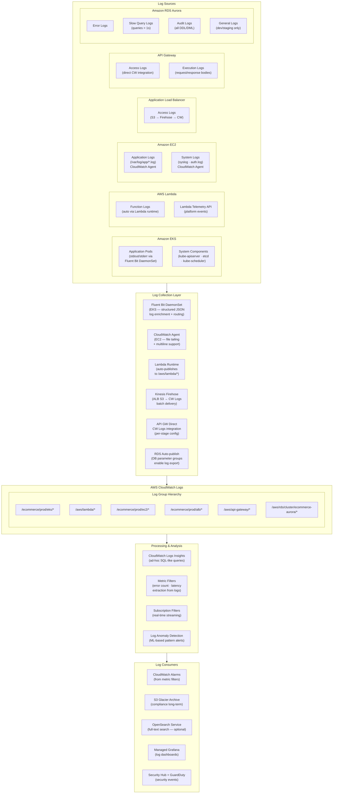
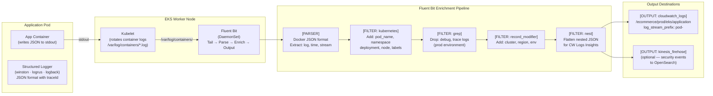
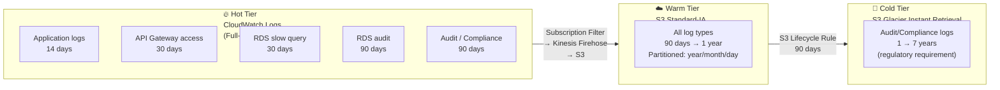
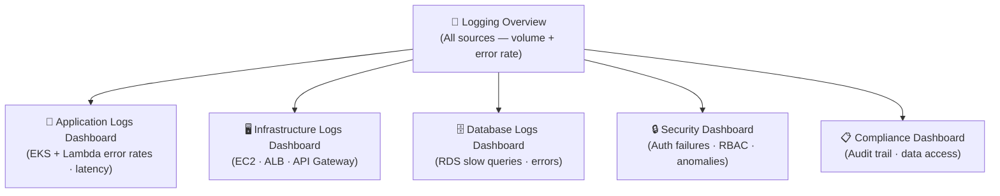
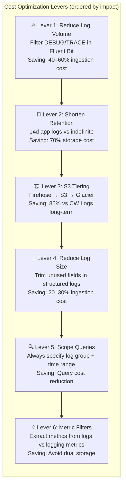
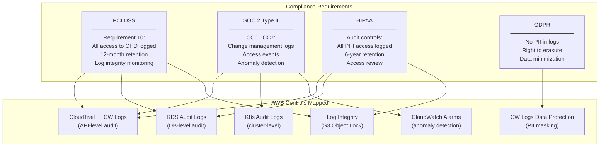

# Centralized Logging Architecture
## AWS CloudWatch Logs — EKS · Lambda · EC2 · ALB · API Gateway · RDS

> **Role**: Cloud Logging Architect
> **Date**: 2026-07-18
> **Platform**: E-Commerce Microservices — Multi-AZ Production
> **Scope**: Centralized log collection · Analysis · Security · Compliance · Cost Optimization

---

## Table of Contents

1. [Logging Architecture](#1-logging-architecture)
2. [Log Groups Design](#2-log-groups-design)
3. [Retention Strategy](#3-retention-strategy)
4. [Logs Insights Queries](#4-logs-insights-queries)
5. [Security Monitoring Queries](#5-security-monitoring-queries)
6. [Error Analysis Queries](#6-error-analysis-queries)
7. [Log Analytics Dashboards](#7-log-analytics-dashboards)
8. [Cost Optimization](#8-cost-optimization)
9. [Compliance Best Practices](#9-compliance-best-practices)

---

## 1. Logging Architecture

### 1.1 Full Centralized Logging Architecture



### 1.2 EKS Log Flow



### 1.3 Structured Log Standard

Every service **must** emit structured JSON. This is the canonical schema:

```json
{
  "timestamp":   "2026-07-18T10:23:45.123Z",
  "level":       "INFO",
  "service":     "order-service",
  "version":     "2.3.1",
  "environment": "production",
  "region":      "us-east-1",
  "traceId":     "1-abc12345-xyz98765432109876543210",
  "spanId":      "abc1234567890abc",
  "correlationId": "req-uuid-7f3a",
  "userId":      "usr_9f3a",
  "requestId":   "req_abc123",
  "message":     "Order created successfully",
  "durationMs":  142,
  "httpMethod":  "POST",
  "httpPath":    "/api/orders",
  "httpStatus":  201,
  "component":   "OrderController",
  "action":      "createOrder",
  "metadata": {
    "orderId":    "ord_20260718_0042",
    "valueTier":  "high",
    "itemCount":  3
  }
}
```

**Rules**:
- `level`: `DEBUG | INFO | WARN | ERROR | FATAL` — uppercase always
- `traceId` + `spanId`: always present (from OTEL context) for log-trace correlation
- No PII: no email, name, address, card numbers in any log field
- `durationMs`: always included for latency-from-logs analysis

---

## 2. Log Groups Design

### 2.1 Log Group Taxonomy

```mermaid
graph LR
    subgraph HIERARCHY["Log Group Naming Convention"]
        PATTERN["/{domain}/{environment}/{service-type}/{source}/{log-type}"]

        EKS1["/ecommerce/prod/eks/application\n(container stdout/stderr)"]
        EKS2["/ecommerce/prod/eks/system\n(kubelet · containerd)"]
        EKS3["/ecommerce/prod/eks/events\n(K8s Events API)"]
        EKS4["/ecommerce/prod/eks/controlplane\n(api-server · scheduler)"]

        LAMBDA1["/aws/lambda/order-processor"]
        LAMBDA2["/aws/lambda/inventory-sync"]
        LAMBDA3["/aws/lambda/payment-validator"]

        EC2_1["/ecommerce/prod/ec2/application"]
        EC2_2["/ecommerce/prod/ec2/system"]
        EC2_3["/ecommerce/prod/ec2/audit"]

        ALB1["/ecommerce/prod/alb/access"]
        APIGW1["/aws/api-gateway/ecommerce/access"]
        APIGW2["/aws/api-gateway/ecommerce/execution"]

        RDS1["/aws/rds/cluster/ecommerce-aurora/error"]
        RDS2["/aws/rds/cluster/ecommerce-aurora/slowquery"]
        RDS3["/aws/rds/cluster/ecommerce-aurora/audit"]
    end
```



### 2.2 Terraform — All Log Groups

```hcl
# log-groups.tf — Single source of truth for all log groups

locals {
  # Retention policies by log type (days)
  retention = {
    application_hot  = 14    # App logs: 14d hot for Logs Insights
    system           = 7     # System logs: 7d
    audit_compliance = 90    # Audit: 90d (regulatory requirement)
    security         = 90    # Security events: 90d
    performance      = 7     # Metrics/perf logs: 7d (short — high volume)
    rds_slow         = 30    # Slow queries: 30d for DBA analysis
    rds_audit        = 365   # RDS audit: 1 year (compliance)
    api_access       = 30    # API access: 30d for API debugging
    alb_access       = 30    # ALB access: 30d for traffic analysis
  }

  base_tags = {
    Project     = "ecommerce"
    Environment = "production"
    ManagedBy   = "terraform"
    CostCenter  = "platform-engineering"
  }
}

# ── EKS Log Groups ──────────────────────────────────────────────────────────
resource "aws_cloudwatch_log_group" "eks_application" {
  name              = "/ecommerce/prod/eks/application"
  retention_in_days = local.retention.application_hot
  kms_key_id        = aws_kms_key.cloudwatch.arn
  tags              = merge(local.base_tags, { LogType = "application", Source = "eks" })
}

resource "aws_cloudwatch_log_group" "eks_system" {
  name              = "/ecommerce/prod/eks/system"
  retention_in_days = local.retention.system
  kms_key_id        = aws_kms_key.cloudwatch.arn
  tags              = merge(local.base_tags, { LogType = "system", Source = "eks" })
}

resource "aws_cloudwatch_log_group" "eks_events" {
  name              = "/ecommerce/prod/eks/events"
  retention_in_days = local.retention.system
  kms_key_id        = aws_kms_key.cloudwatch.arn
  tags              = merge(local.base_tags, { LogType = "events", Source = "eks" })
}

resource "aws_cloudwatch_log_group" "eks_controlplane" {
  name              = "/ecommerce/prod/eks/controlplane"
  retention_in_days = local.retention.audit_compliance
  kms_key_id        = aws_kms_key.cloudwatch.arn
  tags              = merge(local.base_tags, { LogType = "controlplane", Source = "eks" })
}

# Enable EKS control plane logging
resource "aws_eks_cluster" "main" {
  # ... existing config ...
  enabled_cluster_log_types = [
    "api",           # Kubernetes API server requests
    "audit",         # K8s audit log (who did what)
    "authenticator", # AWS IAM authentication
    "controllerManager",
    "scheduler"
  ]
}

# ── Lambda Log Groups (with explicit retention) ─────────────────────────────
resource "aws_cloudwatch_log_group" "lambda" {
  for_each = toset([
    "order-processor",
    "inventory-sync",
    "payment-validator",
    "notification-sender",
    "auto-remediation"
  ])

  name              = "/aws/lambda/${each.value}"
  retention_in_days = local.retention.application_hot
  kms_key_id        = aws_kms_key.cloudwatch.arn
  tags              = merge(local.base_tags, { LogType = "lambda", FunctionName = each.value })
}

# ── EC2 Log Groups ──────────────────────────────────────────────────────────
resource "aws_cloudwatch_log_group" "ec2_application" {
  name              = "/ecommerce/prod/ec2/application"
  retention_in_days = local.retention.application_hot
  kms_key_id        = aws_kms_key.cloudwatch.arn
  tags              = merge(local.base_tags, { LogType = "application", Source = "ec2" })
}

resource "aws_cloudwatch_log_group" "ec2_system" {
  name              = "/ecommerce/prod/ec2/system"
  retention_in_days = local.retention.system
  kms_key_id        = aws_kms_key.cloudwatch.arn
  tags              = merge(local.base_tags, { LogType = "system", Source = "ec2" })
}

resource "aws_cloudwatch_log_group" "ec2_audit" {
  name              = "/ecommerce/prod/ec2/audit"
  retention_in_days = local.retention.audit_compliance
  kms_key_id        = aws_kms_key.cloudwatch.arn
  tags              = merge(local.base_tags, { LogType = "audit", Source = "ec2" })
}

# ── ALB Log Group ───────────────────────────────────────────────────────────
resource "aws_cloudwatch_log_group" "alb_access" {
  name              = "/ecommerce/prod/alb/access"
  retention_in_days = local.retention.alb_access
  kms_key_id        = aws_kms_key.cloudwatch.arn
  tags              = merge(local.base_tags, { LogType = "access", Source = "alb" })
}

# ── API Gateway Log Groups ──────────────────────────────────────────────────
resource "aws_cloudwatch_log_group" "apigw_access" {
  name              = "/aws/api-gateway/ecommerce/access"
  retention_in_days = local.retention.api_access
  kms_key_id        = aws_kms_key.cloudwatch.arn
  tags              = merge(local.base_tags, { LogType = "access", Source = "api-gateway" })
}

resource "aws_cloudwatch_log_group" "apigw_execution" {
  name              = "/aws/api-gateway/ecommerce/execution"
  retention_in_days = local.retention.system   # Short — high volume, verbose
  kms_key_id        = aws_kms_key.cloudwatch.arn
  tags              = merge(local.base_tags, { LogType = "execution", Source = "api-gateway" })
}

# ── RDS Log Groups ──────────────────────────────────────────────────────────
resource "aws_cloudwatch_log_group" "rds_error" {
  name              = "/aws/rds/cluster/ecommerce-aurora/error"
  retention_in_days = local.retention.rds_slow
  kms_key_id        = aws_kms_key.cloudwatch.arn
  tags              = merge(local.base_tags, { LogType = "error", Source = "rds" })
}

resource "aws_cloudwatch_log_group" "rds_slowquery" {
  name              = "/aws/rds/cluster/ecommerce-aurora/slowquery"
  retention_in_days = local.retention.rds_slow
  kms_key_id        = aws_kms_key.cloudwatch.arn
  tags              = merge(local.base_tags, { LogType = "slowquery", Source = "rds" })
}

resource "aws_cloudwatch_log_group" "rds_audit" {
  name              = "/aws/rds/cluster/ecommerce-aurora/audit"
  retention_in_days = local.retention.rds_audit
  kms_key_id        = aws_kms_key.cloudwatch.arn
  tags              = merge(local.base_tags, { LogType = "audit", Source = "rds", Compliance = "required" })
}

# ── Shared KMS Key for all CW log groups ───────────────────────────────────
resource "aws_kms_key" "cloudwatch" {
  description             = "KMS key for CloudWatch Logs encryption — ecommerce-prod"
  deletion_window_in_days = 14
  enable_key_rotation     = true

  policy = jsonencode({
    Version = "2012-10-17"
    Statement = [
      {
        Sid    = "EnableRootAccess"
        Effect = "Allow"
        Principal = { AWS = "arn:aws:iam::${data.aws_caller_identity.current.account_id}:root" }
        Action   = "kms:*"
        Resource = "*"
      },
      {
        Sid    = "CloudWatchLogsEncrypt"
        Effect = "Allow"
        Principal = { Service = "logs.${var.region}.amazonaws.com" }
        Action = [
          "kms:Encrypt", "kms:Decrypt", "kms:ReEncrypt*",
          "kms:GenerateDataKey", "kms:DescribeKey"
        ]
        Resource = "*"
        Condition = {
          ArnLike = {
            "kms:EncryptionContext:aws:logs:arn" =
              "arn:aws:logs:${var.region}:${data.aws_caller_identity.current.account_id}:*"
          }
        }
      }
    ]
  })

  tags = merge(local.base_tags, { Purpose = "cloudwatch-logs-encryption" })
}
```

### 2.3 API Gateway Log Format

```json
// API Gateway access log format — JSON with full request context
{
  "requestId":          "$context.requestId",
  "traceId":            "$context.xrayTraceId",
  "correlationId":      "$context.requestId",
  "timestamp":          "$context.requestTimeEpoch",
  "requestTime":        "$context.requestTime",
  "httpMethod":         "$context.httpMethod",
  "resourcePath":       "$context.resourcePath",
  "routeKey":           "$context.routeKey",
  "status":             "$context.status",
  "protocol":           "$context.protocol",
  "responseLength":     "$context.responseLength",
  "integrationLatency": "$context.integrationLatency",
  "responseLatency":    "$context.responseLatency",
  "sourceIp":           "$context.identity.sourceIp",
  "userAgent":          "$context.identity.userAgent",
  "stage":              "$context.stage",
  "apiId":              "$context.apiId",
  "accountId":          "$context.accountId",
  "domainName":         "$context.domainName",
  "integrationStatus":  "$context.integrationStatus",
  "integrationError":   "$context.integrationErrorMessage",
  "wafStatus":          "$context.waf.status"
}
```

```bash
# Apply JSON access log format to API Gateway stage
aws apigateway update-stage \
  --rest-api-id abc123def456 \
  --stage-name production \
  --patch-operations \
    "op=replace,path=/accessLogSettings/destinationArn,value=arn:aws:logs:us-east-1:123456789012:log-group:/aws/api-gateway/ecommerce/access" \
    "op=replace,path=/accessLogSettings/format,value=$(cat apigw-log-format.json | jq -c .)" \
    "op=replace,path=/tracingEnabled,value=true" \
    "op=replace,path=/*/*/logging/dataTrace,value=false" \
    "op=replace,path=/*/*/logging/loglevel,value=ERROR" \
  --region us-east-1
```

### 2.4 RDS Log Export Configuration

```hcl
# Enable RDS log export to CloudWatch Logs
resource "aws_rds_cluster" "ecommerce" {
  # ... existing cluster config ...

  enabled_cloudwatch_logs_exports = [
    "error",      # Always enable
    "slowquery",  # Queries exceeding long_query_time
    "audit",      # All connections + DDL/DML (compliance)
    # "general"   # Disable in production — extremely high volume
  ]
}

# RDS parameter group — configure slow query threshold
resource "aws_rds_cluster_parameter_group" "ecommerce" {
  name        = "ecommerce-prod-pg"
  family      = "aurora-mysql8.0"
  description = "Production parameter group with logging enabled"

  parameter {
    name  = "slow_query_log"
    value = "1"
  }
  parameter {
    name  = "long_query_time"
    value = "1"    # Log queries > 1 second
  }
  parameter {
    name  = "log_queries_not_using_indexes"
    value = "1"    # Also log full table scans
  }
  parameter {
    name  = "log_output"
    value = "FILE"  # Write to file → CW Logs (not TABLE)
  }
  parameter {
    name  = "server_audit_logging"
    value = "ON"
  }
  parameter {
    name  = "server_audit_events"
    value = "CONNECT,QUERY_DDL,QUERY_DML_NO_SELECT,QUERY_DCL"
  }
  parameter {
    name  = "server_audit_excl_users"
    value = "rdsadmin"   # Exclude internal AWS user from audit
  }
}
```

---

## 3. Retention Strategy

### 3.1 Retention Tiers



### 3.2 Retention Policy by Log Type

| Log Source | Log Group | Hot (CW) | Warm (S3-IA) | Cold (Glacier) | Total |
|---|---|---|---|---|---|
| EKS Application | `/ecommerce/prod/eks/application` | 14d | 76d | — | 90d |
| EKS Control Plane | `/ecommerce/prod/eks/controlplane` | 90d | 275d | 1 year | 3 years |
| Lambda | `/aws/lambda/*` | 14d | 76d | — | 90d |
| EC2 Application | `/ecommerce/prod/ec2/application` | 14d | 76d | — | 90d |
| EC2 Audit | `/ecommerce/prod/ec2/audit` | 90d | 275d | 2 years | 3 years |
| ALB Access | `/ecommerce/prod/alb/access` | 30d | 335d | — | 1 year |
| API Gateway Access | `/aws/api-gateway/*/access` | 30d | 335d | — | 1 year |
| RDS Slow Query | `/aws/rds/cluster/*/slowquery` | 30d | 335d | — | 1 year |
| RDS Audit | `/aws/rds/cluster/*/audit` | 365d | 1 year | 5 years | 7 years |
| VPC Flow Logs | `/aws/vpc/flowlogs` | 7d | 358d | — | 1 year |
| CloudTrail | `/aws/cloudtrail` | 90d | 275d | 6 years | 7 years |

### 3.3 Retention + Archive Terraform

```hcl
# retention-and-archive.tf

# ── Firehose: CW Logs → S3 archive ─────────────────────────────────────────
resource "aws_kinesis_firehose_delivery_stream" "log_archive" {
  name        = "ecommerce-log-archive"
  destination = "extended_s3"

  extended_s3_configuration {
    role_arn           = aws_iam_role.firehose.arn
    bucket_arn         = aws_s3_bucket.log_archive.arn
    buffering_size     = 64    # MB — flush when buffer fills
    buffering_interval = 300   # Seconds — max wait time

    # Hive-compatible partitioning for Athena queries
    prefix = join("/", [
      "logs",
      "source=!{partitionKeyFromQuery:source}",
      "year=!{timestamp:yyyy}",
      "month=!{timestamp:MM}",
      "day=!{timestamp:dd}",
      "hour=!{timestamp:HH}"
    ])
    error_output_prefix = "errors/!{firehose:error-output-type}/!{timestamp:yyyy/MM/dd}/"

    compression_format = "GZIP"

    dynamic_partitioning_configuration {
      enabled = true
    }

    processing_configuration {
      enabled = true
      processors {
        type = "MetadataExtraction"
        parameters {
          parameter_name  = "JsonParsingEngine"
          parameter_value = "JQ-1.6"
        }
        parameters {
          parameter_name  = "MetadataExtractionQuery"
          # Extract 'source' field from log for partitioning
          parameter_value = "{source:.kubernetes.namespace_name // .source // \"unknown\"}"
        }
      }
    }

    cloudwatch_logging_options {
      enabled         = true
      log_group_name  = "/aws/kinesisfirehose/log-archive"
      log_stream_name = "S3Delivery"
    }
  }
}

# ── S3 Lifecycle: Standard → IA → Glacier ──────────────────────────────────
resource "aws_s3_bucket_lifecycle_configuration" "log_archive" {
  bucket = aws_s3_bucket.log_archive.id

  # Application logs: 90d → IA → 1yr delete
  rule {
    id     = "app-logs-lifecycle"
    status = "Enabled"
    filter { prefix = "logs/source=ecommerce" }

    transition {
      days          = 30
      storage_class = "STANDARD_IA"
    }
    expiration {
      days = 90
    }
  }

  # Audit/compliance logs: keep 7 years
  rule {
    id     = "audit-logs-lifecycle"
    status = "Enabled"
    filter { prefix = "logs/source=audit" }

    transition {
      days          = 90
      storage_class = "STANDARD_IA"
    }
    transition {
      days          = 365
      storage_class = "GLACIER_IR"   # Instant Retrieval — queryable by Athena
    }
    expiration {
      days = 2555   # 7 years
    }
  }

  # RDS audit: 7 years (financial regulations)
  rule {
    id     = "rds-audit-lifecycle"
    status = "Enabled"
    filter { prefix = "logs/source=rds-audit" }

    transition {
      days          = 365
      storage_class = "GLACIER_IR"
    }
    expiration {
      days = 2555
    }
  }
}

# ── Subscription filter: CW Logs → Firehose for all log groups ─────────────
resource "aws_cloudwatch_log_subscription_filter" "archive" {
  for_each = {
    eks_app  = "/ecommerce/prod/eks/application"
    ec2_app  = "/ecommerce/prod/ec2/application"
    ec2_audit = "/ecommerce/prod/ec2/audit"
    rds_audit = "/aws/rds/cluster/ecommerce-aurora/audit"
    apigw    = "/aws/api-gateway/ecommerce/access"
  }

  name            = "archive-to-s3-${each.key}"
  log_group_name  = each.value
  filter_pattern  = ""   # All events
  destination_arn = aws_kinesis_firehose_delivery_stream.log_archive.arn
  distribution    = "ByLogStreamName"
}
```

---

## 4. Logs Insights Queries

### 4.1 Application Performance Queries

```sql
-- ══════════════════════════════════════════════════════════════
-- QUERY 1: Top 10 Slowest API Operations (last 1 hour)
-- Log Group: /ecommerce/prod/eks/application
-- ══════════════════════════════════════════════════════════════
fields @timestamp, service, httpMethod, httpPath, httpStatus, durationMs
| filter durationMs > 0 and httpPath not like "/health"
| stats
    count()                     as requestCount,
    avg(durationMs)             as avgDuration,
    pct(durationMs, 50)         as p50,
    pct(durationMs, 95)         as p95,
    pct(durationMs, 99)         as p99,
    max(durationMs)             as maxDuration
  by service, httpMethod, httpPath
| sort p99 desc
| limit 10

-- ══════════════════════════════════════════════════════════════
-- QUERY 2: Error Rate by Service (last 30 min)
-- ══════════════════════════════════════════════════════════════
fields @timestamp, service, level, httpStatus
| filter httpStatus > 0 or level in ["ERROR", "FATAL"]
| stats
    count()                                as totalRequests,
    sum(level in ["ERROR", "FATAL"])       as errors,
    sum(httpStatus >= 500)                 as serverErrors,
    sum(httpStatus >= 400 and httpStatus < 500) as clientErrors,
    (sum(httpStatus >= 500) / count()) * 100 as errorRatePct
  by service
| sort errorRatePct desc
| filter totalRequests > 10

-- ══════════════════════════════════════════════════════════════
-- QUERY 3: Request Volume Trend (RPS by service — 5min bins)
-- ══════════════════════════════════════════════════════════════
fields @timestamp, service, httpPath
| filter httpPath not like "/health"
| stats count() as requests by service, bin(5m) as window
| sort window asc, service asc

-- ══════════════════════════════════════════════════════════════
-- QUERY 4: Trace Correlation — All events for a single request
-- ══════════════════════════════════════════════════════════════
fields @timestamp, service, level, message, spanId, durationMs
| filter traceId = "1-abc12345-xyz98765432109876543210"
| sort @timestamp asc
| display @timestamp, service, level, message, durationMs

-- ══════════════════════════════════════════════════════════════
-- QUERY 5: API Gateway — Latency Analysis by Route
-- Log Group: /aws/api-gateway/ecommerce/access
-- ══════════════════════════════════════════════════════════════
fields @timestamp, httpMethod, resourcePath, status, integrationLatency, responseLatency
| filter resourcePath not like "/health"
| stats
    count()                          as requestCount,
    avg(integrationLatency)          as avgBackendMs,
    avg(responseLatency)             as avgTotalMs,
    pct(responseLatency, 99)         as p99TotalMs,
    sum(status >= 500)               as serverErrors
  by httpMethod, resourcePath
| sort p99TotalMs desc
| limit 20

-- ══════════════════════════════════════════════════════════════
-- QUERY 6: Lambda — Duration + Cold Start Analysis
-- Log Group: /aws/lambda/order-processor
-- ══════════════════════════════════════════════════════════════
fields @timestamp, @type, @duration, @billedDuration, @memorySize, @maxMemoryUsed, @initDuration
| filter @type = "REPORT"
| stats
    count()                        as invocations,
    sum(@initDuration > 0)         as coldStarts,
    avg(@duration)                 as avgDurationMs,
    pct(@duration, 99)             as p99DurationMs,
    avg(@maxMemoryUsed)            as avgMemoryMB,
    max(@maxMemoryUsed)            as maxMemoryMB,
    avg(@initDuration)             as avgInitMs
  by bin(1h) as hour
| sort hour asc

-- ══════════════════════════════════════════════════════════════
-- QUERY 7: RDS Slow Queries — Worst Offenders
-- Log Group: /aws/rds/cluster/ecommerce-aurora/slowquery
-- ══════════════════════════════════════════════════════════════
fields @timestamp, @message
| parse @message "Query_time: * Lock_time: * Rows_sent: * Rows_examined: *\n*" as queryTime, lockTime, rowsSent, rowsExamined, sqlStmt
| filter queryTime > 1
| stats
    count()               as occurrences,
    avg(queryTime)        as avgQuerySec,
    max(queryTime)        as maxQuerySec,
    avg(rowsExamined)     as avgRowsExamined
  by sqlStmt
| sort occurrences desc
| limit 20

-- ══════════════════════════════════════════════════════════════
-- QUERY 8: ALB — Top Traffic Sources + Status Distribution
-- Log Group: /ecommerce/prod/alb/access
-- ══════════════════════════════════════════════════════════════
fields @timestamp, client_ip, request_url, status_code, request_processing_time, target_processing_time
| stats
    count()                           as requestCount,
    sum(status_code >= 500)           as serverErrors,
    sum(status_code >= 400 and status_code < 500) as clientErrors,
    avg(target_processing_time)       as avgBackendMs,
    pct(target_processing_time, 99)   as p99BackendMs
  by client_ip
| sort requestCount desc
| limit 20
```

### 4.2 Business Intelligence Queries

```sql
-- ══════════════════════════════════════════════════════════════
-- QUERY 9: Order Funnel Conversion (from structured app logs)
-- ══════════════════════════════════════════════════════════════
fields @timestamp, service, action, metadata.orderId
| filter service = "order-service"
| filter action in ["viewCart", "initiateCheckout", "paymentStarted", "orderCreated", "orderFailed"]
| stats count() as events by action, bin(1h) as hour
| sort hour asc, action asc

-- ══════════════════════════════════════════════════════════════
-- QUERY 10: Payment Failure Rate + Failure Reasons
-- ══════════════════════════════════════════════════════════════
fields @timestamp, service, level, message, metadata.failureReason
| filter service = "payment-service" and level = "ERROR"
| stats
    count()                    as failures
  by metadata.failureReason, bin(1h) as hour
| sort failures desc

-- ══════════════════════════════════════════════════════════════
-- QUERY 11: User Session Duration Approximation
-- ══════════════════════════════════════════════════════════════
fields @timestamp, correlationId, httpPath
| filter httpPath not like "/health"
| stats
    min(@timestamp)           as sessionStart,
    max(@timestamp)           as sessionEnd,
    count()                   as pageHits
  by correlationId
| eval sessionDurationMin = (sessionEnd - sessionStart) / 1000 / 60
| stats
    avg(sessionDurationMin)   as avgSessionMin,
    avg(pageHits)             as avgPageHits,
    count()                   as totalSessions
  by bin(1h)
```

---

## 5. Security Monitoring Queries

### 5.1 Security Query Suite

```sql
-- ══════════════════════════════════════════════════════════════
-- SEC-1: Brute Force / Credential Stuffing Detection
-- Source: /aws/api-gateway/ecommerce/access
-- Alert if: >20 auth failures from same IP in 5 minutes
-- ══════════════════════════════════════════════════════════════
fields @timestamp, sourceIp, resourcePath, status
| filter resourcePath like "/auth" or resourcePath like "/login"
| filter status in ["401", "403"]
| stats count() as authFailures by sourceIp, bin(5m) as window
| filter authFailures > 20
| sort authFailures desc

-- ══════════════════════════════════════════════════════════════
-- SEC-2: Privilege Escalation — K8s RBAC Changes
-- Source: /ecommerce/prod/eks/controlplane (audit log)
-- ══════════════════════════════════════════════════════════════
fields @timestamp, user.username, verb, objectRef.resource, objectRef.name, responseStatus.code
| filter objectRef.resource in ["clusterroles", "clusterrolebindings", "roles", "rolebindings"]
| filter verb in ["create", "update", "patch", "delete"]
| filter responseStatus.code = 200 or responseStatus.code = 201
| sort @timestamp desc
| display @timestamp, user.username, verb, objectRef.resource, objectRef.name

-- ══════════════════════════════════════════════════════════════
-- SEC-3: Anomalous API Call Patterns (high volume from single user)
-- Source: /aws/cloudtrail (via CW Logs subscription)
-- ══════════════════════════════════════════════════════════════
fields @timestamp, userIdentity.arn, eventName, sourceIPAddress, errorCode
| filter errorCode like "AccessDenied" or errorCode like "UnauthorizedOperation"
| stats
    count()                    as deniedCalls,
    count_distinct(eventName)  as distinctAPIs
  by userIdentity.arn, sourceIPAddress, bin(1h) as window
| filter deniedCalls > 50
| sort deniedCalls desc

-- ══════════════════════════════════════════════════════════════
-- SEC-4: SQL Injection Attempt Detection
-- Source: /aws/api-gateway/ecommerce/access
-- ══════════════════════════════════════════════════════════════
fields @timestamp, sourceIp, resourcePath, status
| filter resourcePath like /('|--|;|UNION|SELECT|INSERT|DROP|UPDATE|DELETE|WHERE|OR 1=1)/i
| stats
    count()              as suspiciousRequests,
    count_distinct(sourceIp) as uniqueIPs
  by bin(5m) as window
| filter suspiciousRequests > 0
| sort suspiciousRequests desc

-- ══════════════════════════════════════════════════════════════
-- SEC-5: Secrets/Credential Exposure in Logs (PII Scanner)
-- Source: All application log groups
-- Run periodically as compliance check
-- ══════════════════════════════════════════════════════════════
fields @timestamp, @logStream, @message, service
| filter @message like /(password|secret|token|api_key|authorization|bearer|private_key)/i
| filter @message not like /\[REDACTED\]/
| filter @message not like /password.*required/i
| sort @timestamp desc
| limit 50

-- ══════════════════════════════════════════════════════════════
-- SEC-6: RDS — Unauthorized Access Attempts
-- Source: /aws/rds/cluster/ecommerce-aurora/audit
-- ══════════════════════════════════════════════════════════════
fields @timestamp, @message
| parse @message "* * * *@* * * *" as timestamp, serverhost, username, host, db, operation, retcode, sqltext
| filter retcode != 0
| filter operation in ["CONNECT", "FAILED_CONNECT"]
| stats
    count()              as failedConnections
  by username, host, bin(5m) as window
| filter failedConnections > 5
| sort failedConnections desc

-- ══════════════════════════════════════════════════════════════
-- SEC-7: IAM Role Assumption Anomaly
-- Source: CloudTrail logs
-- Alert: Cross-account or unusual role assumptions
-- ══════════════════════════════════════════════════════════════
fields @timestamp, userIdentity.arn, requestParameters.roleArn, sourceIPAddress, eventName
| filter eventName = "AssumeRole"
| filter sourceIPAddress not like "amazonaws.com"  -- Exclude AWS internal
| stats
    count()                        as assumeCount,
    count_distinct(sourceIPAddress) as sourceIPs
  by userIdentity.arn, requestParameters.roleArn, bin(1h) as window
| filter assumeCount > 10 or sourceIPs > 3
| sort assumeCount desc

-- ══════════════════════════════════════════════════════════════
-- SEC-8: EKS — Container Escape / Privilege Attempts
-- Source: /ecommerce/prod/eks/controlplane
-- ══════════════════════════════════════════════════════════════
fields @timestamp, user.username, requestURI, verb, objectRef.resource
| filter verb in ["create", "exec", "attach"]
| filter requestURI like "/exec" or requestURI like "/attach"
| filter objectRef.resource = "pods"
| sort @timestamp desc
| display @timestamp, user.username, verb, requestURI

-- ══════════════════════════════════════════════════════════════
-- SEC-9: Geographic Anomaly Detection
-- Source: /aws/api-gateway/ecommerce/access
-- Flag requests from unexpected countries
-- ══════════════════════════════════════════════════════════════
fields @timestamp, sourceIp, resourcePath, status, userAgent
| filter status in ["200", "201"]
-- Filter for IPs in unexpected CIDR ranges (customize per business)
| filter sourceIp not like "10." and sourceIp not like "172." and sourceIp not like "192.168."
| stats
    count()              as requests,
    count_distinct(sourceIp) as uniqueIPs
  by bin(1h) as window
| sort requests desc
| limit 20

-- ══════════════════════════════════════════════════════════════
-- SEC-10: Sensitive Data Access Audit (RDS)
-- Source: /aws/rds/cluster/ecommerce-aurora/audit
-- Track all access to sensitive tables
-- ══════════════════════════════════════════════════════════════
fields @timestamp, @message
| parse @message "* * * *@* * * *" as ts, serverhost, username, host, db, operation, retcode, sqltext
| filter sqltext like /payment_cards|user_pii|ssn|credit_card|customer_data/i
| filter operation in ["QUERY", "QUERY_DML"]
| stats
    count()                 as accessCount
  by username, host, operation, bin(1h) as window
| sort accessCount desc
```

### 5.2 Metric Filters for Real-Time Security Alerts

```hcl
# metric-filters-security.tf

# ── Auth failure rate → alarm ────────────────────────────────────────────
resource "aws_cloudwatch_log_metric_filter" "auth_failures" {
  name           = "api-auth-failures"
  log_group_name = "/aws/api-gateway/ecommerce/access"
  pattern        = "{ ($.status = 401) || ($.status = 403) }"

  metric_transformation {
    name          = "AuthFailureCount"
    namespace     = "Security/APIGateway"
    value         = "1"
    default_value = "0"
    unit          = "Count"
    dimensions = {
      Environment = "production"
    }
  }
}

resource "aws_cloudwatch_metric_alarm" "auth_failure_spike" {
  alarm_name          = "sec-auth-failure-spike"
  alarm_description   = "High rate of authentication failures — possible credential stuffing attack"
  namespace           = "Security/APIGateway"
  metric_name         = "AuthFailureCount"
  statistic           = "Sum"
  period              = 300
  evaluation_periods  = 1
  threshold           = 100
  comparison_operator = "GreaterThanThreshold"
  treat_missing_data  = "notBreaching"
  alarm_actions       = [var.sns_security_arn]
  tags                = { Tier = "security" }
}

# ── RBAC change detection ────────────────────────────────────────────────
resource "aws_cloudwatch_log_metric_filter" "k8s_rbac_change" {
  name           = "eks-rbac-change"
  log_group_name = "/ecommerce/prod/eks/controlplane"
  pattern        = "{ ($.objectRef.resource = \"clusterroles\") || ($.objectRef.resource = \"clusterrolebindings\") }"

  metric_transformation {
    name          = "K8sRBACChangeCount"
    namespace     = "Security/EKS"
    value         = "1"
    default_value = "0"
    unit          = "Count"
  }
}

resource "aws_cloudwatch_metric_alarm" "k8s_rbac_change" {
  alarm_name          = "sec-eks-rbac-change"
  alarm_description   = "Kubernetes RBAC role/binding was modified — verify this is an authorized change"
  namespace           = "Security/EKS"
  metric_name         = "K8sRBACChangeCount"
  statistic           = "Sum"
  period              = 60
  evaluation_periods  = 1
  threshold           = 0
  comparison_operator = "GreaterThanThreshold"
  treat_missing_data  = "notBreaching"
  alarm_actions       = [var.sns_security_arn]
}

# ── RDS audit: suspicious access ────────────────────────────────────────
resource "aws_cloudwatch_log_metric_filter" "rds_failed_connect" {
  name           = "rds-failed-connections"
  log_group_name = "/aws/rds/cluster/ecommerce-aurora/audit"
  pattern        = "FAILED_CONNECT"

  metric_transformation {
    name          = "RDSFailedConnections"
    namespace     = "Security/RDS"
    value         = "1"
    default_value = "0"
    unit          = "Count"
  }
}
```

---

## 6. Error Analysis Queries

```sql
-- ══════════════════════════════════════════════════════════════
-- ERR-1: Error Summary — All Services (last 1 hour)
-- ══════════════════════════════════════════════════════════════
fields @timestamp, service, level, message, httpStatus, component, action
| filter level in ["ERROR", "FATAL"]
| stats
    count()              as errorCount,
    count_distinct(message) as uniqueErrors
  by service, component
| sort errorCount desc
| limit 20

-- ══════════════════════════════════════════════════════════════
-- ERR-2: Error Message Clustering (find top error types)
-- ══════════════════════════════════════════════════════════════
fields @timestamp, service, message, level
| filter level = "ERROR"
| parse message /(?P<errorType>\w+Error|\w+Exception)/
| stats count() as occurrences by errorType, service
| sort occurrences desc
| limit 25

-- ══════════════════════════════════════════════════════════════
-- ERR-3: 5xx Error Breakdown — Which service is failing?
-- Source: /aws/api-gateway/ecommerce/access + EKS application logs
-- ══════════════════════════════════════════════════════════════
fields @timestamp, service, httpStatus, httpPath, httpMethod, message, traceId
| filter httpStatus >= 500
| stats
    count()              as errorCount,
    count_distinct(traceId) as uniqueTraces
  by service, httpMethod, httpPath, httpStatus
| sort errorCount desc
| limit 30

-- ══════════════════════════════════════════════════════════════
-- ERR-4: Cascading Failure Analysis
-- Find errors that correlate across multiple services
-- ══════════════════════════════════════════════════════════════
fields @timestamp, service, level, traceId, message
| filter level = "ERROR" and traceId != ""
| stats
    count()               as errorCount,
    count_distinct(service) as affectedServices,
    makelist(service)     as services
  by traceId
| filter affectedServices > 1
| sort errorCount desc
| limit 20

-- ══════════════════════════════════════════════════════════════
-- ERR-5: Lambda Error Analysis
-- Source: /aws/lambda/order-processor
-- ══════════════════════════════════════════════════════════════
fields @timestamp, @message, @requestId, @logStream
| filter @message like /ERROR/ or @message like /Task timed out/
| parse @message "ERROR * *" as errorType, errorMessage
| stats
    count()              as errorCount
  by errorType, bin(1h) as hour
| sort hour desc, errorCount desc

-- ══════════════════════════════════════════════════════════════
-- ERR-6: Timeout Analysis (requests that timed out)
-- ══════════════════════════════════════════════════════════════
fields @timestamp, service, durationMs, httpPath, httpMethod, traceId
| filter durationMs > 29000 or message like /timeout/i or message like /deadline/i
| stats
    count()          as timeoutCount,
    avg(durationMs)  as avgDurationMs,
    max(durationMs)  as maxDurationMs
  by service, httpPath
| sort timeoutCount desc
| limit 20

-- ══════════════════════════════════════════════════════════════
-- ERR-7: Dependency Error Rate (which downstream is failing?)
-- ══════════════════════════════════════════════════════════════
fields @timestamp, service, message, level
| filter level = "ERROR"
| parse message "calling * failed" as dependencyName
| stats count() as failures by service, dependencyName, bin(5m) as window
| sort failures desc
| limit 30

-- ══════════════════════════════════════════════════════════════
-- ERR-8: RDS Error Log Analysis
-- Source: /aws/rds/cluster/ecommerce-aurora/error
-- ══════════════════════════════════════════════════════════════
fields @timestamp, @message
| parse @message "[ERROR] *" as errorMsg
| filter errorMsg != ""
| stats count() as errorCount by errorMsg
| sort errorCount desc
| limit 20

-- ══════════════════════════════════════════════════════════════
-- ERR-9: Error Trend — Is it Getting Worse?
-- ══════════════════════════════════════════════════════════════
fields @timestamp, service, level
| filter level in ["ERROR", "FATAL"]
| stats count() as errorCount by service, bin(15m) as window
| sort window asc, errorCount desc

-- ══════════════════════════════════════════════════════════════
-- ERR-10: Post-Deployment Error Spike Detection
-- Compare error rate before/after deployment annotation
-- ══════════════════════════════════════════════════════════════
fields @timestamp, service, level, version
| filter level = "ERROR"
| stats
    count()              as errors
  by version, service, bin(5m) as window
| sort window desc
```

---

## 7. Log Analytics Dashboards

### 7.1 Dashboard Hierarchy



### 7.2 Logging Overview Dashboard JSON

```json
{
  "widgets": [
    {
      "type": "text",
      "properties": {
        "markdown": "# 📋 Centralized Logging Dashboard — Production\n**Sources**: EKS · Lambda · EC2 · ALB · API Gateway · RDS\n\n[Security Dashboard](#) | [Database Dashboard](#) | [Logs Insights](#)"
      }
    },
    {
      "type": "metric",
      "properties": {
        "title": "Log Ingestion Volume — All Sources (GB/day)",
        "view": "timeSeries",
        "metrics": [
          [{"expression": "m1/1073741824", "label": "EKS App (GB/day)", "id": "eks_gb"}],
          [{"expression": "m2/1073741824", "label": "Lambda (GB/day)", "id": "lambda_gb"}],
          [{"expression": "m3/1073741824", "label": "API Gateway (GB/day)", "id": "apigw_gb"}],
          [{"expression": "m4/1073741824", "label": "RDS (GB/day)", "id": "rds_gb"}],
          ["AWS/Logs", "IncomingBytes", "LogGroupName", "/ecommerce/prod/eks/application",
           {"stat": "Sum", "period": 86400, "id": "m1", "visible": false}],
          ["AWS/Logs", "IncomingBytes", "LogGroupName", "/aws/lambda/order-processor",
           {"stat": "Sum", "period": 86400, "id": "m2", "visible": false}],
          ["AWS/Logs", "IncomingBytes", "LogGroupName", "/aws/api-gateway/ecommerce/access",
           {"stat": "Sum", "period": 86400, "id": "m3", "visible": false}],
          ["AWS/Logs", "IncomingBytes", "LogGroupName", "/aws/rds/cluster/ecommerce-aurora/slowquery",
           {"stat": "Sum", "period": 86400, "id": "m4", "visible": false}]
        ]
      }
    },
    {
      "type": "metric",
      "properties": {
        "title": "Error Log Events Rate — All Services (events/min)",
        "view": "timeSeries",
        "metrics": [
          ["Security/Application",   "ErrorCount", "Service", "order-service",
           {"stat": "Sum", "period": 60, "label": "order-service errors"}],
          ["Security/Application",   "ErrorCount", "Service", "payment-service",
           {"stat": "Sum", "period": 60, "label": "payment-service errors"}],
          ["Security/APIGateway",    "AuthFailureCount",
           {"stat": "Sum", "period": 60, "label": "API auth failures"}],
          ["Security/RDS",           "RDSFailedConnections",
           {"stat": "Sum", "period": 60, "label": "RDS failed logins"}]
        ],
        "annotations": {
          "horizontal": [{"value": 10, "color": "#ff9900", "label": "Warning threshold"}]
        }
      }
    },
    {
      "type": "metric",
      "properties": {
        "title": "Log Group Storage (GB stored — current)",
        "view": "singleValue",
        "sparkline": false,
        "metrics": [
          ["AWS/Logs", "StoredBytes", "LogGroupName", "/ecommerce/prod/eks/application",
           {"stat": "Maximum", "period": 86400, "label": "EKS App"}],
          ["AWS/Logs", "StoredBytes", "LogGroupName", "/aws/lambda/order-processor",
           {"stat": "Maximum", "period": 86400, "label": "Lambda"}],
          ["AWS/Logs", "StoredBytes", "LogGroupName", "/aws/rds/cluster/ecommerce-aurora/audit",
           {"stat": "Maximum", "period": 86400, "label": "RDS Audit"}]
        ]
      }
    },
    {
      "type": "log",
      "properties": {
        "title": "Recent Errors — All Services (last 15 min)",
        "query": "SOURCE '/ecommerce/prod/eks/application' | fields @timestamp, service, level, message | filter level in [\"ERROR\", \"FATAL\"] | sort @timestamp desc | limit 20",
        "region": "us-east-1",
        "view": "table"
      }
    },
    {
      "type": "log",
      "properties": {
        "title": "API Gateway — Error Rate by Route (last 1h)",
        "query": "SOURCE '/aws/api-gateway/ecommerce/access' | fields @timestamp, httpMethod, resourcePath, status | filter status >= 400 | stats count() as errors, sum(status >= 500) as server_errors by httpMethod, resourcePath | sort errors desc | limit 15",
        "region": "us-east-1",
        "view": "table"
      }
    },
    {
      "type": "log",
      "properties": {
        "title": "RDS Slow Queries — Last 1 Hour",
        "query": "SOURCE '/aws/rds/cluster/ecommerce-aurora/slowquery' | fields @timestamp, @message | parse @message \"Query_time: * \" as qTime | filter qTime > 2 | sort qTime desc | limit 10",
        "region": "us-east-1",
        "view": "table"
      }
    }
  ]
}
```

### 7.3 Security Dashboard JSON

```json
{
  "widgets": [
    {
      "type": "metric",
      "properties": {
        "title": "🔒 Authentication Failures — 24h Trend",
        "view": "timeSeries",
        "metrics": [
          ["Security/APIGateway", "AuthFailureCount",
           {"stat": "Sum", "period": 300, "label": "Auth Failures/5min", "color": "#d62728"}]
        ],
        "annotations": {
          "horizontal": [{"value": 20, "color": "#d62728", "label": "Brute force threshold"}]
        }
      }
    },
    {
      "type": "metric",
      "properties": {
        "title": "🔒 K8s RBAC Changes",
        "view": "timeSeries",
        "metrics": [
          ["Security/EKS", "K8sRBACChangeCount",
           {"stat": "Sum", "period": 300, "label": "RBAC Changes", "color": "#ff9900"}]
        ],
        "annotations": {
          "horizontal": [{"value": 0, "color": "#ff9900", "label": "Any change = investigate"}]
        }
      }
    },
    {
      "type": "log",
      "properties": {
        "title": "Recent Auth Failures — Top Source IPs",
        "query": "SOURCE '/aws/api-gateway/ecommerce/access' | fields @timestamp, sourceIp, resourcePath, status | filter status in [\"401\", \"403\"] | stats count() as failures by sourceIp | sort failures desc | limit 10",
        "region": "us-east-1",
        "view": "table"
      }
    },
    {
      "type": "log",
      "properties": {
        "title": "K8s RBAC Changes — Last 24h",
        "query": "SOURCE '/ecommerce/prod/eks/controlplane' | fields @timestamp, user.username, verb, objectRef.resource, objectRef.name | filter objectRef.resource in [\"clusterroles\", \"clusterrolebindings\", \"roles\", \"rolebindings\"] | sort @timestamp desc | limit 20",
        "region": "us-east-1",
        "view": "table"
      }
    }
  ]
}
```

---

## 8. Cost Optimization

### 8.1 Cost Architecture



### 8.2 Cost Estimation

| Log Source | Volume/Month | CW Logs Cost | With S3 Tiering | Savings |
|---|---|---|---|---|
| EKS Application (14d) | 20 GB | $10 ingestion + $0.60 storage | $10 + $0.06 (S3) | 90% storage |
| Lambda (14d) | 5 GB | $2.50 + $0.15 | $2.50 + $0.015 | 90% storage |
| ALB Access (30d) | 10 GB | $5 + $0.90 | $5 + $0.09 | 90% storage |
| API GW Access (30d) | 8 GB | $4 + $0.72 | $4 + $0.07 | 90% storage |
| RDS Audit (365d) | 15 GB | $7.50 + $45 | $7.50 + $4.50 (Glacier) | **90% storage** |
| **Total** | 58 GB | **~$76/month** | **~$36/month** | **52%** |

### 8.3 Fluent Bit Cost Optimization Config

```yaml
# fluent-bit-cost-optimized.conf — Drop noise before ingestion
# These filters run BEFORE sending to CloudWatch — saves ingestion cost

[FILTER]
    # Drop DEBUG and TRACE entirely in production
    Name    grep
    Match   kube.*
    Exclude level ^(debug|trace|DEBUG|TRACE)$

[FILTER]
    # Drop health check log spam (Kubernetes liveness probes)
    Name    grep
    Match   kube.*
    Exclude log GET /health
    Exclude log GET /readiness
    Exclude log GET /liveness
    Exclude log GET /metrics
    Exclude log ELB-HealthChecker
    Exclude log kube-probe

[FILTER]
    # Drop verbose AWS SDK internal logs
    Name    grep
    Match   kube.*
    Exclude kubernetes.container_name aws-otel-collector
    # ^ Remove this line if you need ADOT collector logs

[FILTER]
    # Keep only essential fields — reduce log size ~30%
    Name    record_modifier
    Match   kube.*
    Allowlist_key timestamp
    Allowlist_key level
    Allowlist_key message
    Allowlist_key service
    Allowlist_key traceId
    Allowlist_key spanId
    Allowlist_key correlationId
    Allowlist_key httpStatus
    Allowlist_key durationMs
    Allowlist_key httpPath
    Allowlist_key component
    Allowlist_key action
    Allowlist_key metadata
    Allowlist_key kubernetes.pod_name
    Allowlist_key kubernetes.namespace_name
    Allowlist_key kubernetes.deployment_name

[OUTPUT]
    Name                cloudwatch_logs
    Match               kube.*
    region              us-east-1
    log_group_name      /ecommerce/prod/eks/application
    log_stream_prefix   pod-
    auto_create_group   true
    log_retention_days  14
    # Compress before sending (reduces transfer + ingestion cost ~60%)
    # Note: CW Logs auto-decompresses gzip
    compression         gzip
    workers             2
```

### 8.4 CloudWatch Logs Insights Cost Control

```bash
# Cost: $0.005 per GB scanned per query
# Best practices to minimize scan cost:

# ✅ GOOD: Specify exact log group
aws logs start-query \
  --log-group-name "/ecommerce/prod/eks/application" \
  --start-time $(($(date +%s) - 3600)) \
  --end-time $(date +%s) \
  --query-string "fields @timestamp, message | filter level='ERROR' | limit 20"

# ✅ GOOD: Short time range (1h instead of 24h = 24x cheaper)
# ✅ GOOD: Use filter early to reduce scanned data
# ✅ GOOD: Use limit to cap result set

# ❌ BAD: Scan all log groups (SOURCE '*')
# ❌ BAD: 30-day time range for debugging
# ❌ BAD: No filter conditions (scans all records)

# Save frequently-used queries as saved queries
aws logs put-query-definition \
  --name "Top-Errors-Last-Hour" \
  --log-group-names "/ecommerce/prod/eks/application" \
  --query-string "fields @timestamp, service, level, message | filter level in ['ERROR','FATAL'] | stats count() as errorCount by service | sort errorCount desc | limit 10" \
  --region us-east-1
```

### 8.5 CloudWatch Logs Data Protection (PII — Free)

```json
{
  "Name": "ecommerce-pii-protection-policy",
  "DataIdentifiers": [
    "arn:aws:dataprotection::aws:data-identifier/CreditCardNumber",
    "arn:aws:dataprotection::aws:data-identifier/EmailAddress",
    "arn:aws:dataprotection::aws:data-identifier/USSocialSecurityNumber",
    "arn:aws:dataprotection::aws:data-identifier/IpAddress",
    "arn:aws:dataprotection::aws:data-identifier/AwsSecretKey",
    "arn:aws:dataprotection::aws:data-identifier/OpenSshPrivateKey"
  ],
  "Statement": [
    {
      "Sid": "audit-pii-occurrences",
      "DataIdentifier": [
        "arn:aws:dataprotection::aws:data-identifier/CreditCardNumber",
        "arn:aws:dataprotection::aws:data-identifier/EmailAddress",
        "arn:aws:dataprotection::aws:data-identifier/USSocialSecurityNumber"
      ],
      "Operation": {
        "Audit": {
          "FindingsDestination": {
            "S3": { "Bucket": "ecommerce-compliance-findings" }
          }
        }
      }
    },
    {
      "Sid": "mask-sensitive-data",
      "DataIdentifier": [
        "arn:aws:dataprotection::aws:data-identifier/CreditCardNumber",
        "arn:aws:dataprotection::aws:data-identifier/USSocialSecurityNumber",
        "arn:aws:dataprotection::aws:data-identifier/AwsSecretKey"
      ],
      "Operation": {
        "Deidentify": {
          "MaskConfig": {}
        }
      }
    }
  ]
}
```

---

## 9. Compliance Best Practices

### 9.1 Compliance Framework



### 9.2 Log Integrity — S3 Object Lock

```hcl
# compliance-archive.tf — S3 with Object Lock for tamper-proof logs

resource "aws_s3_bucket" "compliance_archive" {
  bucket = "ecommerce-compliance-log-archive-${data.aws_caller_identity.current.account_id}"

  # Prevent bucket deletion
  lifecycle {
    prevent_destroy = true
  }
}

resource "aws_s3_bucket_object_lock_configuration" "compliance" {
  bucket = aws_s3_bucket.compliance_archive.id

  # Default WORM retention: 7 years for financial/audit logs
  rule {
    default_retention {
      mode  = "COMPLIANCE"   # COMPLIANCE = cannot be deleted even by root
      years = 7
    }
  }
}

resource "aws_s3_bucket_versioning" "compliance" {
  bucket = aws_s3_bucket.compliance_archive.id
  versioning_configuration {
    status = "Enabled"   # Required for Object Lock
  }
}

resource "aws_s3_bucket_server_side_encryption_configuration" "compliance" {
  bucket = aws_s3_bucket.compliance_archive.id

  rule {
    apply_server_side_encryption_by_default {
      sse_algorithm     = "aws:kms"
      kms_master_key_id = aws_kms_key.compliance.arn
    }
    bucket_key_enabled = true
  }
}

# Block all public access
resource "aws_s3_bucket_public_access_block" "compliance" {
  bucket                  = aws_s3_bucket.compliance_archive.id
  block_public_acls       = true
  block_public_policy     = true
  ignore_public_acls      = true
  restrict_public_buckets = true
}

# Bucket policy: deny delete + deny non-encrypted uploads
resource "aws_s3_bucket_policy" "compliance" {
  bucket = aws_s3_bucket.compliance_archive.id

  policy = jsonencode({
    Version = "2012-10-17"
    Statement = [
      {
        Sid       = "DenyDelete"
        Effect    = "Deny"
        Principal = "*"
        Action    = ["s3:DeleteObject", "s3:DeleteObjectVersion"]
        Resource  = "${aws_s3_bucket.compliance_archive.arn}/*"
      },
      {
        Sid       = "DenyUnencryptedUploads"
        Effect    = "Deny"
        Principal = "*"
        Action    = "s3:PutObject"
        Resource  = "${aws_s3_bucket.compliance_archive.arn}/*"
        Condition = {
          StringNotEquals = {
            "s3:x-amz-server-side-encryption-aws-kms-key-id" = aws_kms_key.compliance.arn
          }
        }
      },
      {
        Sid       = "EnforceTLS"
        Effect    = "Deny"
        Principal = "*"
        Action    = "s3:*"
        Resource  = [
          aws_s3_bucket.compliance_archive.arn,
          "${aws_s3_bucket.compliance_archive.arn}/*"
        ]
        Condition = { Bool = { "aws:SecureTransport" = "false" } }
      }
    ]
  })
}
```

### 9.3 Compliance Governance Script

```bash
#!/bin/bash
# compliance-log-audit.sh — Run weekly as compliance check

echo "=== CloudWatch Logs Compliance Audit ==="
REGION="us-east-1"
REPORT_DATE=$(date +%Y-%m-%d)

# 1. Verify all compliance log groups have retention set
echo "[1] Log Groups Without Retention Policy"
aws logs describe-log-groups \
  --region "$REGION" \
  --query 'logGroups[?!retentionInDays].logGroupName' \
  --output text | tr '\t' '\n' | while read lg; do
    [ -n "$lg" ] && echo "  ❌ NO RETENTION: $lg"
  done
echo ""

# 2. Verify encryption on all log groups
echo "[2] Log Groups Without KMS Encryption"
aws logs describe-log-groups \
  --region "$REGION" \
  --query 'logGroups[?!kmsKeyId].logGroupName' \
  --output text | tr '\t' '\n' | while read lg; do
    # Skip non-critical groups
    if echo "$lg" | grep -qE "(audit|compliance|rds|controlplane)"; then
      echo "  ❌ NOT ENCRYPTED (CRITICAL): $lg"
    fi
  done
echo ""

# 3. Verify Data Protection Policy on sensitive log groups
echo "[3] Data Protection Policies"
SENSITIVE_GROUPS=(
  "/ecommerce/prod/eks/application"
  "/aws/api-gateway/ecommerce/access"
  "/aws/rds/cluster/ecommerce-aurora/audit"
)
for lg in "${SENSITIVE_GROUPS[@]}"; do
  POLICY=$(aws logs describe-account-policies \
    --policy-type DATA_PROTECTION_POLICY \
    --region "$REGION" \
    --query "policyDocuments[?policyName=='ecommerce-pii-protection-policy'].policyName" \
    --output text 2>/dev/null)
  [ -n "$POLICY" ] && echo "  ✅ PII protection active: $lg" || echo "  ❌ NO PII PROTECTION: $lg"
done
echo ""

# 4. Check RDS audit logs are flowing
echo "[4] RDS Audit Log Activity (last 24h)"
EVENTS=$(aws logs describe-log-streams \
  --log-group-name "/aws/rds/cluster/ecommerce-aurora/audit" \
  --order-by LastEventTime \
  --descending \
  --limit 1 \
  --region "$REGION" \
  --query 'logStreams[0].lastEventTimestamp' \
  --output text 2>/dev/null)
NOW_MS=$(($(date +%s) * 1000))
AGE_HOURS=$(( (NOW_MS - EVENTS) / 3600000 ))
[ "$AGE_HOURS" -lt 2 ] && echo "  ✅ RDS audit logs flowing (last event ${AGE_HOURS}h ago)" || echo "  ❌ RDS AUDIT LOGS STALE (${AGE_HOURS}h ago)"
echo ""

# 5. Verify K8s audit logging enabled
echo "[5] EKS Cluster Audit Logging"
aws eks describe-cluster \
  --name ecommerce-prod \
  --region "$REGION" \
  --query 'cluster.logging.clusterLogging[?enabled==`true`].types' \
  --output text | grep -q "audit" && \
  echo "  ✅ K8s audit logging enabled" || \
  echo "  ❌ K8s audit logging DISABLED"
echo ""

# 6. Verify S3 Object Lock on compliance archive
echo "[6] Compliance Archive Integrity"
aws s3api get-object-lock-configuration \
  --bucket "ecommerce-compliance-log-archive-123456789012" \
  --region "$REGION" \
  --query 'ObjectLockConfiguration.ObjectLockEnabled' \
  --output text | grep -q "Enabled" && \
  echo "  ✅ S3 Object Lock enabled" || \
  echo "  ❌ S3 Object Lock NOT ENABLED"

echo ""
echo "=== Compliance Audit Complete — $REPORT_DATE ==="
```

### 9.4 Compliance Log Group Summary

| Log Group | Retention | Encryption | Data Protection | Archive | Object Lock |
|---|---|---|---|---|---|
| `/ecommerce/prod/eks/controlplane` | 90d CW | ✅ KMS | — | ✅ S3 Glacier | ✅ 3yr |
| `/ecommerce/prod/ec2/audit` | 90d CW | ✅ KMS | ✅ PII mask | ✅ S3 Glacier | ✅ 3yr |
| `/aws/rds/cluster/*/audit` | 365d CW | ✅ KMS | ✅ PII audit | ✅ S3 Glacier | ✅ 7yr |
| `/aws/api-gateway/*/access` | 30d CW | ✅ KMS | ✅ PII audit | ✅ S3 Standard-IA | — |
| `/ecommerce/prod/eks/application` | 14d CW | ✅ KMS | ✅ PII mask | ✅ S3 Standard-IA | — |
| `/aws/lambda/*` | 14d CW | ✅ KMS | ✅ PII mask | ✅ S3 Standard-IA | — |
| `/aws/cloudtrail` | 90d CW | ✅ KMS | — | ✅ S3 Glacier | ✅ 7yr |

---

*Logging architecture designed for PCI DSS Requirement 10, SOC 2 CC6/CC7, and GDPR data minimization principles. CloudWatch Logs Data Protection Policy uses AWS-managed identifiers (free tier — no additional charge). S3 Object Lock in COMPLIANCE mode provides WORM storage that even AWS cannot delete.*
